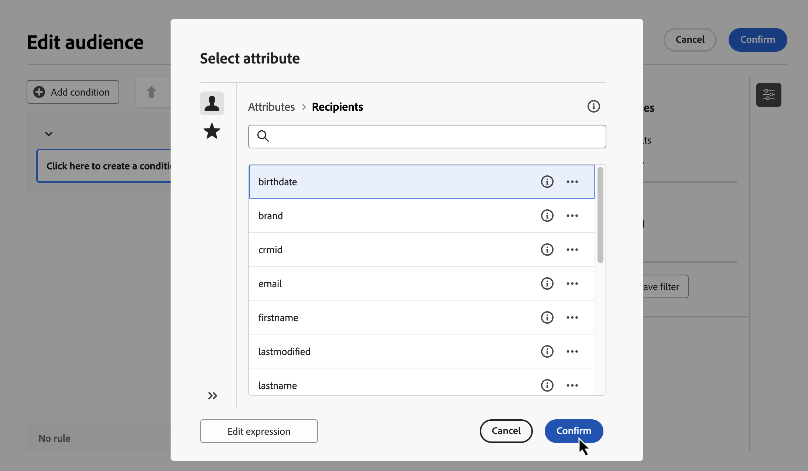
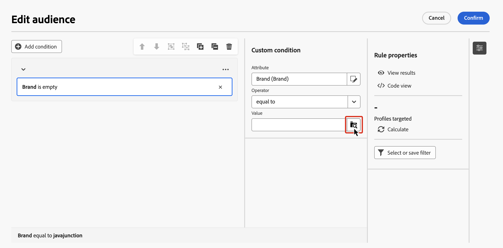
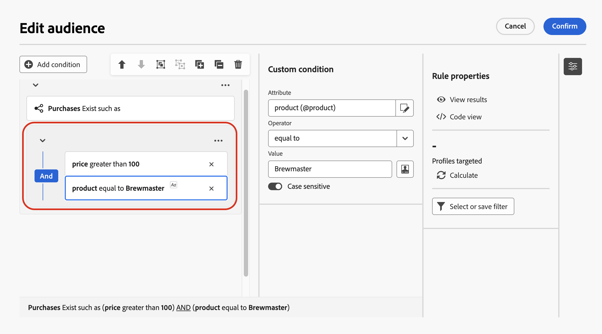

# Uw eerste regel samenstellen {#build-query}

De belangrijkste stappen om regels voor uw Geordende campagnes te bouwen zijn als volgt:

1. **voegt voorwaarden** toe - creeer douanevoorwaarden om uw vraag te filtreren door uw eigen voorwaarde met attributen van het gegevensbestand en geavanceerde uitdrukkingen te bouwen.
1. **combineer voorwaarden** - plaats de voorwaarden in het canvas gebruikend groepen en logische exploitanten.
1. **Controle en bevestig de regel** - controleer de resulterende gegevens van uw regel alvorens het op te slaan.

## Een voorwaarde toevoegen {#conditions}

>[!CONTEXTUALHELP]
>id="ajo_orchestration_querymodeler_customcondition"
>title="Aangepaste voorwaarde"
>abstract="De voorwaarden van de douane zijn het filtreren componenten die u toestaan om uw vraag te filtreren door uw eigen voorwaarde met attributen van het gegevensbestand en geavanceerde uitdrukkingen te bouwen."

Ga als volgt te werk om voorwaarden aan uw query toe te voegen:

1. Heb toegang tot de regelbouwer van een **[!UICONTROL Build audience]** activiteit.

1. Klik **toevoegen voorwaarde** knoop om een eerste voorwaarde voor uw vraag tot stand te brengen.

   U kunt de query ook starten met een vooraf gedefinieerd filter. Klik hiertoe op de knop **[!UICONTROL Select or save filter]** en kies **[!UICONTROL Select predefined filter]** . Voor meer details, zie [&#x200B; Werk met vooraf bepaalde filters &#x200B;](predefined-filters.md).

    toont

1. Identificeer het attribuut van de dabatase als criteria voor uw voorwaarde te gebruiken. Het pictogram &quot;i&quot; naast een kenmerk bevat informatie over de tabel waarin het wordt opgeslagen en het gegevenstype van het kenmerk.

    toont

   >[!NOTE]
   >
   >De **geeft uitdrukking** knoop uit staat u toe om de uitdrukkingsredacteur te gebruiken om een uitdrukking manueel te bepalen gebruikend gebieden van het gegevensbestand en hulpfuncties. [&#x200B; Leer hoe te om uitdrukkingen uit te geven &#x200B;](../orchestrated/edit-expressions.md)

1. Klik het  naast een attribuut toont om tot deze extra opties toegang te hebben:

   +++ Verdeling van waarden

   Met de verdeling van waarden kunt u bepalen hoe waarden in de database worden gebruikt. Het is nuttig voor het begrijpen van de beschikbare waarden, hun tellingen, en percentages. Het helpt ook problemen zoals inconsistente hoofdlettergebruik of spelling te voorkomen bij het maken van query&#39;s of het maken van expressies.

   Voor kenmerken met een groot aantal waarden wordt alleen de eerste twintig weergegeven. In dergelijke gevallen lijkt een **[!UICONTROL Partial load]** -melding deze beperking aan te geven. U kunt geavanceerde filters toepassen om de weergegeven resultaten te verfijnen en de focus op specifieke waarden of subsets van gegevens te richten.

   Als u de voorwaarde sneller wilt samenstellen, selecteert u een waarde en klikt u op **[!UICONTROL Select attribute and value]** om het kenmerk en de waarde in de huidige voorwaarde te vullen.

   U kunt een waarde op uw klembord ook kopiëren gebruikend het  toont, bijvoorbeeld om het in de uitdrukkingsredacteur te kleven.

   

   +++

   +++ Toevoegen aan Favorieten

   Door kenmerken toe te voegen aan het menu Favorieten hebt u snel toegang tot de meest gebruikte kenmerken. U kunt maximaal 20 kenmerken toevoegen aan favorieten. Favoriete en recente kenmerken zijn gekoppeld aan elke gebruiker binnen een organisatie, zodat de toegankelijkheid op verschillende computers gegarandeerd is en een naadloze ervaring op alle apparaten mogelijk is.

   Gebruik het menu **[!UICONTROL Favorites and recents]** voor toegang tot de gewenste kenmerken. Favoriete kenmerken worden als eerste weergegeven, gevolgd door recent gebruikte kenmerken, zodat u gemakkelijk de vereiste kenmerken kunt vinden. Als u een kenmerk uit de favorieten wilt verwijderen, selecteert u het sterpictogram opnieuw.

    toont

   +++

1. Klik op **[!UICONTROL Confirm]** om het geselecteerde kenmerk aan uw voorwaarde toe te voegen.

1. Er wordt een deelvenster met eigenschappen weergegeven waarin u de gewenste waarde voor het kenmerk kunt configureren.

   

1. Selecteer de **[!UICONTROL Operator]** die u wilt toepassen in de vervolgkeuzelijst. Er zijn verschillende operatoren beschikbaar voor gebruik. Operatoren die beschikbaar zijn in de vervolgkeuzelijst, zijn afhankelijk van het gegevenstype van het kenmerk.

   +++Lijst met beschikbare operatoren

   | Operator | Doel | Voorbeeld |
   |---|---|---|
   | Gelijk aan | Retourneert een resultaat dat identiek is aan de gegevens die zijn ingevoerd in de tweede kolom Waarde. | Achternaam (@lastName) gelijk aan &#39;Jones&#39; retourneert alleen ontvangers met als achternaam Jones. |
   | Niet gelijk aan | Retourneert alle waarden die niet identiek zijn aan de ingevoerde waarde. | Taal (@taal) is niet gelijk aan &#39;Engels&#39;. |
   | Groter dan | Retourneert een waarde die groter is dan de ingevoerde waarde. | Leeftijd (@age) groter dan 50 zal alle waarden groter dan &quot;50&quot;terugkeren, zoals &quot;51&quot;, &quot;52&quot;. |
   | Minder dan | Retourneert een waarde die kleiner is dan de ingevoerde waarde. | Aanmaakdatum (@created) voordat &#39;DaysAgo(100)&#39; alle ontvangers retourneert die minder dan 100 dagen geleden zijn gemaakt. |
   | Groter dan of gelijk aan | Retourneert alle waarden die gelijk zijn aan of groter zijn dan de ingevoerde waarde. | Leeftijd (@age) groter dan of gelijk aan &#39;30&#39; retourneert alle ontvangers van 30 jaar of ouder. |
   | Kleiner dan of gelijk aan | Retourneert alle waarden die gelijk zijn aan of lager zijn dan de ingevoerde waarde. | Leeftijd (@age) kleiner dan of gelijk aan &#39;60&#39; retourneert alle ontvangers van 60 jaar of ouder. |
   | Opgenomen in | Retourneert resultaten die zijn opgenomen in de aangegeven waarden. Deze waarden moeten door een komma worden gescheiden. | De geboortedatum (@geboortedatum) is opgenomen in &#39;12-10-1979.12-10-1984&#39; en retourneert de tussen deze data geboren ontvangers. |
   | Niet in | Werkt zoals is opgenomen in operator. Hier worden ontvangers uitgesloten op basis van de ingevoerde waarden. | Geboortedatum (@geboortedatum) is niet opgenomen in &quot;10-12-1979,12-10-1984&quot;. Ontvangers die binnen deze datums zijn geboren, worden niet geretourneerd. |
   | Is leeg | Retourneert resultaten die overeenkomen met een lege waarde in de tweede kolom Waarde. | Mobiele (@mobilePhone) is leeg en retourneert alle ontvangers die geen mobiel nummer hebben. |
   | Is niet leeg | Werkt in omgekeerde volgorde naar de operator Is leeg. Het is niet nodig gegevens in te voeren in de tweede kolom Waarde. | E-mail (@email) is niet leeg. |
   | Begint met | Retourneert resultaten die beginnen met de ingevoerde waarde. | Account # (@account) begint met &#39;32010&#39;. |
   | Begint niet met | Retourneert resultaten die niet beginnen met de ingevoerde waarde. | Account # (@account) begint niet met &#39;20&#39;. |
   | Bevat | Retourneert resultaten die ten minste de ingevoerde waarde bevatten. | Het e-maildomein (@domain) bevat &#39;mail&#39; en retourneert alle domeinnamen die &#39;mail&#39; bevatten, zoals &#39;gmail.com&#39;. |
   | Bevat niet | Retourneert resultaten die niet de ingevoerde waarde bevatten. | E-maildomein (@domein) bevat geen &#39;vo&#39;. Domeinnamen die &#39;vo&#39; bevatten, zoals &#39;voila.fr&#39;, worden niet weergegeven in de resultaten. |
   | leuk | Net als bij de operator Bevat kunt u een jokerteken % in de waarde invoegen. | Achternaam (@lastName) zoals &#39;Jon%s&#39;. Het jokerteken fungeert als een &#39;joker&#39; om namen als &#39;Jones&#39; te zoeken. |
   | Niet leuk | Net als bij de operator Bevat kunt u een jokerteken % in de waarde invoegen. | Achternaam (@lastName) houdt niet van &#39;Smi%h&#39;. Ontvangers met de achternaam Smith worden niet geretourneerd. |

   +++

1. Op het **gebied van de Waarde**, bepaal de verwachte waarde. U kunt de uitdrukkingsredacteur ook gebruiken om een uitdrukking manueel te bepalen gebruikend gebieden van het gegevensbestand en hulpfuncties. Om dit te doen, klik het  toont. [&#x200B; Leer hoe te om uitdrukkingen uit te geven &#x200B;](../orchestrated/edit-expressions.md)

   Voor datumtekstkenmerken zijn vooraf gedefinieerde waarden beschikbaar met de optie **[!UICONTROL Presets]** .

   +++Zie voorbeeld

    toont

   +++

### Aangepaste voorwaarden voor gekoppelde tabellen (1-1 en 1-N koppelingen){#links}

De voorwaarden van de douane staan u toe om lijsten te vragen verbonden aan de lijst die momenteel door uw regel wordt gebruikt. Dit omvat lijsten met een 1-1 kardinaliteitsverbinding, of inzamelingstabellen (verbinding 1-N).

Voor a **1-1 verbinding**, navigeer aan de verbonden lijst, selecteer de gewenste attributen en bepaal de verwachte waarde.

U kunt een lijstverbinding in de **plukker van de Waarde** ook direct selecteren en bevestigen. In dat geval moeten de waarden die beschikbaar zijn voor de geselecteerde tabel, worden geselecteerd met een speciale kiezer, zoals in het onderstaande voorbeeld wordt getoond.

+++Voorbeeld van query

Hier, richt de vraag zich merken het waarvan etiket &quot;loopt&quot;.

1. Navigeer binnen de **Merk** lijst en selecteer het **3&rbrace; attribuut van het Etiket &lbrace;.**

   

1. Definieer de verwachte waarde voor het kenmerk.

   

Hier volgt een queryvoorbeeld waarin een tabelkoppeling rechtstreeks is geselecteerd. Beschikbare waarden voor deze tabel moeten worden geselecteerd in een speciale kiezer.

+++ 

Voor a **1-N verbinding**, kunt u sub-voorwaarden bepalen om uw vraag te verfijnen, zoals aangetoond in het hieronder voorbeeld.

+++Voorbeeld van query

Hier richt de vraag zich op ontvangers die aankopen hebben gedaan met betrekking tot het Brewmsaster-product, voor meer dan 100$.

1. Selecteer **Aankopen** lijst en bevestig.

1. Klik op **[!UICONTROL Add condition]** om de subvoorwaarden te definiëren die op de geselecteerde tabel moeten worden toegepast.

   

1. Voeg subvoorwaarden toe die aan uw behoeften voldoen.

   

+++ 

### Aangepaste omstandigheden met geaggregeerde gegevens {#aggregate}

Met aangepaste omstandigheden kunt u gezamenlijke bewerkingen uitvoeren. Hiervoor moet u rechtstreeks een kenmerk in een verzamelingstabel selecteren:

1. Navigeer binnen de gewenste inzamelingstabel en selecteer de attributen waarop u een gezamenlijke verrichting wilt uitvoeren.

1. In de eigenschappen ruit, knevel op de **Samengevoegde gegevens** optie en selecteer de gewenste gezamenlijke functie.

   

## Voorwaarden combineren met operatoren {#operators}

Telkens als u een nieuwe voorwaarde in uw regel toevoegt, wordt het automatisch verbonden met de bestaande voorwaarde door een **EN** exploitant. Dit betekent dat de resultaten van de twee voorwaarden worden gecombineerd.

Als u de operator tussen voorwaarden wilt wijzigen, klikt u erop en selecteert u de gewenste operator.

Beschikbare operatoren zijn:

* **EN (Doorsnede)**: Combineert resultaten die alle het filtreren componenten in de uitgaande overgangen aanpassen.
* **OF (Unie)**: Omvat resultaten die minstens één van de het filtreren componenten in de uitgaande overgangen aanpassen.
* **BEHALVE (Uitsluiting)**: Sluit resultaten uit die alle het filtreren componenten in de uitgaande overgang aanpassen.

## Manipulatieomstandigheden {#manipulate}

De werkbalk van het canvas van de regelbouwer biedt opties voor het eenvoudig manipuleren van de voorwaarden binnen uw regel:

| Werkbalkpictogram | Beschrijving |
|--- |--- |
|  | Verplaats de component omhoog een rij. |
|  | Verplaats de component een rij omlaag. |
|  | Plaats twee componenten in een groep. |
|  | Scheid de componenten van één groep. |
|  uit | Vouw alle groepen uit. |
|  samen | Vouw alle groepen samen. |
|  | Alle groepen en componenten verwijderen. |

Afhankelijk van uw behoeften, kunt u tussenliggende groepen componenten moeten tot stand brengen door componenten in een zelfde groep te groeperen en hen te verbinden samen.

* Om twee bestaande voorwaarden te groeperen, selecteer één van de twee voorwaarden en klik de  of  knoop om het met de voorwaarde hierboven of onder te groeperen.

* Om een bestaande voorwaarde met nieuwe te groeperen, selecteer de voorwaarde, klik het  toont en **[!UICONTROL Add group]** selecteert. Selecteer het nieuwe kenmerk dat u aan de groep wilt toevoegen en bevestig het vervolgens.

  

In het onderstaande voorbeeld hebben we een tussengroep opgericht voor klanten die het BrewMaster- of VanillaVelvet-product hebben aangeschaft.

## Uw query controleren en valideren

>[!CONTEXTUALHELP]
>id="ajo_orchestration_querymodeler_ruleproperties"
>title="Eigenschappen van Rule"
>abstract="Zodra u uw vraag in het canvas hebt gebouwd, kunt u het controleren gebruikend de **eigenschappen van de Regel** ruit die op de rechterkant wordt gevestigd.  Dit ruit staat u toe om de resulterende gegevens te tonen, een SQL codeversie van de vraag terug te winnen, en het aantal gerichte verslagen te controleren.  gebruik **Uitgezocht of sparen filter** knoop om uw vraag als vooraf bepaald filter te bewaren, of de canvasinhoud met een bestaand filter te vervangen."

Zodra u uw vraag in het canvas hebt gebouwd, kunt u het controleren gebruikend de **eigenschappen van de Regel** ruit. Beschikbare bewerkingen zijn:

* **resultaten van de Mening:** toont de gegevens die uit uw vraag voortvloeien.
* **mening van de Code**: Toont een op code-gebaseerde versie van de vraag in SQL.
* **berekent**: Updates en toont het aantal verslagen die door uw regel worden gericht.
* **Uitgezocht of sparen filter**: Kies een bestaand vooraf bepaald filter om in het canvas te gebruiken, of sparen uw vraag als vooraf bepaald filter voor toekomstig hergebruik. Als het filter parameters bevat, geeft u waarden op voordat u het filter toepast. Voor details, zie [&#x200B; Werk met vooraf bepaalde filters &#x200B;](predefined-filters.md).

 

Wanneer uw regel gereed is, klikt u op de knop **[!UICONTROL Confirm]** in de map om deze op te slaan.

>[!IMPORTANT]
>
>Als u een vooraf gedefinieerd filter in het deelvenster Eigenschappen regel selecteert, wordt de regel die in het canvas is gemaakt, vervangen door het geselecteerde filter.
