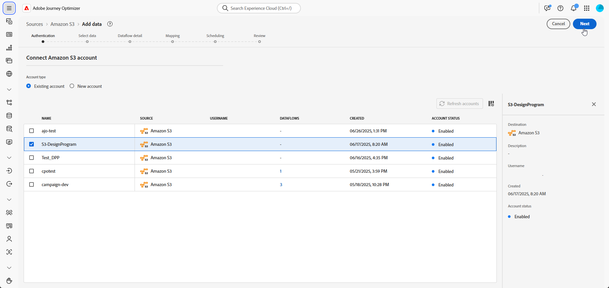

# Configuratiestappen {#configuration-steps}

+++ Inhoudsopgave

| Welkom bij georkestreerde campagnes | Start uw eerste georkestreerde campagne | De database opvragen | Gecontroleerde campagnes |
|---|---|---|---|
| [ krijgen begonnen met georkestreerde campagnes ](gs-orchestrated-campaigns.md)<br/><br/><b>[ stappen van de Configuratie ](configuration-steps.md)</b><br/><br/>[ Toegang en beheert georkestreerde campagnes ](access-manage-orchestrated-campaigns.md) | [ Zeer belangrijke stappen voor georkestreerde campagneverwezenlijking ](gs-campaign-creation.md)<br/><br/>[ creëren en plannen de campagne ](create-orchestrated-campaign.md)<br/><br/>[ activiteiten van het Orchestrate ](orchestrate-activities.md)<br/><br/>[ verzenden berichten met georkestreerde campagnes ](send-messages.md)<br/><br/>[ Begin en controleren de campagne ](start-monitor-campaigns.md)<br/><br/>[ Meldend ](reporting-campaigns.md) | [ Werk met de regelbouwer ](orchestrated-rule-builder.md)<br/><br/>[ bouwt uw eerste vraag ](build-query.md)<br/><br/>[ uitdrukkingen ](edit-expressions.md) uit | [ wordt begonnen met activiteiten ](activities/about-activities.md)<br/><br/> Activiteiten:<br/>[ en-sluit zich aan ](activities/and-join.md) - [ bouwt publiek ](activities/build-audience.md) - [ dimensie van de Verandering ](activities/change-dimension.md) - [ combineert ](activities/combine.md) - [ Deduplicatie ](activities/deduplication.md) - [ Verrijking ](activities/enrichment.md) - [ Fork ](activities/fork.md) opnieuw verzoening ](activities/reconciliation.md) - [ Gesplitst ](activities/split.md) - [ wacht ](activities/wait.md)[ |

{style="table-layout:fixed"}

+++

</br>

>[!BEGINSHADEBOX]

Documentatie in uitvoering

>[!ENDSHADEBOX]

Deze gids begeleidt u door het proces om een relationeel schema tot stand te brengen, vormend een dataset voor georkestreerde campagnes, die gegevens via een S3 bron opnemen, en het vragen van de ingebedde gegevens in het AP platform.

In dit voorbeeld, omvat de opstelling het integreren van twee zeer belangrijke entiteiten, **Transacties van de Loyalty** en **Beloningen van de Loyalty**, en verbindt hen met bestaande kernentiteiten **Ontvangers** en **Merken**.

1. [DDL-bestand uploaden](#upload-ddl)

   Bepaal het relationele gegevensmodel voor georkestreerde campagnes, met inbegrip van de **Transacties van de Loyalty** en **Beloningen van de Loyalty** entiteiten, samen met vereiste sleutels en versioning attributen.

1. [Entiteiten selecteren](#entities)

   Vestig betekenisvolle verhoudingen tussen lijsten in uw schema om een samenhangend en onderling verbonden gegevensmodel tot stand te brengen.

1. [Koppelingsschema](#link-schema)

   Verbind de **entiteit van de Transacties van de Loyalty** {aan **Ontvangers**, en **Beloningen van de Loyalty** aan **Merken**, om een verbonden gegevensmodel te bouwen dat gepersonaliseerde klantenreizen steunt.

1. [Gegevens samenvoegen](#ingest)

   Breng gegevens van ondersteunde bronnen, zoals SFTP, cloudopslag of databases, naar Adobe Experience Platform.

## DDL-bestand uploaden {#upload-ddl}

Deze sectie biedt stapsgewijze instructies voor het maken van een relationeel schema in Adobe Experience Platform door een DDL-bestand (Data Definition Language) te uploaden. Met behulp van een DDL-bestand kunt u vooraf de structuur van uw gegevensmodel definiëren, inclusief tabellen, kenmerken, sleutels en relaties.

1. Meld u aan bij het AP-platform.

1. Navigeer aan het **Beheer van Gegevens** > **Schema**.

1. Klik op **creeer Schema**.

1. U wordt gevraagd een keuze te maken uit twee schematypen:

   * **Standaard**
   * **Relationeel**, die specifiek voor georkestreerde campagnes wordt gebruikt

   

1. Selecteer **uploadt Ddl- dossier** om een diagram van de entiteitverhouding te bepalen en schema&#39;s tot stand te brengen.

   De tabelstructuur moet het volgende bevatten:
   * Ten minste één primaire sleutel
   * Een versie-id, zoals een `lastmodified` veld van het type `datetime` of `number` .

1. Sleep en zet het DDL-bestand neer en klik op **[!UICONTROL Next]** .

1. Typ uw **[!UICONTROL Schema name]** in.

1. Opstelling elk schema en zijn kolommen, die ervoor zorgen dat een primaire sleutel wordt gespecificeerd.

   Eén kenmerk, zoals `lastmodified` , moet worden opgegeven als een versiedescriptor. Dit kenmerk, doorgaans van het type `datetime`, `long` of `int` , is essentieel voor innameprocessen om ervoor te zorgen dat de gegevensset wordt bijgewerkt met de meest recente gegevensversie.

   

1. Klik **[!UICONTROL Done]** eenmaal gereed.

U kunt nu de tabel- en velddefinities op het canvas controleren. [ leer meer in de sectie hieronder ](#entities)

## Entiteiten selecteren {#entities}

Volg onderstaande stappen om logische verbindingen tussen tabellen in uw schema te definiëren.

1. Open de canvasweergave van uw gegevensmodel en kies de twee tabellen die u wilt koppelen

1. Klik op de knop  naast Source Join en sleep de pijl naar Target Join om de verbinding tot stand te brengen.

   

1. Vul de bepaalde vorm in om de verbinding te bepalen en klik **toepassen** eens gevormd.

   

   **Kardinaliteit**:

   * **1-n**: één voorkomen van de bronlijst kan verscheidene overeenkomstige voorkomen van de doellijst hebben, maar één voorkomen van de doellijst kan hoogstens één overeenkomstige voorkomen van de bronlijst hebben.

   * **n-1**: één voorkomen van de doellijst kan verscheidene overeenkomstige voorkomen van de bronlijst hebben, maar één voorkomen van de bronlijst kan hoogstens één overeenkomstige voorkomen van de doellijst hebben.

   * **1-1**: één voorkomen van de bronlijst kan hoogstens één overeenkomstige voorkomen van de doellijst hebben.

1. Alle koppelingen die in het gegevensmodel zijn gedefinieerd, worden als pijlen weergegeven in de canvasweergave. Klik op een pijl tussen twee tabellen om details weer te geven, wijzigingen aan te brengen of de koppeling naar wens te verwijderen.

   

1. Gebruik de werkbalk om het canvas aan te passen en aan te passen.

   

   * **Gezoem binnen**: vergroot het canvas om details van uw gegevensmodel duidelijker te zien.

   * **Gezoem uit**: Verminder de canvasgrootte voor een bredere mening van uw gegevensmodel.

   * **Passende mening**: Pas het gezoem aan om alle schema&#39;s binnen het zichtbare gebied te passen.

   * **Filter**: Kies welk schema om binnen het canvas te tonen.

   * **de auto lay-out van de Dwinging**: Orden automatisch schema&#39;s voor betere organisatie.

   * **Kaart van de Vertoning**: Ga een minikaartbekleding in-/uitschakelen helpen grote of complexe schemalay-outs gemakkelijker navigeren.

1. Klik **sparen** eens gereed. Deze actie leidt tot de schema&#39;s en bijbehorende gegevensreeksen, en laat de gegevensreeks voor gebruik in Geordende Campagnes toe.

1. Klik op **[!UICONTROL Open Jobs]** om de voortgang van de ontwerptaak te volgen. Dit proces kan enkele minuten duren, afhankelijk van het aantal tabellen dat in het DDL-bestand is gedefinieerd.

   

## Koppelingsschema {#link-schema}

Vestig een verband tussen het **schema van de 0} loyaliteitstransacties {en het** Ontvangers **schema om elke transactie met het correcte klantenverslag te associëren.**

1. Navigeer aan **[!UICONTROL Schemas]** en open eerder **loyaliteitstransacties** creëren.

1. Klik op **[!UICONTROL Add Relationship]** van de klant **[!UICONTROL Field properties]** .

   

1. Selecteer **[!UICONTROL Many-to-One]** als de relatie **[!UICONTROL Type]** .

1. Verbinding met het bestaande **Ontvangers** schema.

   

1. Voer een **[!UICONTROL Relationship name from current schema]** en **[!UICONTROL Relationship name from reference schema]** in.

1. Klik op **[!UICONTROL Apply]** om de wijzigingen op te slaan.

Ga door een verband tussen het **loyaliteitbeloningen** schema en het **Merken** schema te creëren om elke beloningsingang met het aangewezen merk te associëren.


## Samenvattingsgegevens {#ingest}

Adobe Experience Platform staat toe dat gegevens uit externe bronnen worden opgenomen en biedt u de mogelijkheid om inkomende gegevens te structureren, labelen en verbeteren met behulp van Experience Platform-services. U kunt gegevens invoeren uit verschillende bronnen, zoals Adobe-toepassingen, opslag in de cloud, databases en vele andere.

1. Via het menu **[!UICONTROL Connections]** opent u het menu **[!UICONTROL Sources]** .

1. Selecteer de categorie **[!UICONTROL Cloud storage]** , vervolgens Amazon S3 en klik op **[!UICONTROL Add Data]** .

   

1. Sluit uw S3-account aan:

   * Met een bestaande account

   * Met een nieuwe account

   [ leer meer in de documentatie van Adobe Experience Platform ](https://experienceleague.adobe.com/en/docs/experience-platform/destinations/catalog/cloud-storage/amazon-s3#connect)

   

1. Navigeer door de verbonden S3 bron tot u van de twee die omslagen de plaats bepalen vroeger worden gecreeerd d.w.z. **loyaliteitbeloningen** en **loyaliteitstransacties**.

1. Klik op uw map.

   Als u een map selecteert, worden alle huidige en toekomstige bestanden met dezelfde structuur automatisch verwerkt. Als u een bestand selecteert, moet u de bestanden handmatig bijwerken voor elke nieuwe gegevensverhoging.

   

1. Kies de gegevensindeling en klik op Volgende.


<!--manual
## Create a relational schema manual


1. Log in to the AP Platform.
1. Navigate to the **Schema Management** section.
1. Click on **Create Schema**.

1. You will be prompted to select between two schema types:
    * **Standard**
    * **Relational** (used specifically for AGO campaigns)

1. Click on **Create Manual**.
1. Provide a **Schema Name** (e.g., `test_demo_ck001`).
1. Choose **Schema Type**:
    - **Record Type** (required for AGO campaigns)
    - **Time Series** (not applicable here)
1. Click **Finish** to proceed to the schema design canvas.

## Select entities and fields to import

1. In the canvas, add attributes (fields) to your schema.
1. Add a **Primary Key** (mandatory).
1. Add a **Version Descriptor** attribute (for CDC support):
    - This must be of type **DateTime** or **Numeric** (Integer, Long, Short, Byte).
    - Common example: `last_modified`

> **Why?** The **Primary Key** uniquely identifies each record, and the **Version Descriptor** tracks changes, supporting CDC (Change Data Capture) and data mirroring.

1. Mark the appropriate fields as **Primary Key** and **Version Descriptor**.
1. Click **Save**.

---


## 5. Creating a Dataset

1. Navigate to **Datasets**.
1. Click on **Create Dataset**.
1. Select the schema you just created.
1. Assign a **Dataset Name** (same as schema is fine).
1. Optionally, add tags (e.g., `AGO_campaigns`).
6. Ensure the checkbox **"Relational Schema"** is checked.
7. Click **Finish**.

> **Note:** Only one dataset can be created per relational schema.


## 6. Enabling the Dataset

1. Click **Enable** for the dataset.
1. Wait a few moments for the status to show **Enabled**.

> **Why?** Without enabling, the dataset cannot be used in orchestrated campaigns or ingest data.

## 7. Creating a Data Source (S3)

1. Navigate to **Sources**.
1. Click **Create Source**.
1. Choose the source type (e.g., **S3 Bucket**).
1. Provide connection details:
    - Bucket Path (optionally include subfolder path)
1. Save the source.

## 8. Preparing and Uploading Data

1. Prepare your CSV file with:
    - Column headers matching your schema attributes
    - `last_modified` column
    - `change_type` column (`U`/`DU` for upsert, `D` for delete)

> **Important:** `change_type` is required but does not need to be defined in the schema.

1. Save the file as `.csv`.

1. Upload the file to the specified folder in your S3 bucket.


## 9. Ingesting Data from S3

1. Go to **Sources** and find your S3 source.
1. Click **Add Data**.
1. Select the uploaded file.
1. Specify the file format as **CSV** and any compression type if applicable.
1. Review the data preview (ensure `change_type`, `last_modified`, and primary key are visible).
1. Click **Next**.

### Enable Change Data Capture (CDC)

- Check **Enable Change Data Capture**.
- Select the dataset enabled for AGO campaigns.

### Field Mapping

- Fields are auto-mapped (note that `change_type` is not mapped and that's expected).
- Click **Next**.

### Scheduling

- Schedule ingestion frequency (minute, hour, day, week).
- Set start time (immediate or future).
- Click **Finish** to create the data flow.

## 10. Monitoring Data Flow

1. Navigate back to **Sources > Data Flows**.
1. Wait 4–5 minutes for the first run (initial overhead).
1. Monitor:
    - Status (Started, Completed)
    - Number of records ingested
    - Errors (if any)

> **Tip:** Ingested data first lands in the **Data Lake**.

## 11. Data Replication to Data Store

The **Data Store** is updated:

- Every **15 minutes**, or

- If **Data Lake size exceeds 5MB**

This is a background replication process.


## 12. Querying the Dataset

1. Navigate to **Query Services**.
1. Click **Create Query**.
1. Example query:

   ```sql
   SELECT * FROM test_demo_ck001;
   ```

1. Run the query.

> **Note:** If ingestion is incomplete, query will return an error. Check data flow status.

-->