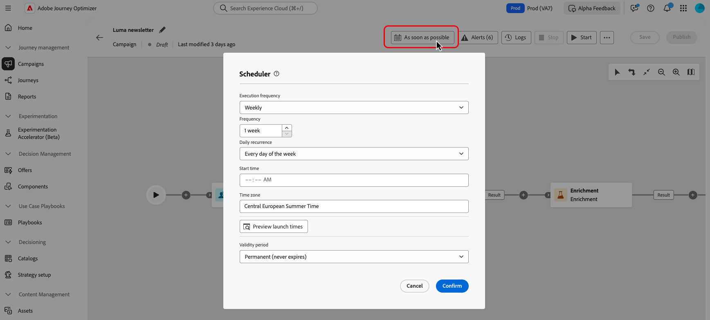

# Een georkestreerde campagne maken en plannen {#create-first-campaign}

+++ Inhoudsopgave

| Welkom bij georkestreerde campagnes | Start uw eerste georkestreerde campagne | De database opvragen | Gecontroleerde campagnes |
|---|---|---|---|
| [ krijgen begonnen met georkestreerde campagnes ](gs-orchestrated-campaigns.md)  [ stappen van de Configuratie ](configuration-steps.md)  [ Toegang en beheert georkestreerde campagnes ](access-manage-orchestrated-campaigns.md) | [ Zeer belangrijke stappen voor georkestreerde campagneverwezenlijking ](gs-campaign-creation.md)  <b>[ creëren en plannen de campagne ](create-orchestrated-campaign.md)</b>  [ activiteiten van het Orchestrate ](orchestrate-activities.md)  [ Begin en controleer de campagne ](start-monitor-campaigns.md)  [ Meldend ](reporting-campaigns.md) | [ Werk met de regelbouwer ](orchestrated-rule-builder.md)  [ bouwt uw eerste vraag ](build-query.md)  [ uit geeft uitdrukkingen ](edit-expressions.md)  [ opnieuw op ](retarget.md) | [ wordt begonnen met activiteiten ](activities/about-activities.md)   Activiteiten: [ en-sluit zich aan ](activities/and-join.md) - [ bouwt publiek ](activities/build-audience.md) - [ dimensie van de Verandering ](activities/change-dimension.md) - [ de activiteiten van het Kanaal ](activities/channels.md) - [ combineren ](activities/combine.md) - [ Deduplicatie ](activities/deduplication.md) - [ Verrijking ](activities/enrichment.md) Formeel k [ - ](activities/fork.md) Verzoening [ - ](activities/reconciliation.md) sparen publiek [ - ](activities/save-audience.md) Gesplitst [ - ](activities/split.md) wacht [&#128279;](activities/wait.md) |

{style="table-layout:fixed"}

+++

 

Maak een georkestreerde campagne in [!DNL Adobe Journey Optimizer] en configureer het uitvoeringsschema om te bepalen wanneer de campagne start en hoe vaak deze wordt uitgevoerd. Kies ervoor de campagne onmiddellijk te starten, op een specifieke datum en tijd, of op terugkerende basis met flexibele planningsopties zoals dagelijkse, wekelijkse of maandelijkse frequenties.

## Maak de campagne {#create}

>[!CONTEXTUALHELP]
>id="ajo_campaign_creation_workflow"
>title="Lijst van georkestreerde campagnes"
>abstract="Het **Orchestration** lusje maakt een lijst van alle georkestreerde campagne. Klik op de naam van een geordende campagne om deze te bewerken. Gebruik **creeer georkestreerde campagne** knoop om een nieuwe georkestreerde campagne toe te voegen."

Voer de volgende stappen uit om een georkestreerde campagne te maken:

1. Ga naar het menu **[!UICONTROL Campaigns]** , selecteer de tab **[!UICONTROL Orchestration]** en klik op **[!UICONTROL Create campaign]** .

   

1. Voer een naam en beschrijving in voor de campagne.

1. *(facultatief)* gebruik het **[!UICONTROL Tags]** gebied om Adobe Experience Platform Verenigde Markeringen aan uw campagne toe te wijzen. Op deze manier kunt u ze gemakkelijk classificeren en zoeken verbeteren vanuit de lijst met georkestreerde campagnes. [ Leer hoe te met markeringen ](../start/search-filter-categorize.md#tags) te werken.

1. Klik op **[!UICONTROL Create]**.

Uw georkestreerde campagne wordt nu gemaakt en wordt weergegeven in de lijst met georkestreerde campagnes. U kunt deze eigenschappen op elk ogenblik bijwerken door het  in het campagnecanvas te klikken.

## De campagne plannen {#schedule}

>[!CONTEXTUALHELP]
>id="ajo_orchestration_scheduler"
>title="Planner"
>abstract="Als campagnemanager, kunt u campagnes plannen om automatisch op specifieke tijden te lanceren, toelatend nauwkeurige timing en nauwkeurige het richten gegevens voor marketing mededelingen."

>[!CONTEXTUALHELP]
>id="ajo_orchestration_schedule_validity"
>title="Geldigheid van planner"
>abstract="U kunt een geldigheidsperiode voor de planner bepalen. Deze kan permanent zijn (standaard) of geldig zijn tot een bepaalde datum."

>[!CONTEXTUALHELP]
>id="ajo_orchestration_schedule_options"
>title="Planningsopties"
>abstract="Bepaal de frequentie van de planner. Het kan op een specifiek moment, één keer of verscheidene keren per dag, week of maand worden uitgevoerd."

Standaard worden georkestreerde campagnes gestart wanneer ze handmatig worden geactiveerd en eindigen wanneer de bijbehorende activiteiten zijn uitgevoerd. Als u liever de uitvoering vertraagt of de campagne op een terugkerende basis uitvoert, kunt u een schema voor de campagne definiëren.

Overweeg de volgende aanbevolen procedures bij het plannen van georkestreerde campagnes om optimale prestaties en verwacht gedrag te garanderen:

* Plan geen georkestreerde campagne om meer dan om de 15 minuten in werking te stellen aangezien het algemene systeemprestaties kan belemmeren en tot blokken in het gegevensbestand kan leiden.
* Als u een one-shot bericht in uw georkesteerde campagne wilt verzenden, kunt u het plaatsen om **eens** in werking te stellen.
* Als u een terugkomend bericht in uw georkestreerde campagne wilt verzenden, moet u a **gebruiken plannend** opties en de uitvoeringsfrequentie plaatsen. De terugkomende leveringsactiviteit staat u niet toe om een programma te bepalen.

Voer de volgende stappen uit om het campagnereschema te configureren:

1. Open de campagne en klik op **[!UICONTROL As soon as possible]** .

   

1. Selecteer een uitvoeringsfrequentie voor de campagne, dan vorm de beschikbare opties. De instellingen variëren afhankelijk van de geselecteerde frequentie:

   +++Eenmaal

   Voer de campagne één keer uit op een opgegeven datum en tijd.

   * **[!UICONTROL Date]**: selecteer de datum waarop de campagne moet worden uitgevoerd.
   * **[!UICONTROL Time]**: selecteer het specifieke tijdstip waarop de campagne moet worden uitgevoerd.

   +++

   +++Dagelijks

   Voer de campagne elke dag of op geselecteerde dagen uit.

   * **[!UICONTROL Daily recurrence]**: Bepaal hoe vaak de campagne moet worden uitgevoerd:
      * **[!UICONTROL Every day]**: Voert de campagne elke dag van de week uit, inclusief weekends.
      * **[!UICONTROL On weekdays]**: voert de campagne slechts van maandag tot en met vrijdag uit.
      * **[!UICONTROL Through a specific period]**: voert de campagne dagelijks uit binnen een bepaald datumbereik (bijvoorbeeld van 1 juli tot 15 juli). De campagne valt niet buiten dit bereik.
      * **[!UICONTROL On selected days of the week]**: voert de campagne alleen uit op de opgegeven dagen van de week (bijvoorbeeld maandag, woensdag, vrijdag).

   * **[!UICONTROL Start time]**: bepaal de tijd de campagne elke dag zou moeten uitvoeren.

   +++

   +++meerdere keren per dag

   Voer de campagne meerdere keren uit binnen dezelfde dag. U kunt specifieke tijden kiezen of een periodieke frequentie plaatsen.

   * **[!UICONTROL Selected hours]**: Selecteer de specifieke tijden de campagne zou moeten lopen en zijn dagelijkse herhaling (voer elke dag van de week of op bepaalde dagen uit) vormen.
   * **[!UICONTROL Periodic]**: kies om de campagne elke n minuten of uren uit te voeren. U kunt ook het tijdbereik definiëren binnen de dag waarop uitvoeringen zijn toegestaan.

   +++

   +++wekelijks

   Voer de campagne wekelijks uit, met opties voor specifieke dagen.

   * **[!UICONTROL Frequency]**: Bepaal hoe vaak de campagne moet worden uitgevoerd (bijvoorbeeld elke week, elke twee weken).
   * **[!UICONTROL Starting from date]**: selecteer de datum waarop de herhaling moet beginnen.
   * **[!UICONTROL Daily recurrence]**: kies specifieke dagen van de week voor uitvoering (bijvoorbeeld elke maandag en donderdag).
   * **[!UICONTROL Start time]**: stel de tijd in waarop de campagne op de geselecteerde dagen moet worden uitgevoerd.

   +++

   +++Maandelijks

   Voer de campagne maandelijks uit, met opties voor specifieke dagen.

   * **[!UICONTROL Monthly recurrence]**: geef aan of de campagne elke maand wordt uitgevoerd of alleen gedurende bepaalde maanden.
   * **[!UICONTROL Daily recurrence]** :
      * **[!UICONTROL Every day]**: Voert de campagne uit op elke kalenderdag van de maand, inclusief weekends.
      * **[!UICONTROL Last day of the month]**: voert de campagne alleen uit op de laatste kalenderdag van elke maand (bijvoorbeeld 31 januari 28/29 februari).
      * **[!UICONTROL Specific day of the month (e.g., 15th)]**: voert de campagne uit op een opgegeven dag (bijvoorbeeld de 15e van elke maand).
      * **[!UICONTROL First/last, or nth day of the week]** (bijvoorbeeld eerste maandag):      Voert de campagne uit op een opgegeven weekdag (bijvoorbeeld de 15e van elke week).
      * **[!UICONTROL Selected days of the week]**: voert de campagne op een bepaalde dag uit.

   * **[!UICONTROL Start time]**: stel de tijd in waarop de campagne moet worden uitgevoerd.

   +++

1. Gebruik de instelling **[!UICONTROL Validity period]** om een specifieke begin- en einddatum te definiëren, waarbij de uitvoering van de campagne wordt beperkt tot een beperkt tijdvenster.

1. Voor terugkerende planningen klikt u op de knop **[!UICONTROL Preview launch times]** om een voorvertoning weer te geven van de exacte uitvoeringsdatums en -tijden die worden gebaseerd op de huidige configuratie. Hierdoor kunt u het schema valideren voordat de campagne wordt geactiveerd en kunt u ervoor zorgen dat de campagne naar behoren wordt uitgevoerd.

>[!NOTE]
>
>Wanneer u campagnes in [!DNL Adobe Journey Optimizer] plant, moet u ervoor zorgen dat de begindatum/tijd wordt uitgelijnd op de gewenste eerste levering. Voor terugkerende campagnes, als de aanvankelijke geplande tijd reeds is overgegaan, zullen de campagnes aan de volgende beschikbare tijdgroef volgens hun terugkeringsregels rollen.

In het volgende voorbeeld, wordt de activiteit gevormd zodat de georkestreerde campagne tweemaal per dag om 9 en 12 AM, elke dag van de week van 1 Oktober, 2025 aan 1 Januari, 2026 loopt.

{width="50%" align="left"} in werking te stellen

## Volgende stappen {#next}

Zodra uw campagnemontages en programma worden gevormd, bent u bereid om de verschillende taken te beginnen te ordenen het zal uitvoeren. [ Leer hoe te om campagneactiviteiten te ordenen ](../orchestrated/orchestrate-activities.md)
