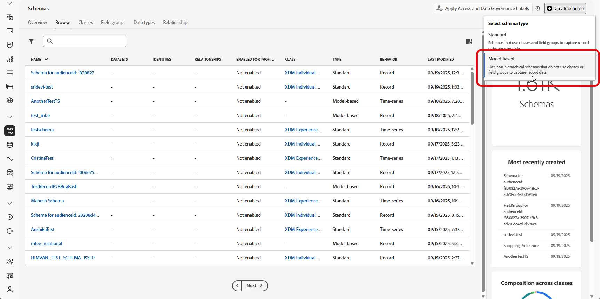
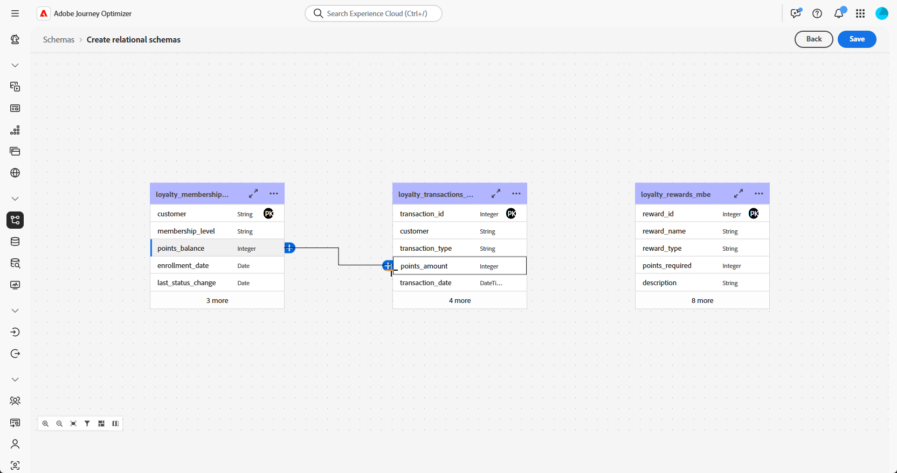

# Op modellen gebaseerde schema&#39;s maken met een DDL-bestand {#file-upload-schema}

Bepaal het op model-gebaseerde gegevensmodel dat voor Geordende campagnes wordt vereist door schema&#39;s zoals **Loyalty Membership**, **Transacties van de Loyalty**, en **Beloningen van de Loyalty** te creëren. Elk schema moet een primaire sleutel, een versieringsattribuut, en aangewezen verhoudingen omvatten om entiteiten zoals **Ontvangers** of **Merken** van verwijzingen te voorzien.

De schema&#39;s kunnen manueel door de interface worden gecreeerd of in bulk worden ingevoerd gebruikend een Ddl- dossier.

Deze sectie verstrekt geleidelijke begeleiding op hoe te om een model-gebaseerd schema binnen Adobe Experience Platform tot stand te brengen door een DL (de Taal van de Definitie van Gegevens) dossier te uploaden. Met behulp van een DDL-bestand kunt u vooraf de structuur van uw gegevensmodel definiëren, inclusief tabellen, kenmerken, sleutels en relaties.

1. [&#x200B; upload een Ddl- dossier &#x200B;](#ddl-upload) om model-gebaseerde schema&#39;s tot stand te brengen en hun structuur te bepalen.

1. [&#x200B; bepaalt verhoudingen &#x200B;](#relationships) tussen lijsten in uw gegevensmodel.

1. [&#x200B; schema&#39;s van de Verbinding &#x200B;](#link-schema) om uw op model-gebaseerde gegevens met bestaande profielentiteiten zoals Ontvangers of Banden te verbinden.

1. [&#x200B; Samenvatting gegevens &#x200B;](ingest-data.md) in uw dataset van gesteunde bronnen.

➡️ [&#x200B; Leer meer over op model-gebaseerde schema&#39;s in de documentatie van Adobe Experience Platform &#x200B;](https://experienceleague.adobe.com/en/docs/experience-platform/xdm/schema/model-based)

## Een DDL-bestand uploaden{#ddl-upload}

Door een DDL-bestand te uploaden, kunt u vooraf de structuur van uw gegevensmodel definiëren, inclusief tabellen, kenmerken, sleutels en relaties.

Op Excel gebaseerde schemabestanden worden geüpload. Download het [&#x200B; verstrekte malplaatje &#x200B;](assets/template.zip) om uw schemadefinities gemakkelijk voor te bereiden.

+++De volgende functies worden ondersteund bij het maken van modelgebaseerde schema&#39;s in Adobe Experience Platform

* **ENUM**\
  De gebieden van ENUM worden gesteund in zowel op DDL-Gebaseerde als handschemaverwezenlijking, die u toestaan om attributen met een vaste reeks toegestane waarden te bepalen.
Hier volgt een voorbeeld:

  ```
  CREATE TABLE orders (
  order_id     INT NOT NULL,
  product_id   INT NOT NULL,
  order_date   DATE NOT NULL,
  customer_id  INT NOT NULL,
  quantity     INT NOT NULL,
  order_status enum ('PENDING', 'SHIPPED', 'DELIVERED', 'CANCELLED'),
  PRIMARY KEY (order_id, product_id)
  );
  ```

* **Etiket van het Schema voor het Beleid van Gegevens**\
  De etikettering wordt gesteund op het niveau van het schemagebied om gegevens te handhaven governance beleid zoals toegangsbeheer en gebruiksbeperkingen. Voor meer details, verwijs naar [&#x200B; documentatie van Adobe Experience Platform &#x200B;](https://experienceleague.adobe.com/docs/experience-platform/xdm/home.html?lang=nl).

+++

1. Meld u aan bij Adobe Experience Platform.

1. Navigeer aan het **Beheer van Gegevens** > **Schema** menu.

1. Klik **creëren Schema**.

1. Selecteer **[!UICONTROL Model-based]** als uw **type van Schema**.

   

1. Selecteer **[!UICONTROL Upload DDL file]** om een entiteitrelatiediagram te bepalen en schema&#39;s tot stand te brengen.

   De tabelstructuur moet het volgende bevatten:
   * Ten minste één primaire sleutel.
   * Een versie-id, zoals een `lastmodified` veld van het type `datetime` of `number` .
   * Voor CDC-opname (Change Data Capture) gebruikt u een speciale kolom met de naam `_change_request_type` van het type `String` , die het type gegevenswijziging aangeeft (bijvoorbeeld invoegen, bijwerken, verwijderen) en incrementele verwerking mogelijk maakt.
   * In het DDL-bestand mogen niet meer dan 200 tabellen worden gedefinieerd.


   >[!IMPORTANT]
   >
   > Om het even welk schema dat voor het richten wordt gebruikt moet minstens één identiteitsgebied van type `String` met een bijbehorende **identiteit namespace** omvatten.\
   >Dit zorgt voor compatibiliteit met de Adobe Journey Optimizer-functionaliteit voor het maken van doelen en het oplossen van identiteiten.

1. Sleep en zet het DDL-bestand neer en klik op **[!UICONTROL Next]** .

   De maximale ondersteunde grootte voor een DDL-bestand is 10 MB.

1. Typ uw **[!UICONTROL Schema name]** in.

1. Opstelling elk schema en zijn kolommen, die ervoor zorgen dat een primaire sleutel en een versiedescriptor worden gespecificeerd.

   Eén kenmerk, zoals `lastmodified` , moet worden opgegeven als de versiedescriptor (type `datetime` , `long` of `int` ) om ervoor te zorgen dat gegevenssets worden bijgewerkt met de meest recente gegevens. Gebruikers kunnen de versiedescriptor wijzigen, die na het instellen verplicht wordt. Een kenmerk kan niet zowel een primaire sleutel (PK) als een versiedescriptor zijn.

   

1. Markeer een attribuut als `identity` en wijs het aan een bepaalde identiteitsnamespace toe.

1. Wijzig de naam van elke tabel, verwijder of voeg een beschrijving toe aan elke tabel.

1. Klik **[!UICONTROL Done]** eenmaal gereed.

U kunt nu de tabel- en velddefinities op het canvas controleren. [&#x200B; leer meer in de sectie hieronder &#x200B;](#entities)

## Relaties definiëren {#relationships}

U kunt verhoudingen direct binnen het Ddl- dossier specificeren wanneer het creëren van uw schema. Als u liever relaties buiten het bestand definieert, kunt u dit in de interface doen door de onderstaande stappen te volgen.

1. Open de canvasweergave van uw gegevensmodel en kies de twee tabellen die u wilt koppelen

1. Klik op de knop  naast Source Join en sleep de pijl naar Target Join om de verbinding tot stand te brengen.

   >[!NOTE]
   >
   >Samengestelde toetsen worden ondersteund als deze in het DDL-bestand zijn gedefinieerd.

   

1. Vul de bepaalde vorm in om de verbinding te bepalen en klik **toepassen** eens gevormd.

   

   **Kardinaliteit**:

   * **1-n**: één voorkomen van de bronlijst kan verscheidene overeenkomstige voorkomen van de doellijst hebben, maar één voorkomen van de doellijst kan hoogstens één overeenkomstige voorkomen van de bronlijst hebben.

   * **n-1**: één voorkomen van de doellijst kan verscheidene overeenkomstige voorkomen van de bronlijst hebben, maar één voorkomen van de bronlijst kan hoogstens één overeenkomstige voorkomen van de doellijst hebben.

   * **1-1**: één voorkomen van de bronlijst kan hoogstens één overeenkomstige voorkomen van de doellijst hebben.

1. Alle koppelingen die in het gegevensmodel zijn gedefinieerd, worden als pijlen weergegeven in de canvasweergave. Klik op een pijl tussen twee tabellen om details weer te geven, wijzigingen aan te brengen of de koppeling naar wens te verwijderen.

   

1. Gebruik de werkbalk om het canvas aan te passen en aan te passen.

   

   * **Gezoem binnen**: vergroot het canvas om details van uw gegevensmodel duidelijker te zien.

   * **Gezoem uit**: Verminder de canvasgrootte voor een bredere mening van uw gegevensmodel.

   * **Passende mening**: Pas het gezoem aan om alle schema&#39;s binnen het zichtbare gebied te passen.

   * **Filter**: Kies welk schema om binnen het canvas te tonen.

   * **de auto lay-out van de Dwinging**: Orden automatisch schema&#39;s voor betere organisatie.

   * **Kaart van de Vertoning**: Ga een minikaartbekleding in-/uitschakelen helpen grote of complexe schemalay-outs gemakkelijker navigeren.

1. Klik **sparen** eens gereed. Deze actie leidt tot de schema&#39;s en bijbehorende gegevensreeksen en laat de gegevensreeks voor gebruik in Geordende Campagnes toe.

1. Klik op **[!UICONTROL Open Jobs]** om de voortgang van de ontwerptaak te volgen. Dit proces kan enkele minuten duren, afhankelijk van het aantal tabellen dat in het DDL-bestand is gedefinieerd.

   U kunt uw DDL-importtaken ook openen door het venster **[!UICONTROL Upload DDL file]** te openen en **[!UICONTROL View all DDL import jobs]** te selecteren.

   

## Koppelingsschema&#39;s {#link-schema}

>[!IMPORTANT]
>
> Alleen relaties die expliciet in het DDL-bestand zijn gedefinieerd, worden door het systeem herkend. Om het even welke entiteitverhoudingen die buiten het Ddl- dossier bestaan zullen worden genegeerd en niet verwerkt.

Vestig een verband tussen het **schema van de 0&rbrace; loyaliteitstransacties &lbrace;en het** Ontvangers **schema om elke transactie met het correcte klantenverslag te associëren.**

1. Navigeer aan **[!UICONTROL Schemas]** en open eerder **loyaliteitstransacties** creëren.

1. Klik op **[!UICONTROL Add Relationship]** van de klant **[!UICONTROL Field properties]** .

   

1. Selecteer **[!UICONTROL Many-to-One]** als de relatie **[!UICONTROL Type]** .

1. Verbinding met het bestaande **Ontvangers** schema.

   

1. Voer een **[!UICONTROL Relationship name from current schema]** en **[!UICONTROL Relationship name from reference schema]** in.

1. Klik op **[!UICONTROL Apply]** om de wijzigingen op te slaan.

Ga door een verband tussen het **loyaliteitbeloningen** schema en het **Merken** schema te creëren om elke beloningsingang met het aangewezen merk te associëren.


