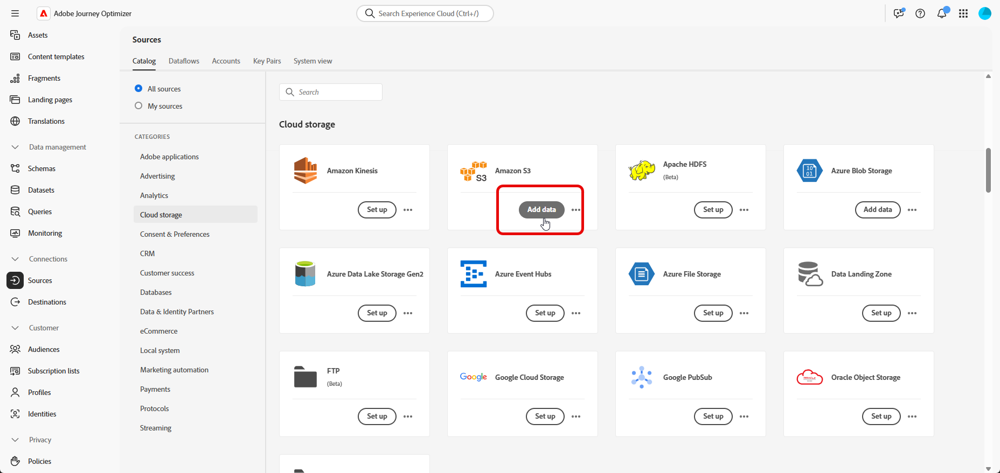

# Samenvattingsgegevens {#ingest-data}

>[!IMPORTANT]
>
>Om de gegevensbron voor een dataset te veranderen, moet u eerst bestaande dataflow schrappen alvorens tot nieuwe te leiden die de zelfde dataset en de nieuwe bron verwijzingen.
>
>Adobe Experience Platform dwingt een strikte één-op-één verhouding tussen gegevensstromen en datasets af. Dit staat u toe om synchronisatie tussen de bron en de dataset voor nauwkeurige stijgende opname te handhaven.

Adobe Experience Platform staat toe dat gegevens uit externe bronnen worden opgenomen en biedt u de mogelijkheid om inkomende gegevens te structureren, labelen en verbeteren met behulp van Experience Platform-services. U kunt gegevens invoeren uit verschillende bronnen, zoals Adobe-toepassingen, opslag in de cloud, databases en vele andere.

Een dataset is een opslag en beheersconstructie voor een inzameling van gegevens, typisch een lijst, die een schema (kolommen) en gebieden (rijen) bevat. De gegevens die met succes in Experience Platform worden opgenomen worden opgeslagen binnen het gegevensmeer als datasets.

## Ondersteunde bronnen voor geordende campagnes {#supported}

De volgende bronnen worden ondersteund voor gebruik met geordende campagnes:

<table>
  <thead>
    <tr>
      <th>Type</th>
      <th>Bron</th>
    </tr>
  </thead>
  <tbody>
    <tr>
      <td rowspan="3">Cloud Storage</td>
      <td><a href="https://experienceleague.adobe.com/en/docs/experience-platform/sources/ui-tutorials/create/cloud-storage/s3">Amazon S3</a></td>
    </tr>
    <tr>
      <td><a href="https://experienceleague.adobe.com/en/docs/experience-platform/sources/ui-tutorials/create/cloud-storage/google-cloud-storage">Google Cloud Storage</a></td>
    </tr>
    <tr>
      <td><a href="https://experienceleague.adobe.com/en/docs/experience-platform/sources/ui-tutorials/create/cloud-storage/sftp">SFTP</a></td>
    </tr>
      <td rowspan="4">Cloud Data Warehouses</td>
      <td><a href="https://experienceleague.adobe.com/en/docs/experience-platform/sources/ui-tutorials/create/databases/snowflake">Snowflake</a></td>
    </tr>
    <tr>
      <td><a href="https://experienceleague.adobe.com/en/docs/experience-platform/sources/ui-tutorials/create/databases/bigquery">Google BigQuery</a></td>
    </tr>
    <tr>
      <td><a href="https://experienceleague.adobe.com/en/docs/experience-platform/sources/ui-tutorials/create/cloud-storage/data-landing-zone">Gegevenslandingszone<a></td>
    </tr>
    <tr>
      <td><a href="https://experienceleague.adobe.com/en/docs/experience-platform/sources/ui-tutorials/create/databases/databricks">Azure Databricks</a></td>
    </tr>
    <tr>
      <td rowspan="3">Bestandsgebaseerde uploads</td>
      <td><a href="https://experienceleague.adobe.com/en/docs/experience-platform/sources/ui-tutorials/create/local-system/local-file-upload">Lokaal bestand uploaden<a></td>
    </tr>

</tbody>
</table>

## Richtsnoeren voor de gegevenshygiëne van relationele schema&#39;s {#cdc}

Voor datasets die met **[!UICONTROL Change data capture]** worden toegelaten, worden alle gegevensveranderingen met inbegrip van schrappingen, automatisch weerspiegeld van het bronsysteem in Adobe Experience Platform.

Aangezien Adobe Journey Optimizer Campaigns vereist dat alle geregistreerde datasets worden ingeschakeld met **[!UICONTROL Change data capture]** , is het de verantwoordelijkheid van de klant om verwijderingen bij de bron te beheren. Alle records die uit het bronsysteem zijn verwijderd, worden automatisch verwijderd uit de bijbehorende dataset in Adobe Experience Platform.

Als u records wilt verwijderen via bestandsopname, moet het gegevensbestand van de klant de record markeren met een `D` -waarde in het `Change Request Type` -veld. Dit geeft aan dat de record in Adobe Experience Platform moet worden verwijderd, wat een weerspiegeling is van het bronsysteem.

Als een klant records alleen uit Adobe Experience Platform wil verwijderen zonder dat dit van invloed is op de oorspronkelijke brongegevens, zijn de volgende opties beschikbaar:

* **Volmacht of Geanimeerde Lijst voor de gegevens van de Verandering vangen Replicatie**

  De klant kan een volmacht of een geanimeerde bronlijst tot stand brengen om te controleren welke verslagen in Adobe Experience Platform worden herhaald. De schrappingen kunnen dan selectief van deze intermediaire lijst worden beheerd.

* **Schrapping via Gegevens Distiller**

  Als vergunning gegeven, **Gegevens Distiller** kan worden gebruikt om schrappingsverrichtingen direct binnen Adobe Experience Platform, onafhankelijk van het bronsysteem te steunen.

  [&#x200B; Leer meer op Gegevens Distiller &#x200B;](https://experienceleague.adobe.com/en/docs/experience-platform/query/data-distiller/overview)

## Een gegevensstroom configureren

In dit voorbeeld wordt getoond hoe u een gegevensstroom configureert die gestructureerde gegevens in Adobe Experience Platform opneemt. De gevormde gegevensstroom steunt geautomatiseerde, geplande opname en laat updates in real time toe.

1. Via het menu **[!UICONTROL Connections]** opent u het menu **[!UICONTROL Sources]** .

1. Kies uw bron afhankelijk van de [&#x200B; Gesteunde Bronnen voor Geordende campagnes &#x200B;](#supported).

   

1. Sluit uw Cloud Storage- of Google Cloud Storage-account aan als u bronnen op basis van cloud hebt gekozen.

   

1. Kies de gegevens die u in Adobe Experience Platform wilt invoeren.

   

1. Schakel **[!UICONTROL Dataset details]** vanaf de pagina **[!UICONTROL Enable Change data capture]** in om alleen gegevenssets weer te geven die zijn toegewezen aan relationele schema&#39;s en die zowel een primaire sleutel als een versiedescriptor bevatten.

[Meer informatie over richtlijnen voor de gegevenshygiëne van relationele schema&#39;s](#cdc)

   >[!IMPORTANT]
   >
   > Voor **dossier-gebaseerde slechts bronnen**, moet elke rij in het gegevensdossier een `_change_request_type` kolom met waarden `U` (upsert) of `D` (schrapping) omvatten. Zonder deze kolom, zal het systeem niet de gegevens als ondersteunend verandering volgen erkennen, en de Geordende knevel van de Campagne zal niet verschijnen, verhinderend de dataset voor het richten wordt geselecteerd.

   

1. Selecteer de eerder gemaakte gegevensset en klik op **[!UICONTROL Next]** .

   

1. Als u alleen op bestanden gebaseerde bronnen gebruikt, uploadt u vanuit het **[!UICONTROL Select data]** -venster uw lokale bestanden en geeft u een voorvertoning van de structuur en inhoud ervan weer.

   De maximale ondersteunde grootte is 100 MB.

1. Controleer in het venster **[!UICONTROL Mapping]** of elk kenmerk van het bronbestand correct is toegewezen aan de corresponderende velden in het doelschema. [&#x200B; Leer meer over het richten van dimensies &#x200B;](target-dimension.md).

   Klik **[!UICONTROL Next]** eenmaal gereed.

   

1. Configureer de gegevensstroom **[!UICONTROL Schedule]** op basis van de gewenste frequentie.

1. Klik op **[!UICONTROL Finish]** om de gegevensstroom te maken. Deze wordt automatisch uitgevoerd volgens het gedefinieerde schema.

1. Selecteer **[!UICONTROL Connections]** in het menu **[!UICONTROL Sources]** en open het tabblad **[!UICONTROL Data Flows]** om de uitvoering van de flow bij te houden, ingesloten records te controleren en eventuele fouten op te lossen.

   

