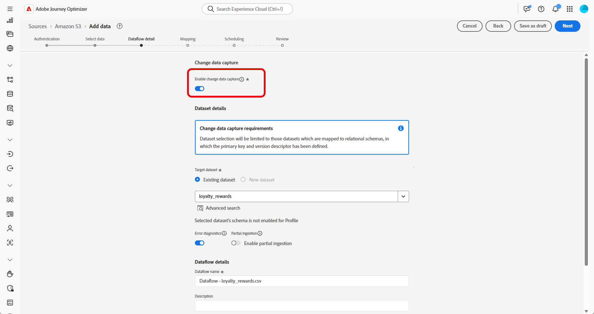

# Samenvattingsgegevens {#ingest-data}

+++ Inhoudsopgave

| Welkom bij georkestreerde campagnes | Start uw eerste georkestreerde campagne | De database opvragen | Gecontroleerde campagnes |
|---|---|---|---|
| [ worden begonnen met georkestreerde campagnes ](gs-orchestrated-campaigns.md)   creeer en beheer relationele Schema&#39;s en Datasets   <ul><li>[ worden begonnen met Schema&#39;s en Datasets ](gs-schemas.md)</li><li>[ Handmatig schema ](manual-schema.md)</li><li>[ het uploadschema van het Dossier ](file-upload-schema.md)</li><li>[ Ingest gegevens ](ingest-data.md)</li></ul>[ toegang en beheer georkestreerde campagnes ](access-manage-orchestrated-campaigns.md)  [ Zeer belangrijke stappen om een georkestreerde campagne ](gs-campaign-creation.md) tot stand te brengen | [ creeer en programma de campagne ](create-orchestrated-campaign.md)  [ Orchestrate activiteiten ](orchestrate-activities.md)  [ Begin en controleer de campagne ](start-monitor-campaigns.md)  [ Meldend ](reporting-campaigns.md) | [ Werk met de regelbouwer ](orchestrated-rule-builder.md)  [ bouwt uw eerste vraag ](build-query.md)  [ uit geeft uitdrukkingen ](edit-expressions.md)  [ opnieuw op ](retarget.md) | [ wordt begonnen met activiteiten ](activities/about-activities.md)   Activiteiten: [ en-sluit zich aan ](activities/and-join.md) - [ bouwt publiek ](activities/build-audience.md) - [ dimensie van de Verandering ](activities/change-dimension.md) - [ de activiteiten van het Kanaal ](activities/channels.md) - [ combineren ](activities/combine.md) - [ Deduplicatie ](activities/deduplication.md) - [ Verrijking ](activities/enrichment.md) Formeel k [ - ](activities/fork.md) Verzoening [ - ](activities/reconciliation.md) sparen publiek [ - ](activities/save-audience.md) Gesplitst [ - ](activities/split.md) wacht [&#128279;](activities/wait.md) |

{style="table-layout:fixed"}

+++

 

>[!BEGINSHADEBOX]

 

De inhoud op deze pagina is niet definitief en kan worden gewijzigd.

>[!ENDSHADEBOX]

Adobe Experience Platform staat toe dat gegevens uit externe bronnen worden opgenomen en biedt u de mogelijkheid om inkomende gegevens te structureren, labelen en verbeteren met behulp van Experience Platform-services. U kunt gegevens invoeren uit verschillende bronnen, zoals Adobe-toepassingen, opslag in de cloud, databases en vele andere.

## Met cloudopslag {#ingest}

>[!IMPORTANT]
>
>Om de gegevensbron voor een dataset te veranderen, moet u eerst bestaande dataflow schrappen alvorens tot nieuwe te leiden die de zelfde dataset en de nieuwe bron verwijzingen.
>
>Adobe Experience Platform dwingt een strikte één-op-één verhouding tussen gegevensstromen en datasets af. Dit staat u toe om synchronisatie tussen de bron en de dataset voor nauwkeurige stijgende opname te handhaven.

U kunt een gegevensstroom vormen om gegevens van een bron van Amazon S3 in Adobe Experience Platform in te voeren. Zodra gevormd, laat de gegevensstroom geautomatiseerde, geplande opname van gestructureerde gegevens toe en steunt updates in real time.

1. Via het menu **[!UICONTROL Connections]** opent u het menu **[!UICONTROL Sources]** .

1. Selecteer de categorie **[!UICONTROL Cloud storage]** , vervolgens Amazon S3 en klik op **[!UICONTROL Add Data]** .

   

1. Sluit uw S3-account aan:

   * Met een bestaande account

   * Met een nieuwe account

   [ leer meer in de documentatie van Adobe Experience Platform ](https://experienceleague.adobe.com/en/docs/experience-platform/destinations/catalog/cloud-storage/amazon-s3#connect)

   

1. Kies uw map **[!UICONTROL Data format]** , **[!UICONTROL Delimiter]** en **[!UICONTROL Compression type]** .

1. Navigeer door de verbonden S3 bron tot u van gewenste omslagen, bijvoorbeeld **loyaliteitbeloningen** en **loyaliteitstransacties** de plaats bepaalt.

1. Selecteer de map die uw gegevens bevat.

   Als u een map selecteert, worden alle huidige en toekomstige bestanden met dezelfde structuur automatisch verwerkt. Als u één bestand selecteert, moet u echter elke nieuwe gegevensstap handmatig uploaden.

   

1. Kies uw map **[!UICONTROL Data format]** , **[!UICONTROL Delimiter]** en **[!UICONTROL Compression type]** . Controleer de voorbeeldgegevens op nauwkeurigheid en klik op **[!UICONTROL Next]** .

   

1. Schakel **[!UICONTROL Enable Change data capture]** in om alleen gegevenssets weer te geven die zijn toegewezen aan relationele schema&#39;s en zowel een primaire sleutel als een versiedescriptor bevatten.

   

1. Selecteer de eerder gemaakte gegevensset en klik op **[!UICONTROL Next]** .

   

1. Controleer in het venster **[!UICONTROL Mapping]** of elk kenmerk van het bronbestand correct is toegewezen aan de corresponderende velden in het doelschema.

   Klik **[!UICONTROL Next]** eenmaal gereed.

   

1. Configureer de gegevensstroom **[!UICONTROL Schedule]** op basis van de gewenste frequentie.

1. Klik op **[!UICONTROL Finish]** om de gegevensstroom te maken. Deze wordt automatisch uitgevoerd volgens het gedefinieerde schema.

1. Selecteer **[!UICONTROL Connections]** in het menu **[!UICONTROL Sources]** en open het tabblad **[!UICONTROL Data Flows]** om de uitvoering van de flow bij te houden, ingesloten records te controleren en eventuele fouten op te lossen.

   

