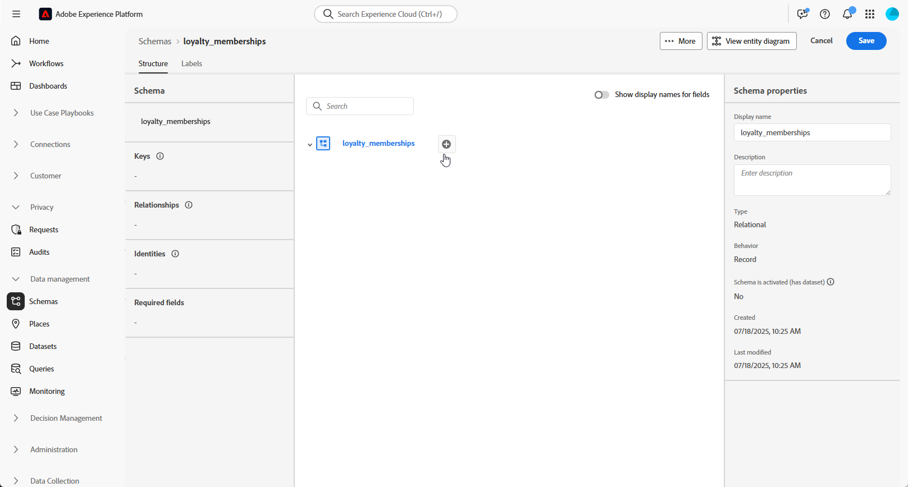

# Handmatig relationeel schema instellen {#manual-schema}

+++ Inhoudsopgave

| Welkom bij georkestreerde campagnes | Start uw eerste georkestreerde campagne | De database opvragen | Gecontroleerde campagnes |
|---|---|---|---|
| [ wordt begonnen met georkestreerde campagnes ](gs-orchestrated-campaigns.md)   creeer en beheer relationele Schema&#39;s en Datasets: <ul><li>[ worden begonnen met Schema&#39;s en Datasets ](gs-schemas.md)</li><li>[ Handmatig schema ](manual-schema.md)</li><li>[ het uploadschema van het Dossier ](file-upload-schema.md)</li><li>[ Ingest gegevens ](ingest-data.md)</li></ul>[ toegang en beheer georkestreerde campagnes ](access-manage-orchestrated-campaigns.md)  [ Zeer belangrijke stappen om een georkestreerde campagne ](gs-campaign-creation.md) tot stand te brengen | [ creeer en programma de campagne ](create-orchestrated-campaign.md)  [ Orchestrate activiteiten ](orchestrate-activities.md)  [ Begin en controleer de campagne ](start-monitor-campaigns.md)  [ Meldend ](reporting-campaigns.md) | [ Werk met de regelbouwer ](orchestrated-rule-builder.md)  [ bouwt uw eerste vraag ](build-query.md)  [ uit geeft uitdrukkingen ](edit-expressions.md)  [ opnieuw op ](retarget.md) | [ wordt begonnen met activiteiten ](activities/about-activities.md)   Activiteiten: [ en-sluit zich aan ](activities/and-join.md) - [ bouwt publiek ](activities/build-audience.md) - [ dimensie van de Verandering ](activities/change-dimension.md) - [ de activiteiten van het Kanaal ](activities/channels.md) - [ combineren ](activities/combine.md) - [ Deduplicatie ](activities/deduplication.md) - [ Verrijking ](activities/enrichment.md) Formeel k [ - ](activities/fork.md) Verzoening [ - ](activities/reconciliation.md) sparen publiek [ - ](activities/save-audience.md) Gesplitst [ - ](activities/split.md) wacht  |

{style="table-layout:fixed"}

+++

 

>[!BEGINSHADEBOX]

 

De inhoud op deze pagina is niet definitief en kan worden gewijzigd.

>[!ENDSHADEBOX]

Relationele schema&#39;s kunnen direct door het gebruikersinterface worden gecreeerd, toelatend gedetailleerde configuratie van attributen, primaire sleutels, versioning gebieden, en verhoudingen.

Het volgende voorbeeld bepaalt manueel het **schema van het Membership van de Loyalty** om de vereiste structuur voor georkestreerde campagnes te illustreren.

1. [ creeer manueel een relationeel schema ](#schema) gebruikend de interface van Adobe Experience Platform.

1. [ voegt attributen ](#schema-attributes) zoals klant identiteitskaart, lidmaatschapsniveau, en statusgebieden toe.

1. [ Verbinding uw schema ](#link-schema) aan ingebouwde schema&#39;s zoals Ontvangers voor campagne het richten.

1. [ creeer een dataset ](#dataset) die op uw schema wordt gebaseerd en laat het voor gebruik in georkestreerde campagnes toe.

1. [ Samenvatting gegevens ](ingest-data.md) in uw dataset van gesteunde bronnen.

## Uw schema maken {#schema}

Begin door een nieuw relationeel schema manueel in Adobe Experience Platform te creëren. Met dit proces kunt u de schemastructuur helemaal opnieuw definiëren, inclusief de naam en het gedrag.

1. Meld u aan bij Adobe Experience Platform.

1. Ga naar het menu **[!UICONTROL Data Management]** > **[!UICONTROL Schema]** .

1. Klik op **[!UICONTROL Create Schema]**.

1. Selecteer **[!UICONTROL Relational]** als uw **type van Schema**.

   {zoomable="yes"}

1. Kies **[!UICONTROL Create manually]** om het schema samen te stellen door handmatig velden toe te voegen.

1. Voer uw **[!UICONTROL Schema display name]** in.

1. Kies **[!UICONTROL Record]** als uw **[!UICONTROL Schema behavior]** .

   {zoomable="yes"}

1. Klik **Afwerking** om aan uw schemaverwezenlijking te werk te gaan.

U kunt nu kenmerken aan uw schema toevoegen om de structuur ervan te definiëren.

## Kenmerken toevoegen aan uw schema {#schema-attributes}

Voeg vervolgens kenmerken toe om de structuur van het schema te definiëren. Deze gebieden vertegenwoordigen de belangrijkste gegevenspunten die in geordende campagnes, zoals klantenherkenningstekens, lidmaatschapsdetails, en activiteitendata worden gebruikt. Het bepalen van hen verzekert nauwkeurig betrouwbare verpersoonlijking, segmentatie, en het volgen.

1. In het canvas, klik  naast uw **naam van het Schema** beginnen attributen toe te voegen.

   {zoomable="yes"}

1. Voer het kenmerk **[!UICONTROL Field name]** , **[!UICONTROL Display name]** en **[!UICONTROL Type]** in.

   In dit voorbeeld, hebben wij de attributen toegevoegd die in de lijst hieronder aan het **het lidmaatschapsschema van de Loyalty** worden gedetailleerd.

+++ Voorbeelden van kenmerken

   | Kenmerknaam | Gegevenstype | Aanvullende kenmerken |
   |-|-|-|
   | klant | TEKENREEKS | Primaire sleutel |
   | membership_level | TEKENREEKS | Vereist |
   | points_balance | INTEGER | Vereist |
   | enrollment_date | DATE | Vereist |
   | last_status_change | DATE | Vereist |
   | expiration_date | DATE | - |
   | is_active | BOOLEAN | Vereist |
   | laatstelijk | DATETIME | Vereist |

+++

1. Wijs de desbetreffende velden toe als de **[!UICONTROL Primary Key]** en **[!UICONTROL Version Descriptor]** .

   **[!UICONTROL Primary Key]** zorgt ervoor dat elke record op unieke wijze wordt geïdentificeerd, terwijl **[!UICONTROL Version Descriptor]** updates vastlegt in de loop van de tijd, waardoor de functie Gegevens vastleggen wijzigen wordt ingeschakeld en gegevensmirroring wordt ondersteund.

   {zoomable="yes"}

1. Klik op **[!UICONTROL Save]**.

Zodra de attributen worden gecreeerd, moet u uw onlangs gecreeerd schema met een ingebouwd schema verbinden.

## Koppelingsschema&#39;s {#link-schema}

Creeer een verband tussen twee schema&#39;s staat u toe om uw georkestreerde campagnes met gegevens te verrijken die buiten het primaire profielschema worden opgeslagen.

1. Selecteer in het nieuwe schema het kenmerk dat u als koppeling wilt gebruiken en klik op **[!UICONTROL Add relationship]** .

   {zoomable="yes"}

1. Kies de **[!UICONTROL Reference schema]** en **[!UICONTROL Reference field]** om de relatie tot stand te brengen.

   In dit voorbeeld is het kenmerk `customer` gekoppeld aan het schema `recipients` .

   {zoomable="yes"}

1. Voer een naam voor de relatie in vanuit het huidige schema en het referentieschema.

1. Klik op **[!UICONTROL Apply]** zodra dit is geconfigureerd.

Zodra de verhouding wordt gevestigd, moet u een dataset tot stand brengen die op uw schema wordt gebaseerd.

## Creeer een dataset voor het schema {#dataset}

Na het bepalen van uw schema, moet de volgende stap een dataset tot stand brengen die op het wordt gebaseerd. In deze gegevensset worden uw opgenomen gegevens opgeslagen en moeten geordende campagnes zijn ingeschakeld om deze toegankelijk te maken in Adobe Journey Optimizer. Als u deze optie inschakelt, wordt de gegevensset herkend voor gebruik in realtime workflows voor orchestratie en personalisatie.

1. Ga naar het menu **[!UICONTROL Data Management]** > **[!UICONTROL Datasets]** en klik op **[!UICONTROL Create dataset]** .

   {zoomable="yes"}

1. Selecteer **[!UICONTROL Create dataset from schema]**.

1. Kies uw eerder gecreeerd schema, hier **het lidmaatschap van de Loyalty**, en klik **[!UICONTROL Next]**.

   {zoomable="yes"}

1. Voer een **[!UICONTROL Name]** voor uw **[!UICONTROL Dataset]** in en klik op **[!UICONTROL Finish]** .

1. Laat de **Geordende 1} optie van Campagnes {toe om de dataset beschikbaar voor gebruik in uw campagnes van AJO te maken.**

   De activering kan een paar minuten duren. Gegevensinvoer is alleen mogelijk nadat de optie volledig is geactiveerd.

   {zoomable="yes"}

U kunt nu gegevens in uw schema beginnen op te nemen gebruikend de bron van uw keus.

➡️ [ Leer hoe te om gegevens in te voeren ](ingest-data.md)
