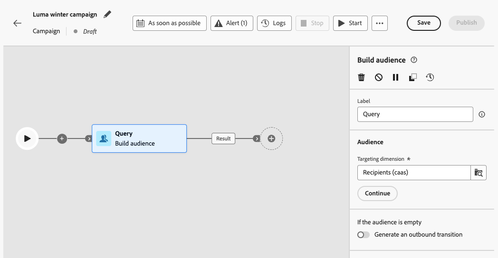

# Gestroomlijnde campagneactiviteiten ordenen {#orchestrate}

+++ Inhoudsopgave

| Welkom bij georkestreerde campagnes | Start uw eerste georkestreerde campagne | De database opvragen | Gecontroleerde campagnes |
|---|---|---|---|
| [ wordt begonnen met georkestreerde campagnes ](gs-orchestrated-campaigns.md)  [ stappen van de Configuratie ](configuration-steps.md)  [ Toegang en beheert georkestreerde camapens ](access-manage-orchestrated-campaigns.md) | [ Zeer belangrijke stappen voor georkestreerde campagneverwezenlijking ](gs-campaign-creation.md)  [ creëren en vormen de campagne ](create-orchestrated-campaign.md)  <b>[ activiteiten van het Orchestrate ](orchestrate-activities.md)</b>  [ verzenden berichten met georkestreerde campagnes ](send-messages.md)  [ Begin en controleren de campagne ](start-monitor-campaigns.md)  [ Meldend ](reporting-campaigns.md) | [ Werk met de regelbouwer ](orchestrated-rule-builder.md)  [ bouwt uw eerste vraag ](build-query.md)  [ uitdrukkingen ](edit-expressions.md) uit | [ wordt begonnen met activiteiten ](activities/about-activities.md)   Activiteiten: [ en-sluit zich aan ](activities/and-join.md) - [ bouwt publiek ](activities/build-audience.md) - [ dimensie van de Verandering ](activities/change-dimension.md) - [ combineert ](activities/combine.md) - [ Deduplicatie ](activities/deduplication.md) - [ Verrijking ](activities/enrichment.md) - [ Fork ](activities/fork.md) opnieuw verzoening [&#128279;](activities/reconciliation.md) - [ Gesplitst ](activities/split.md) - [ wacht ](activities/wait.md) |

{style="table-layout:fixed"}

+++

 

Zodra u [ een georkestreerde campagne ](gs-campaign-creation.md) hebt gecreeerd, of van het georkestreerde campagnemenu of binnen een campagne, kunt u beginnen de verschillende taken te ordenen het zal uitvoeren. Hiervoor wordt een visueel canvas verschaft, zodat u een georkestreerd campagnediagram kunt maken. Binnen dit diagram, kunt u diverse activiteiten toevoegen en hen in een opeenvolgende orde verbinden.

## Activiteiten toevoegen {#add}

In dit stadium van de configuratie, wordt het diagram getoond met een beginpictogram, dat het begin van uw georkestreerde campagne vertegenwoordigt. Als u uw eerste activiteit wilt toevoegen, klikt u op de knop **+** die is verbonden met het beginpictogram.

Er wordt een lijst met activiteiten weergegeven die aan het diagram kunnen worden toegevoegd. De beschikbare activiteiten zijn afhankelijk van uw positie binnen het georkestreerde campagnediagram. Bijvoorbeeld, wanneer het toevoegen van uw eerste activiteit, kunt u uw georkestreerde campagne beginnen door een publiek te richten, het georkestreerde campagneweg te verdelen, of a **te plaatsen wacht** activiteit om de georkestreerde campagneuitvoering te vertragen. Anderzijds, na a **bouwt publiek** activiteit, kunt u uw doel met het richten van activiteiten verfijnen, een levering naar uw publiek met kanaalactiviteiten verzenden, of het geordende campagneproces met de activiteiten van de stroomcontrole organiseren.

{zoomable="yes"}

Zodra een activiteit aan het diagram is toegevoegd, verschijnt een juiste ruit, toestaand u om de onlangs toegevoegde activiteit met specifieke montages te vormen. De gedetailleerde informatie over hoe te om elke activiteit te vormen is beschikbaar in [ deze sectie ](activities/about-activities.md).

{zoomable="yes"}

Herhaal dit proces om zoveel activiteiten toe te voegen als u wilt, afhankelijk van de taken die u voor uw georkestreerde campagne wilt uitvoeren. U kunt ook een nieuwe activiteit invoegen tussen twee activiteiten. Om dit te doen, klik **+** knoop op de overgang tussen de activiteiten, selecteer de gewenste activiteit en vorm het in de juiste ruit.

Om een activiteit te verwijderen, selecteer het op het canvas en klik **Schrapping** pictogram in de activiteiteneigenschappen.

>[!TIP]
>
>U kunt de naam van de overgangen tussen elke activiteit aanpassen. U doet dit door de overgang te selecteren en het label ervan te wijzigen in het rechterdeelvenster.

## De werkbalk {#toolbar}

De werkbalk in de rechterbovenhoek van het canvas bevat opties waarmee u de activiteiten eenvoudig kunt manipuleren en op het canvas kunt navigeren:

* **Veelvoudige selectiemodus**: Selecteer veelvoudige activiteiten om hen allen in één keer te schrappen of hen te kopiëren en te kleven. Zie [deze sectie](#copy).
* **roteer**: Verdraai verticaal het canvas.
* **Passend aan het scherm**: Pas het het gezoemniveau van het canvas aan uw scherm aan.
* **Gezoem uit** / **Gezoem binnen**: Gezoem uit of in het canvas.
* **kaart van de Vertoning**: Opent een momentopname van het canvas die u toont wordt gevestigd.

{zoomable="yes"}{width="50%"}

## Activiteiten beheren {#manage}

Wanneer u activiteiten toevoegt, zijn er actieknoppen beschikbaar in het deelvenster Eigenschappen, zodat u meerdere bewerkingen kunt uitvoeren.

{zoomable="yes"}

U kunt:

* **Schrap** de activiteit van het canvas.
* **onbruikbaar maken/laat** de activiteit toe. Wanneer de georkestreerde campagne wordt uitgevoerd, worden activiteiten met een handicap en de volgende activiteiten op hetzelfde pad niet uitgevoerd en wordt de georkestreerde campagne gestopt.
* **Pauze/hervat** de activiteit. Wanneer de georkestreerde campagne wordt uitgevoerd, pauzeert het bij de gepauzeerde activiteit. De bijbehorende taak en alle taken die deze in hetzelfde pad volgen, worden niet uitgevoerd.
* **Exemplaar** de activiteit. Zie [deze sectie](#copy).
* Heb toegang tot de Logboeken en de taken van de activiteit **&#x200B;**.

Verscheidene **richtend** activiteiten, zoals **combineren** of **Deduplicatie**, staat u toe om de resterende bevolking te verwerken en het in een extra uitgaande overgang te omvatten. Bijvoorbeeld, als u a **Gesplitste** activiteit gebruikt, bestaat de aanvulling uit de bevolking die om het even welke eerder bepaalde ondergroepen niet aanpast. Om dit vermogen te gebruiken, activeer **aanvult** optie.

## Verplaatsen of kopiëren {#move-copy}

### Kopiëren en plakken {#copy}

U kunt georkestreerde campagneactiviteiten kopiëren en ze in elke werkstroom plakken. De doelgeorkestreerde campagne kan in een verschillende browser tabel zijn.

Voor het kopiëren van activiteiten hebt u twee mogelijkheden:

* Kopieer één activiteit gebruikend de actieknoop.

  {zoomable="yes"}{width="70%"}

* Kopieer meerdere activiteiten met de werkbalkknop.

  {zoomable="yes"}{width="70%"}

Als u de gekopieerde activiteiten wilt plakken, klikt u op de knop **+** in een overgang en selecteert u &quot;X-activiteit plakken&quot;.

{zoomable="yes"}{width="50%"}

<!--
### Move activities and their child nodes {#move}

Journey Optimizer allows you to move an activity, along with the entire content of its child nodes (including all transitions and activities within it) to the end of another transition within the same orchestrated campaign.

This process disconnects the activity and everything in its outbound transition from the initial location, moving it to the new target transition.

To move an activity:

1. Select the activity you wish to move.
1. In the activity's properties pane, click the **Move** button.
1. Select the transition where you want to place the activity and its outbound transition, then confirm.

## Execution options {#execution}

All activities allow you to manage their execution options. Select an activity and click on the **Execution options** button. This lets you define the activity's execution mode and behavior in case of errors.

{zoomable="yes"}{width="70%"}

### Properties

The **Execution** field allows you to define the action to be carried out when the task is started.

The **Maximum execution duration** field allows you to specify a duration such as "30s" or "1h". If the activity is not finished after the duration specified has been elapsed, an alert is triggered. This has no impact on how the orchestrated campaign functions.

The **Time zone** field allows you to select the time zone of the activity. Adobe Journey Optimizer allows you to manage the time differences between multiple countries on the same instance. The setting applied is configured when the instance is created.

**The Affinity** field allows you to force an orchestrated campaign or an orchestrated campaign activity to execute on a particular machine. To do this, you must specify one or several affinities for the orchestrated campaign or activity in question.

The **Behavior** field allows you to define the procedure to follow if asynchronous tasks are used.

### Error management

The **In case of error** field allows you to specify the action to be carried out should the activity encounter an error.

### Initialization script

The **Initialization script** lets you initialize variables or modify activity properties. Click the **Edit code** button and type the snippet of code to execute. The script is called when the activity executes. 

## Example {#example}

Here is an orchestrated campaign example designed to send an email to all customers (other than VIP customers) with an email who are interested in coffee machines.

{zoomable="yes"}{zoomable="yes"}

To achieve this, activities below have been added:

* A **[!UICONTROL Fork]** activity that divides the orchestrated campaign into three paths (one for each set of customer),
* **[!UICONTROL Build audience]** activities to target the three sets of customers:

    * Customers with an email,
    * Customers belonging to the pre-existing "Interrested in Coffee Machine(s)" audience,
    * Customers belonging to the pre-existing "VIP ro reward" audience.

* A **[!UICONTROL Combine]** activity that groups together customers with an email and those interested in coffee machines,
* A **[!UICONTROL Combine]** activity that excludes VIP customers,
* An **[!UICONTROL Email delivery]** activity that sends an email to the resulting customers. 

Once you have completed the orchestrated campaign, add en **[!UICONTROL End]** activity at the end of the diagram. This activity allow you to visually mark the end of a workflow and has no functional impact.

After successfully designing the orchestrated campaign diagram, you can execute the orchestrated campaign and track the progress of its various tasks. [Learn how to start an orchestrated campaign and monitor its execution](start-monitor-campaigns.md)
-->