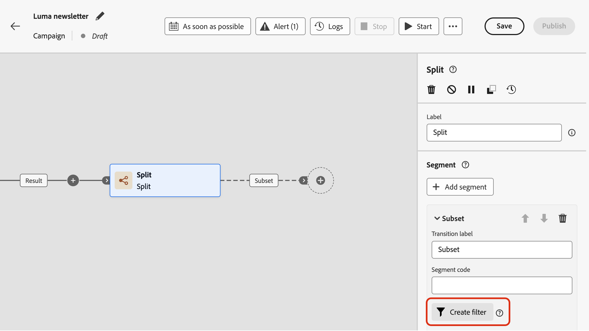

# Werken met de regelbouwer {#orchestrated-rule-builder}

+++ Inhoudsopgave

| Welkom bij georkestreerde campagnes | Start uw eerste georkestreerde campagne | De database opvragen | Gecontroleerde campagnes |
|---|---|---|---|
| [ krijgen begonnen met georkestreerde campagnes ](gs-orchestrated-campaigns.md)  [ stappen van de Configuratie ](configuration-steps.md)  [ Toegang en beheert georkestreerde campagnes ](access-manage-orchestrated-campaigns.md) | [ Zeer belangrijke stappen voor georkestreerde campagneverwezenlijking ](gs-campaign-creation.md)  [ creëren en plannen de campagne ](create-orchestrated-campaign.md)  [ activiteiten van het Orchestrate ](orchestrate-activities.md)  <b>[ Begin en controleer de campagne ](start-monitor-campaigns.md)</b>  [ Meldend ](reporting-campaigns.md) | [ Werk met de regelbouwer ](orchestrated-rule-builder.md)  [ bouwt uw eerste vraag ](build-query.md)  [ uit geeft uitdrukkingen ](edit-expressions.md)  [ opnieuw op ](retarget.md) | [ wordt begonnen met activiteiten ](activities/about-activities.md)   Activiteiten: [ en-sluit zich aan ](activities/and-join.md) - [ bouwt publiek ](activities/build-audience.md) - [ dimensie van de Verandering ](activities/change-dimension.md) - [ de activiteiten van het Kanaal ](activities/channels.md) - [ combineren ](activities/combine.md) - [ Deduplicatie ](activities/deduplication.md) - [ Verrijking ](activities/enrichment.md) Formeel k [ - ](activities/fork.md) Verzoening [ - ](activities/reconciliation.md) sparen publiek [ - ](save-audience.md) Gesplitst [ - ](activities/split.md) wacht  |

{style="table-layout:fixed"}

+++

 

Geordende campagnes komen met een regelbouwer die het proces vereenvoudigt om het gegevensbestand te filtreren dat op diverse criteria wordt gebaseerd. De bouwer van de regel beheert zeer complexe en lange vragen efficiënt, die grotere flexibiliteit en precisie aanbieden.

Het steunt ook vooraf bepaalde filters binnen voorwaarden, die u machtigen om vragen te verfijnen terwijl het gebruiken van geavanceerde uitdrukkingen en exploitanten voor uitvoerige publiek richtend en segmenteringsstrategieën.

## Heb toegang tot de regelbouwer

De vraagmodeler is beschikbaar in elke context waar u regels aan filtergegevens moet bepalen.

| Gebruik | Voorbeeld |
|  ---  |  ---  |
| **bouwt publiek**: Specificeer de bevolking u in uw georkestreerde campagnes wilt richten gebruikend a **[!UICONTROL Build audience]** activiteit, en creeert moeiteloos nieuwe die toehoorders aan uw behoeften worden aangepast. [ Leer hoe te om publiek te bouwen ](../orchestrated/activities/build-audience.md) | {width="200" align="center" zoomable="yes"} |
| **creeer voorwaarde in het campagnecanvas**: Pas regels binnen het campagnecanvas toe gebruikend een **[!UICONTROL Split]** activiteit, om zich op uw specifieke vereisten te richten. [ Leer hoe te om een Gesplitste activiteit ](../orchestrated/activities/split.md) te gebruiken | {width="200" align="center" zoomable="yes"} toont |
| **creeer geavanceerde filters**: Bouw regels om de gegevens te filtreren die in lijsten zoals werkschemalogboeken of het richten van dimensies worden getoond. | {width="200" align="center" zoomable="yes"} tonen aan te passen |

## Interface van Rule builder {#interface}

De regelbouwer verstrekt een centraal canvas waar u uw vraag en een eigenschappenruit bouwt die informatie over de regel verstrekt.

* Het **centrale canvas** is waar u toevoegt en de verschillende componenten combineert om uw regel te bouwen. [ Leer hoe te om een regel ](../orchestrated/build-query.md) te bouwen

* Het deelvenster **[!UICONTROL Rule properties]** bevat informatie over uw regel. Het staat u toe om diverse handelingen uit te voeren om de regel te controleren en ervoor te zorgen het uw behoeften aanpast.

  Dit deelvenster wordt weergegeven wanneer u een query samenstelt om een publiek te maken. [ leer hoe te om uw vraag te controleren en te bevestigen ](build-query.md#check-and-validate-your-query)
