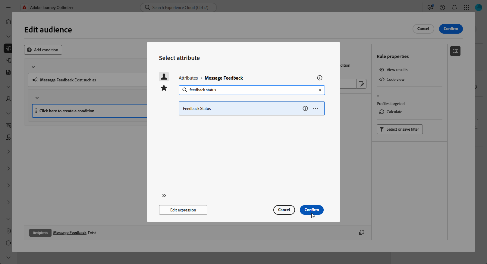
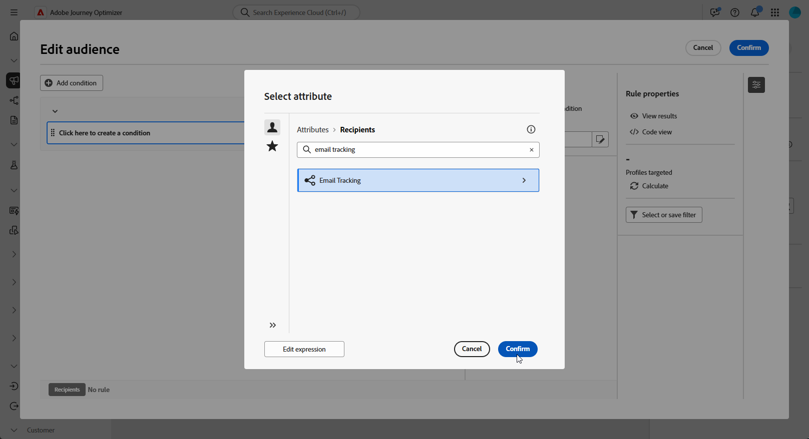
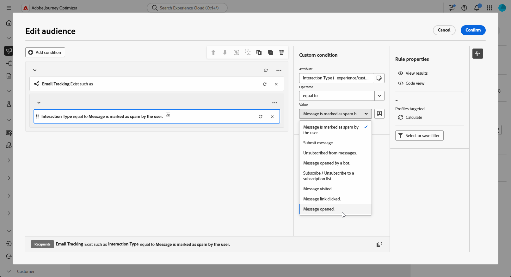

# Opnieuw gerichte query&#39;s maken {#retarget}

Door opnieuw te trainen kunt u op basis van de manier waarop ze op een vorige geordende campagne hebben gereageerd, een follow-up met ontvangers krijgen. U kunt bijvoorbeeld een tweede e-mail verzenden naar ontvangers die wel een tweede e-mail hebben ontvangen, maar niet op de eerste hebben geklikt.

**[!UICONTROL Orchestrated Campaign]** biedt hiervoor twee hoofdkenmerken:

* **[!UICONTROL Message Feedback]**: legt gebeurtenissen vast die betrekking hebben op de levering, zoals verzonden, geopend, teruggestuurd, enz. bericht.
* **[!UICONTROL Email Tracking]**: legt gebruikersacties vast, bijvoorbeeld klikken en openen.

{zoomable="yes"}

## Een regel voor opnieuw toewijzen op basis van feedback maken {#feedback-retarget}

Op feedback gebaseerde regel voor opnieuw toewijzen stelt u in staat ontvangers opnieuw als doel in te stellen op basis van gebeurtenissen voor het verzenden van berichten die zijn vastgelegd in het kenmerk **[!UICONTROL Message Feedback]** . Deze gebeurtenissen omvatten uitkomsten zoals berichten die worden verzonden, geopend, teruggestuurd of gemarkeerd als spam.

Gebruikend deze gegevens, kunt u regels bepalen om ontvangers te identificeren die een vorig bericht ontvingen toelatend follow-upmededeling die op specifieke leveringsstatussen wordt gebaseerd.

1. Maak een nieuwe **[!UICONTROL Orchestrated Campaign]** .

1. Voeg een **[!UICONTROL Build Audience]** -activiteit toe en stel de doeldimensie in op **[!UICONTROL Recipient (caas)]** .

1. Klik in de **[!UICONTROL Rule Builder]** op **[!UICONTROL Add Condition]** en selecteer **[!UICONTROL Message Feedback]** in de **[!UICONTROL Attributes Picker]** . Klik **[!UICONTROL Confirm]** om de Terugkoppeling van het a **Bericht tot stand te brengen bestaat zoals** voorwaarde.

   {zoomable="yes"}

1. Kies het kenmerk **[!UICONTROL Feedback Status]** om gebeurtenissen voor berichtlevering als doel in te stellen.

   +++ Gedetailleerd, stap voor stap

   1. Voeg een andere voorwaarde toe die is gekoppeld aan het kenmerk **[!UICONTROL Message feedback]** .

   1. Zoek het kenmerk **[!UICONTROL Feedback Status]** en klik op **[!UICONTROL Confirm]** .

      {zoomable="yes"}

   1. Kies in het menu **[!UICONTROL Custom condition]** welke leveringsstatus u wilt bijhouden in de vervolgkeuzelijst **[!UICONTROL Value]** .

      {zoomable="yes"}

   +++

1. Kies het kenmerk **[!UICONTROL Orchestrated Campaign Name]** als u een specifieke geordende campagne wilt starten.

   +++ Gedetailleerd, stap voor stap

   1. Voeg een andere voorwaarde toe die is gekoppeld aan het kenmerk **[!UICONTROL Message feedback]** , zoek naar **[!UICONTROL entity]** en navigeer naar:

      `_experience > CustomerJourneyManagement > Entities > AJO Orchestrated Campaign entity`.

   1. Selecteer **[!UICONTROL Orchestrated Campaign Name]**.

      {zoomable="yes"}

   1. Geef in het menu **[!UICONTROL Custom condition]** de naam van de campagne op in het veld **[!UICONTROL Value]** .

   +++

1. Kies het **[!UICONTROL Orchestrated Campaign Action Name]** -kenmerk als u een specifiek bericht of een specifieke activiteit in een geordende campagne als doel wilt instellen.

   +++ Gedetailleerd, stap voor stap

   1. Voeg een andere voorwaarde toe die is gekoppeld aan het kenmerk **[!UICONTROL Message feedback]** , zoek naar **[!UICONTROL entity]** en navigeer naar:

      `_experience > CustomerJourneyManagement > Entities > AJO Orchestrated Campaign entity`.

   1. Selecteer **[!UICONTROL Orchestrated Campaign Action Name]**.

      {zoomable="yes"}

   1. Geef in het menu **[!UICONTROL Custom condition]** de naam van de actie voor de campagne op in het veld **[!UICONTROL Value]** .

      De namen van de acties kunnen worden gevonden door het  naast het gebied van het Etiket van uw activiteit te klikken.

   +++

1. U kunt ook filteren op **[!UICONTROL Campaign ID]** (UUID), die u vindt in de campagneeigenschappen.

U hebt nu op feedback gebaseerde herrichtingsregel geconfigureerd om ontvangers te identificeren op basis van de leveringsstatus van een vorig bericht, zoals verzonden, geopend, teruggestuurd of gemarkeerd als spam. Met dit die publiek wordt bepaald, kunt u of een follow-up e-mail toevoegen of uw het richten verder verfijnen door [&#x200B; het vormen van een Op volgen-Gebaseerde het opnieuw richten regel &#x200B;](#tracking-based), die gebruikersinteractiegegevens gebruikt.

{zoomable="yes"}

## Een op reeksspatiëring gebaseerde herrichtingsregel maken {#tracking-based}

Het volgen-gebaseerde opnieuw richten van regel richt ontvangers die op hun interactie met een bericht worden gebaseerd, gebruikend gegevens van het **[!UICONTROL Email Tracking]** attribuut. Hiermee worden gebruikersacties vastgelegd, zoals het openen van e-mail en het klikken op koppelingen.

Gebruik de entiteit **[!UICONTROL Email Tracking]** als volgt om ontvangers opnieuw te richten op basis van berichtinteractie (bijvoorbeeld openen of klikken):

1. Maak een nieuwe **[!UICONTROL Orchestrated Campaign]** .

1. Voeg een **[!UICONTROL Build Audience]** -activiteit toe en stel de doeldimensie in op **[!UICONTROL Recipient (caas)]** om de focus op vorige geordende campagneontvangers te plaatsen.

1. Klik in de **[!UICONTROL Rule Builder]** op **[!UICONTROL Add Condition]** en selecteer **[!UICONTROL Email Tracking]** in de **[!UICONTROL Attributes Picker]** .

   Klik **[!UICONTROL Confirm]** om a **E-mail het Volgen tot stand te brengen bestaat zoals** voorwaarde.

   {zoomable="yes"}

1. Als u de interactie van ontvangers met een bericht als doel wilt instellen, voegt u een andere voorwaarde toe die is gekoppeld aan het kenmerk **[!UICONTROL Email tracking]** en zoekt u het kenmerk **[!UICONTROL Interaction Type]** .

   {zoomable="yes"}

1. Gebruik in de opties voor aangepaste voorwaarden **[!UICONTROL Included in]** als de operator en selecteer een of meer waarden, afhankelijk van het gebruikte hoofdlettergebruik, bijvoorbeeld **[!UICONTROL Message Opened]** of **[!UICONTROL Message Link Clicked]** .

   {zoomable="yes"}

U hebt nu een op reeksspatiëring gebaseerde herrichtingsregel geconfigureerd voor doelontvangers op basis van hun interacties met een eerder bericht, zoals het openen van een e-mail of het klikken met koppelingen, met behulp van gegevens uit het kenmerk **[!UICONTROL Email Tracking]** . Met dit bepaalde publiek, kunt u of een follow-up actie toevoegen of uw het richten verder verfijnen door het met a [&#x200B; te combineren terugkoppelen-Gebaseerde het opnieuw richten regel &#x200B;](#feedback-retarget) om berichtresultaten zoals verzonden, die, of duidelijk als spam worden verzonden te omvatten.

{zoomable="yes"}
