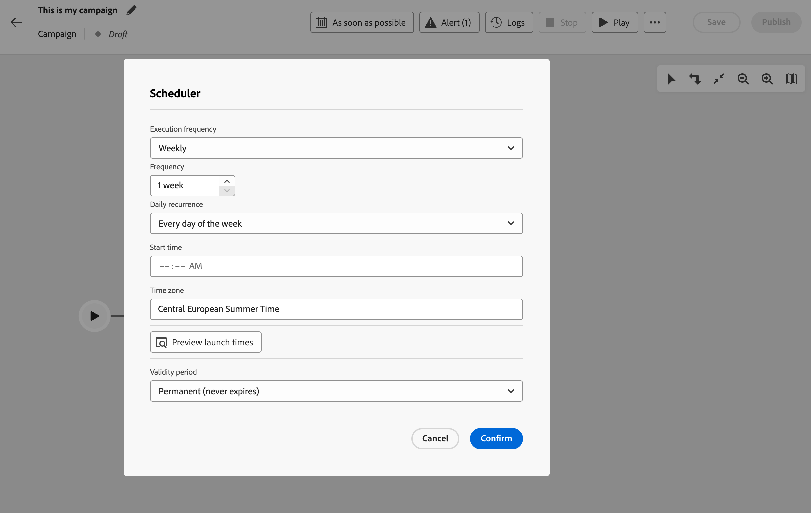

# Uw georkestreerde campagnes plannen en starten {#start-monitor}

>[!CONTEXTUALHELP]
>id="ajo_campaign_publication"
>title="Georkestreerde campagne publiceren"
>abstract="Als u uw campagne wilt starten, moet u deze publiceren. Zorg ervoor dat alle waarschuwingen zijn gewist voordat u ze publiceert."

+++ Inhoudsopgave

| Welkom bij georkestreerde campagnes | Start uw eerste georkestreerde campagne | De database opvragen | Gecontroleerde campagnes |
|---|---|---|---|
| [ worden begonnen met georkestreerde campagnes ](gs-orchestrated-campaigns.md)  [ stappen van de Configuratie ](configuration-steps.md)  [ Zeer belangrijke stappen voor georkestreerde campagneverwezenlijking ](gs-campaign-creation.md) | [ creeer een georkestreerde campagne ](create-orchestrated-campaign.md)  [ Orchestrate activiteiten ](orchestrate-activities.md)  [ verzenden berichten met georkestreerde campagnes ](send-messages.md)  [ Begin en controleer de campagne ](start-monitor-campaigns.md)  [ Meldend ](reporting-campaigns.md) | [ Werk met de Vraag Modeler ](orchestrated-query-modeler.md)  [ bouwt uw eerste vraag ](build-query.md)  [ uitdrukkingen ](edit-expressions.md) uit | [ wordt begonnen met activiteiten ](activities/about-activities.md)   Activiteiten: [ en-sluit zich aan ](activities/and-join.md) - [ bouwt publiek ](activities/build-audience.md) - [ dimensie van de Verandering ](activities/change-dimension.md) - [ combineert ](activities/combine.md) - [ Deduplicatie ](activities/deduplication.md) - [ Verrijking ](activities/enrichment.md) - [ Fork ](activities/fork.md) opnieuw verzoening ](activities/reconciliation.md) - [ Gesplitst ](activities/split.md) - [ wacht ](activities/wait.md)[ |

{style="table-layout:fixed"}

+++

 

Nadat u de georkestreerde en ontworpen taken hebt gemaakt die u op het canvas wilt uitvoeren, kunt u deze publiceren en controleren hoe deze wordt uitgevoerd.

## Georkestreerde campagnes plannen {#schedule}

>[!CONTEXTUALHELP]
>id="ajo_orchestration_scheduler"
>title="Planningsactiviteit"
>abstract="De campagne **Planner** staat u toe om te plannen wanneer de georkestreerde campagne begonnen wordt. Deze activiteit moet worden beschouwd als een geplande start. Het kan alleen worden gebruikt als de eerste activiteit van de georkestreerde campagne."

Als campagnemanager, kunt u campagnes plannen om automatisch op specifieke tijden te lanceren, toelatend nauwkeurige timing en nauwkeurige het richten gegevens voor marketing mededelingen.

### Best practices {#scheduler-best-practices}

* Plan geen georkestreerde campagne om meer dan om de 15 minuten in werking te stellen aangezien het algemene systeemprestaties kan belemmeren en tot blokken in het gegevensbestand kan leiden.
* Als u een one-shot bericht in uw georkesteerde campagne wilt verzenden, kunt u het plaatsen om **eens** in werking te stellen.
* Als u een terugkomend bericht in uw georkestreerde campagne wilt verzenden, moet u a **gebruiken plannend** opties en de uitvoeringsfrequentie plaatsen. De terugkomende leveringsactiviteit staat u niet toe om een programma te bepalen.

### Het campagnereschema configureren {#scheduler-configuration}

>[!CONTEXTUALHELP]
>id="ajo_orchestration_schedule_validity"
>title="Geldigheid van planner"
>abstract="U kunt een geldigheidsperiode voor de planner bepalen. Deze kan permanent zijn (standaard) of geldig zijn tot een bepaalde datum."

>[!CONTEXTUALHELP]
>id="ajo_orchestration_schedule_options"
>title="Planningsopties"
>abstract="Bepaal de frequentie van de planner. Het kan op een specifiek moment, één keer of verscheidene keren per dag, week of maand worden uitgevoerd."

Voer de volgende stappen uit om het **georkestreerde campagneschema** te configureren:

1. Selecteer zo spoedig mogelijk **** knoop op de bovenkant van uw georkestreerd campagnecanvas.

1. Vorm de **frequentie van de Uitvoering**:

   * **Eenmaal**: De georkestreerde campagne wordt uitgevoerd één keer.

   * **Dagelijks**: De georkestreerde campagne wordt uitgevoerd op een specifiek tijdstip, eens per dag.

   * **verscheidene tijden per dag:** de georkestreerde campagne wordt regelmatig uitgevoerd verscheidene keren per dag. U kunt uitvoeringen instellen op specifieke tijdstippen of periodiek.

   * **Wekelijks**: de georkestreerde campagne wordt uitgevoerd op een gespecificeerd ogenblik, één of verscheidene tijden per week.

   * **Maandelijks**: De georkestreerde campagne wordt uitgevoerd op een gespecificeerd moment, eens of verscheidene tijden per maand. U kunt maanden selecteren wanneer u de georkestreerde campagne moet uitvoeren. U kunt uitvoeringen ook instellen op bepaalde weekdagen van de maand, zoals de tweede dinsdag van de maand.

     {width="50%" align="left"}

1. Definieer de details van de uitvoering op basis van de geselecteerde frequentie. De detailvelden variëren afhankelijk van de gebruikte frequentie (tijd, herhalingsfrequentie, opgegeven dagen, enz.).

1. Klik **de lanceringstijden van de Voorproef** om het programma van volgende tien uitvoeringen van uw georkestreerde campagne te controleren.

1. Bepaal de geldigheidsperiode van de planner:

   * **Vaste (verloopt nooit)**: de georkestreerde campagne wordt uitgevoerd, volgens de gespecificeerde frequentie, zonder enige grenzen aan het tijdkader of aantal herhalingen.

   * **Geldigheidsperiode**: de georkestreerde campagne wordt uitgevoerd volgens de gespecificeerde frequentie, tot een specifieke datum. U moet begin- en einddatums opgeven.

1. Selecteer **bevestigen** om uw montages te bewaren. De uitvoeringsfrequentie wordt boven het georkestreerde campagnecanvas weergegeven.

>[!TIP]
>
>Als u de georkestreerde campagne direct wilt beginnen, houd **zo spoedig mogelijk** standaardwaarde.

### Voorbeeld {#scheduler-example}

In het volgende voorbeeld, wordt de activiteit gevormd zodat de georkestreerde campagne tweemaal per dag om 9 en 12 AM, elke dag van de week van 1 Oktober, 2025 aan 1 Januari, 2026 loopt.

{width="50%" align="left"} in werking te stellen

## Een georkestreerde campagne starten {#start}

Als u een geordende campagne wilt starten, navigeert u naar het tabblad **[!UICONTROL Orchestration]** van het menu **[!UICONTROL Campaigns]** en selecteert u de campagne die u wilt starten. Klik vervolgens op de knop **[!UICONTROL Play]** in de rechterbovenhoek van het canvas.

Zodra de georkestreerde campagne loopt, wordt elke activiteit in het canvas uitgevoerd in opeenvolgende orde, tot het eind van de georkestreerde campagne wordt bereikt.

U kunt de voortgang van doelprofielen in real time volgen gebruikend een visuele stroom. Hierdoor kunt u snel de status van elke activiteit en het aantal profielen identificeren dat tussen de activiteiten overgaat.

{zoomable="yes"}

In georkestreerde campagnes, worden de gegevens die van één activiteit aan een andere door overgangen worden vervoerd opgeslagen in een tijdelijke het werklijst. Deze gegevens kunnen voor elke overgang worden weergegeven. Selecteer hiertoe een overgang om de eigenschappen ervan in de rechterkant van het scherm te openen.

* Klik op **[!UICONTROL Preview schema]** om het schema van de werktabel weer te geven.
* Klik op **[!UICONTROL Preview results]** om de gegevens te visualiseren die in de geselecteerde overgang worden verzonden.

{zoomable="yes"}

## De uitvoering van de campagne controleren

### Activiteitenuitvoering controleren {#activities}

De visuele indicatoren in de hoger-juiste hoek van elke activiteitendoos staan u toe om hun uitvoering te controleren:

| Visuele indicator | Beschrijving |
|-----|------------|
| {zoomable="yes"}{width="70%"} | De activiteit wordt momenteel uitgevoerd. |
| {zoomable="yes"}{width="70%"} | De activiteit vereist uw aandacht. Dit kan inhouden dat de verzending van een levering wordt bevestigd of dat de nodige actie wordt ondernomen. |
| {zoomable="yes"}{width="70%"} | Er is een fout opgetreden in de activiteit. Om het probleem op te lossen, opent u de georkestreerde campagnelogboeken voor meer informatie. |
| {zoomable="yes"}{width="70%"} | De activiteit is met succes uitgevoerd. |

### Logboeken en taken controleren {#logs-tasks}

>[!CONTEXTUALHELP]
>id="ajo_campaign_logs"
>title="Logboeken en taken"
>abstract="De **Logboeken en het 1} scherm van taken {verstrekken een geschiedenis van de georkestreerde campagneuitvoering, registrerend alle gebruikersacties en ondervonden fouten.**"

Het controleren van logboeken en taken is een zeer belangrijke stap om uw georkestreerde campagnes te analyseren en ervoor te zorgen zij behoorlijk lopen. Ze zijn toegankelijk via het pictogram **[!UICONTROL Logs]** dat beschikbaar is in de werkbalk Handeling en in het deelvenster Eigenschappen van elke activiteit.

Het menu **[!UICONTROL Logs and tasks]** bevat een geschiedenis van de georkestreerde uitvoering van de campagne, waarin alle handelingen van de gebruiker zijn opgenomen en fouten zijn aangetroffen.

{zoomable="yes"}

Er zijn twee soorten informatie beschikbaar:

* Het tabblad **[!UICONTROL Log]** bevat de uitvoeringsgeschiedenis van alle georkestreerde campagneactiviteiten. De uitgevoerde bewerkingen en uitvoeringsfouten worden chronologisch geïndexeerd.
* Het tabblad **[!UICONTROL Tasks]** bevat details over de uitvoeringsvolgorde van de activiteiten.

Op beide tabbladen kunt u de weergegeven kolommen en hun volgorde kiezen, filters toepassen en het zoekveld gebruiken om snel de gewenste informatie te zoeken.

## Opdrachten voor het uitvoeren van geordende campagne {#execution-commands}

De actiebalk in de rechterbovenhoek bevat opdrachten waarmee u de georkestreerde uitvoering van de campagne kunt beheren. U kunt:

* **[!UICONTROL Start]** / **[!UICONTROL Resume]** de uitvoering van de opdracht   georkestreerde campagne, die dan de status In progress krijgt. Als de georkestreerde campagne is gepauzeerd, wordt deze hervat, anders wordt de campagne gestart en worden de initiële activiteiten vervolgens geactiveerd.

* **[!UICONTROL Pause]** de uitvoering van de georkestreerde campagne, die vervolgens de status Gepauzeerd krijgt. Er zullen geen nieuwe activiteiten worden geactiveerd totdat de activiteiten worden hervat, maar de lopende activiteiten worden niet opgeschort.

* **[!UICONTROL Stop]** een georkestreerde campagne die wordt uitgevoerd en die vervolgens de status Voltooid krijgt. De lopende bewerkingen worden indien mogelijk onderbroken. U kunt de georkestreerde campagne niet hervatten vanaf dezelfde plaats als waar ze is gestopt.
