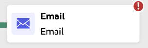
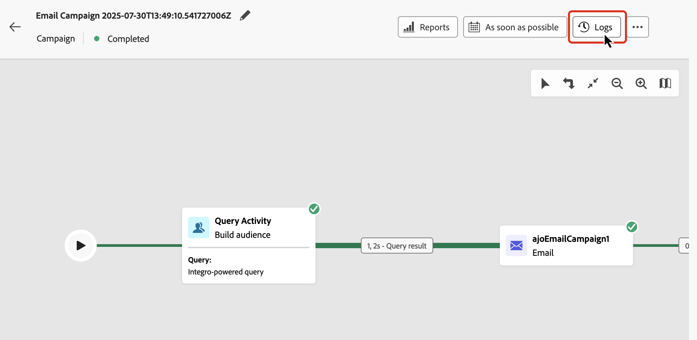

# Uw geordende campagnes starten en volgen {#start-monitor}

>[!CONTEXTUALHELP]
>id="ajo_campaign_publication"
>title="Geordende campagne publiceren"
>abstract="Als u uw campagne wilt starten, moet u deze publiceren. Zorg ervoor dat alle fouten zijn gewist voordat u ze publiceert."

Nadat u de georkestreerde en ontworpen taken hebt gemaakt die u op het canvas wilt uitvoeren, kunt u deze publiceren en controleren hoe deze wordt uitgevoerd.

U kunt de campagne ook in testmodus uitvoeren om de uitvoering en het resultaat van de verschillende activiteiten te controleren.

## Uw campagne testen vóór publicatie {#test}

Met [!DNL Journey Optimizer] kunt u geordende campagnes testen voordat u live gaat. Wanneer een campagne wordt gecreeerd, gaat het de **staat van het Ontwerp** door gebrek in. In deze status kunt u de campagne handmatig uitvoeren om de stroom te testen.

>[!IMPORTANT]
>
>Alle activiteiten op het canvas worden uitgevoerd, behalve **[!UICONTROL Save audience]** -activiteiten en kanaalactiviteiten. Er is geen functioneel effect op uw gegevens of publiek.

Als u een geordende campagne wilt testen, opent u de campagne en selecteert u **[!UICONTROL Start]** .

{zoomable="yes"}

Elke activiteit in de campagne wordt opeenvolgend uitgevoerd tot het einde van het canvas wordt bereikt. Tijdens de test kunt u de uitvoering van de campagne besturen met de actiebalk op het canvas. Vanaf dat punt kunt u:

* **Einde** de uitvoering op elk ogenblik.
* **Begin** opnieuw de uitvoering.
* **hervat** de uitvoering als het eerder werd gepauzeerd.

Met het pictogram **[!UICONTROL Alerts]** / **[!UICONTROL Warning]** op de werkbalk Canvas wordt u op de hoogte gebracht van problemen, zoals waarschuwingen die proactief kunnen verschijnen vóór de uitvoering en fouten die optreden tijdens of na de uitvoering.

{zoomable="yes"}

U kunt ontbroken activiteiten ook snel identificeren gebruikend de [&#x200B; visuele statusindicatoren &#x200B;](#activities) die direct op elke activiteit worden getoond. Voor gedetailleerde het oplossen van problemen, open de [&#x200B; logboeken van de campagne &#x200B;](#logs-tasks), die diepgaande informatie over de fout en zijn context verstrekken.

Als u kanaalactiviteiten hebt toegevoegd aan het canvas, kunt u de inhoud van uw berichten voorvertonen en testen met de knop **[!UICONTROL Simulate Content]** . [&#x200B; Leer hoe te met kanaalactiviteiten &#x200B;](activities/channels.md) te werken

Nadat de campagne is gevalideerd, kan deze worden gepubliceerd.

## De campagne publiceren {#publish}

Nadat uw campagne is getest en klaar is, klikt u op **[!UICONTROL Publish]** om deze actief te maken.

{zoomable="yes"}

>[!NOTE]
>
>Als de knop **[!UICONTROL Publish]** is uitgeschakeld (grijs weergegeven), opent u de logbestanden via de actiebalk en controleert u de foutberichten. Alle fouten moeten worden gecorrigeerd voordat u een campagne kunt publiceren.

De visuele stroom begint opnieuw en echte profielen beginnen in real-time door de reis te stromen.

Als de publicatieactie mislukt (bijvoorbeeld als gevolg van ontbrekende berichtinhoud), wordt u gewaarschuwd en moet u het probleem verhelpen voordat u het opnieuw probeert. Bij succesvol publiceren, begint de campagne onmiddellijk uitvoerend (of op programma), beweegt zich van **Ontwerp** aan **Levende** status, en wordt &quot;Gelezen slechts&quot;.

## Campagne uitvoeren {#monitor}

### Visuele controle van de stroom {#flow}

Tijdens het uitvoeren (in test- of live modus) toont de visuele stroom hoe profielen in real-time door de reis bewegen. Het aantal profielen dat de overgang tussen taken maakt, wordt weergegeven.

{zoomable="yes"}

Gegevens die van de ene activiteit naar de andere worden vervoerd via overgangen, worden opgeslagen in een tijdelijke werktabel. Deze gegevens kunnen voor elke overgang worden weergegeven. Gegevens die tussen activiteiten worden doorgegeven, inspecteren:

1. Selecteer een overgang.
1. Klik in het deelvenster Eigenschappen op **[!UICONTROL Preview schema]** om het schema van de werktabel weer te geven. Selecteer **[!UICONTROL Preview results]** om de getransporteerde gegevens weer te geven.

   {zoomable="yes"}

### Indicatoren voor de uitvoering van activiteiten {#activities}

De visuele statusindicatoren helpen u begrijpen hoe elke activiteit uitvoert:

| Visuele indicator | Beschrijving |
|-----|------------|
| {zoomable="yes"}{width="70%"} | De activiteit wordt momenteel uitgevoerd. |
| {zoomable="yes"}{width="70%"} | De activiteit vereist uw aandacht. Dit kan inhouden dat de verzending van een levering wordt bevestigd of dat de nodige actie wordt ondernomen. |
| {zoomable="yes"}{width="70%"} | Er is een fout opgetreden in de activiteit. Open de geordende campagnerogboeken voor meer informatie om het probleem op te lossen. |
| {zoomable="yes"}{width="70%"} | De activiteit is met succes uitgevoerd. |

### Logboeken en taken {#logs-tasks}

>[!CONTEXTUALHELP]
>id="ajo_campaign_logs"
>title="Logboeken en taken"
>abstract="De **Logboeken en het 1&rbrace; scherm van taken &lbrace;verstrekken een geschiedenis van de Geordende campagneuitvoering, registrerend alle gebruikersacties en ondervonden fouten.**"

Het controleren van logboeken en taken is een zeer belangrijke stap om uw Geordende campagnes te analyseren en ervoor te zorgen zij behoorlijk lopen. Logbestanden en taken zijn toegankelijk via de knop **[!UICONTROL Logs]** , die beschikbaar is in zowel de test- als de live modus op de canvaswerkbalk.

{zoomable="yes"}

Het scherm **[!UICONTROL Logs and tasks]** biedt een complete geschiedenis van de uitvoering van de campagne, waarin alle handelingen van de gebruiker zijn opgenomen en fouten zijn aangetroffen.

{zoomable="yes"}

Er zijn twee soorten informatie beschikbaar:

* Het tabblad **[!UICONTROL Log]** bevat de chronologische geschiedenis van alle bewerkingen en fouten.
* Het tabblad **[!UICONTROL Tasks]** bevat de stapsgewijze uitvoeringsvolgorde van activiteiten.

Op beide tabbladen kunt u de weergegeven kolommen en hun volgorde kiezen, filters toepassen en het zoekveld gebruiken om snel de gewenste informatie te zoeken.

## Volgende stappen {#next}

Nadat u het geordende campagneccanvas hebt gestart, kunt u Journey Optimizer-rapportagefuncties gebruiken om inzicht te krijgen in het gedrag van het publiek en om de prestaties van elke stap in uw klantentraject te meten. [&#x200B; Leer meer op Geordende campagnes die &#x200B;](../orchestrated/reporting-campaigns.md) melden
