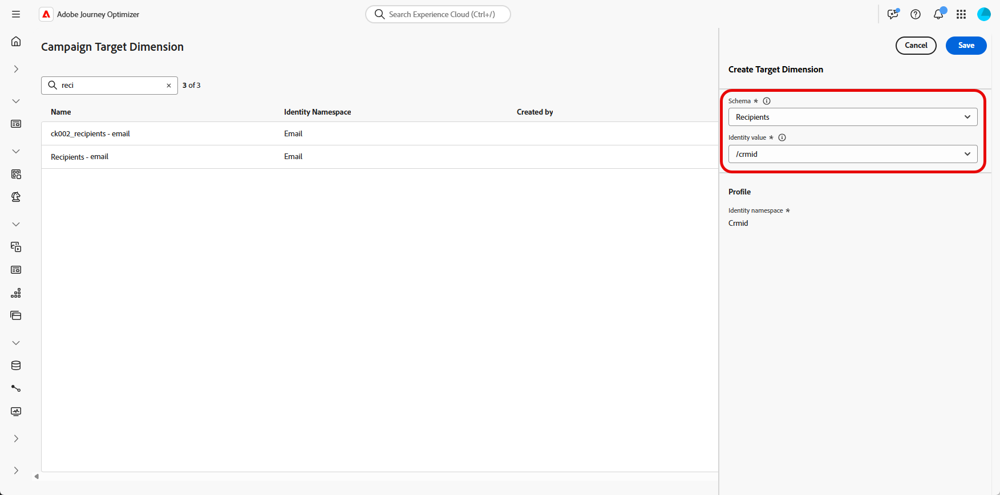

# Een doeldimensie configureren {#configuration}

Met **[!UICONTROL Orchestrated Campaigns]**, kunt u gerichte mededelingen op entiteitniveau ontwerpen en leveren, leveraging Adobe Experience Platform relationele schemamogelijkheden. Experience Platform gebruikt schema&#39;s om de gegevensstructuur op een consistente en herbruikbare manier te beschrijven. Wanneer gegevens in Experience Platform worden opgenomen, worden ze gestructureerd volgens een XDM-schema.

Hoewel de segmentatie voor **[!UICONTROL Orchestrated Campaigns]** hoofdzakelijk op relationele schema&#39;s werkt, komt de daadwerkelijke berichtlevering altijd op het **niveau van het Profiel** voor.

Wanneer het vormen richt, bepaalt u twee zeer belangrijke aspecten:

* **gerichte Schema&#39;s**

  U geeft op welke relationele schema&#39;s geschikt zijn voor doelframes. Standaard wordt het schema met de naam `Recipient` gebruikt, maar u kunt alternatieven configureren, zoals `Visitors` , `Customers` .

  >[!IMPORTANT]
  >
  > Het doelschema moet een 1 :1 verhouding met het `Profile` schema hebben. U kunt `Purchases` bijvoorbeeld niet gebruiken als een doelschema, omdat dit doorgaans een een-op-een-relatie vertegenwoordigt.

* **Verbinding van het Profiel**

  Het systeem moet begrijpen hoe het doelschema aan het `Profile` schema in kaart brengt. Dit wordt bereikt door een gedeeld identiteitsgebied - dat zowel in het doelschema als het `Profile` schema bestaat en als identiteitsnaamruimte gevormd.

## Uw doeldimensie maken {#targeting-dimension}

Begin door campagneorchestratie op te zetten door een relationeel schema aan het klantenprofiel in kaart te brengen.

1. Open vanuit **[!UICONTROL Administration]** het menu **[!UICONTROL Configurations]** en selecteer **[!UICONTROL Campaign Target Dimension]** .

   

1. Klik op **[!UICONTROL Create]** om uw **[!UICONTROL Targeting dimension]** -bestand te maken.

1. Kies uw [&#x200B; eerder gevormd Schema &#x200B;](gs-schemas.md) &#x200B; van drop-down.

   Terwijl alle relationele schema&#39;s zichtbaar zijn, slechts zijn de schema&#39;s met een directe identiteitsverhouding aan het **Profiel** verkiesbaar voor selectie.

1. Selecteer **[!UICONTROL Identity value]** die de entiteit vertegenwoordigt u wilt richten.

   In dit voorbeeld is het klantprofiel gekoppeld aan meerdere abonnementen, die elk worden vertegenwoordigd door een uniek `crmID` in het `Recipient` -schema. Als u **[!UICONTROL Target Dimension]** instelt om het `Recipient` schema en de `crmID` identiteit te gebruiken, kunt u berichten verzenden op abonnementsniveau in plaats van naar het hoofdklantprofiel, zodat elk contract of elke regel een eigen gepersonaliseerd bericht ontvangt.

   [&#x200B; leer meer in de documentatie van Adobe Experience Platform &#x200B;](https://experienceleague.adobe.com/en/docs/experience-platform/xdm/schema/composition#identity)

   

1. Klik op **[!UICONTROL Save]** om de installatie te voltooien. Een **[!UICONTROL Target dimension]** kan na het maken niet worden verwijderd of bewerkt.

Nadat u de **[!UICONTROL Target Dimension]** hebt geconfigureerd, gaat u verder met het maken en instellen van de **[!UICONTROL Channel Configuration]** en het definiëren van de bijbehorende **[!UICONTROL Execution Details]** .

## De kanaalconfiguratie configureren {#channel-configuration}

Nadat u **[!UICONTROL Target Dimension]** hebt ingesteld, moet u uw **[!UICONTROL Channel Configuration]** configureren en het juiste **[!UICONTROL Execution Details]** definiëren. Zo kunt u definiëren:

* **het niveau van berichtlevering**: bijvoorbeeld, verzendend één bericht per ontvanger, zoals één enkele e-mail per individu.

* **het uitvoeringsadres**: het specifieke contactgebied dat voor het verzenden, zoals een e-mailadres of een telefoonaantal moet worden gebruikt.

U kunt als volgt de kanaalconfiguratie configureren:

1. Begin door uw **[!UICONTROL Channel configuration]** te maken en te configureren.

   U kunt ook een bestaande **[!UICONTROL Channel configuration]** bijwerken.

   ➡️ [&#x200B; volg de stappen die in deze pagina &#x200B;](../email/surface-personalization.md) worden gedetailleerd

1. Open vanuit de sectie **[!UICONTROL Execution details]** van uw **[!UICONTROL Channel configuration]** de tab **[!UICONTROL Orchestrated campaigns]** .

   

1. Klik op **[!UICONTROL Enabled]** om deze compatibel te maken met geordende campagnes.

1. Kies uw leveringsmethode:

   * **[!UICONTROL Target Dimension]**: verzenden naar de primaire entiteit, bijvoorbeeld de ontvanger.

   * **[!UICONTROL Target + Secondary Dimension]**: verzenden met zowel primaire als secundaire entiteiten, bijvoorbeeld ontvanger + contract.

1. Selecteer van drop-down uw [&#x200B; eerder gecreeerd Doel Dimension &#x200B;](#targeting-dimension).

   

1. Als u **[!UICONTROL Target + Secondary Dimension]** hebt geselecteerd als de leveringsmethode, kiest u een **[!UICONTROL Secondary Dimension]** om de context voor het verzenden van berichten te definiëren.

1. Kies onder de sectie **[!UICONTROL Execution Address]** welke **[!UICONTROL Source]** moet worden gebruikt om het bezorgadres op te halen, zoals het e-mailadres of telefoonnummer:

   * **[!UICONTROL Profile]**: selecteer deze optie als het bezorgingsadres, bijvoorbeeld e-mail, rechtstreeks in het hoofdprofiel van de klant wordt opgeslagen.

     Nuttig wanneer het verzenden van berichten naar de belangrijkste klant, niet een specifieke bijbehorende entiteit.

   * **[!UICONTROL Target Dimension]**: Kies deze optie als het bezorgadres is opgeslagen in de primaire entiteit, bijvoorbeeld een ontvanger.

     Nuttig wanneer elke ontvanger zijn eigen bezorgadres heeft, zoals een ander e-mailadres of telefoonnummer.

   * **[!UICONTROL Secondary Dimension]**: Wanneer u **[!UICONTROL Target + Secondary Dimension]** als leveringsmethode gebruikt, selecteert u de relevante **[!UICONTROL Secondary Dimension]** die u eerder hebt geconfigureerd.

     Als de secundaire dimensie bijvoorbeeld een boeking of abonnement vertegenwoordigt, kan het uitvoeringsadres, zoals een e-mail, van dat niveau worden genomen. Dit is handig wanneer profielen bij het boeken of abonneren op een service andere contactgegevens gebruiken.

1. Van het **[!UICONTROL Delivery address]** gebied, klik  uit om het specifieke gebied te kiezen voor uw berichtlevering te gebruiken.

   

1. Klik op **[!UICONTROL Submit]** wanneer dit is geconfigureerd.

Uw kanaal is nu klaar om met **Geordende Campagnes** te gebruiken, en de berichten zullen volgens de geselecteerde doeldimensie worden geleverd.
