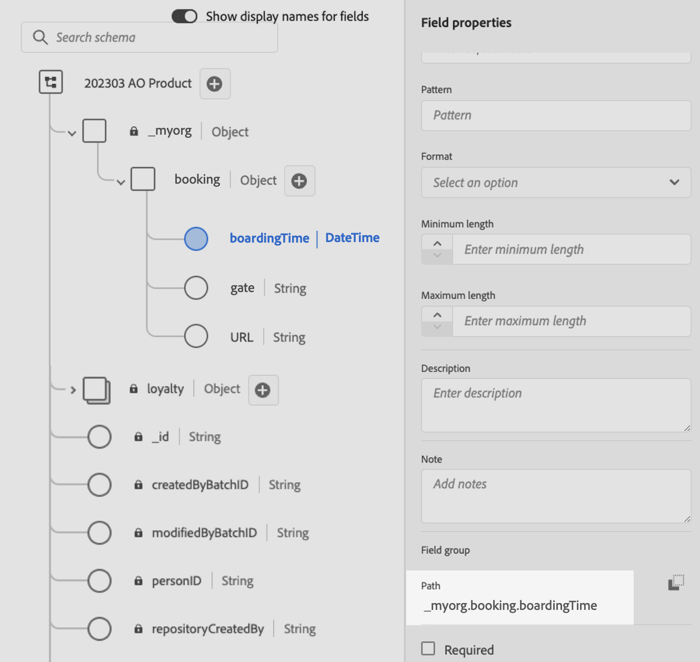

# Adobe Experience Platform-gegevens gebruiken voor personalisatie {#aep-data}

>[!AVAILABILITY]
>
>Deze functie is momenteel beschikbaar voor alle klanten als een beperkte beschikbaarheidsrelease.
>
>Voor nu, kan de hulpfunctie &quot;datasetLookup&quot;binnen uitdrukkingsfragmenten voor een beperkte reeks klanten worden gebruikt. Neem contact op met uw Adobe-vertegenwoordiger voor toegang.

Journey Optimizer staat u toe aan hefboomwerkingsgegevens van het het verslagdatasets van Adobe Experience Platform in de verpersoonlijkingsredacteur om [ uw inhoud ](../personalization/personalize.md) te personaliseren. Alvorens te beginnen, moeten de datasets nodig voor raadplegingsverpersoonlijking eerst voor raadpleging worden toegelaten. De gedetailleerde informatie is beschikbaar in deze sectie: [ gegevens van Adobe Experience Platform van het Gebruik ](../data/lookup-aep-data.md).

Zodra een dataset voor raadplegingsverpersoonlijking is toegelaten, kunt u zijn gegevens gebruiken om uw inhoud in [!DNL Journey Optimizer] te personaliseren.

1. Open de verpersoonlijkingsredacteur, die in elke context beschikbaar is waar u verpersoonlijking zoals berichten kunt bepalen. [ Leer hoe te met de verpersoonlijkingsredacteur ](../personalization/personalization-build-expressions.md) te werken

1. Navigeer aan de lijst van helperfuncties en voeg **datasetLookup** hulpfunctie aan de coderuit toe.

   

1. Deze functie verstrekt een vooraf bepaalde syntaxis om u toe te staan om gebieden van uw datasets van Adobe Experience Platform te roepen. De syntaxis is als volgt:

   ```
   {{datasetLookup datasetId="datasetId" id="key" result="store" required=false}}
   ```

   * **datasetId** is identiteitskaart van de dataset u met werkt.
   * **identiteitskaart** is identiteitskaart van de bronkolom die met de primaire identiteit van de opzoekdataset zou moeten worden aangesloten.

     >[!NOTE]
     >
     >De waarde ingegaan voor dit gebied kan of een gebied identiteitskaart (`profile.packages.packageSKU`), een gebied zijn dat in een reisgebeurtenis (`context.journey.events.event_ID.productSKU`) wordt overgegaan, of een statische waarde (`sku007653`). In elk geval, zal het systeem de waarde en raadpleging in de dataset gebruiken om te controleren of het een sleutel aanpast.
     >
     >Als u een letterlijke tekenreekswaarde voor de toets gebruikt, moet u de tekst tussen aanhalingstekens plaatsen. Bijvoorbeeld: `{{datasetLookup datasetId="datasetId" id="SKU1234" result="store" required=false}}` . Als u een kenmerkwaarde gebruikt als een dynamische sleutel, verwijdert u de aanhalingstekens. Voorbeeld: `{{datasetLookup datasetId="datasetId" id=category.product.SKU result="SKU" required=false}}`

   * **resultaat** is een willekeurige naam die u moet verstrekken om alle gebiedswaarden van verwijzingen te voorzien u van de dataset gaat terugwinnen. Deze waarde wordt in de code gebruikt om elk veld aan te roepen.

   * **required=false**: Als vereist aan WAAR wordt geplaatst, zal het bericht slechts worden geleverd als een passende sleutel wordt gevonden. Indien ingesteld op false, is geen overeenkomende sleutel vereist en kan het bericht nog steeds worden bezorgd. Houd er rekening mee dat als de waarde false is, u in de berichtinhoud een back-up- of standaardwaarde moet opgeven.

   +++Waar kan ik een gegevensset-id ophalen?

   Dataset-id&#39;s kunnen worden opgehaald in de gebruikersinterface van Adobe Experience Platform. Leer hoe te met datasets in de [ documentatie van Adobe Experience Platform ](https://experienceleague.adobe.com/en/docs/experience-platform/catalog/datasets/user-guide#view-datasets){target="_blank"} te werken.

   

   +++

1. Pas de syntaxis aan uw wensen aan. In dit voorbeeld willen we gegevens ophalen over de vluchten van passagiers. De syntaxis is als volgt:

   ```
   {{datasetLookup datasetId="1234567890abcdtId" id=profile.upcomingFlightId result="flight"}}
   ```

   * We werken in de dataset met als id &quot;1234567890abcdtId&quot;,
   * Het gebied wij willen gebruiken om zich aan te sluiten bij de blik omhoog dataset is *profile.upcomingFlightId*,
   * We willen alle veldwaarden opnemen onder de &quot;vlucht&quot;-referentie.

1. Zodra de syntaxis om in de dataset van Adobe Experience Platform te roepen is gevormd, kunt u specificeren welke gebieden u wilt terugwinnen. De syntaxis is als volgt:

   ```
   {{result.fieldId}}
   ```

   >[!NOTE]
   >
   >Wanneer het van verwijzingen voorzien van een datasetgebied, zorg ervoor dat u de volledige die gebiedspad zoals binnen het schema wordt bepaald aanpast.
   >
   >Er zijn geen harde grenzen op het aantal gebieden die kunnen worden getrokken gebruikend de helperfunctie. Voor de beste prestaties is het echter raadzaam het aantal velden onder de 50 te houden om te voorkomen dat de doorvoer wordt beïnvloed.

   * **resultaat** is de waarde die u aan de **resultaat** parameter in de **datasetLookup** hulpfunctie hebt toegewezen. In dit voorbeeld, &quot;vlucht&quot;.
   * **fieldID** is identiteitskaart van het gebied u wilt terugwinnen. Deze id is zichtbaar in de gebruikersinterface van [!DNL Adobe Experience Platform] wanneer het doorbladeren van het recordschema met betrekking tot uw dataset:

     +++Waar moet u een veld-id ophalen?

     Velden-id&#39;s kunnen worden opgehaald wanneer een voorbeeld van een gegevensset in de gebruikersinterface van Adobe Experience Platform wordt weergegeven. Leer hoe te voorproef datasets in de [ documentatie van Adobe Experience Platform ](https://experienceleague.adobe.com/en/docs/experience-platform/catalog/datasets/user-guide#preview){target="_blank"}.

     

     +++

   In dit voorbeeld willen we informatie gebruiken over de instaptijd en -poort van de passagiers. Daarom voegen wij deze twee lijnen toe:

   * `{{flight._myorg.booking.boardingTime}}`
   * `{{flight._myorg.booking.gate}}`

1. Nu uw code klaar is, kunt u uw inhoud voltooien zoals gewoonlijk, en het testen gebruikend de **Simuleer inhoud** knoop om de verpersoonlijking te controleren. [ Leer hoe te om inhoud ](../content-management/preview-test.md) voor te vertonen en te testen


   
