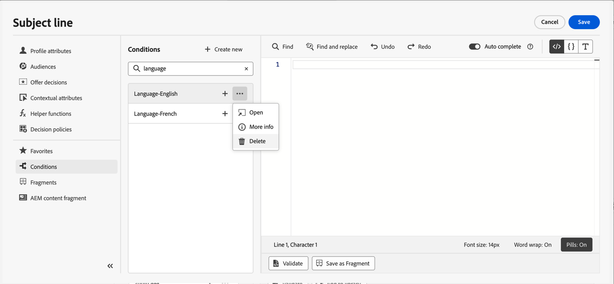

# Werken met voorwaardelijke regels {#conditions}

Voorwaardelijke regels zijn sets regels die bepalen welke inhoud in uw berichten moet worden weergegeven, afhankelijk van verschillende criteria zoals de kenmerken van profielen, het lidmaatschap van het publiek of contextuele gebeurtenissen.

Voorwaardelijke regels worden gecreeerd gebruikend de verpersoonlijkingsredacteur en kunnen worden opgeslagen als u hen over uw inhoud wilt opnieuw gebruiken. [&#x200B; Leer hoe te om een voorwaardelijke regel aan de bibliotheek te bewaren &#x200B;](#save)

>[!NOTE]
>
>De individuen zullen [&#x200B; nodig hebben leiden de Punten van de Bibliotheek &#x200B;](../administration/ootb-product-profiles.md) toestemming om voorwaardelijke regels te bewaren of te schrappen. Opgeslagen voorwaarden zijn beschikbaar voor gebruik door alle gebruikers binnen een organisatie.

## Toegang krijgen tot de constructor voor voorwaardelijke regels {#access}

Voorwaardelijke regels worden gemaakt in het menu **[!UICONTROL Conditions]** in de verpersoonlijkingseditor, die toegankelijk is:

* Vanuit de Designer-e-mail, wanneer dynamische inhoud wordt ingeschakeld voor een component in de hoofdtekst van de e-mail. [&#x200B; Leer hoe te om dynamische inhoud in e-mails toe te voegen &#x200B;](dynamic-content.md#emails)

  

* Op om het even welk gebied waar u verpersoonlijking kunt toevoegen gebruikend de [&#x200B; verpersoonlijkingsredacteur &#x200B;](personalization-build-expressions.md).

  

## Een voorwaardelijke regel maken {#create-condition}

>[!CONTEXTUALHELP]
>id="ajo_expression_editor_conditions_create"
>title="Voorwaarde maken"
>abstract="Combineer profielkenmerken, contextafhankelijke gebeurtenissen of soorten publiek om regels op te stellen die bepalen welke inhoud in uw berichten moet worden weergegeven."

>[!CONTEXTUALHELP]
>id="ajo_expression_editor_conditions"
>title="Voorwaarde maken"
>abstract="Combineer profielkenmerken, contextafhankelijke gebeurtenissen of soorten publiek om regels op te stellen die bepalen welke inhoud in uw berichten moet worden weergegeven."

U kunt als volgt een voorwaardelijke regel maken:

1. Open het menu **[!UICONTROL Conditions]** vanuit de verpersoonlijkingseditor of de e-mailtoepassing Designer en klik vervolgens op **[!UICONTROL Create new]** .

1. Bouw de voorwaardelijke regel volgens uw behoeften. U doet dit door de gewenste kenmerken vanuit het linkermenu naar het canvas te slepen en neer te zetten.

   De stappen om kenmerken in het canvas te combineren zijn gelijkaardig aan de ervaring van het segmentbouwen. Voor meer informatie over hoe te met het canvas van de regelbouwer te werken, verwijs naar [&#x200B; deze documentatie &#x200B;](https://experienceleague.adobe.com/docs/experience-platform/segmentation/ui/segment-builder.html?lang=nl-NL#rule-builder-canvas).

   

   De kenmerken zijn ingedeeld in drie tabbladen:

   * **[!UICONTROL Profile]**:
      * **[!UICONTROL Audiences]** maakt een lijst van alle publieksattributen (d.w.z. status, versie etc.) voor [&#x200B; de dienst van de Segmentatie van Adobe Experience Platform &#x200B;](https://experienceleague.adobe.com/docs/experience-platform/segmentation/home.html?lang=nl-NL){target="_blank"},
      * **[!UICONTROL XDM Individual profiles]** maakt een lijst van alle profielattributen verbonden aan het [&#x200B; Model van de Gegevens van de Ervaring (XDM) schema &#x200B;](https://experienceleague.adobe.com/docs/experience-platform/xdm/home.html?lang=nl){target="_blank"} dat in Adobe Experience Platform wordt bepaald.
   * **[!UICONTROL Contextual]**: wanneer uw bericht tijdens een reis wordt gebruikt, zijn de contextuele reisgebieden beschikbaar door dit lusje.
   * **[!UICONTROL Audiences]**: maakt een lijst van alle publiek dat van segmentdefinities wordt geproduceerd die in [&#x200B; de dienst van de Segmentatie van Adobe Experience Platform &#x200B;](https://experienceleague.adobe.com/docs/experience-platform/segmentation/home.html?lang=nl-NL){target="_blank"} worden gecreeerd.

1. Zodra uw voorwaardelijke regel klaar is, kunt u deze aan uw bericht toevoegen om dynamische inhoud te maken. [&#x200B; Leer hoe te om dynamische inhoud toe te voegen &#x200B;](dynamic-content.md)

   U kunt de regel ook opslaan om verder hergebruik toe te staan. [&#x200B; Leer hoe te om een voorwaarde &#x200B;](#save) te bewaren

## Een voorwaardelijke regel opslaan {#save}

Als er voorwaardenregels zijn die u vaak opnieuw gebruikt, kunt u deze opslaan in de voorwaardenbibliotheek. Alle opgeslagen regels worden gedeeld en kunnen worden benaderd en gebruikt door personen binnen uw organisatie.

>[!NOTE]
>
>Voorwaardelijke regels die contextafhankelijke kenmerken voor reizen gebruiken, kunnen niet worden opgeslagen in de bibliotheek.

1. Klik op de knop **[!UICONTROL Save condition]** in het scherm van de voorwaardeneditie.

1. Geef de regel een naam en een beschrijving (optioneel) en klik op **[!UICONTROL Add]** .

   

1. De voorwaardelijke regel wordt opgeslagen in de bibliotheek. U kunt het nu gebruiken om dynamische inhoud in uw berichten tot stand te brengen. [&#x200B; Leer hoe te om dynamische inhoud toe te voegen &#x200B;](dynamic-content.md)

>[!CAUTION]
>
>Gebruik bij de naamgeving van voorwaardelijke inhoudsvarianten alleen alfanumerieke tekens (A-Z, a-z, 0-9). Door speciale tekens (zoals `<` , `>` , `=` , `{` , `}` , enz.) in variantnamen te gebruiken, kan de sjablooneditor componenten afbreken of verbergen.

## Opgeslagen voorwaardelijke regels bewerken en verwijderen {#edit-delete}

U kunt op elk gewenst moment een voorwaardelijke regel verwijderen met de knop voor ovaal.

Voorwaardelijke regels die zijn opgeslagen in de bibliotheek kunnen niet worden gewijzigd. U kunt ze echter nog steeds gebruiken om nieuwe regels te maken. Hiervoor opent u de voorwaardelijke regel, brengt u de gewenste wijzigingen aan en slaat u deze op in de bibliotheek. [&#x200B; Leer hoe te om een voorwaarde aan de bibliotheek &#x200B;](#save) te bewaren
