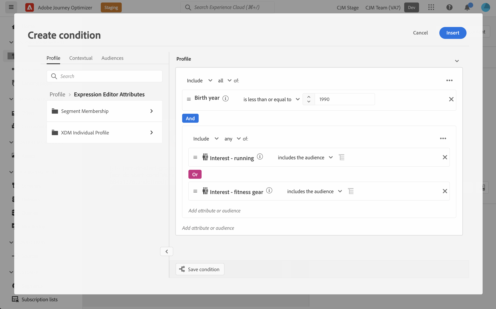

# Werken met voorwaardelijke regels {#conditions}

Voorwaardelijke regels zijn sets regels die bepalen welke inhoud in uw berichten moet worden weergegeven, afhankelijk van verschillende criteria zoals de kenmerken van profielen, segmentlidmaatschap of contextuele gebeurtenissen.

Voorwaardelijke regels worden gecreeerd gebruikend de uitdrukkingsredacteur en kunnen worden opgeslagen als u hen over uw inhoud wilt opnieuw gebruiken. [Leer hoe u een voorwaardelijke regel opslaat in de bibliotheek](#save)

>[!NOTE]
>
>Personen hebben de [Bibliotheekitems beheren](../administration/ootb-product-profiles.md) toestemming om voorwaardelijke regels op te slaan of te verwijderen. Opgeslagen voorwaarden zijn beschikbaar voor gebruik door alle gebruikers binnen een organisatie.

## Toegang krijgen tot de constructor voor voorwaardelijke regels {#access}

Voorwaardelijke regels worden gemaakt op basis van de **[!UICONTROL Conditions]** menu in de expressieeditor, die toegankelijk is:

* Vanuit de e-mailontwerper, bij het inschakelen van dynamische inhoud voor een component in de hoofdtekst van de e-mail. [Leer hoe u dynamische inhoud toevoegt aan e-mails](dynamic-content.md#emails)

   

* Op elk gebied waar u verpersoonlijking kunt toevoegen gebruikend [Expressieeditor](personalization-build-expressions.md).

   

## Een voorwaardelijke regel maken {#create-condition}

>[!CONTEXTUALHELP]
>id="ajo_expression_editor_conditions_create"
>title="Voorwaarde maken"
>abstract="Combineer profielkenmerken, contextafhankelijke gebeurtenissen of soorten publiek om regels op te stellen die bepalen welke inhoud in uw berichten moet worden weergegeven."

>[!CONTEXTUALHELP]
>id="ajo_expression_editor_conditions"
>title="Voorwaarde maken"
>abstract="Combineer profielkenmerken, contextafhankelijke gebeurtenissen of soorten publiek om regels op te stellen die bepalen welke inhoud in uw berichten moet worden weergegeven."

De stappen voor het maken van een voorwaardelijke regel zijn als volgt:

1. Toegang krijgen tot **[!UICONTROL Conditions]** in de Expressieeditor of de E-mailontwerper en klik vervolgens op **[!UICONTROL Create new]**.

1. Bouw de voorwaardelijke regel volgens uw behoeften. U doet dit door de gewenste kenmerken vanuit het linkermenu naar het canvas te slepen en neer te zetten.

   De stappen om kenmerken in het canvas te combineren zijn gelijkaardig aan de ervaring van het segmentbouwen. Voor meer informatie over hoe te met het canvas van de regelbouwer te werken, verwijs naar [deze documentatie](https://experienceleague.adobe.com/docs/experience-platform/segmentation/ui/segment-builder.html?lang=en#rule-builder-canvas).

   

   De kenmerken zijn ingedeeld in drie tabbladen:

   * **[!UICONTROL Profile]**:
      * **[!UICONTROL Segment Membership]** geeft alle segmentkenmerken weer (bijvoorbeeld status, versie enz.) for [Adobe Experience Platform Segmentation-service](https://experienceleague.adobe.com/docs/experience-platform/segmentation/home.html),
      * **[!UICONTROL XDM Individual profiles]** Hiermee worden alle profielkenmerken weergegeven die zijn gekoppeld aan de [XDM-schema (Experience Data Model)](https://experienceleague.adobe.com/docs/experience-platform/xdm/home.html?lang=nl) gedefinieerd in Adobe Experience Platform.
   * **[!UICONTROL Contextual]**: wanneer uw bericht in een reis wordt gebruikt, zijn de contextuele reisgebieden beschikbaar door dit lusje.
   * **[!UICONTROL Audiences]**: geeft een overzicht van alle soorten publiek die worden gegenereerd op basis van segmenten die zijn gemaakt in [Adobe Experience Platform Segmentation-service](https://experienceleague.adobe.com/docs/experience-platform/segmentation/home.html).

1. Zodra uw voorwaardelijke regel klaar is, kunt u deze aan uw bericht toevoegen om dynamische inhoud te maken. [Leer hoe u dynamische inhoud toevoegt](dynamic-content.md)

   U kunt de regel ook opslaan om verder hergebruik toe te staan. [Leer hoe u een voorwaarde opslaat](#save)

## Een voorwaardelijke regel opslaan {#save}

Als er voorwaardenregels zijn die u vaak opnieuw gebruikt, kunt u deze opslaan in de voorwaardenbibliotheek. Alle opgeslagen regels worden gedeeld en kunnen worden benaderd en gebruikt door personen binnen uw organisatie.

>[!NOTE]
>
>Voorwaardelijke regels die contextafhankelijke kenmerken voor reizen gebruiken, kunnen niet worden opgeslagen in de bibliotheek.

1. Klik in het scherm van de voorwaardeneditie op de knop **[!UICONTROL Save condition]** knop.

1. Geef een naam en een beschrijving (optioneel) aan de regel, en klik vervolgens op **[!UICONTROL Add]**.

   

1. De voorwaardelijke regel wordt opgeslagen in de bibliotheek. U kunt het nu gebruiken om dynamische inhoud in uw berichten tot stand te brengen. [Leer hoe u dynamische inhoud toevoegt](dynamic-content.md)

## Opgeslagen voorwaardelijke regels bewerken en verwijderen {#edit-delete}

U kunt op elk gewenst moment een voorwaardelijke regel verwijderen met de knop Ovaal.

Voorwaardelijke regels die zijn opgeslagen in de bibliotheek kunnen niet worden gewijzigd. U kunt ze echter nog steeds gebruiken om nieuwe regels te maken. Hiervoor opent u de voorwaardelijke regel, brengt u de gewenste wijzigingen aan en slaat u deze op in de bibliotheek. [Leer hoe u een voorwaarde opslaat in de bibliotheek](#save)
