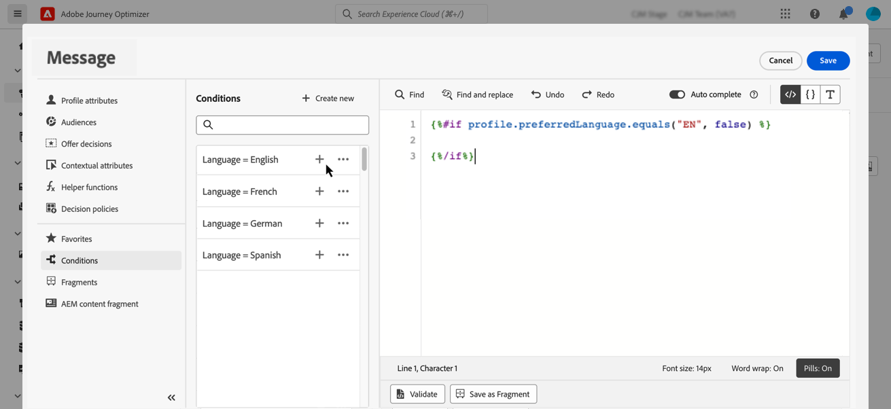
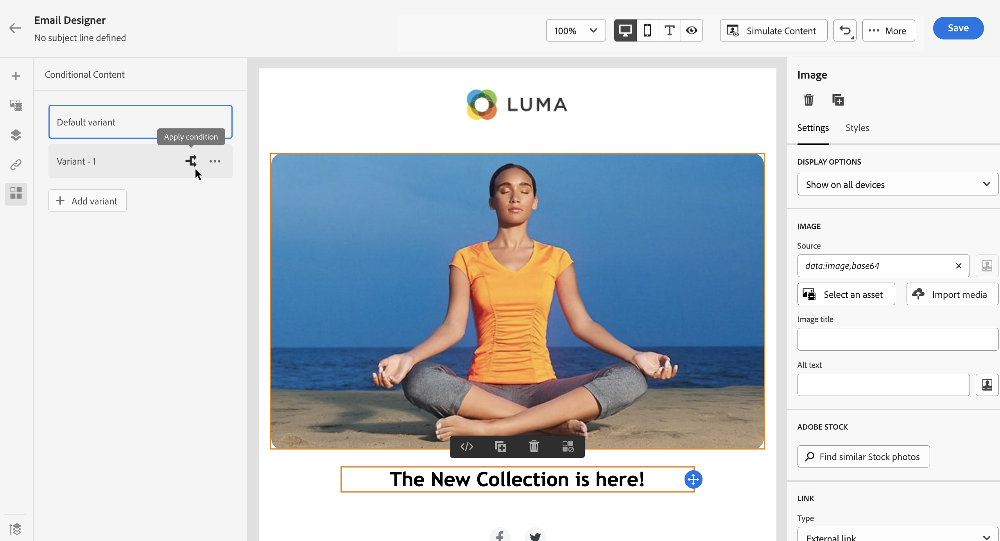
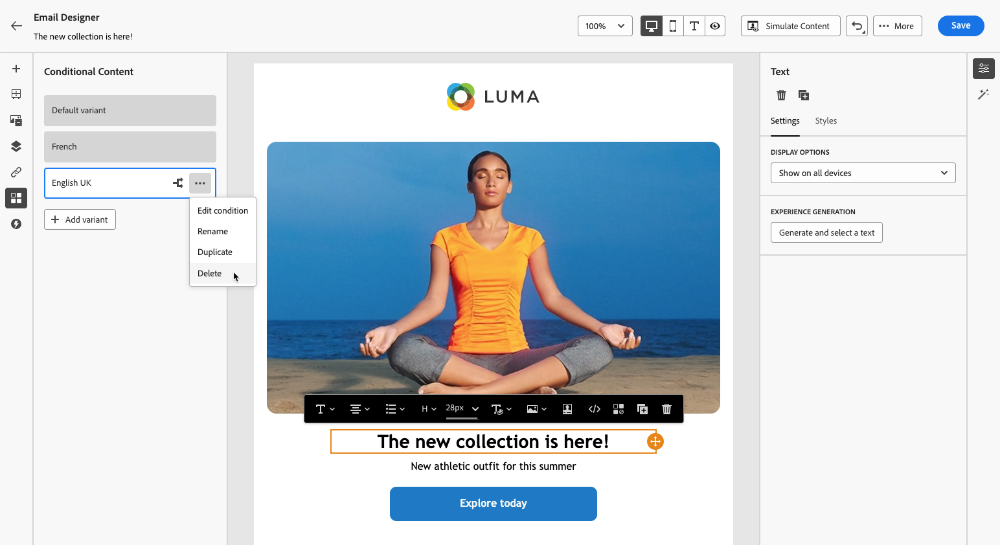

# Dynamische inhoud maken {#dynamic-content}

Met Adobe Journey Optimizer kunt u voorwaardelijke regels die in de bibliotheek zijn gemaakt, gebruiken om dynamische inhoud aan uw berichten toe te voegen.

Dynamische inhoud kan in elk veld worden gemaakt waarin u personalisatie kunt toevoegen met de verpersoonlijkingseditor. Dit zijn onder andere onderwerpregel, koppelingen, inhoud van pushberichten of representaties van teksttypeaanbiedingen. [ leer meer over verpersoonlijking ](personalize.md)

Bovendien kunt u voorwaardelijke regels gebruiken in de e-mailtoepassing van Designer om meerdere varianten van een inhoudscomponent te maken.

## Dynamische inhoud toevoegen aan expressies {#perso-expressions}

U kunt als volgt dynamische inhoud in expressies toevoegen:

1. Navigeer naar het veld waaraan u dynamische inhoud wilt toevoegen en open vervolgens de verpersoonlijkingseditor.

1. Selecteer het menu **[!UICONTROL Conditions]** om de lijst met beschikbare voorwaardelijke regels weer te geven. Klik op + naast een regel om deze toe te voegen aan de huidige expressie.

   U kunt ook een nieuwe regel maken door **[!UICONTROL Create new]** te selecteren. [ Leer hoe te om voorwaarden ](create-conditions.md) tot stand te brengen

   

1. Voeg tussen de tags `{%if}` en `{%/if}` de inhoud toe die u wilt weergeven als aan de voorwaardelijke regel is voldaan. U kunt zoveel regels toevoegen als nodig zijn om verschillende varianten van een expressie te maken.

   In het onderstaande voorbeeld zijn twee varianten gemaakt voor een SMS-inhoud, afhankelijk van de voorkeurstaal van de ontvanger.

   

1. Wanneer de inhoud gereed is, kunt u een voorvertoning van de verschillende varianten weergeven met de knop **[!UICONTROL Simulate content]** . [ Leer hoe te om berichten ](../content-management/preview-test.md) te testen en voor te vertonen

   

>[!CAUTION]
>
>Als de E-mail Designer niet correct wordt weergegeven nadat voorwaardelijke blokken zijn toegevoegd, controleert u of de syntaxis van elke nieuwe voorwaarde correct is en of er geen dubbele of conflicterende instructies bestaan. Als er problemen blijven optreden, kunt u probleemgebieden opnieuw samenstellen in een nieuwe sjabloon en elke voorwaardelijke blokkering stapsgewijs testen.

## Dynamische inhoud toevoegen aan e-mails {#emails}

>[!CONTEXTUALHELP]
>id="ac_conditional_content"
>title="Voorwaardelijke content"
>abstract="Gebruik voorwaardelijke regels om meerdere varianten van een inhoudscomponent te maken. Als aan geen van de voorwaarden wanneer het verzenden van het bericht wordt voldaan, zal de inhoud van de Standaardvariant tonen."

>[!CONTEXTUALHELP]
>id="ac_conditional_content_select"
>title="Voorwaardelijke content"
>abstract="Gebruik een voorwaardelijke regel die u in de bibliotheek hebt opgeslagen of maak een nieuwe regel."

U kunt als volgt varianten van een inhoudscomponent maken in de e-mailtoepassing van Designer:

1. In [ E-mail Designer ](../email/content-from-scratch.md), selecteer een inhoudscomponent, dan klik **[!UICONTROL Enable conditional content]**.

   

1. Het deelvenster **[!UICONTROL Conditional Content]** wordt aan de linkerkant weergegeven. In dit deelvenster kunt u meerdere varianten van de geselecteerde inhoudscomponent maken aan de hand van voorwaarden.

   Configureer de eerste variant door de knop **[!UICONTROL Select condition]** te selecteren.

   

1. De weergave van de voorwaardenbibliotheek. Selecteer de voorwaardelijke regel die u aan de variant wilt koppelen en klik op **[!UICONTROL Select]** . In dit voorbeeld willen we de componenttekst aanpassen, afhankelijk van de voorkeurstaal van de ontvanger.

   

   U kunt ook een nieuwe regel maken door op **[!UICONTROL Create new]** te klikken. [ Leer hoe te om voorwaarden ](create-conditions.md) tot stand te brengen

1. De voorwaardelijke regel is gekoppeld aan de variant. Voor een betere leesbaarheid kunt u de naam van de variant wijzigen door de handeling **[!UICONTROL Rename]** te selecteren in het pictogram Meer handelingen.

   

1. Vorm hoe de component zou moeten tonen als de regel wordt ontmoet wanneer het verzenden van het bericht. In dit voorbeeld willen we de tekst in het Frans weergeven als dit de voorkeurstaal van de ontvanger is.

   

1. Voeg zoveel varianten toe als nodig zijn voor de inhoudscomponent. U kunt op elk gewenst moment schakelen tussen de verschillende varianten om te controleren hoe de inhoudcomponent afhankelijk van de voorwaardelijke regels wordt weergegeven.

   >[!NOTE]
   >
   >* Als bij het verzenden van het bericht aan geen van de regels in de varianten wordt voldaan, geeft de inhoudcomponent de inhoud weer die in de **[!UICONTROL Default variant]** is gedefinieerd.
   >
   >* Voorwaardelijke inhoud wordt geëvalueerd op basis van de bijbehorende regels in de volgorde waarin de varianten worden weergegeven. De standaardvariant wordt altijd weergegeven als aan geen andere voorwaarden wordt voldaan.
   >
   >* Bij het simuleren of renderen van proefdrukken voor e-mails die meerdere voorwaardelijke varianten bevatten, kan Journey Optimizer meer verwerkingstijd nodig hebben. Als u time-outs of foutberichten ervaart, kunt u overwegen het totale aantal varianten te verminderen of voorwaardelijke regels te vereenvoudigen. Leer meer over het testen van uw inhoud op [ deze pagina ](../content-management/preview-test.md).

1. Als u een variant wilt verwijderen, klikt u op het pictogram Meer handelingen naast de gewenste variant en selecteert u **[!UICONTROL Delete]** .

   
