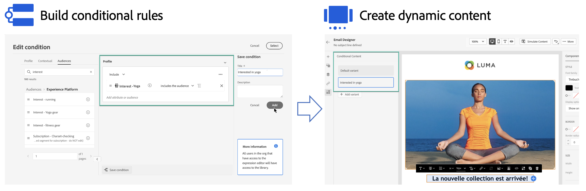

# Aan de slag met dynamische inhoud {#start-dynamic-content}

>[!CONTEXTUALHELP]
>id="ajo_conditions_list"
>title="Voorwaarden"
>abstract="Met voorwaardelijke regels kunt u meerdere inhoudsvarianten in uw berichten weergeven op basis van profielkenmerken, contextuele gebeurtenissen of publiekssegmenten."

Met dynamische inhoud kunt u de inhoud van berichten aanpassen op basis van **voorwaardelijke regels** die kunnen worden opgebouwd uit profielkenmerken, contextuele gebeurtenissen of publiekssegmenten. Voorwaardelijke regels worden gecreeerd gebruikend een visuele regelbouwer binnen de Redacteur van de Uitdrukking, waar u hen voor verder hergebruik over uw reizen en campagnes kunt opslaan.

Voorwaardelijke regels kunnen worden gebruikt in de e-mailontwerper en de expressieeditor naar **dynamische inhoud maken** die zich zal aanpassen aan de profielen in uw berichten worden gericht.

* [Leer hoe u met voorwaardelijke regels werkt](create-conditions.md)
* [Leer hoe u dynamische inhoud maakt](dynamic-content.md)

## Hoe kan ik-video {#video}

Leer hoe u dynamische inhoud maakt met de constructor voor voorwaardenregels.

>[!VIDEO](https://video.tv.adobe.com/v/3409815?quality=12)
