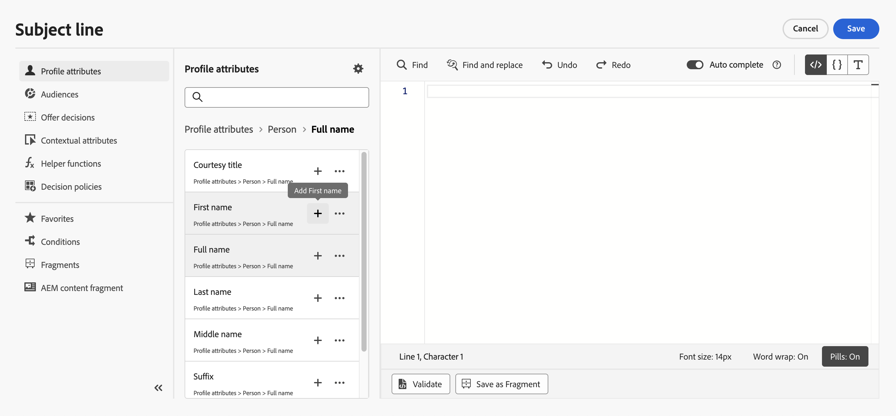
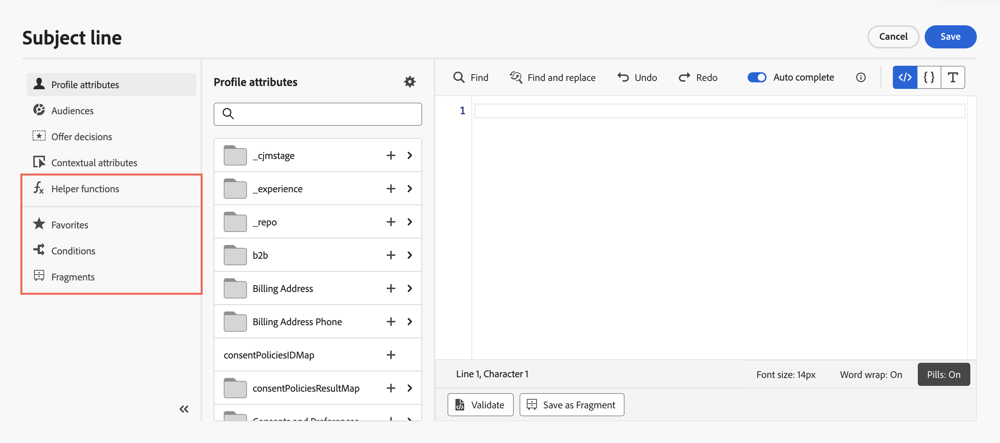

# Aanpassing toevoegen {#build-personalization-expressions}

>[!CONTEXTUALHELP]
>id="ajo_perso_editor"
>title="Informatie over de verpersoonlijkingseditor"
>abstract="Met de verpersoonlijkingseditor kunt u alle gegevens selecteren, rangschikken, aanpassen en valideren om een aangepaste verpersoonlijking voor uw inhoud te maken."

De verpersoonlijkingseditor is het middelpunt van de verpersoonlijking in [!DNL Journey Optimizer] . Het is beschikbaar in elke context waarin u personalisatie als e-mail, push en aanbiedingen moet definiëren.

In de interface van de verpersoonlijkingsredacteur, kunt u selecteren, schikken, aanpassen en bevestigen alle gegevens om een aangepaste verpersoonlijking voor uw inhoud tot stand te brengen.


## Waar kan ik personalisatie toevoegen? {#where}

U kunt verpersoonlijking in **[!DNL Journey Optimizer]** op elke gebieden met  pictogram. Vouw de onderstaande secties uit voor meer informatie.

+++Berichten

In berichten kan personalisatie op verschillende plaatsen in uw berichten, zoals het **[!UICONTROL Subject line]** gebied worden toegevoegd.


Het kan ook in andere secties van uw inhoud worden toegevoegd. Bijvoorbeeld, voor [ duw berichten ](../push/push-gs.md), kan de verpersoonlijking in **Titel** worden toegevoegd, **Lichaam**, **het correcte van de Douane**, **Badges** en **Gegevens van de Douane** gebieden.

+++

+++Email Designer

Wanneer het uitgeven van e-mailinhoud in [ E-mail Designer ](../email/get-started-email-design.md), kunt u verpersoonlijking in tekstblokken en in URLs toevoegen gebruikend het pictogram in de contextafhankelijke hulpmiddelbar.


+++

+++Aanbiedingen

U kunt verpersoonlijking toevoegen wanneer het gebruiken van tekst-type inhoud in uw **aanbiedingen&#39; vertegenwoordiging**. [ Leer hoe te om gepersonaliseerde aanbiedingen tot stand te brengen ](../offers/offer-library/creating-personalized-offers.md)

+++

+++URL&#39;s

Journey Optimizer staat u ook toe om **URLs** in uw bericht te personaliseren.  Persoonlijke URL&#39;s sturen ontvangers naar specifieke pagina&#39;s van een website of naar een gepersonaliseerde microsite, afhankelijk van de profielkenmerken. De verpersoonlijking URL is beschikbaar voor deze types van verbindingen: **Externe verbinding**, **Verbinding Unsubscription** en **Opt-Out**.

Voorbeeld van aangepaste URL&#39;s:

* `https://www.adobe.com/users/{{profile.person.name.lastName}}`
* `https://www.adobe.com/users?uid={{profile.person.name.firstName}}`
* `https://www.adobe.com/usera?uid={{context.journey.technicalProperties.journeyUID}}`
* `https://www.adobe.com/users?uid={{profile.person.crmid}}&token={{context.token}}`

{width="50%"}

>[!NOTE]
>
>Wanneer u een gepersonaliseerde URL bewerkt in de verpersoonlijkingseditor, zijn hulpfuncties en het lidmaatschap van het publiek uit veiligheidsoverwegingen uitgeschakeld.
>
>Spaties worden niet ondersteund in de personalisatietokens die in URL&#39;s worden gebruikt.

In Beperkte Beschikbaarheid voor een reeks klanten, steunt Journey Optimizer ook volledige/basisURL verpersoonlijking. Bijvoorbeeld:

```
<a href="{{profile.social.link}}" />
<a href="{{profile.social.baseUrl}}/profile" />
<a href="https://{{profile.social.baseUrl}}/profile" />
```

>[!WARNING]
>
>De lijst met toegestane domeinen moet vooraf aan Adobe worden verstrekt.

+++

+++E-mailconfiguratie

Wanneer u een e-mailkanaalconfiguratie maakt, kunt u gepersonaliseerde waarden definiëren voor subdomeinen, kopteksten en URL-volgparameters. [Meer informatie](../email/surface-personalization.md)

+++

## Personalization-bronnen {#sources}

In het navigatievenster kunt u de bron voor personalisatie selecteren. Beschikbare bronnen zijn:

* **[!UICONTROL Profile attributes]** : maakt een lijst van alle verwijzingen verbonden aan het profielschema dat in [ wordt beschreven het Model van Gegevens van Adobe Experience Platform (XDM) documentatie ](https://experienceleague.adobe.com/docs/experience-platform/xdm/home.html?lang=nl){target="_blank"}.
* **[!UICONTROL Target attributes]** : Deze map is specifiek voor geordende campagnes. Deze bevat kenmerken die rechtstreeks binnen het canvas van de campagne worden berekend. [ Leer hoe te om verpersoonlijking in Geordende campagnes toe te voegen ](../orchestrated/activities/channels.md#add-personalization)
* **[!UICONTROL Audiences]** : geeft een overzicht van alle soorten publiek dat is gemaakt in de Adobe Experience Platform Segmentation-service. Meer informatie over beschikbare segmentatie [ hier ](https://experienceleague.adobe.com/docs/experience-platform/segmentation/home.html){target="_blank"}.
* **[!UICONTROL Offer decisions]** : geeft een overzicht van alle aanbiedingen die aan een specifieke plaatsing zijn gekoppeld. Selecteer de plaatsing en voeg de aanbiedingen in uw inhoud in. Voor een volledige documentatie over hoe te om aanbiedingen te beheren, verwijs naar [ deze sectie ](../offers/get-started/starting-offer-decisioning.md).
* **[!UICONTROL Contextual attributes]** : wanneer een activiteit van de kanaalactie (E-mail, push, SMS) in een reis of campagne wordt gebruikt, zijn contextafhankelijke kenmerken met betrekking tot gebeurtenissen en eigenschappen beschikbaar voor personalisatie. Een voorbeeld van verpersoonlijking leveraging contextafhankelijke attributen wordt voorgesteld in [ deze sectie ](personalization-use-case.md).

>[!NOTE]
>
>Als u zich richt op een publiek met verrijkingsattributen die gebruikend een samenstellingswerkschema worden geproduceerd, kunt u deze verrijkingsattributen gebruiken om uw bericht te personaliseren. [ Leer hoe te om de attributen van de kijkverrijking ](../audience/about-audiences.md#enrichment) te gebruiken

## Aanpassing toevoegen {#add}

>[!CONTEXTUALHELP]
>id="ajo_perso_editor_autocomplete"
>title="Automatisch voltooid"
>abstract="Als u deze optie inschakelt, kan het systeem automatisch code voorstellen en voltooien terwijl u typt. Deze functie is alleen beschikbaar voor HTML- en Text-indelingen en ondersteunt profiel- en contextkenmerken. Als deze optie via de schakeloptie is uitgeschakeld, wordt de native HTML-code automatisch ingevuld."

De centrale werkruimte is waar u uw verpersoonlijkingssyntaxis bouwt. Als u een kenmerk wilt gebruiken om uw bericht aan te passen, zoekt u het naar het linkernavigatievenster en klikt u op de knop `+` om het aan de expressie toe te voegen.



Met het ellipsmenu naast het pictogram `+` kunt u meer details voor elk kenmerk ophalen en veelgebruikte kenmerken toevoegen aan favorieten. Kenmerken die aan favorieten worden toegevoegd, zijn toegankelijk via het menu **[!UICONTROL Favorites]** in het navigatiegebied.

>[!NOTE]
>
>Standaard worden in het venster Kenmerken alleen gevulde kenmerken weergegeven. Als u alle kenmerken wilt weergeven, selecteert u de knop  boven het zoekveld en schakelt u de optie **[!UICONTROL Show only populated attributes]** uit.

Daarnaast kunt u standaardfallback-tekst definiëren die wordt weergegeven als een tekenreekstype profielkenmerk leeg is. Klik hiertoe op de knop voor het weglatingsteken naast het kenmerk en selecteer **[!UICONTROL Insert with fallback text]** . Schrijf de tekst die standaard moet worden weergegeven als de waarde van het kenmerk leeg is voor een profiel en klik vervolgens op **[!UICONTROL Add]** .


In het volgende voorbeeld, laat de verpersoonlijkingsredacteur u de profielen selecteren die hun verjaardag vandaag dan voltooien de aanpassing door een specifieke aanbieding op te nemen die aan deze dag beantwoordt.


## Opties voor het bewerken van expressies {#options}

De centrale werkruimte biedt verschillende gereedschappen waarmee u uw personalisatie-expressie kunt schrijven.


Beschikbare opties zijn:

1. **[!UICONTROL Find]** / **[!UICONTROL Find and replace]** : doorzoek uw expressie en vervang automatisch gedeelten van code.
1. **[!UICONTROL Undo]** / **[!UICONTROL Redo]** : De laatste bewerking ongedaan maken / opnieuw uitvoeren.
1. **[!UICONTROL Auto complete]**: stelt automatisch code voor en voltooit deze terwijl u typt. Deze functie is alleen beschikbaar voor HTML- en Text-indelingen en ondersteunt profiel- en contextkenmerken. Als deze optie via de schakeloptie is uitgeschakeld, wordt de native HTML-code automatisch ingevuld.

   {width="70%" align="center" zoomable="yes"}

1. **[!UICONTROL HTML]** / **[!UICONTROL JSON]** / **[!UICONTROL Text]** : geef de indeling van de code aan. Hierdoor kan het systeem de functie voor validatie en automatisch aanvullen aanpassen op basis van de geselecteerde taal.
1. **[!UICONTROL Validate]**: controleer de syntaxis van uw expressie. Lees meer in [deze sectie](../personalization/personalization-build-expressions.md).
1. **[!UICONTROL Save as fragment]**: sla uw expressie op als een expressiefragment. Leer meer in [ deze sectie ](../content-management/save-fragments.md#save-as-expression-fragment)
1. **[!UICONTROL Font size]** - Hiermee past u de tekengrootte voor de inhoud in de editor aan voor betere leesbaarheid.
1. **[!UICONTROL Word wrap]**: Schakelt tekstomloop in of uit, waardoor lange expressies op één regel kunnen worden weergegeven of in de editor kunnen worden opgenomen. U kunt onder andere de volgende opties kiezen:
   * **weg** (Gebrek) - Geen woord het verpakken. Lange regels reiken verder dan de editorweergave en vereisen horizontaal schuiven.
   * **op** - verpakt lijnen bij de breedte van de redacteur.
   * **de omloopkolom van Word** - verpakt lijnen wanneer een lijnkarakters 80 karakters bereiken.
   * **Begrensde** - verpakt lijnen bij of de redacteursbreedte of bij 80 karakters, welke kleiner is.
1. **[!UICONTROL Pills]**: geef kenmerken weer als compacte &#39;vullingen&#39; om de leesbaarheid te verbeteren door lange kenmerkpaden te verbergen. Klik op een kenmerk om het volledige pad weer te geven.

   >[!NOTE]
   >
   >Het vullingscherm wordt in de komende 30 dagen geleidelijk in alle omgevingen weergegeven.
   >
   >Deze optie is alleen beschikbaar voor profielkenmerken, contextafhankelijke kenmerken en dynamische media.

In het navigatievenster, zijn de extra eigenschappen beschikbaar om u te helpen uw verpersoonlijkingsuitdrukking bouwen.



* **[!UICONTROL Helper functions]** - Met behulp van hulpfuncties kunt u bewerkingen uitvoeren op gegevens, zoals berekeningen, gegevensopmaak of conversies, voorwaarden en deze manipuleren in de context van personalisatie. [ leer meer over beschikbare hulpfuncties ](functions/functions.md)

* **[!UICONTROL Favorites]** - Kenmerken die u aan de favorieten hebt toegevoegd, worden in deze lijst weergegeven. Hierdoor hebt u snel toegang tot de meest gebruikte items. Als u een kenmerk aan uw favorieten wilt toevoegen, klikt u op het menu voor ovaal en kiest u **[!UICONTROL Add to favorites]** .

* **[!UICONTROL Conditions]** - Gebruik voorwaardelijke regels die zijn gemaakt in de bibliotheek om dynamische inhoud toe te voegen aan uw berichten. Dit staat u toe om veelvoudige varianten van uw bericht tot stand te brengen die op voorwaarden worden gebaseerd. [ Leer hoe te om dynamische inhoud tot stand te brengen ](../personalization/get-started-dynamic-content.md)

* **[!UICONTROL Fragments]** - Expressiefragmenten gebruiken die zijn gemaakt of opgeslagen in de huidige sandbox. Een fragment is een herbruikbare component waarnaar in [!DNL Journey Optimizer] -campagnes en -reizen kan worden verwezen. Met deze functionaliteit kunt u meerdere blokken met aangepaste inhoud vooraf samenstellen. Deze blokken kunnen door marketinggebruikers worden gebruikt om inhoud snel samen te stellen in een verbeterd ontwerpproces. [ Leer hoe te om uitdrukkingsfragmenten voor verpersoonlijking te gebruiken ](../personalization/use-expression-fragments.md)

Zodra uw verpersoonlijkingsuitdrukking klaar is, moet u het hebben door de verpersoonlijkingsredacteur worden bevestigd. Lees meer in [deze sectie](../personalization/personalization-build-expressions.md).

## Validatiemechanismen {#validation-mechanisms}

De bevestiging van uw uitdrukking wordt automatisch uitgevoerd wanneer u op **klikt voeg** knoop toe om het editorvenster te sluiten. U kunt **ook gebruiken bevestigt** knoop om uw verpersoonlijkingssyntaxis te controleren.


Vouw de onderstaande sectie uit om algemene fouten weer te geven die kunnen optreden bij het valideren van de personalisatie.

+++Algemene fouten

* **Weg &quot;XYZ&quot;niet gevonden**

Wanneer u probeert te verwijzen naar een veld dat niet in het schema is gedefinieerd.

In dit geval **firstName1** wordt niet bepaald als attribuut in het profielschema:

```
{{profile.person.name.firstName1}}
```

* **Type wanverhouding voor veranderlijke &quot;XYZ&quot;. Array verwacht. Gevonden tekenreeks.**

Wanneer u probeert een tekenreeks te doorlopen in plaats van een array.

In dit geval **product** is geen serie:

```
{{each profile.person.name.firstName as |product|}}
 {{product.productName}}
{{/each}}
```

* **Ongeldige zakbalksyntaxis. Gevonden`'[XYZ}}'`**

Wanneer een ongeldige syntaxis voor het stuur wordt gebruikt.

Handlebars-expressies worden omringd met **{{expression}}**

```
   {{[profile.person.name.firstName}}
```

* **Ongeldige segmentdefinitie**

```
No segment definition found for 988afe9f0-d4ae-42c8-a0be-8d90e66e151
```

+++

Voor aanbiedingen kunnen specifieke fouten optreden. Vouw de onderstaande sectie uit voor meer informatie:

+++ Specifieke fouten met betrekking tot aanbiedingen

De fouten met betrekking tot aanbiedingen integratie in een E-mail of Duw bericht hebben het volgende patroon:

```
Offer.<offerType>.[PlacementID].[ActivityID].<offer-attribute>
```

De bevestiging wordt uitgevoerd tijdens de bevestiging van de verpersoonlijkingsinhoud in de verpersoonlijkingsredacteur.

<table> 
 <thead> 
  <tr> 
   <th> Fouttitel <br /> </th> 
   <th> Validatie/resolutie <br /> </th> 
  </tr> 
 </thead> 
 <tbody> 
  <tr> 
   <td>Bron met id placementID en type OfferPlacement niet gevonden <br/>
Bron met id activityID en type OfferActivity niet gevonden<br/></td> 
   <td>Controleren of ActivityID en/of PlacementID beschikbaar zijn</td> 
  </tr> 
   <tr> 
   <td>Bron kan niet worden gevalideerd.</td> 
   <td>Het componenttype in de Placement moet overeenkomen met de aanbiedingType</td> 
  </tr> 
   <tr> 
   <td>De openbare URL komt niet voor in de aanbiedings-id.</td> 
   <td>De afbeeldingsaanbiedingen (alle gepersonaliseerde en reservekopieën die aan de beslissing en het plaatsingspaar zijn gekoppeld) moeten een openbare URL hebben die is gevuld (de bezorgings-URL mag niet leeg zijn).</td> 
  </tr> 
  <tr> 
   <td>De beslissing bevat niet-profielkenmerken.</td> 
   <td>Het modelgebruik van aanbiedingen mag alleen de profielkenmerken bevatten.</td> 
  </tr> 
  <tr> 
   <td>Er is een fout opgetreden tijdens het ophalen van het beslissingsgebruik.</td> 
   <td>Deze fout kan optreden wanneer de API het aanbiedingsmodel probeert op te halen.</td> 
  </tr>
  <tr> 
   <td>Het aanbiedingskenmerk van kenmerk is ongeldig.</td> 
   <td>Controleer of het aanbiedingskenmerk waarnaar wordt verwezen in het aanbiedingsconcept geldig is. Hier volgen de geldige kenmerken: <br/>
Afbeelding: deliveryURL, linkURL <br/>
Tekst: inhoud <br/>
HTML: inhoud<br/></td> 
  </tr> 
 </tbody> 
</table>

+++
