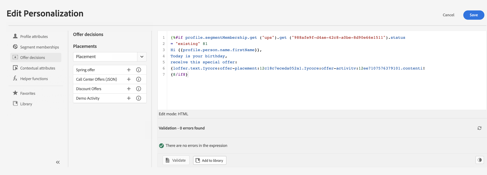

# Aan de slag met de personalisatie-editor {#build-personalization-expressions}

>[!CONTEXTUALHELP]
>id="ajo_perso_editor"
>title="Informatie over de verpersoonlijkingseditor"
>abstract="Met de verpersoonlijkingseditor kunt u alle gegevens selecteren, rangschikken, aanpassen en valideren om een aangepaste verpersoonlijking voor uw inhoud te maken."

De verpersoonlijkingseditor is het middelpunt van de verpersoonlijking in [!DNL Journey Optimizer] . Het is beschikbaar in elke context waarin u personalisatie als e-mail, push en aanbiedingen moet definiëren.

In de interface van de verpersoonlijkingsredacteur, zult u, alle gegevens selecteren schikken aanpassen en bevestigen om een aangepaste verpersoonlijking voor uw inhoud tot stand te brengen.

## Personalization-bronnen {#sources}

In het linkergedeelte van het scherm wordt een domeinkiezer weergegeven waarmee u de bron voor personalisatie kunt selecteren. Beschikbare bronnen zijn:

* **[!UICONTROL Profile attributes]** : maakt een lijst van alle verwijzingen verbonden aan het profielschema dat in [ wordt beschreven het Model van Gegevens van Adobe Experience Platform (XDM) documentatie ](https://experienceleague.adobe.com/docs/experience-platform/xdm/home.html?lang=nl) {target="_blank"}.
* **[!UICONTROL Audiences]** : geeft een overzicht van alle soorten publiek dat is gemaakt in de Adobe Experience Platform Segmentation-service. Meer informatie over beschikbare segmentatie  {target="_blank"}.
* **[!UICONTROL Offer decisions]** : geeft een overzicht van alle aanbiedingen die aan een specifieke plaatsing zijn gekoppeld. Selecteer de plaatsing en voeg de aanbiedingen in uw inhoud in. Voor een volledige documentatie over hoe te om aanbiedingen te beheren, verwijs naar [ deze sectie ](../offers/get-started/starting-offer-decisioning.md).
* **[!UICONTROL Contextual attributes]** : wanneer een activiteit van de kanaalactie (E-mail, push, SMS) in een reis of campagne wordt gebruikt, zijn contextafhankelijke kenmerken met betrekking tot gebeurtenissen en eigenschappen beschikbaar voor personalisatie. Een voorbeeld van verpersoonlijking leveraging contextafhankelijke attributen wordt voorgesteld in [ deze sectie ](personalization-use-case.md).

>[!NOTE]
>
>Als u zich richt op een publiek met verrijkingsattributen die gebruikend een samenstellingswerkschema worden geproduceerd, kunt u deze verrijkingsattributen gebruiken om uw bericht te personaliseren. [ Leer hoe te om de attributen van de kijkverrijking ](../audience/about-audiences.md#enrichment) te gebruiken

## Aanpassing toevoegen {#add}

>[!CONTEXTUALHELP]
>id="ajo_perso_editor_autocomplete"
>title="Automatisch voltooid"
>abstract="Als u deze optie inschakelt, kan het systeem automatisch code voorstellen en voltooien terwijl u typt. Deze functie is alleen beschikbaar voor HTML- en Text-indelingen en ondersteunt profiel- en contextkenmerken. Als deze optie via de schakeloptie is uitgeschakeld, wordt de native HTML-code automatisch ingevuld."

De centrale werkruimte is waar u uw verpersoonlijkingssyntaxis bouwt. Als u een kenmerk wilt gebruiken om uw bericht aan te passen, zoekt u het naar het linkernavigatievenster en klikt u op de knop `+` om het aan de expressie toe te voegen.

Met het ellipsmenu naast het pictogram `+` kunt u meer details voor elk kenmerk ophalen en veelgebruikte kenmerken toevoegen aan favorieten. Kenmerken die aan favorieten worden toegevoegd, zijn toegankelijk via het menu **[!UICONTROL Favorites]** in het linkernavigatievenster.

Daarnaast kunt u standaardfallback-tekst definiëren die wordt weergegeven als een tekenreekstype profielkenmerk leeg is. Klik hiertoe op de knop voor het weglatingsteken naast het kenmerk en selecteer **[!UICONTROL Insert with fallback text]** . Schrijf de tekst die standaard moet worden weergegeven als de waarde van het kenmerk leeg is voor een profiel en klik vervolgens op **[!UICONTROL Add]** .

In het volgende voorbeeld, laat de verpersoonlijkingsredacteur u de profielen selecteren die hun verjaardag vandaag dan voltooien de aanpassing door een specifieke aanbieding op te nemen die aan deze dag beantwoordt.

## Gereedschappen voor het bewerken van expressies

De centrale werkruimte biedt verschillende gereedschappen waarmee u uw personalisatie-expressie kunt schrijven.

Beschikbare opties zijn:

1. **[!UICONTROL Find]** / **[!UICONTROL Find and replace]** : doorzoek uw expressie en vervang automatisch gedeelten van code.
1. **[!UICONTROL Undo]** / **[!UICONTROL Redo]** : De laatste bewerking ongedaan maken / opnieuw uitvoeren.
1. **[!UICONTROL Auto complete]**: stelt automatisch code voor en voltooit deze terwijl u typt. Deze functie is alleen beschikbaar voor HTML- en Text-indelingen en ondersteunt profiel- en contextkenmerken. Als deze optie via de schakeloptie is uitgeschakeld, wordt de native HTML-code automatisch ingevuld.

   {width="70%" align="center" zoomable="yes"}

1. **[!UICONTROL HTML]** / **[!UICONTROL JSON]** / **[!UICONTROL Text]** : geef de indeling van de code aan. Hierdoor kan het systeem de functie voor validatie en automatisch aanvullen aanpassen op basis van de geselecteerde taal.
1. **[!UICONTROL Validate]**: controleer de syntaxis van uw expressie. Lees meer in [deze sectie](personalization-validation.md).
1. **[!UICONTROL Save as fragment]**: sla uw expressie op als een expressiefragment. Leer meer in [ deze sectie ](../content-management/save-fragments.md#save-as-expression-fragment)
1. **[!UICONTROL Font size]** - Hiermee past u de tekengrootte voor de inhoud in de editor aan voor betere leesbaarheid.
1. **[!UICONTROL Word wrap]**: Schakelt tekstomloop in of uit, waardoor lange expressies op één regel kunnen worden weergegeven of in de editor kunnen worden opgenomen. U kunt onder andere de volgende opties kiezen:
   * **weg** (Gebrek) - Geen woord het verpakken. Lange regels reiken verder dan de editorweergave en vereisen horizontaal schuiven.
   * **op** - verpakt lijnen bij de breedte van de redacteur.
   * **de omloopkolom van Word** - verpakt lijnen wanneer een lijnkarakters 80 karakters bereiken.
   * **Begrensde** - verpakt lijnen bij of de redacteursbreedte of bij 80 karakters, welke kleiner is.

In het navigatievenster, zijn de extra eigenschappen beschikbaar om u te helpen uw verpersoonlijkingsuitdrukking bouwen.

* **[!UICONTROL Helper functions]** - Met behulp van hulpfuncties kunt u bewerkingen uitvoeren op gegevens, zoals berekeningen, gegevensopmaak of conversies, voorwaarden en deze manipuleren in de context van personalisatie. [ leer meer op beschikbare hulpfuncties ](functions/functions.md)

* **[!UICONTROL Favorites]** - Kenmerken die u aan de favorieten hebt toegevoegd, worden in deze lijst weergegeven. Hierdoor hebt u snel toegang tot de meest gebruikte items. Als u een kenmerk aan uw favorieten wilt toevoegen, klikt u op het menu voor ovaal en kiest u **[!UICONTROL Add to favorites]** .

* **[!UICONTROL Conditions]** - Gebruik voorwaardelijke regels die zijn gemaakt in de bibliotheek om dynamische inhoud toe te voegen aan uw berichten. Dit staat u toe om veelvoudige varianten van uw bericht tot stand te brengen die op voorwaarden worden gebaseerd. [ Leer hoe te om dynamische inhoud tot stand te brengen ](../personalization/get-started-dynamic-content.md)

* **[!UICONTROL Fragments]** - Expressiefragmenten gebruiken die zijn gemaakt of opgeslagen in de huidige sandbox. Een fragment is een herbruikbare component waarnaar in [!DNL Journey Optimizer] -campagnes en -reizen kan worden verwezen. Met deze functionaliteit kunt u meerdere blokken met aangepaste inhoud vooraf samenstellen. Deze blokken kunnen door marketinggebruikers worden gebruikt om inhoud snel samen te stellen in een verbeterd ontwerpproces. [ Leer hoe te om uitdrukkingsfragmenten voor verpersoonlijking te gebruiken ](../personalization/use-expression-fragments.md)

Zodra uw verpersoonlijkingsuitdrukking klaar is, moet u het hebben door de verpersoonlijkingsredacteur worden bevestigd. Lees meer in [deze sectie](personalization-validation.md).
