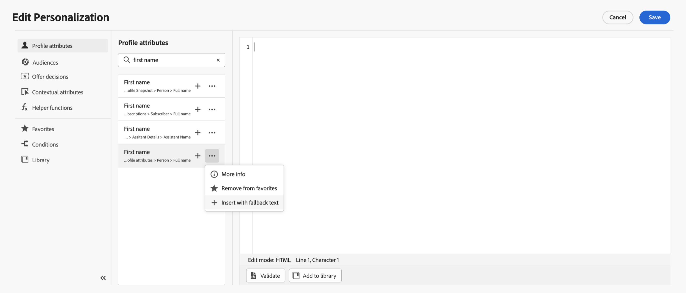

# Aan de slag met de Expressieeditor {#build-personalization-expressions}

>[!CONTEXTUALHELP]
>id="ajo_perso_editor"
>title="De expressie-editor"
>abstract="Met de Expressieeditor kunt u alle gegevens selecteren, rangschikken, aanpassen en valideren om een aangepaste personalisatie voor uw inhoud te maken."

De redacteur van de Uitdrukking is het middelstuk van de verpersoonlijking in [!DNL Journey Optimizer]. Het is beschikbaar in elke context waarin u personalisatie als e-mail, push en aanbiedingen moet definiëren.

In de interface van de uitdrukkingsredacteur, zult u, alle gegevens selecteren schikken aanpassen en bevestigen om een aangepaste verpersoonlijking voor uw inhoud tot stand te brengen.

## Beschikbare bronnen voor personalisatie {#sources}

In het linkergedeelte van het scherm wordt een domeinkiezer weergegeven waarmee u de bron voor personalisatie kunt selecteren. Beschikbare bronnen zijn:

* **[!UICONTROL Profile attributes]** : geeft alle referenties weer die zijn gekoppeld aan het profielschema dat wordt beschreven in [Adobe Experience Platform Data Model (XDM)-documentatie](https://experienceleague.adobe.com/docs/experience-platform/xdm/home.html?lang=nl){target="_blank"}.
* **[!UICONTROL Audiences]** : geeft een lijst weer van alle soorten publiek dat is gemaakt in de Adobe Experience Platform Segmentation-service. Meer informatie over segmentatie is beschikbaar [hier](https://experienceleague.adobe.com/docs/experience-platform/segmentation/home.html){target="_blank"}.
* **[!UICONTROL Offer decisions]** : geeft een overzicht van alle aanbiedingen die aan een specifieke plaatsing zijn gekoppeld. Selecteer de plaatsing en voeg de aanbiedingen in uw inhoud in. Voor volledige documentatie over het beheren van aanbiedingen raadpleegt u [deze sectie](../offers/get-started/starting-offer-decisioning.md).
* **[!UICONTROL Contextual attributes]** : wanneer een activiteit van de kanaalactie (E-mail, duw, SMS) in een reis of een campagne wordt gebruikt, zijn de contextafhankelijke attributen met betrekking tot gebeurtenissen en eigenschappen beschikbaar voor verpersoonlijking. Een voorbeeld van personalisatie die gebruik maakt van contextafhankelijke kenmerken wordt weergegeven in [deze sectie](personalization-use-case.md).
* **[!UICONTROL Helper functions]** : geeft een overzicht van alle hulpfuncties die beschikbaar zijn om bewerkingen op gegevens uit te voeren, zoals berekeningen, gegevensopmaak of conversies, voorwaarden en deze in de context van personalisatie te manipuleren. Meer informatie in [deze sectie](functions/functions.md).

## Aanpassingskenmerken toevoegen {#add}

Klik + knoop om een attribuut in uw verpersoonlijkingsuitdrukking toe te voegen.

Met het elliptische menu naast het pictogram &quot;+&quot; kunt u meer details voor elke variabele ophalen en de meestgebruikte kenmerken toevoegen aan de favorieten. [Leer hoe u kenmerken aan favorieten kunt toevoegen](personalization-favorites.md)

Daarnaast kunt u standaardfallback-tekst definiëren die wordt weergegeven als een tekenreekstype profielkenmerk leeg is. Om dit te doen, klik de ellipsknoop naast het attribuut en selecteer **[!UICONTROL Insert with fallback text]**. Schrijf de tekst die standaard moet worden weergegeven als de waarde van het kenmerk leeg is voor een profiel en klik vervolgens op **[!UICONTROL Add]**.

In het volgende voorbeeld, laat de uitdrukkingsredacteur u de profielen selecteren die hun verjaardag vandaag hebben dan de aanpassing voltooien door een specifieke aanbieding op te nemen die aan deze dag beantwoordt.

Zodra uw verpersoonlijkingsuitdrukking klaar is, moet u het hebben door de redacteur van de Uitdrukking worden bevestigd. Meer informatie in [deze sectie](personalization-validation.md).
