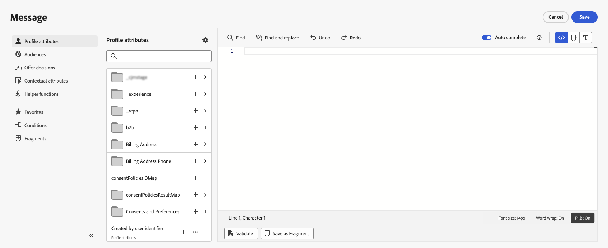

# Aan de slag met de personalisatie-editor {#build-personalization-expressions}

>[!CONTEXTUALHELP]
>id="ajo_perso_editor"
>title="Informatie over de verpersoonlijkingseditor"
>abstract="Met de verpersoonlijkingseditor kunt u alle gegevens selecteren, rangschikken, aanpassen en valideren om een aangepaste verpersoonlijking voor uw inhoud te maken."

>[!CONTEXTUALHELP]
>id="ajo_perso_editor_autocomplete"
>title="Automatisch voltooid"
>abstract="Als u deze optie inschakelt, kan het systeem uw code automatisch voltooien en suggesties doen terwijl u uw expressie typt. Deze optie is alleen beschikbaar voor HTML en tekstindelingen."

De verpersoonlijkingseditor is het middelpunt van de verpersoonlijking in [!DNL Journey Optimizer] . Het is beschikbaar in elke context waarin u personalisatie als e-mail, push en aanbiedingen moet definiëren.

In de interface van de verpersoonlijkingsredacteur, zult u, alle gegevens selecteren schikken aanpassen en bevestigen om een aangepaste verpersoonlijking voor uw inhoud tot stand te brengen.

## Beschikbare bronnen voor personalisatie {#sources}

In het linkergedeelte van het scherm wordt een domeinkiezer weergegeven waarmee u de bron voor personalisatie kunt selecteren. Beschikbare bronnen zijn:

* **[!UICONTROL Profile attributes]** : maakt een lijst van alle verwijzingen verbonden aan het profielschema dat in [ wordt beschreven het Model van Gegevens van Adobe Experience Platform (XDM) documentatie ](https://experienceleague.adobe.com/docs/experience-platform/xdm/home.html?lang=nl) {target="_blank"}.
* **[!UICONTROL Audiences]** : geeft een overzicht van alle soorten publiek dat is gemaakt in de Adobe Experience Platform Segmentation-service. Meer informatie over beschikbare segmentatie  {target="_blank"}.
* **[!UICONTROL Offer decisions]** : geeft een overzicht van alle aanbiedingen die aan een specifieke plaatsing zijn gekoppeld. Selecteer de plaatsing en voeg de aanbiedingen in uw inhoud in. Voor een volledige documentatie over hoe te om aanbiedingen te beheren, verwijs naar [ deze sectie ](../offers/get-started/starting-offer-decisioning.md).
* **[!UICONTROL Contextual attributes]** : wanneer een activiteit van de kanaalactie (E-mail, push, SMS) in een reis of campagne wordt gebruikt, zijn contextafhankelijke kenmerken met betrekking tot gebeurtenissen en eigenschappen beschikbaar voor personalisatie. Een voorbeeld van verpersoonlijking leveraging contextafhankelijke attributen wordt voorgesteld in [ deze sectie ](personalization-use-case.md).
* **[!UICONTROL Helper functions]** : geeft een overzicht van alle hulpfuncties die beschikbaar zijn om bewerkingen uit te voeren op gegevens, zoals berekeningen, gegevensopmaak of conversies, voorwaarden en deze te manipuleren in de context van personalisatie. Lees meer in [deze sectie](functions/functions.md).

## Aanpassingskenmerken toevoegen {#add}

Klik + knoop om een attribuut in uw verpersoonlijkingsuitdrukking toe te voegen.

Met het elliptische menu naast het pictogram &quot;+&quot; kunt u meer details voor elke variabele ophalen en de meestgebruikte kenmerken toevoegen aan de favorieten. [ Leer hoe te om attributen aan favorieten toe te voegen ](personalization-favorites.md)

>[!NOTE]
>
>Als u zich richt op een publiek met verrijkingsattributen die gebruikend een samenstellingswerkschema worden geproduceerd, kunt u deze verrijkingsattributen gebruiken om uw bericht te personaliseren. [ Leer hoe te om de attributen van de kijkverrijking ](../audience/about-audiences.md#enrichment) te gebruiken

Daarnaast kunt u standaardfallback-tekst definiëren die wordt weergegeven als een tekenreekstype profielkenmerk leeg is. Klik hiertoe op de knop voor het weglatingsteken naast het kenmerk en selecteer **[!UICONTROL Insert with fallback text]** . Schrijf de tekst die standaard moet worden weergegeven als de waarde van het kenmerk leeg is voor een profiel en klik vervolgens op **[!UICONTROL Add]** .

In het volgende voorbeeld, laat de verpersoonlijkingsredacteur u de profielen selecteren die hun verjaardag vandaag dan voltooien de aanpassing door een specifieke aanbieding op te nemen die aan deze dag beantwoordt.

Zodra uw verpersoonlijkingsuitdrukking klaar is, moet u het hebben door de verpersoonlijkingsredacteur worden bevestigd. Lees meer in [deze sectie](personalization-validation.md).
