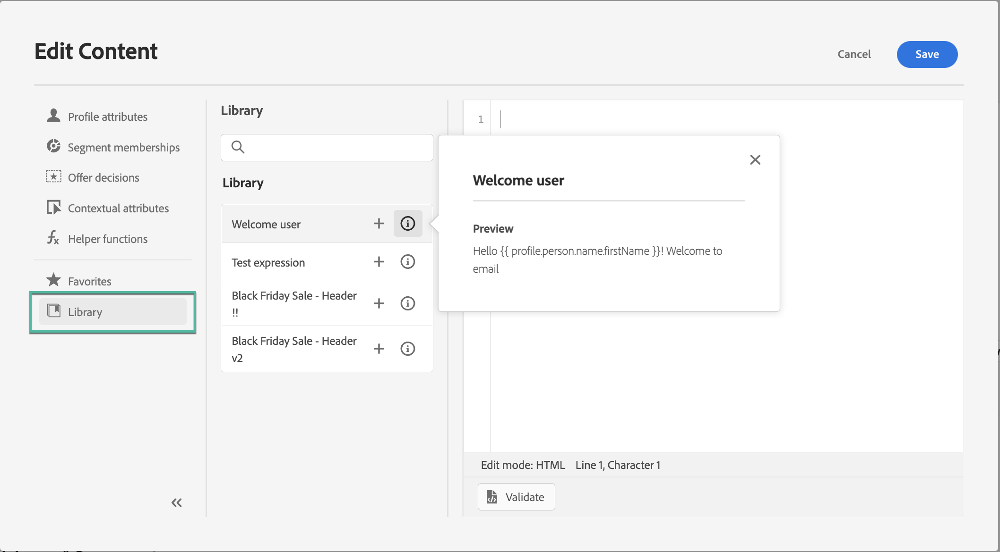
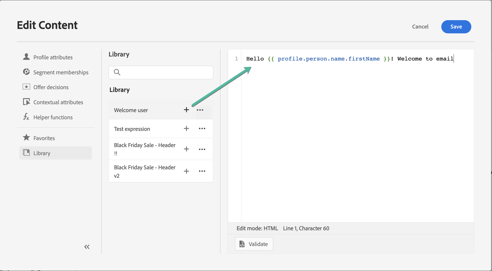

# Werken met opgeslagen expressies {#expression-library}

>[!CONTEXTUALHELP]
>id="ajo_perso_library"
>title="Informatie over de expressiebibliotheek"
>abstract="[!DNL Journey Optimizer] biedt een bibliotheek waarin u toegang kunt krijgen tot opgeslagen personalisatie-expressies die zijn geconfigureerd door Admin-gebruikers. "

[!DNL Journey Optimizer] biedt een bibliotheek waarin u toegang kunt krijgen tot eerder opgeslagen personalisatie-expressies die zijn toegevoegd door Admin-gebruikers.

➡️ [Leer hoe u met opgeslagen expressies werkt in deze video](#video-preview)

Als u de opgeslagen expressies wilt openen, klikt u op de knop **[!UICONTROL Library]** in het linkerdeelvenster. In de lijst worden alle expressies weergegeven die door Admin-gebruikers zijn opgeslagen (zie [Expressies opslaan in de bibliotheek](#save-expressions)).

    >[!OPMERKING]
    >
    >Met de knop Info kunt u meer informatie ophalen over de inhoud van een opgeslagen expressie. Als u over de juiste machtigingen beschikt om bibliotheekitems te beheren, wordt de informatieknop weergegeven in het ovaalmenu.
    
    

Klik + om de uitdrukking in de redacteur op te nemen. Vervolgens kunt u de inhoud van uw personalisatie op de gebruikelijke wijze aanpassen en valideren. [Meer informatie](../personalization/personalization-build-expressions.md)

    

## Een expressie opslaan in de bibliotheek {#save-expressions}

[!DNL Journey Optimizer] Hiermee kunnen Admin-gebruikers personalisatie-expressies opslaan in de bibliotheek. Deze uitdrukkingen zullen dan aan alle gebruikers beschikbaar zijn om verpersoonlijkingsinhoud te bouwen.

Voer de volgende stappen uit om een expressie op te slaan in de bibliotheek:

1. In de redacteursinterface, bouw dan de uitdrukking en klik **[!UICONTROL Add to library]**.

   >[!NOTE]
   >
   >Als de knop niet zichtbaar is, checkt u de Admin Console in dat u de vereiste machtigingen hebt (zie [Machtigingsniveaus](../administration/high-low-permissions.md)).

   

1. Voer in het rechterdeelvenster een titel en een beschrijving voor de expressie in, zodat gebruikers deze gemakkelijker kunnen vinden en klik vervolgens op **[!UICONTROL Add]**.

   

1. De expressie wordt toegevoegd aan de bibliotheek. Gebruikers kunnen deze nu gebruiken om hun personalisatie-inhoud samen te stellen.

>[!NOTE]
>
>* Expressies mogen niet groter zijn dan 200 kB.
>
>* Opgeslagen expressies worden gesorteerd op aanmaakdatum: recent toegevoegde expressie wordt als eerste weergegeven in de lijst.

Om een bestaande uitdrukking uit te geven, voeg het aan de redacteur toe, dan wijzig het volgens uw behoeften. Klikken **[!UICONTROL Add to library]** om de syntaxis te valideren en de expressie op te slaan.

Als u een expressie wilt verwijderen, klikt u op de knop Ovaal en vervolgens klikt u op **[!UICONTROL Delete]**.

## Hoe kan ik-video{#video}

Ontdek hoe u opgeslagen bibliotheekitems voor personalisatie in een bericht kunt gebruiken en hoe u bibliotheekitems voor personalisatie maakt en beheert.

>[!VIDEO](https://video.tv.adobe.com/v/340941?quality=12)

