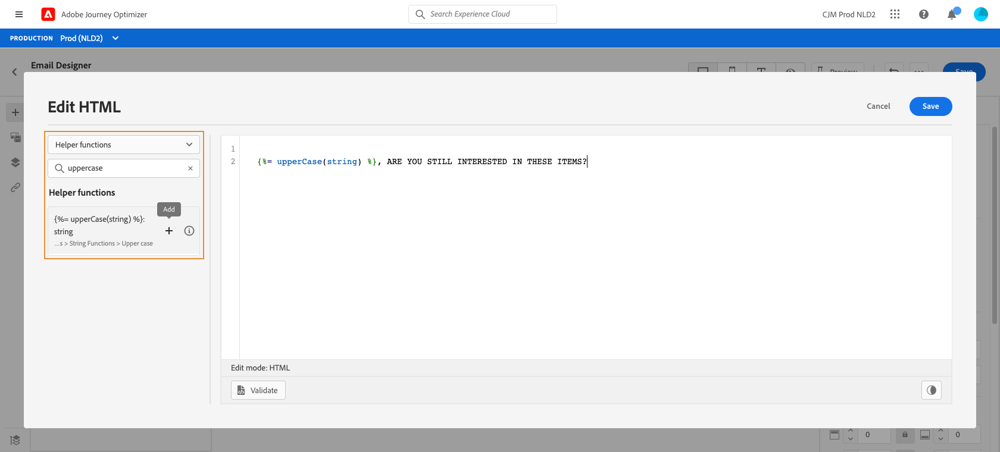
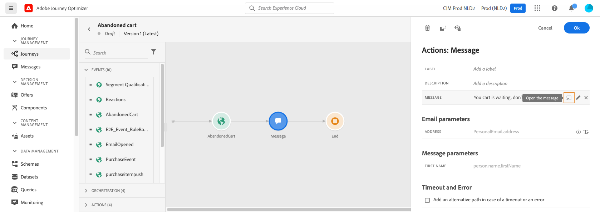
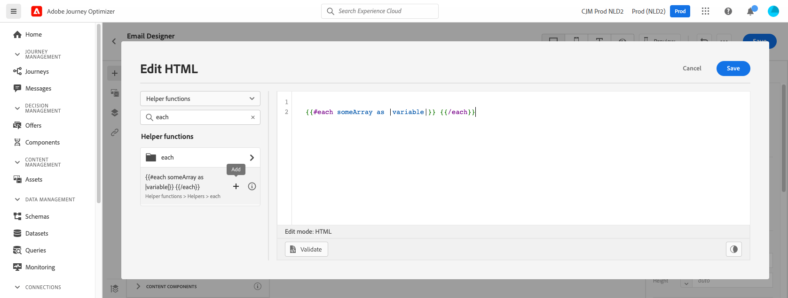
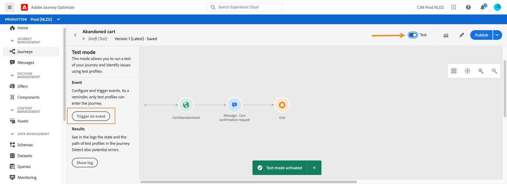

# Gebruiksscenario voor personalisatie: e-mail over verlaten van winkelwagen {#personalization-use-case-helper-functions}

In dit voorbeeld past u de hoofdtekst van een e-mailbericht aan. Dit bericht is bedoeld voor klanten die objecten in hun winkelwagentje hebben verlaten maar hun aankoop niet hebben voltooid.

U gebruikt de volgende typen hulpfuncties:

* De tekenreeksfunctie `upperCase` om de voornaam van de klant in hoofdletters in te voegen. [Meer informatie](functions/string.md#upper).
* De `each` helper, om van de punten een lijst te maken die in het karretje zijn. [Meer informatie](functions/helpers.md#each).
* De `if` helper, om een productspecifieke nota op te nemen als het verwante product in de kar is. [Meer informatie](functions/helpers.md#if-function).

<!-- **Context**: personalization based on contextual data from the journey -->

Alvorens u begint, zorg ervoor u weet hoe te om deze elementen te vormen:
* Een e-mailbericht. [Meer informatie](../create-message.md)
* De hoofdtekst van een e-mail. [Meer informatie](../create-email-content.md).
* Een eenheidsgebeurtenis. [Meer informatie](../event/about-events.md).
* Een reis die begint met een evenement. [Meer informatie](../building-journeys/using-the-journey-designer.md).

Voer de volgende stappen uit:
1. [Maak een e-mailbericht](#configure-email).
2. [Voeg de voornaam van de klant in hoofdletters](#uppercase-function) in.
3. [Maak de eerste gebeurtenis en de reis](#create-context).
4. [Voeg de inhoud van het winkelwagentje toe aan de e-mail](#each-helper).
5. [Een productspecifieke opmerking](#if-helper) invoegen.
6. [De journey testen en publiceren](#test-and-publish).

## Stap 1: E-mail maken{#configure-email}

1. Maak of wijzig een e-mailbericht en klik op **[!UICONTROL Email Designer]**.
   

2. Sleep in het linkerpalet van de introductiepagina E-mail Designer drie structuurcomponenten naar de hoofdtekst van het bericht.

3. Sleep een HTML-inhoudscomponent naar elke nieuwe structuurcomponent.

   

## Stap 2: De voornaam van de klant in hoofdletters invoegen {#uppercase-function}

1. Klik op de introductiepagina van E-mail Designer op de HTML-component waar u de voornaam van de klant wilt toevoegen.
2. Klik op **[!UICONTROL Show the source code]** op de contextuele werkbalk.

   

3. Voeg in het venster **[!UICONTROL Edit HTML]** de tekenreeksfunctie `upperCase` toe:
   1. Selecteer **[!UICONTROL Helper functions]** in de lijst.
   2. Gebruik het zoekveld om &quot;hoofdletters&quot; te zoeken.
   3. Voeg uit de zoekresultaten de functie `upperCase` toe. Klik hiertoe op het plusteken (+) naast `: string`.

      De redacteur van de Uitdrukking toont deze uitdrukking:

      ```handlebars
      
      ```

      

4. Verwijder de tijdelijke aanduiding &quot;tekenreeks&quot; uit de expressie.
5. Voeg het voornaamtoken toe:
   1. Selecteer **[!UICONTROL Profile]** in de lijst.
   2. Selecteer **[!UICONTROL Profile]** > **[!UICONTROL Person]** > **[!UICONTROL Full name]**.
   3. Voeg de token **[!UICONTROL First name]** toe aan de expressie.

      De redacteur van de Uitdrukking toont deze uitdrukking:

      ```handlebars
      
      ```

      

      Meer informatie over de gegevens van de persoonnaam in [Adobe Experience Plaform documentatie](https://experienceleague.adobe.com/docs/experience-platform/xdm/data-types/person-name.html){target=&quot;_blank&quot;}.

6. Klik **[!UICONTROL Validate]**, dan klik **[!UICONTROL Save]**.

   
7. Sla het bericht op.

## Stap 3: De eerste gebeurtenis en de bijbehorende reis maken {#create-context}

De inhoud van het winkelwagentje is contextuele informatie van de reis. Daarom moet u een eerste gebeurtenis en de e-mail aan een reis toevoegen alvorens u kartspecifieke informatie aan e-mail kunt toevoegen.

1. Maak een gebeurtenis waarvan het schema de array `productListItems` bevat.
2. Definieer alle velden in deze array als payload-velden voor deze gebeurtenis.

   Leer meer over het type van de het puntgegevens van de productlijst in [Adobe Experience Platform documentatie](https://experienceleague.adobe.com/docs/experience-platform/xdm/data-types/product-list-item.html){target=&quot;_blank&quot;}.

3. Maak een reis die met deze gebeurtenis begint.
4. Voeg het bericht aan de reis toe.
5. Beëindig de reis met een eindactiviteit.

   Omdat u het bericht nog niet hebt gepubliceerd, kunt u de reis niet testen of publiceren.

   

6. Klik op **[!UICONTROL OK]**.

   Een bericht deelt u mee dat de reiscontext aan het bericht is overgegaan.

   

## Stap 4: Lijst met artikelen uit het winkelwagentje invoegen {#each-helper}

1. Open het bericht opnieuw.

   

2. Klik op de introductiepagina van E-mail Designer op de HTML-component waar u de inhoud van het winkelwagentje wilt weergeven.
3. Klik op **[!UICONTROL Show the source code]** op de contextuele werkbalk.

   

4. Voeg in het venster **[!UICONTROL Edit HTML]** de hulplijn `each` toe:
   1. Selecteer **[!UICONTROL Helper functions]** in de lijst.
   2. Gebruik het zoekveld om &quot;elk&quot; te zoeken.
   3. Voeg aan de hand van de zoekresultaten de hulplijn `each` toe.

      De redacteur van de Uitdrukking toont deze uitdrukking:

      ```handlebars
      {{#each someArray as |variable|}} {{/each}}
      ```

      

5. Voeg de array `productListItems` toe aan de expressie:

   1. Verwijder de tijdelijke aanduiding &quot;someArray&quot; uit de expressie.
   2. Selecteer **[!UICONTROL Context]** in de lijst.

      De optie **[!UICONTROL Context]** is alleen beschikbaar nadat de reiscontext aan het bericht is doorgegeven.

   3. Selecteer **[!UICONTROL Journey Orchestration]** > **[!UICONTROL Events]** > ***[!UICONTROL event_name]*** en vouw vervolgens het knooppunt **[!UICONTROL productListItems]** uit.

      In dit voorbeeld vertegenwoordigt *event_name* de naam van uw gebeurtenis.

   4. Voeg de token **[!UICONTROL Product]** toe aan de expressie.

      De redacteur van de Uitdrukking toont deze uitdrukking:

      ```handlebars
      {{#each context.journey.events.event_ID.productListItems.product as |variable|}} {{/each}}
      ```
      In dit voorbeeld vertegenwoordigt *event_ID* de id van de gebeurtenis.

      

   5. De expressie wijzigen:
      1. Verwijder de tekenreeks &quot;.product&quot;.
      2. Vervang de tijdelijke aanduiding &quot;variabele&quot; door &quot;product&quot;.

      In dit voorbeeld wordt de gewijzigde expressie getoond:

      ```handlebars
      {{#each context.journey.events.event_ID.productListItems as |product|}}
      ```
6. Plak deze code tussen de openingstag `{{#each}}` en de afsluitende tag `{/each}}`:

   ```html
   <table>
      <tbody>
         <tr>
            <td><b>#name</b></td>
            <td><b>#quantity</b></td>
            <td><b>$#priceTotal</b></td>
         </tr>
      </tbody>
   </table>
   ```

7. Voeg de personalisatietokens voor de puntnaam, het aantal, en de prijs toe:

   1. Verwijder de tijdelijke aanduiding &quot;#name&quot; uit de HTML-tabel.
   2. Voeg uit de vorige zoekresultaten de token **[!UICONTROL Name]** toe aan de expressie.

   Herhaal deze stappen tweemaal:
   * Vervang de tijdelijke aanduiding &quot;#quantity&quot; door de token **[!UICONTROL Quantity]**.
   * Vervang placeholder &quot;#priceTotal&quot;met **[!UICONTROL Total price]** teken.

   In dit voorbeeld wordt de gewijzigde expressie getoond:

   ```handlebars
   {{#each context.journey.events.event_ID.productListItems as |product|}}
      <table>
         <tbody>
            <tr>
               <td><b>{{context.journey.events.event_ID.productListItems.name}}</b></td>
               <td><b>{{context.journey.events.event_ID.productListItems.quantity}}</b></td>
               <td><b>${{context.journey.events.event_ID.productListItems.priceTotal}}</b></td>
            </tr>
         </tbody>
      </table>
   {{/each}}
   ```
8. Klik **[!UICONTROL Validate]**, dan klik **[!UICONTROL Save]**.
   

## Stap 5: Een productspecifieke notitie invoegen {#if-helper}

1. Klik op de homepage van E-mailontwerper op de HTML-component waar u de notitie wilt invoegen.
2. Klik op **[!UICONTROL Show the source code]** op de contextuele werkbalk.

   

3. Voeg in het venster **[!UICONTROL Edit HTML]** de hulplijn `if` toe:
   1. Selecteer **[!UICONTROL Helper functions]** in de lijst.
   2. Gebruik het zoekveld om &quot;if&quot; te zoeken.
   3. Voeg aan de hand van de zoekresultaten de hulplijn `if` toe.

      De redacteur van de Uitdrukking toont deze uitdrukking:

      ```handlebars
       render_1
          render_2
          default_render
      
      ```
      

4. Deze voorwaarde verwijderen uit de expressie:

   ```handlebars
    render_2
   ```

   In dit voorbeeld wordt de gewijzigde expressie getoond:

   ```handlebars
    render_1
       default_render
   
   ```

5. Voeg de token voor de productnaam toe aan de voorwaarde:
   1. Verwijder de tijdelijke aanduiding &quot;condition1&quot; uit de expressie.
   2. Selecteer **[!UICONTROL Context]** in de lijst.
   3. Selecteer **[!UICONTROL Journey Orchestration]** > **[!UICONTROL Events]** > ***[!UICONTROL event_name]*** en vouw vervolgens het knooppunt **[!UICONTROL productListItems]** uit.

      In dit voorbeeld vertegenwoordigt *event_name* de naam van uw gebeurtenis.

   4. Voeg de token **[!UICONTROL Name]** toe aan de expressie.

      De redacteur van de Uitdrukking toont deze uitdrukking:

      ```handlebars
      
         render_1
          default_render
      
      ```
      

6. De expressie wijzigen:
   1. In de redacteur van de Uitdrukking, specificeer de productnaam na `name` teken.

      Gebruik deze syntaxis, waarbij *product_name* de naam van uw product vertegenwoordigt:

      ```javascript
      = "product_name"
      ```

      In dit voorbeeld is de productnaam &quot;Juno Jacket&quot;:

      ```handlebars
      
         render_1
          default_render
      
      ```

   2. Vervang de tijdelijke aanduiding &quot;render_1&quot; door de tekst van de notitie.

      Voorbeeld:

      ```handlebars
      
         Due to longer than usual lead times on the Juno Jacket, please expect item to ship two weeks after purchase.
          default_render
      
      ```
   3. Verwijder de tijdelijke aanduiding &quot;default_render&quot; uit de expressie.
7. Klik **[!UICONTROL Validate]**, dan klik **[!UICONTROL Save]**.

   

8. Sla het bericht op en publiceer het.

## Stap 6: De reis testen en publiceren {#test-and-publish}

1. Open de reis. Als de reis reeds open is, vernieuw dan de pagina.
2. Schakel de schakeloptie **[!UICONTROL Test]** in en klik op **[!UICONTROL Trigger an event]**.

   U kunt de testmodus pas inschakelen nadat u het bericht hebt gepubliceerd.

   

3. Voer in het venster **[!UICONTROL Event configuration]** de invoerwaarden in en klik vervolgens op **[!UICONTROL Send]**.

   De testmodus werkt alleen met testprofielen.

   

   De e-mail wordt verzonden naar het adres van het testprofiel.

   In dit voorbeeld bevat de e-mail de opmerking over de Juno-jasje, omdat dit product zich in de kar bevindt:

   

4. Controleer of er geen fout is en publiceer de reis.


## Verwante onderwerpen

### Handbalken, functies

* [Helpers](functions/helpers.md)

* [Reeksfuncties](functions/string.md)

### Gebruiksscenario’s

* [Personalisatie met profielgegevens, context en aanbieding](personalization-use-case.md)

* [Personalisatie met een op beslissingen gebaseerd aanbod](../offers/offers-e2e.md)

## Video over zelfstudie{#helper-functions-video}

>[!VIDEO](https://video.tv.adobe.com/v/334244?quality=12)