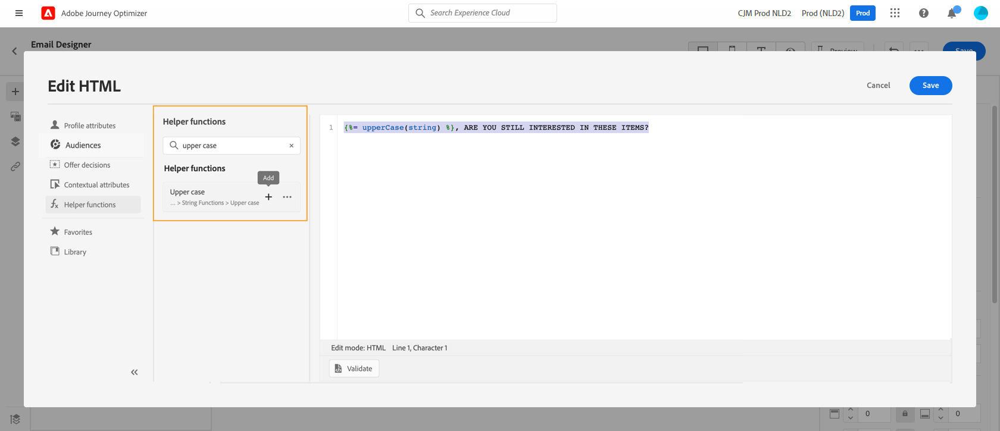
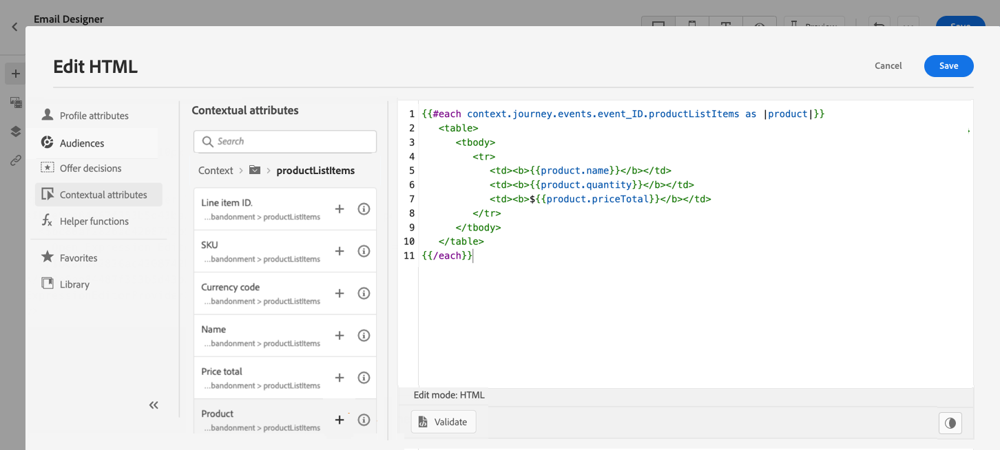

# Gebruiksscenario voor personalisatie: e-mail over verlaten van winkelwagen {#personalization-use-case-helper-functions}

In dit voorbeeld past u de hoofdtekst van een e-mailbericht aan. Dit bericht is bedoeld voor klanten die objecten in hun winkelwagentje hebben verlaten maar hun aankoop niet hebben voltooid.

U gebruikt de volgende typen hulpfuncties:

* De `upperCase` tekenreeksfunctie, om de voornaam van de klant in hoofdletters in te voegen. [Meer informatie](functions/string.md#upper).
* De `each` helper, om de punten te vermelden die in het karretje zijn. [Meer informatie](functions/helpers.md#each).
* De `if` helper, om een productspecifieke nota in te voegen als het verwante product in de kar is. [Meer informatie](functions/helpers.md#if-function).

<!-- **Context**: personalization based on contextual data from the journey -->

➡️ [Leer hoe u in deze video hulpfuncties kunt gebruiken](#video)

Alvorens u begint, zorg ervoor u weet hoe te om deze elementen te vormen:

* Een eenheidsgebeurtenis. [Meer informatie](../event/about-events.md).
* Een reis die begint met een evenement. [Meer informatie](../building-journeys/using-the-journey-designer.md).
* Een e-mailbericht op reis. [Meer informatie](../email/create-email.md)
* De hoofdtekst van een e-mail. [Meer informatie](../email/content-from-scratch.md).

Voer de volgende stappen uit:

1. [De eerste gebeurtenis en de reis maken](#create-context).
1. [Een e-mailbericht maken](#configure-email).
1. [De voornaam van de klant in hoofdletters invoegen](#uppercase-function).
1. [De inhoud van het winkelwagentje toevoegen aan de e-mail](#each-helper).
1. [Een productspecifieke notitie invoegen](#if-helper).
1. [De journey testen en publiceren](#test-and-publish).

## Stap 1: De eerste gebeurtenis en de bijbehorende reis maken {#create-context}

De inhoud van het winkelwagentje is contextuele informatie van de reis. Daarom moet u een eerste gebeurtenis en de e-mail aan een reis toevoegen alvorens u kartspecifieke informatie aan e-mail kunt toevoegen.

1. Maak een gebeurtenis waarvan het schema de `productListItems` array.
1. Definieer alle velden in deze array als payload-velden voor deze gebeurtenis.

   Meer informatie over het type itemgegevens in de productlijst vindt u in [Adobe Experience Platform-documentatie](https://experienceleague.adobe.com/docs/experience-platform/xdm/data-types/product-list-item.html){target="_blank"}.

1. Maak een reis die met deze gebeurtenis begint.
1. Een **E-mail** activiteit van de reis.

   

## Stap 2: E-mail maken{#configure-email}

1. In de **E-mail** activiteit, klik **[!UICONTROL Edit content]** en klik vervolgens op **[!UICONTROL Email Designer]**.

   

1. Sleep in het linkerpalet van de introductiepagina E-mail Designer drie structuurcomponenten naar de hoofdtekst van het bericht.

1. Sleep een HTML-inhoudscomponent naar elke nieuwe structuurcomponent.

   

## Stap 3: De voornaam van de klant in hoofdletters invoegen {#uppercase-function}

1. Klik op de introductiepagina van E-mail Designer op de HTML-component waar u de voornaam van de klant wilt toevoegen.
1. Klik op de contextafhankelijke werkbalk op **[!UICONTROL Show the source code]**.

   

1. In de **[!UICONTROL Edit HTML]** venster toevoegen `upperCase` tekenreeksfunctie:
   1. Selecteer in het linkermenu de optie **[!UICONTROL Helper functions]**.
   1. Gebruik het zoekveld om naar hoofdletters en kleine letters te zoeken.
   1. Voeg in de zoekresultaten de `upperCase` functie. Klik hiertoe op het plusteken (+) naast `: string`.

      De redacteur van de Uitdrukking toont deze uitdrukking:

      ```handlebars
      
      ```

      

1. Verwijder de tijdelijke aanduiding &quot;tekenreeks&quot; uit de expressie.
1. Voeg het voornaamtoken toe:
   1. Selecteer in het linkermenu de optie **[!UICONTROL Profile attributes]**.
   1. Selecteer **[!UICONTROL Person]** > **[!UICONTROL Full name]**.
   1. Voeg de **[!UICONTROL First name]** gebruiken voor de expressie.

      De redacteur van de Uitdrukking toont deze uitdrukking:

      ```handlebars
      
      ```

      

      Meer informatie over het gegevenstype Personen in [Adobe Experience Platform-documentatie](https://experienceleague.adobe.com/docs/experience-platform/xdm/data-types/person-name.html){target="_blank"}.

1. Klikken **[!UICONTROL Validate]** en klik vervolgens op **[!UICONTROL Save]**.

   

1. Sla het bericht op.

## Stap 4: Lijst met artikelen uit het winkelwagentje invoegen {#each-helper}

1. Open de inhoud van het bericht opnieuw.

1. Klik op de introductiepagina van E-mail Designer op de HTML-component waar u de inhoud van het winkelwagentje wilt weergeven.
1. Klik op de contextafhankelijke werkbalk op **[!UICONTROL Show the source code]**.

   

1. In de **[!UICONTROL Edit HTML]** venster toevoegen `each` helper:
   1. Selecteer in het linkermenu de optie **[!UICONTROL Helper functions]**.
   1. Gebruik het zoekveld om &quot;elk&quot; te zoeken.
   1. Voeg in de zoekresultaten de `each` helper.

      De redacteur van de Uitdrukking toont deze uitdrukking:

      ```handlebars
      {{#each someArray as |variable|}} {{/each}}
      ```

      

1. Voeg de `productListItems` array naar de expressie:

   1. Verwijder de tijdelijke aanduiding &quot;someArray&quot; uit de expressie.
   1. Selecteer in het linkermenu de optie **[!UICONTROL Contextual attributes]**.

      **[!UICONTROL Contextual attributes]** zijn pas beschikbaar nadat de reiscontext aan het bericht is doorgegeven.

   1. Selecteren **[!UICONTROL Journey Optimizer]** > **[!UICONTROL Events]** > ***[!UICONTROL event_name]***, breid dan uit **[!UICONTROL productListItems]** knooppunt.

      In dit voorbeeld: *event_name* vertegenwoordigt de naam van uw gebeurtenis.

   1. Voeg de **[!UICONTROL Product]** gebruiken voor de expressie.

      De redacteur van de Uitdrukking toont deze uitdrukking:

      ```handlebars
      {{#each context.journey.events.event_ID.productListItems.product as |variable|}} {{/each}}
      ```
      In dit voorbeeld: *event_ID* vertegenwoordigt de id van uw gebeurtenis.

      

   1. De expressie wijzigen:
      1. Verwijder de tekenreeks &quot;.product&quot;.
      1. Vervang de tijdelijke aanduiding &quot;variabele&quot; door &quot;product&quot;.

      In dit voorbeeld wordt de gewijzigde expressie getoond:

      ```handlebars
      {{#each context.journey.events.event_ID.productListItems as |product|}}
      ```


1. Deze code plakken tussen het openen `{{#each}}` en het sluiten `{/each}}` tag:

   ```html
   <table>
      <tbody>
         <tr>
            <td><b>#name</b></td>
            <td><b>#quantity</b></td>
            <td><b>$#priceTotal</b></td>
         </tr>
      </tbody>
   </table>
   ```

1. Voeg de personalisatietokens voor de puntnaam, het aantal, en de prijs toe:

   1. Verwijder de tijdelijke aanduiding &quot;#name&quot; uit de tabel HTML.
   1. Voeg uit de vorige zoekresultaten de **[!UICONTROL Name]** gebruiken voor de expressie.

   Herhaal deze stappen tweemaal:

   * Vervang de tijdelijke aanduiding &quot;#quantity&quot; door de **[!UICONTROL Quantity]** token.
   * Vervang de tijdelijke aanduiding &quot;#priceTotal&quot; door de **[!UICONTROL Total price]** token.

   In dit voorbeeld wordt de gewijzigde expressie getoond:

   ```handlebars
   {{#each context.journey.events.event_ID.productListItems as |product|}}
      <table>
         <tbody>
            <tr>
               <td><b>{{context.journey.events.event_ID.productListItems.name}}</b></td>
               <td><b>{{context.journey.events.event_ID.productListItems.quantity}}</b></td>
               <td><b>${{context.journey.events.event_ID.productListItems.priceTotal}}</b></td>
            </tr>
         </tbody>
      </table>
   {{/each}}
   ```

1. Klikken **[!UICONTROL Validate]** en klik vervolgens op **[!UICONTROL Save]**.

   

## Stap 5: Een productspecifieke notitie invoegen {#if-helper}

1. Klik op de startpagina van E-mailontwerper op de HTML-component waar u de notitie wilt invoegen.
1. Klik op de contextafhankelijke werkbalk op **[!UICONTROL Show the source code]**.

   

1. In de **[!UICONTROL Edit HTML]** venster toevoegen `if` helper:
   1. Selecteer in het linkermenu de optie **[!UICONTROL Helper functions]**.
   1. Gebruik het zoekveld om &quot;if&quot; te zoeken.
   1. Voeg in de zoekresultaten de `if` helper.

      De redacteur van de Uitdrukking toont deze uitdrukking:

      ```handlebars
       render_1
          render_2
          default_render
      
      ```

      

1. Deze voorwaarde verwijderen uit de expressie:

   ```handlebars
    render_2
   ```

   In dit voorbeeld wordt de gewijzigde expressie getoond:

   ```handlebars
    render_1
       default_render
   
   ```

1. Voeg de token voor de productnaam toe aan de voorwaarde:
   1. Verwijder de tijdelijke aanduiding &quot;condition1&quot; uit de expressie.
   1. Selecteer in het linkermenu de optie **[!UICONTROL Contextual attributes]**.
   1. Selecteren **[!UICONTROL Journey Orchestration]** > **[!UICONTROL Events]** > ***[!UICONTROL event_name]***, breid dan uit **[!UICONTROL productListItems]** knooppunt.

      In dit voorbeeld: *event_name* vertegenwoordigt de naam van uw gebeurtenis.

   1. Voeg de **[!UICONTROL Name]** gebruiken voor de expressie.

      De redacteur van de Uitdrukking toont deze uitdrukking:

      ```handlebars
      
         render_1
          default_render
      
      ```

      

1. De expressie wijzigen:
   1. Geef in de Expressieeditor de productnaam op na de naam `name` token.

      Gebruik deze syntaxis, waarbij *product_name* staat voor de naam van het product:

      ```javascript
      = "product_name"
      ```

      In dit voorbeeld is de productnaam &quot;Juno Jacket&quot;:

      ```handlebars
      
         render_1
          default_render
      
      ```

   1. Vervang de tijdelijke aanduiding &quot;render_1&quot; door de tekst van de notitie.

      Voorbeeld:

      ```handlebars
      
         Due to longer than usual lead times on the Juno Jacket, please expect item to ship two weeks after purchase.
          default_render
      
      ```

   1. Verwijder de tijdelijke aanduiding &quot;default_render&quot; uit de expressie.
1. Klikken **[!UICONTROL Validate]** en klik vervolgens op **[!UICONTROL Save]**.

   

1. Sla het bericht op.

## Stap 6: De reis testen en publiceren {#test-and-publish}

1. De knop **[!UICONTROL Test]** schakelen en vervolgens klikken **[!UICONTROL Trigger an event]**.

   

1. In de **[!UICONTROL Event configuration]** -venster, voert u de invoerwaarden in en klikt u op **[!UICONTROL Send]**.

   De testmodus werkt alleen met testprofielen.

   

   De e-mail wordt verzonden naar het adres van het testprofiel.

   In dit voorbeeld bevat de e-mail de opmerking over de Juno-jasje, omdat dit product zich in de kar bevindt:

   

1. Controleer of er geen fout is en publiceer de reis.


## Verwante onderwerpen {#related-topics}

### Handbalken, functies {#handlebars}

* [Helpers](functions/helpers.md)

* [Reeksfuncties](functions/string.md)

### Gebruiksscenario’s {#use-case}

* [Personalisatie met profielgegevens, context en aanbieding](personalization-use-case.md)

* [Personalisatie met een op beslissingen gebaseerd aanbod](../offers/offers-e2e.md)

## Hoe kan ik-video{#video}

Leer hoe u hulpfuncties kunt gebruiken.

>[!VIDEO](https://video.tv.adobe.com/v/334244?quality=12)
