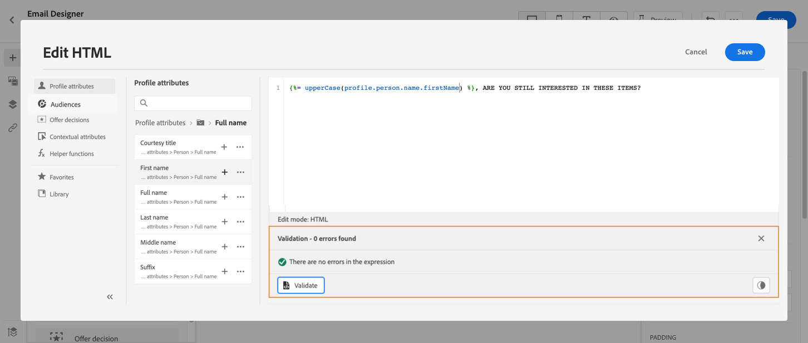

# Personalization-gebruiksgeval: e-mail met winkelwagentje verlaten {#personalization-use-case-helper-functions}

In dit voorbeeld past u de hoofdtekst van een e-mailbericht aan. Dit bericht is bedoeld voor klanten die objecten in hun winkelwagentje hebben verlaten, maar hun aankoop niet hebben voltooid.

U gebruikt de volgende typen hulpfuncties:

* De `upperCase` -tekenreeksfunctie om de voornaam van de klant in hoofdletters in te voegen. [Meer info](functions/string.md#upper).
* De `each` helper om de items in het winkelwagentje weer te geven. [Meer info](functions/helpers.md#each).
* De `if` helper, om een productspecifieke nota op te nemen als het verwante product in de kar is. [Meer info](functions/helpers.md#if-function).
<!-- **Context**: personalization based on contextual data from the journey -->

➡️ [ Leer hoe te om hulpfuncties in deze video te gebruiken ](#video)

Alvorens u begint, zorg ervoor u weet hoe te om deze elementen te vormen:

* Een eenheidsgebeurtenis. [Meer info](../event/about-events.md).
* Een reis die begint met een evenement. [Meer info](../building-journeys/using-the-journey-designer.md).
* Een e-mailbericht op reis. [Meer informatie](../email/create-email.md)
* De hoofdtekst van een e-mail. [Meer info](../email/content-from-scratch.md).

Voer de volgende stappen uit:

1. [ creeer de aanvankelijke gebeurtenis en de reis ](#create-context).
1. [ creeer een e-mailbericht ](#configure-email).
1. [ Tussenvoegsel de voornaam van de klant in hoofdletters ](#uppercase-function).
1. [ voeg de kartinhoud aan e-mail ](#each-helper) toe.
1. [ Tussenvoegsel een product-specifieke nota ](#if-helper).
1. [ Test en publiceer de reis ](#test-and-publish).

## Stap 1: Maak de eerste gebeurtenis en de bijbehorende reis {#create-context}

De inhoud van het winkelwagentje is contextuele informatie van de reis. Daarom moet u een eerste gebeurtenis en de e-mail aan een reis toevoegen alvorens u kartspecifieke informatie aan e-mail kunt toevoegen.

1. Maak een gebeurtenis waarvan het schema de array `productListItems` bevat.
1. Definieer alle velden in deze array als payload-velden voor deze gebeurtenis.

   Leer meer over het gegevenstype van het productlijstpunt in [ documentatie van Adobe Experience Platform ](https://experienceleague.adobe.com/docs/experience-platform/xdm/data-types/product-list-item.html){target="_blank"}.

1. Maak een reis die met deze gebeurtenis begint.
1. Voeg een **E-mail** activiteit aan de reis toe.

   

## Stap 2: Maak de e-mail {#configure-email}

1. In de **E-mail** activiteit, klik **[!UICONTROL Edit content]**, dan klik **[!UICONTROL Email Designer]**.

   

1. Sleep in het linkerpalet van de homepage van E-mail Designer drie structuurcomponenten naar de hoofdtekst van het bericht.

1. Sleep een HTML-inhoudscomponent naar elke nieuwe structuurcomponent.

   

## Stap 3: De voornaam van de klant invoegen in hoofdletters {#uppercase-function}

1. Klik op de homepage van Designer via e-mail op de HTML-component waar u de voornaam van de klant wilt toevoegen.
1. Klik op de contextafhankelijke werkbalk op **[!UICONTROL Show the source code]** .

   

1. Voeg in het venster **[!UICONTROL Edit HTML]** de tekenreeksfunctie `upperCase` toe:
   1. Selecteer **[!UICONTROL Helper functions]** in het linkermenu.
   1. Gebruik het zoekveld om naar hoofdletters en kleine letters te zoeken.
   1. Voeg uit de zoekresultaten de functie `upperCase` toe. Klik hiertoe op het plusteken (+) naast `: string` .

      De redacteur van de Uitdrukking toont deze uitdrukking:

      ```handlebars
      
      ```

      

1. Verwijder de tijdelijke aanduiding &quot;tekenreeks&quot; uit de expressie.
1. Voeg de token voor de voornaam toe:
   1. Selecteer **[!UICONTROL Profile attributes]** in het linkermenu.
   1. Selecteer **[!UICONTROL Person]** > **[!UICONTROL Full name]** .
   1. Voeg het token **[!UICONTROL First name]** toe aan de expressie.

      De redacteur van de Uitdrukking toont deze uitdrukking:

      ```handlebars
      
      ```

      

      Leer meer over het gegevenstype van de persoonnaam in [ documentatie van Adobe Experience Platform ](https://experienceleague.adobe.com/docs/experience-platform/xdm/data-types/person-name.html){target="_blank"}.

1. Klik op **[!UICONTROL Validate]** en vervolgens op **[!UICONTROL Save]** .

   

1. Sla het bericht op.

## Stap 4: De lijst met artikelen uit het winkelwagentje invoegen {#each-helper}

In deze stap wordt herhaling over gebeurtenisgegevens getoond. Voor uitvoerige voorbeelden om over verschillende gegevensbronnen (gebeurtenissen, de reacties van de douaneactie, en andere contextafhankelijke gegevens) te herhalen, zie [ over contextafhankelijke gegevens met Handlebars ](iterate-contextual-data.md) herhalen.

1. Open de inhoud van het bericht opnieuw.

1. Klik op de startpagina van Designer e-mailen op de HTML-component waar u de inhoud van het winkelwagentje wilt weergeven.
1. Klik op de contextafhankelijke werkbalk op **[!UICONTROL Show the source code]** .

   

1. Voeg in het **[!UICONTROL Edit HTML]** -venster de `each` helper toe:
   1. Selecteer **[!UICONTROL Helper functions]** in het linkermenu.
   1. Gebruik het zoekveld om &quot;elk&quot; te zoeken.
   1. Voeg aan de hand van de zoekresultaten de hulplijn `each` toe.

      De redacteur van de Uitdrukking toont deze uitdrukking:

      ```handlebars
      {{#each someArray as |variable|}} {{/each}}
      ```

      

1. Voeg de array `productListItems` toe aan de expressie:

   1. Verwijder de tijdelijke aanduiding &quot;someArray&quot; uit de expressie.
   1. Selecteer **[!UICONTROL Contextual attributes]** in het linkermenu.

      **[!UICONTROL Contextual attributes]** zijn alleen beschikbaar nadat de reiscontext aan het bericht is doorgegeven.

   1. Selecteer **[!UICONTROL Journey Optimizer]** > **[!UICONTROL Events]** > *** [!UICONTROL event_name] *** en vouw vervolgens het knooppunt **[!UICONTROL productListItems]** uit.

      In dit voorbeeld, *event_name* vertegenwoordigt de naam van uw gebeurtenis.

   1. Voeg het token **[!UICONTROL Product]** toe aan de expressie.

      De redacteur van de Uitdrukking toont deze uitdrukking:

      ```handlebars
      {{#each context.journey.events.event_ID.productListItems.product as |variable|}} {{/each}}
      ```

      In dit voorbeeld, *event_ID* vertegenwoordigt identiteitskaart van uw gebeurtenis.

      

   1. De expressie wijzigen:
      1. Verwijder de tekenreeks &quot;.product&quot;.
      1. Vervang de tijdelijke aanduiding &quot;variabele&quot; door &quot;product&quot;.

      In dit voorbeeld wordt de gewijzigde expressie getoond:

      ```handlebars
      {{#each context.journey.events.event_ID.productListItems as |product|}}
      ```

1. Plak deze code tussen de openingstag `{{#each}}` en de afsluitende tag `{{/each}}` :

   ```html
   <table>
      <tbody>
         <tr>
            <td><b>#name</b></td>
            <td><b>#quantity</b></td>
            <td><b>$#priceTotal</b></td>
         </tr>
      </tbody>
   </table>
   ```

1. Voeg de personalisatietokens voor de puntnaam, het aantal, en de prijs toe:

   1. Verwijder de tijdelijke aanduiding &quot;#name&quot; uit de HTML-tabel.
   1. Voeg uit de vorige zoekresultaten de token **[!UICONTROL Name]** toe aan de expressie.

   Herhaal deze stappen tweemaal:

   * Vervang de tijdelijke aanduiding &quot;#quantity&quot; door de token **[!UICONTROL Quantity]** .
   * Vervang de tijdelijke aanduiding &quot;#priceTotal&quot; door de token **[!UICONTROL Total price]** .

   In dit voorbeeld wordt de gewijzigde expressie getoond:

   ```handlebars
   {{#each context.journey.events.event_ID.productListItems as |product|}}
      <table>
         <tbody>
            <tr>
            <td><b>{{product.name}}</b></td>
            <td><b>{{product.quantity}}</b></td>
            <td><b>${{product.priceTotal}}</b></td>
            </tr>
         </tbody>
      </table>
   {{/each}}
   ```

1. Klik op **[!UICONTROL Validate]** en vervolgens op **[!UICONTROL Save]** .

   

## Stap 5: Een productspecifieke notitie invoegen {#if-helper}

1. Klik op de homepage van Designer e-mailen op de HTML-component waar u de notitie wilt invoegen.
1. Klik op de contextafhankelijke werkbalk op **[!UICONTROL Show the source code]** .

   

1. Voeg in het **[!UICONTROL Edit HTML]** -venster de `if` helper toe:
   1. Selecteer **[!UICONTROL Helper functions]** in het linkermenu.
   1. Gebruik het zoekveld om te zoeken naar &quot;if&quot;.
   1. Voeg aan de hand van de zoekresultaten de hulplijn `if` toe.

      De redacteur van de Uitdrukking toont deze uitdrukking:

      ```handlebars
       render_1
          render_2
          default_render
      
      ```

      

1. Deze voorwaarde verwijderen uit de expressie:

   ```handlebars
    render_2
   ```

   In dit voorbeeld wordt de gewijzigde expressie getoond:

   ```handlebars
    render_1
       default_render
   
   ```

1. Voeg de token voor de productnaam toe aan de voorwaarde:
   1. Verwijder de tijdelijke aanduiding &quot;condition1&quot; uit de expressie.
   1. Selecteer **[!UICONTROL Contextual attributes]** in het linkermenu.
   1. Selecteer **[!UICONTROL Journey Orchestration]** > **[!UICONTROL Events]** > *** [!UICONTROL event_name] *** en vouw vervolgens het knooppunt **[!UICONTROL productListItems]** uit.

      In dit voorbeeld, *event_name* vertegenwoordigt de naam van uw gebeurtenis.

   1. Voeg het token **[!UICONTROL Name]** toe aan de expressie.

      De redacteur van de Uitdrukking toont deze uitdrukking:

      ```handlebars
      
         render_1
          default_render
      
      ```

      

1. De expressie wijzigen:
   1. Geef in de Expressieeditor de productnaam op na de token `name` .

      Gebruik deze syntaxis, waar *product_name* de naam van uw product vertegenwoordigt:

      ```javascript
      = "product_name"
      ```

      In dit voorbeeld is de productnaam &quot;Juno Jacket&quot;:

      ```handlebars
      
         render_1
          default_render
      
      ```

   1. Vervang de tijdelijke aanduiding &quot;render_1&quot; door de tekst van de notitie.

      Voorbeeld:

      ```handlebars
      
         Due to longer than usual lead times on the Juno Jacket, please expect item to ship two weeks after purchase.
          default_render
      
      ```

   1. Verwijder de tijdelijke aanduiding &quot;default_render&quot; uit de expressie.
1. Klik op **[!UICONTROL Validate]** en vervolgens op **[!UICONTROL Save]** .

    uit

1. Sla het bericht op.

## Stap 6: De reis testen en publiceren {#test-and-publish}

1. Schakel de **[!UICONTROL Test]** -schakeloptie in en klik op **[!UICONTROL Trigger an event]** .

   

1. Voer in het **[!UICONTROL Event configuration]** -venster de invoerwaarden in en klik op **[!UICONTROL Send]** .

   De testmodus werkt alleen met testprofielen.

   

   De e-mail wordt verzonden naar het adres van het testprofiel.

   In dit voorbeeld bevat de e-mail de opmerking over de Juno-jasje, omdat dit product zich in de kar bevindt:

   

1. Controleer of er geen fout is en publiceer de reis.


## Verwante onderwerpen {#related-topics}

### Handbalken, functies {#handlebars}

* [Helpers](functions/helpers.md)

* [Reeksfuncties](functions/string.md)

### Gebruiksscenario’s {#use-case}

* [Personalization met profielgegevens, context en aanbieding](personalization-use-case.md)

* [Personalization met een op beslissingen gebaseerd aanbod](../offers/offers-e2e.md)

## Hoe kan ik-video {#video}

Leer hoe u hulpfuncties kunt gebruiken.

>[!VIDEO](https://video.tv.adobe.com/v/334244?quality=12)
