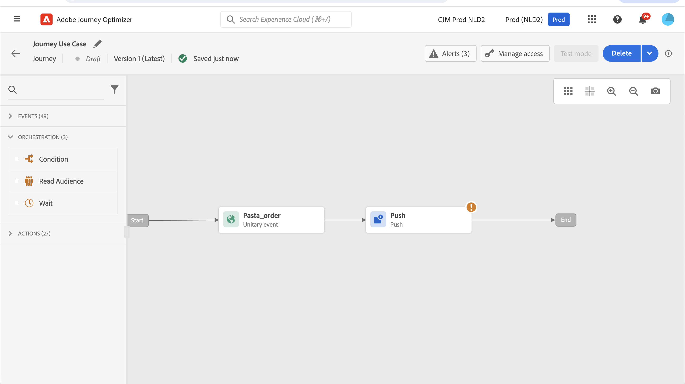
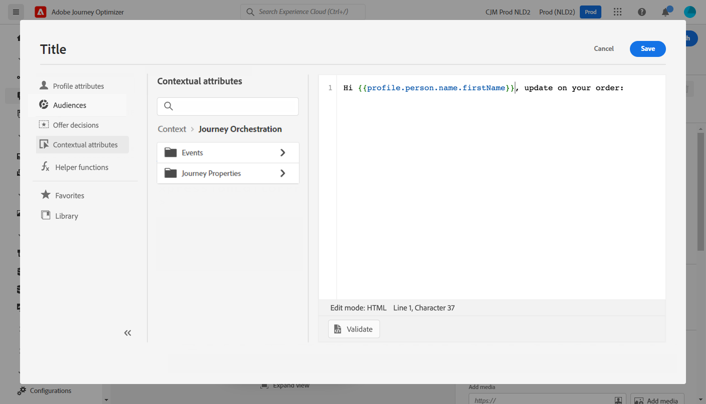

# Personalization use case: bericht over status van bestelling {#personalization-use-case}

In dit gebruiksgeval, zult u zien hoe te om veelvoudige types van verpersoonlijking in één enkel duw bericht te gebruiken. Er worden drie typen personalisatie gebruikt:

* **Profiel**: berichtverpersoonlijking die op een profielgebied wordt gebaseerd
* **besluit van de Aanbieding**: verpersoonlijking die op de variabelen van het besluitvormingsbeheer wordt gebaseerd
* **Context**: verpersoonlijking die op contextafhankelijke gegevens van de reis wordt gebaseerd

Het doel van dit voorbeeld is om een gebeurtenis naar [!DNL Journey Optimizer] te duwen telkens wanneer een klantenorde wordt bijgewerkt. Vervolgens wordt een pushmelding naar de klant gestuurd met informatie over de bestelling en een persoonlijke aanbieding.

Voor dit gebruik zijn de volgende voorwaarden nodig:

* een bestelgebeurtenis configureren, waaronder het ordernummer, de status en de naam van het item. Verwijs naar deze [&#x200B; sectie &#x200B;](../event/about-events.md).
* creeer een besluit, verwijs naar deze [&#x200B; sectie &#x200B;](../offers/offer-activities/create-offer-activities.md).

➡️ [&#x200B; ontdekt een gelijkaardig gebruiksgeval in video &#x200B;](#video)

## Stap 1 - Maak de reis {#create-journey}

1. Klik op het menu **[!UICONTROL Journeys]** en maak een nieuwe reis.

   

1. Voeg uw ingangsgebeurtenis, en a **duw** actieactiviteit toe.

   

1. Configureer en ontwerp uw pushmelding. Verwijs naar deze [&#x200B; sectie &#x200B;](../push/create-push.md).

## Stap 2 - personalisatie toevoegen aan profiel {#add-perso}

1. In **duw** activiteit, klik **geef inhoud** uit.

1. Klik het **gebied van de Titel**.

   

1. Voer het onderwerp in en voeg profielpersonalisatie toe. Gebruik de zoekbalk om het voornaamveld van het profiel te zoeken. Plaats de cursor in de onderwerptekst op de plaats waar u het aanpassingsveld wilt invoegen en klik op het pictogram **+** . Klik **sparen**.

   

## Stap 3 - Verpersoonlijking toevoegen aan contextuele gegevens {#add-perso-contextual-data}

1. In **duw** activiteit, klik **geef inhoud** uit en klik het **gebied van de Titel**.

   

1. Selecteer het **Contextuele attributenmenu**. Contextafhankelijke kenmerken zijn alleen beschikbaar als een reis contextuele gegevens heeft doorgegeven aan het bericht. Klik **Journey Orchestration**. De volgende contextafhankelijke informatie wordt weergegeven:

   * **Gebeurtenissen**: deze categorie groepeert alle gebieden van de gebeurtenis(sen) die vóór de activiteit van de kanaalactie in de reis worden geplaatst.
   * **Eigenschappen van de Reis**: de technische gebieden met betrekking tot de reis voor een bepaald profiel, bijvoorbeeld reisidentiteitskaart of de specifieke aangetroffen fouten. Leer meer in [&#x200B; documentatie van Journey Orchestration &#x200B;](../building-journeys/expression/journey-properties.md).

   

1. Breid het **punt van Gebeurtenissen** uit, en zoek het gebied van het ordenummer met betrekking tot uw gebeurtenis. U kunt ook het zoekvak gebruiken. Klik op het pictogram **+** om het verpersoonlijkingsveld in te voegen in de onderwerptekst. Klik **sparen**.

   

1. Klik nu het **gebied van het Lichaam**.

   

1. Typ het bericht en voeg in het menu **[!UICONTROL Contextual attributes]** de naam van het orderitem en de voortgang van de volgorde in.

   

1. Van het linkermenu, uitgezochte **besluiten van de Aanbieding** om een beslissingsvariabele op te nemen. Selecteer de plaatsing en klik het **+** pictogram naast de beslissing om het aan het lichaam toe te voegen.

   

1. Klik bevestigen om ervoor te zorgen dat er geen fouten zijn, en klik **sparen**.

   

## Stap 4 - De reis testen en publiceren {#test-publish}

1. Klik de **knoop van de Test**, dan klik **Trekker een gebeurtenis**.

   

1. Voer de verschillende waarden in die tijdens de test moeten worden doorstaan. De testmodus werkt alleen met testprofielen. De profiel-id moet overeenkomen met een testprofiel. Klik **verzenden**.

   

   Het pushbericht wordt verzonden en weergegeven op de mobiele telefoon van het testprofiel.

   

1. Controleer of er geen fout is en publiceer de reis.

## Hoe kan ik-video {#video}

In de onderstaande video ziet u een vergelijkbaar gebruiksscenario waarin gebruik wordt gemaakt van contextafhankelijke gegevens van een reis om een e-mail aan te passen.

>[!VIDEO](https://video.tv.adobe.com/v/3425027?quality=12)
