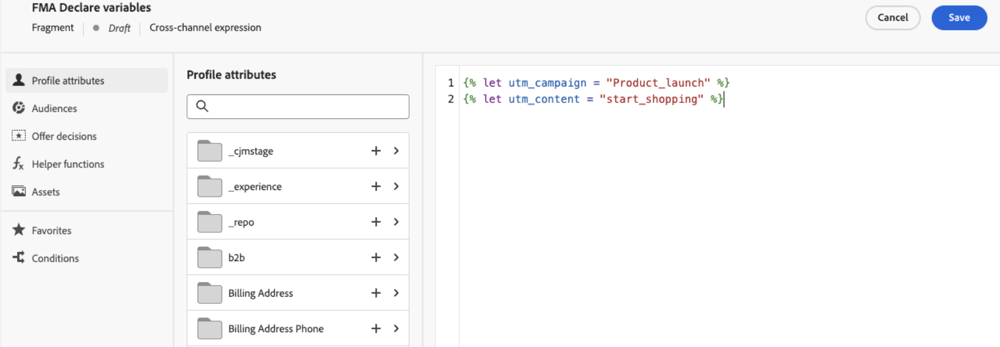

# Expressiefragmenten benutten {#use-expression-fragments}

Wanneer het gebruiken van de **verpersoonlijkingsredacteur**, kunt u hefboomwerking alle uitdrukkingsfragmenten die zijn gecreeerd of aan de huidige zandbak bewaard.

Een fragment is een herbruikbare component waarnaar in [!DNL Journey Optimizer] -campagnes en -reizen kan worden verwezen. Met deze functionaliteit kunt u meerdere blokken met aangepaste inhoud vooraf samenstellen. Deze blokken kunnen door marketinggebruikers worden gebruikt om inhoud snel samen te stellen in een verbeterd ontwerpproces. [ Leer meer op fragmenten ](../content-management/fragments.md)

➡️ [ Leer hoe te, auteur en gebruiks fragmenten in deze video ](../content-management/fragments.md#video-fragments) beheren

## Expressiefragment gebruiken {#use-expression-fragment}

Volg onderstaande stappen om expressiefragmenten aan uw inhoud toe te voegen.

>[!NOTE]
>
>U kunt maximaal 30 fragmenten in een bepaalde levering toevoegen. Fragmenten kunnen maximaal 1 niveau worden genest.

1. Open de [ verpersoonlijkingsredacteur ](personalization-build-expressions.md) en selecteer de **[!UICONTROL Fragments]** knoop op de linkerruit.

   In de lijst worden alle uitdrukkingsfragmenten weergegeven die als fragmenten in de huidige sandbox zijn gemaakt of opgeslagen. [ Leer hoe te om fragmenten ](../content-management/create-fragments.md) tot stand te brengen
Ze worden gesorteerd op aanmaakdatum: recent toegevoegde expressiefragmenten worden als eerste weergegeven in de lijst.

   

   U kunt deze lijst ook vernieuwen.

   >[!NOTE]
   >
   >Als sommige fragmenten zijn gewijzigd of toegevoegd terwijl u de inhoud bewerkt, wordt de lijst bijgewerkt met de meest recente wijzigingen.

1. Klik op het pictogram + naast een expressiefragment om de bijbehorende fragment-id in te voegen in de editor.

   

   >[!CAUTION]
   >
   >U kunt om het even welk **Ontwerp** toevoegen of **Levend** fragment aan uw inhoud. Nochtans, zult u uw reis of campagne niet kunnen activeren als een fragment met de **status van het Ontwerp** in het wordt gebruikt. Tijdens de reis- of campagnepublicatie wordt een fout weergegeven in ontwerpfragmenten die u moet goedkeuren om te kunnen publiceren.

1. Zodra fragment ID is toegevoegd, als u het overeenkomstige uitdrukkingsfragment opent en [ het ](../content-management/manage-fragments.md#edit-fragments) van de interface uitgeeft, worden de veranderingen gesynchroniseerd. Ze worden automatisch doorgegeven aan alle concepten of live reizen/campagnes die die fragment-id bevatten.

1. Klik op de knop **[!UICONTROL More actions]** naast een fragment. Selecteer **[!UICONTROL View fragment]** in het contextmenu dat wordt geopend voor meer informatie over dat fragment. **[!UICONTROL Fragment ID]** wordt ook weergegeven en kan hier worden gekopieerd.

   

1. U kunt het expressiefragment openen in een ander venster om de inhoud en eigenschappen ervan te bewerken. U kunt de optie **[!UICONTROL Open fragment]** in het contextmenu of vanuit het deelvenster **[!UICONTROL Fragment info]** gebruiken. [ Leer hoe te om een fragment uit te geven ](../content-management/manage-fragments.md#edit-fragments)

   

1. U kunt uw inhoud dan aanpassen en bevestigen zoals gewoonlijk gebruikend alle verpersoonlijking en auteursmogelijkheden van de [ verpersoonlijkingsredacteur ](personalization-build-expressions.md).

1. In sommige gevallen hoeft u alleen variabelen te berekenen, dus u kunt de inhoud van het expressiefragment verbergen. Hiervoor gebruikt u het kenmerk `render` en stelt u dit in op `false` . Bijvoorbeeld:

   ```
   Hi {{profile.person.name.firstName|fragment id='ajo:fragmentId/variantId' mode ='inline' render=false}}
   ```

>[!NOTE]
>
>Als u een uitdrukkingsfragment creeert dat veelvoudige lijnonderbrekingen bevat en het in [ SMS ](../sms/create-sms.md#sms-content) of [ duw ](../push/design-push.md) inhoud gebruikt, worden de lijnonderbrekingen bewaard. Aldus zorg ervoor om uw [ SMS ](../sms/send-sms.md) of [ duw ](../push/send-push.md) bericht te testen alvorens het te verzenden.

## Gebruik impliciete variabelen {#implicit-variables}

De impliciete variabelen verbeteren de bestaande fragmentfunctionaliteit om de efficiëntie voor hergebruik van inhoud en het gebruik van scripts te verbeteren. Fragmenten kunnen invoervariabelen gebruiken en uitvoervariabelen maken die kunnen worden gebruikt in campagne- en reisinhoud.

Dit vermogen kan bijvoorbeeld worden gebruikt om het volgen parameters van uw e-mail te initialiseren, die op de huidige campagne of de reis worden gebaseerd, en deze parameters in de gepersonaliseerde verbindingen te gebruiken die aan de e-mailinhoud worden toegevoegd.

De volgende gebruiksgevallen zijn mogelijk:

1. **gebruik een inputvariabelen in een fragment.**

   Wanneer een fragment wordt gebruikt in een campagne-/reisactie-inhoud, kan het gebruikmaken van variabelen die buiten het fragment zijn gedeclareerd. Hieronder ziet u een voorbeeld:

   

   Hierboven ziet u dat de variabele `utm_content` is gedeclareerd in de inhoud van de campagne. Wanneer het fragment **Hero blok** wordt gebruikt, zal het een verbinding tonen waaraan de `utm_content` parameterwaarde zal worden toegevoegd. Het uiteindelijke resultaat is: `https://luma.enablementadobe.com?utm_campaign= Product_launch&utm_content= start_shopping` .

1. **gebruik een outputvariabelen van een fragment.**

   Variabelen die in een fragment worden berekend of gedefinieerd, zijn beschikbaar voor gebruik in de inhoud. In het volgende voorbeeld, verklaart een fragment **F1** een reeks variabelen:

   

   In e-mailinhoud kunt u de volgende instellingen aanpassen:

   

   Het fragment F1 initialiseert de volgende variabelen: `utm_campaign` en `utm_content` . Vervolgens worden deze parameters toegevoegd aan de koppeling in de berichtinhoud. Het uiteindelijke resultaat is: `https://luma.enablementadobe.com?utm_campaign= Product_launch&utm_content= start_shopping` .

>[!NOTE]
>
>Tijdens runtime breidt het systeem uit wat zich in fragmenten bevindt en interpreteert het de verpersoonlijkingscode van boven naar beneden. Met dit in gedachten kunnen complexere gebruiksgevallen worden bereikt. U kunt bijvoorbeeld een fragment F1 hebben dat variabelen doorgeeft aan een ander fragment F2 hieronder. U kunt ook een visueel fragment F1 hebben dat variabelen tot een genest uitdrukkingsfragment F2 overgaat.


## Bewerkbare velden aanpassen {#customize-fields}

Als bepaalde delen van een expressiefragment bewerkbaar zijn gemaakt met variabelen, kunt u de standaardwaarden ervan overschrijven met een specifieke syntaxis. [ Leer hoe te om uw fragmenten klantgericht te maken ](../content-management/customizable-fragments.md)

Voer de volgende stappen uit om de velden aan te passen:

1. Voeg het fragment in de code in via het menu **[!UICONTROL Fragments]** .

1. Gebruik de code `<fieldId>="<value>"` aan het einde van de syntaxis om de standaardwaarde van de variabele te overschrijven.

   In het onderstaande voorbeeld overschrijven we de waarde van een variabele waarvan de id &#39;sport&#39; is met de waarde &#39;yoga&#39;. Hiermee wordt &quot;yoga&quot; in uw fragmentinhoud weergegeven, overal waar naar de variabele &quot;sport&quot; wordt verwezen.

   

Een voorbeeld dat toont hoe te om editable gebieden in een uitdrukkingsfragmenten toe te voegen en hun waarden met voeten te treden wanneer het creëren van een e-mail is beschikbaar in [ deze sectie ](../content-management/customizable-fragments.md#example).

## Overerving onderbreken {#break-inheritance}

Wanneer u een fragment-id toevoegt aan de personalisatie-editor, worden de wijzigingen in het oorspronkelijke expressiefragment gesynchroniseerd.

U kunt echter ook de inhoud van een expressiefragment in de editor plakken. Selecteer in het contextmenu de optie **[!UICONTROL Paste fragment]** om die inhoud in te voegen.


In dat geval wordt de overerving van het oorspronkelijke fragment verbroken. De inhoud van het fragment wordt naar de editor gekopieerd en de wijzigingen worden niet meer gesynchroniseerd.

Het wordt een zelfstandig element dat niet meer aan het oorspronkelijke fragment is gekoppeld. U kunt het net als elk ander element in de code bewerken.

