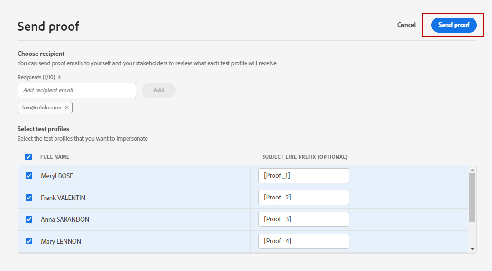
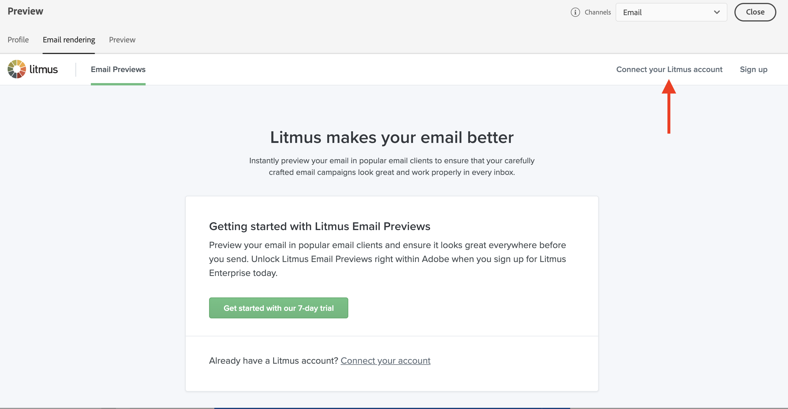

# Uw berichten voorvertonen en testen{#preview-and-proof}

Nadat de inhoud van uw bericht is gedefinieerd, kunt u testprofielen gebruiken om een voorbeeld van de inhoud weer te geven en deze te testen. Als u [gepersonaliseerde inhoud](personalization/personalize.md) opnam, zult u kunnen controleren hoe deze inhoud in het bericht wordt getoond, leveraging de gegevens van het testprofiel.

Om mogelijke fouten in e-mailinhoud of verpersoonlijkingsmontages te ontdekken, verzend proefdrukken naar testprofielen. Telkens wanneer een wijziging wordt aangebracht, moet een bewijs worden verzonden om de meest recente inhoud te valideren.

>[!CAUTION]
>
>U hebt testprofielen nodig om uw berichten te kunnen bekijken en proefdrukken te kunnen verzenden. Leer hoe u testprofielen maakt op [deze pagina](building-journeys/creating-test-profiles.md).

Als u de inhoud van uw bericht wilt testen, moet u:

* [testprofielen selecteren](#select-test-profiles)
* [de voorvertoning van het bericht controleren](#preview-your-messages)

Vervolgens kunt u proefdrukken](#send-proofs) verzenden naar uw testprofielen.[

Bovendien kunt u uw **Litmus**-account gebruiken in [!DNL Journey Optimizer] om direct een voorvertoning van uw **e-mailrendering** weer te geven in populaire e-mailclients. U kunt er dan voor zorgen dat uw e-mailinhoud er goed uitziet en goed werkt in elk Postvak IN. Leer hoe te om E-mailvoorproeven van Litmus in [deze sectie](#email-rendering) te ontgrendelen

## Testprofielen selecteren{#select-test-profiles}

Gebruik [Testprofielen](building-journeys/creating-test-profiles.md) om extra ontvangers aan te wijzen die niet de bepaalde het richten criteria aanpassen.

Volg onderstaande stappen om testprofielen te selecteren:

1. Klik in de berichteninterface of in de e-mailontwerper op de knop **[!UICONTROL Preview]** om de selectie van het testprofiel te openen.

   

1. Selecteer de naamruimte die u wilt gebruiken om testprofielen te identificeren door op het selectiepictogram **[!UICONTROL Identity namespace]** te klikken.

   

   Meer informatie over Adobe Experience Platform-naamruimten [in deze sectie](https://experienceleague.adobe.com/docs/experience-platform/identity/namespaces.html?lang=en#getting-started).

   In het onderstaande voorbeeld gebruiken we de naamruimte **Email**.

1. Gebruik het zoekveld om de naamruimte te zoeken, selecteer deze en klik op **[!UICONTROL Select]**

   

1. Voer de waarde in om het testprofiel te identificeren en klik op **[!UICONTROL Find test profile]**.

   

1. Als u personalisatie in uw bericht toevoegde, voeg andere profielen toe zodat u verschillende varianten van het bericht afhankelijk van profielgegevens kunt testen. Als profielen eenmaal zijn toegevoegd, worden deze weergegeven onder de selectievelden.

   

   Gebaseerd op de elementen van de berichtverpersoonlijking, toont deze lijst gegevens voor elk testprofiel in de verwante kolommen.

## Voorvertoning van berichten{#preview-your-messages}

Als [testprofielen](#select-test-profiles) zijn geselecteerd, kunt u een voorbeeld van uw berichten bekijken en de inhoud controleren.

1. Klik op het tabblad **[!UICONTROL Preview]** om uw bericht te testen.

1. Selecteer een testprofiel. U kunt de waarden controleren die beschikbaar zijn in de kolommen. Gebruik de pijl-rechts/pijl-links om door gegevens te bladeren.

   

1. Klik op het pictogram **[!UICONTROL Select data]** boven de lijst om kolommen toe te voegen of te verwijderen.

   

   U kunt de gebieden van de verpersoonlijking voor het huidige bericht aan het eind van de lijst zien. In dit voorbeeld worden stad, voornaam en achternaam van het profiel weergegeven. Selecteer deze velden en zorg ervoor dat deze waarden worden ingevuld in uw testprofielen.

1. In de voorvertoning van het bericht worden gepersonaliseerde elementen vervangen door de geselecteerde gegevens van het testprofiel.

   Voor dit bericht zijn bijvoorbeeld zowel de e-mailinhoud als het onderwerp van de e-mail gepersonaliseerd:

   

1. Selecteer andere testprofielen voor een voorvertoning van de e-mailrendering voor elke variant van uw bericht.

Voor een voorbeeld van een pushmelding:

1. Schakel over naar het **[!UICONTROL Push]**-kanaal vanuit de vervolgkeuzelijst **[!UICONTROL Channels]** linksboven in het **[!UICONTROL Preview]**-scherm.

   

1. Pas dezelfde stappen toe als hierboven zijn beschreven om een testprofiel te selecteren en selecteer het type apparaat voor een voorvertoning van inhoud: **[!UICONTROL iOS]** of **[!UICONTROL Android]**

   

1. In de pushvoorvertoning worden de gegevens van het testprofiel gebruikt in de berichtinhoud.

   Voor deze pushmelding zijn bijvoorbeeld zowel de titel als de hoofdtekst gepersonaliseerd:

   

## Verzend proeven{#send-proofs}

Een proef is een specifiek bericht dat u toestaat om een bericht te testen alvorens het naar het belangrijkste publiek te verzenden. Ontvangers van het bewijs zijn belast met de goedkeuring van het bericht: renderen, inhoud, instellingen voor personalisatie, configuratie.

Als [testprofielen](#select-test-profiles) zijn geselecteerd, kunt u proefdrukken verzenden.

1. Klik in het **[!UICONTROL Preview]**-scherm op de knop **[!UICONTROL Send proof]**.

   

1. Selecteer de testprofielen die de proef zullen ontvangen en klik **[!UICONTROL Send proof]**. U kunt desgewenst een voorvoegsel toevoegen aan de onderwerpregel van de proefdruk.

   

1. Klik in het **[!UICONTROL Preview]** scherm op de **[!UICONTROL View proofs]** knop om de status te controleren.

   

U moet proefdrukken verzenden na om het even welke wijziging aan de berichtinhoud.

## E-mailweergave{#email-rendering}

U kunt uw **Litmus**-account gebruiken in [!DNL Journey Optimizer] om direct een voorvertoning weer te geven van uw **e-mailrendering** in populaire e-mailclients.

Voor toegang tot de rendermogelijkheden via e-mail moet u:

* Een Litmus-account hebben
* [Testprofielen selecteren](#select-test-profiles)

Voer vervolgens de onderstaande stappen uit:

1. Klik in de E-mailontwerper op de knop **[!UICONTROL Preview]** en selecteer het tabblad **[!UICONTROL Email rendering]**.

1. Klik **Verbind uw rekening van het Net** op de hogere juiste sectie.

   

1. Voer uw gegevens in en meld u aan.

   

1. Klik op de knop **Test uitvoeren** om e-mailvoorvertoningen te genereren.

1. Controleer uw e-mailinhoud in populaire desktops, mobiele en webclients.

   

>[!CAUTION]
>
>Wanneer u uw **Litmus** account aansluit met [!DNL Journey Optimizer], gaat u ermee akkoord dat testberichten naar Litmus worden verzonden: nadat deze e-mails zijn verzonden , worden deze niet meer beheerd door Adobe . Dientengevolge, is het beleid van de het bewaare-mail van het Litmus- gegevens van toepassing op deze e-mail, met inbegrip van verpersoonlijkingsgegevens die in deze testberichten kunnen worden omvat.

