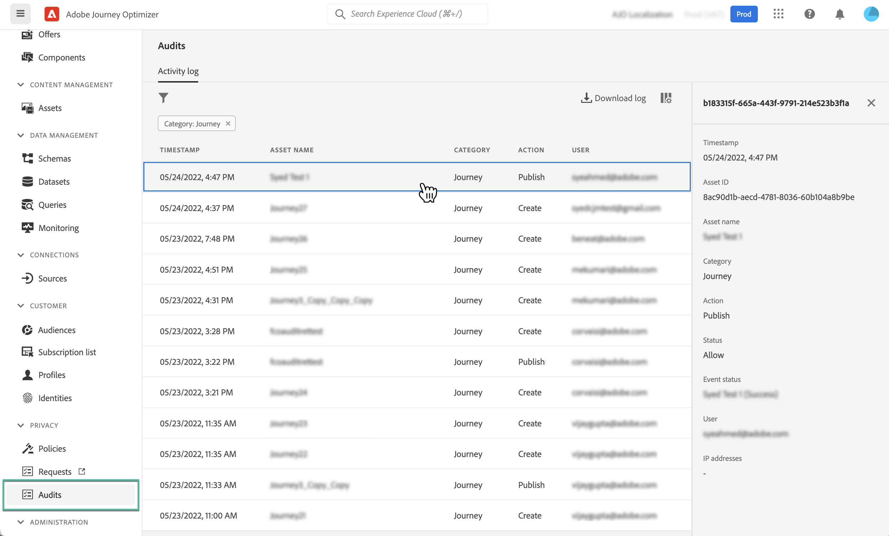

# Audit van Journey Optimizer-bronnen {#track-changes}

## Over auditlogboeken {#audit-logs}

Met Journey Optimizer kunt u acties identificeren die door gebruikers in het systeem worden uitgevoerd op verschillende services en mogelijkheden, zoals reizen, berichten, landingspagina&#39;s enzovoort.

Dit staat u toe om de zichtbaarheid van activiteiten te verhogen die in het systeem worden uitgevoerd, kwesties problemen op te lossen, en uw zaken te helpen aan verordeningen en collectief beleid van het gegevensbeheer voldoen.

Elke actie wordt opgenomen met metagegevens in &quot;auditlogs&quot; die toegankelijk zijn in Adobe Experience Platform. Raadpleeg voor meer informatie over auditlogs, zoals hoe u deze kunt weergeven en beheren in de gebruikersinterface of de API voor meer informatie [Adobe Experience Platform-documentatie](https://experienceleague.adobe.com/docs/experience-platform/landing/governance-privacy-security/audit-logs/overview.html).

## Gebeurtenistypen die zijn vastgelegd in auditlogboeken {#events}

In de volgende tabel wordt aangegeven op welke acties Journey Optimizer-bronnen worden opgenomen in auditlogboeken.

>[!NOTE]
>
>De volledige lijst met acties die in de auditlogboeken zijn vastgelegd, is beschikbaar in [Adobe Experience Platform-documentatie](https://experienceleague.adobe.com/docs/experience-platform/landing/governance-privacy-security/audit-logs/overview.html#category).

| Resource | Actie |
|-----------|------------------|
| AJO-campagne | Maken / Verwijderen / Bijwerken / Activeren / Stoppen |
| Algemene instelling AJO-kanaal | Maken/verwijderen/bijwerken |
| AJO IP-pool | Maken/verwijderen/bijwerken |
| AJO-openingspagina | Maken/Verwijderen/Bijwerken/Publiceren/Publiceren ongedaan maken |
| HTML-sjabloon AJO-landingspagina | Maken/verwijderen/bijwerken |
| Voorinstelling voor AJO-openingspagina | Maken/verwijderen/bijwerken |
| Subdomein van AJO-landingspagina | Maken/verwijderen/bijwerken |
| AJO-bericht | Maken/verwijderen/bijwerken/publiceren |
| Voorinstelling voor AJO-bericht | Maken/verwijderen/bijwerken |
| AJO PTR-record | Maken/verwijderen/bijwerken |
| AJO-sjabloon voor opgeslagen expressie | Maken/verwijderen/bijwerken |
| Aanmeldingsgegevens AJO SMS API | Maken/verwijderen/bijwerken |
| AJO-subdomein | Maken/verwijderen/bijwerken |
| AJO-suppressielijst | CSV maken/verwijderen/downloaden |
| Veldgroep | Maken/verwijderen/bijwerken |
| Reis | Maken / Verwijderen / Bijwerken / Stoppen / Publiceren |
| Aangepaste actie voor reizen | Maken/verwijderen/bijwerken |
| Gegevensbron voor reis | Maken/verwijderen/bijwerken |
| Journaal | Maken/verwijderen/bijwerken |
| Regel voor berichtfrequentie | Maken/verwijderen/bijwerken |
| Beoordelingsstrategie | Maken/verwijderen/bijwerken |
