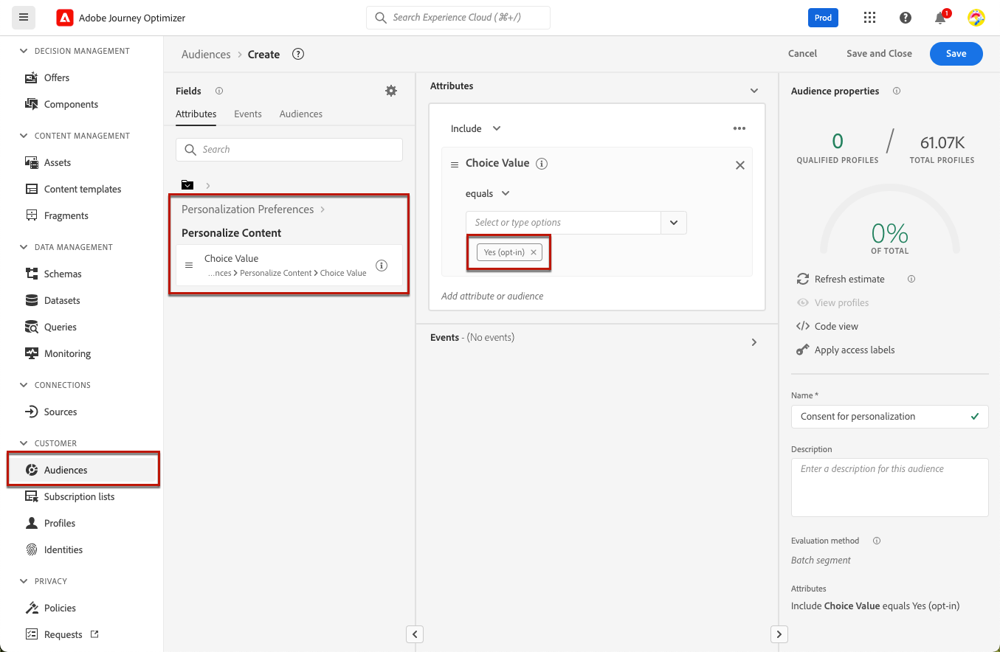
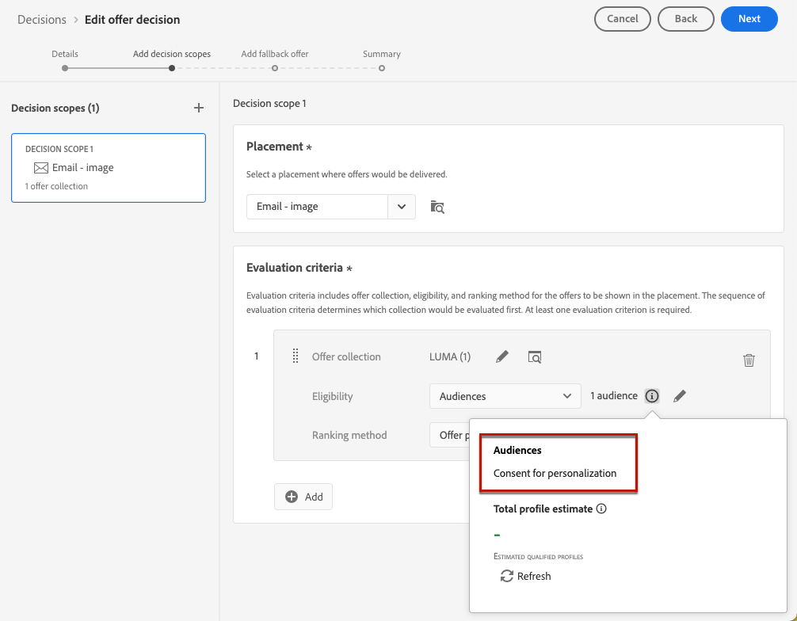
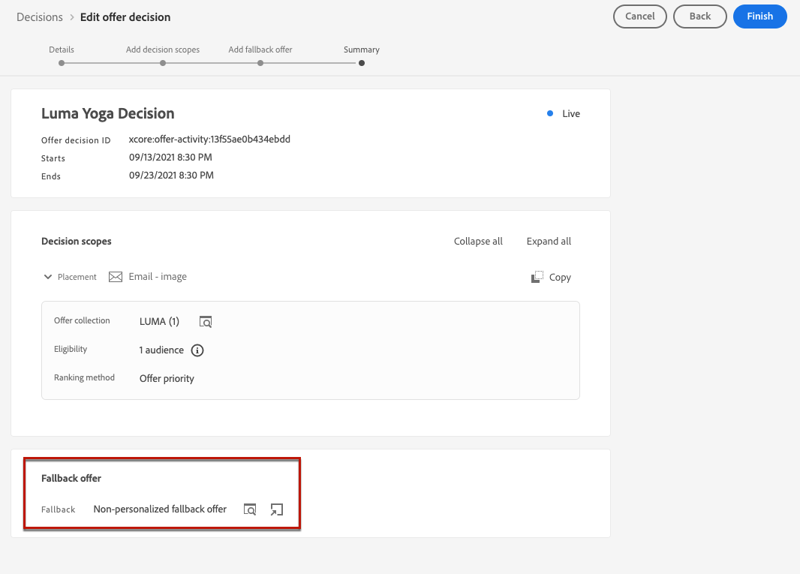
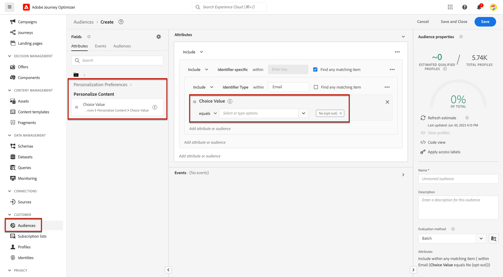
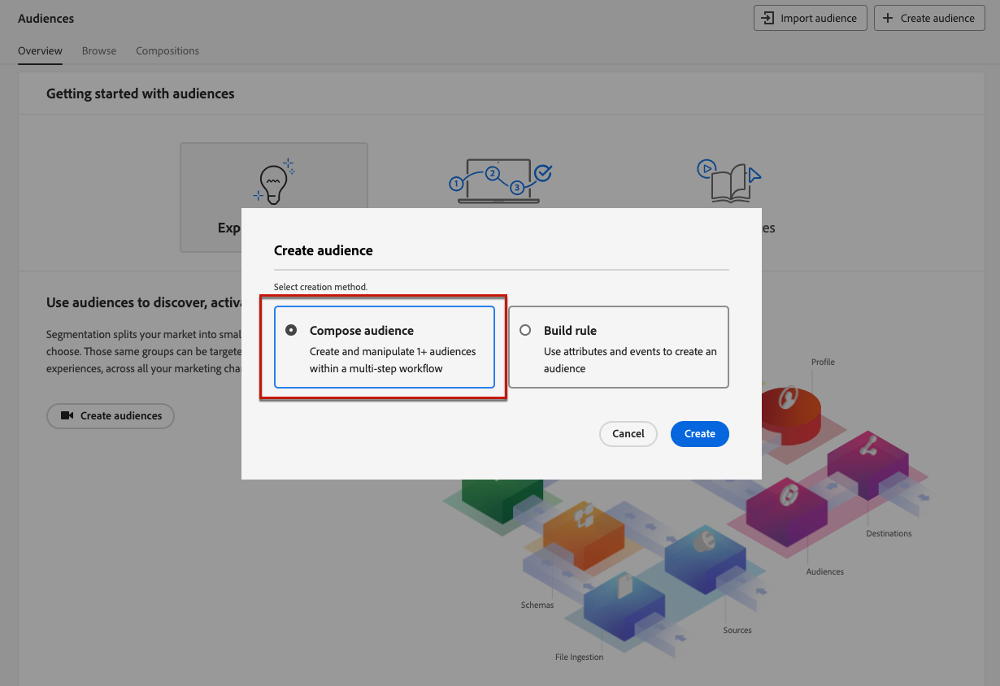
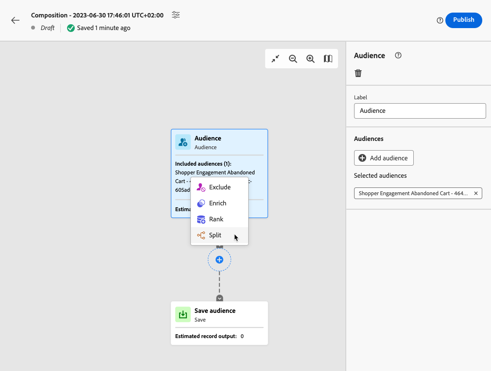
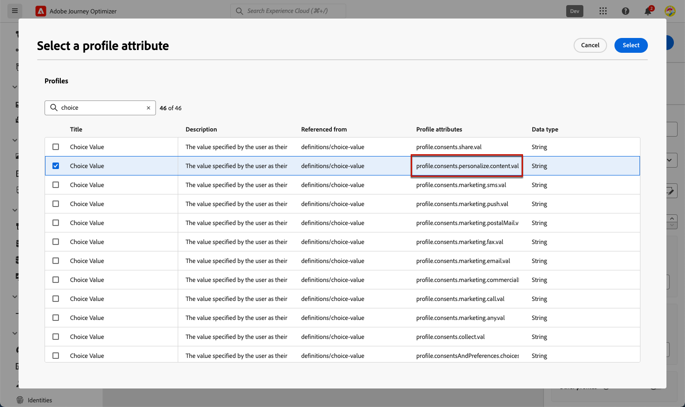
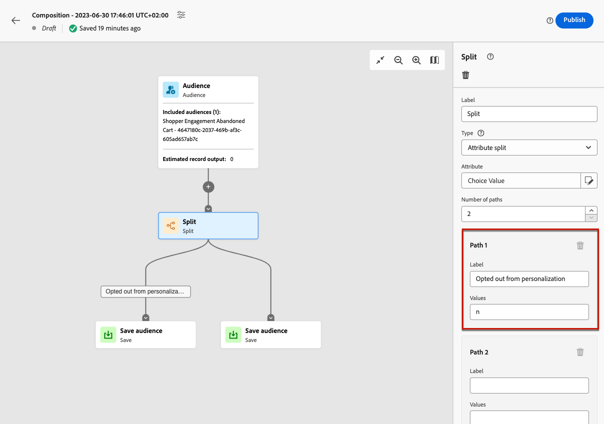

# Weigeren beheren {#consent}

Het is een wettelijke vereiste om ontvangers de mogelijkheid te bieden zich niet langer te abonneren op het ontvangen van communicatie van een merk, en om ervoor te zorgen dat deze keuze wordt nagekomen. Als u deze voorschriften niet naleeft, brengt u juridische risico&#39;s met zich mee voor uw merk. Het helpt u vermijden verzendend ongevraagde mededelingen naar uw ontvangers, die hen zouden kunnen maken uw berichten als spam merken en uw reputatie schaden.

Leer meer over de toepasselijke wetgeving in de [&#x200B; documentatie van Experience Platform &#x200B;](https://experienceleague.adobe.com/docs/experience-platform/privacy/regulations/overview.html?lang=nl-NL#regulations){target="_blank"} .

## Abonnementen beheren tijdens reizen en campagnes {#opt-out-ajo}

Wanneer het verzenden van berichten van reizen of campagnes, moet u altijd ervoor zorgen dat de klanten van toekomstige mededelingen kunnen opzeggen. Als u het abonnement opzegt, worden de profielen automatisch verwijderd uit het publiek van toekomstige marketingberichten.

Hoewel **[!DNL Journey Optimizer]** manieren biedt om de optie om te weigeren te beheren in e-mails en SMS-berichten, is voor pushberichten geen actie aan uw kant vereist, aangezien ontvangers hun abonnement zelf via hun apparaten kunnen opzeggen. Ze kunnen er bijvoorbeeld voor kiezen om meldingen te stoppen wanneer ze worden gedownload of wanneer ze uw app gebruiken. Op dezelfde manier kunnen ze de meldingsinstellingen wijzigen via het mobiele besturingssysteem.

>[!NOTE]
>
>Bovendien kunt u hefboomwerkingJourney Optimizer **HULPMIDDELEN API van de Onderdrukking** om uw uitgaande berichten te controleren gebruikend onderdrukking en lijsten van gewenste personen. [&#x200B; Leer hoe te om met de REST API van de Onderdrukking te werken &#x200B;](https://developer.adobe.com/journey-optimizer-apis/references/suppression/){target="_blank"} 

In de volgende secties vindt u informatie over het beheren van opt-out in Journey Optimizer-berichten voor e-mail en SMS:

<table style="table-layout:fixed"><tr style="border: 0;">
<td>

<a href="../email/email-opt-out.md"><strong> e-mail opt-out beheer </strong>

</td>
<td>

<a href="../sms/sms-opt-out.md"><strong> het opt-outbeheer van SMS </strong></a>

</td>
</tr></table>

>[!NOTE]
>
>In [!DNL Journey Optimizer], wordt de toestemming behandeld door het schema van de 1&rbrace; Toestemming van Experience Platform [&#128279;](https://experienceleague.adobe.com/docs/experience-platform/xdm/field-groups/profile/consents.html?lang=nl-NL){target="_blank"} .  Standaard is de waarde voor het veld voor toestemming leeg en wordt deze behandeld als toestemming voor het ontvangen van uw communicatie. U kunt deze standaardwaarde wijzigen terwijl het aan een van de mogelijke hier vermelde waarden [&#128279;](https://experienceleague.adobe.com/docs/experience-platform/xdm/data-types/consents.html?lang=nl-NL#choice-values){target="_blank"} , of gebruik [&#x200B; toestemmingsbeleid &#x200B;](../action/consent.md) om de standaardlogica met voeten te treden.

## Persoonlijkheidsgoedkeuring implementeren {#opt-out-personalization}

Uw klanten kunnen er ook voor kiezen om geen persoonlijke inhoud te presenteren. Zodra een profiel uit verpersoonlijking heeft gekozen, moet u ervoor zorgen dat hun gegevens niet voor verpersoonlijking worden gebruikt en u moet om het even welke gepersonaliseerde inhoud met een fallback variant vervangen.

### In beslissingsbeheer {#opt-out-decision-management}

Wanneer het leveraging van aanbiedingen, worden de verpersoonlijkingsvoorkeur niet automatisch uitgevoerd in [&#x200B; besluitvormingswerkingsgebied &#x200B;](../offers/offer-activities/create-offer-activities.md#add-decision-scopes) van het verzoek van a [&#x200B; besluit &#x200B;](../offers/api-reference/offer-delivery-api/decisioning-api.md) API of [&#x200B; randbesluit &#x200B;](../offers/api-reference/offer-delivery-api/edge-decisioning-api.md) API verzoek. In dit geval moet u handmatig toestemming voor personalisatie afdwingen. Volg de onderstaande stappen om dit te doen.

>[!NOTE]
>
>De beslissingsbereiken die worden gebruikt in [!DNL Journey Optimizer] authored kanalen voldoen aan deze eis van de reis of de campagne waartoe zij behoren.

1. Creeer een [&#x200B; publiek van Adobe Experience Platform &#x200B;](../audience/about-audiences.md) gebruikend de [&#x200B; Dienst van de Segmentatie &#x200B;](https://experienceleague.adobe.com/docs/experience-platform/segmentation/ui/overview.html?lang=nl-NL){target="_blank"}  en gebruik een profielattribuut zoals **[!UICONTROL Personalize Content = Yes (opt-in)]** aan doelgebruikers die met verpersoonlijking hebben ingestemd.

   

1. Wanneer het creëren van a [&#x200B; besluit &#x200B;](../offers/offer-activities/create-offer-activities.md), voeg een besluitvormingswerkingsgebied toe en bepaal een toelatingsbeperking die op dit publiek voor elke inzameling van evaluatiecriteria wordt gebaseerd die gepersonaliseerde aanbiedingen bevat.

   

1. Creeer de aanbieding van de a [&#x200B; reserve &#x200B;](../offers/offer-library/creating-fallback-offers.md) die gepersonaliseerde inhoud niet omvat.

1. [&#x200B; wijs &#x200B;](../offers/offer-activities/create-offer-activities.md#add-fallback) de niet-gepersonaliseerde reserveaanbieding aan het besluit toe.

   

1. [&#x200B; Overzicht en sparen &#x200B;](../offers/offer-activities/create-offer-activities.md#review) het besluit.

Als een gebruiker:

* met toestemming voor personalisatie zal het beslissingsbereik het beste aanbod voor dat profiel bepalen .

* zonder toestemming voor personalisatie, komt het desbetreffende profiel niet in aanmerking voor een van de aanbiedingen die in de evaluatiecriteria zijn opgenomen en zal daarom het niet-persoonlijke fallback-aanbod ontvangen.

>[!NOTE]
>
>De toestemming voor het hebben van profielgegevens die in [&#x200B; gegevens modelleren &#x200B;](../offers/ranking/ai-models.md) worden gebruikt wordt nog niet gesteund in [!DNL Journey Optimizer].

### In de verpersoonlijkingsredacteur {#opt-out-expression-editor}

De [&#x200B; verpersoonlijkingsredacteur &#x200B;](../personalization/personalization-build-expressions.md) zelf voert geen toestemmingscontroles of handhaving uit aangezien het niet betrokken bij de levering van berichten is.

Nochtans, staat het gebruik van op recht-gebaseerde etiketten van de toegangscontrole toe om te beperken welke gebieden voor verpersoonlijking kunnen worden gebruikt. De [&#x200B; berichtvoorproef &#x200B;](../content-management/preview.md) en [&#x200B; e-mail die dienst teruggeven &#x200B;](../content-management/rendering.md) zullen de gebieden maskeren die met gevoelige informatie worden geïdentificeerd.

>[!NOTE]
>
>Leer meer over de toegangscontrole van het Niveau van Objecten (OLAC) in [&#x200B; deze sectie &#x200B;](../administration/object-based-access.md).

In [!DNL Journey Optimizer] campagnes, wordt het toestemmingsbeleid afgedwongen als volgt:

* U kunt toestemmingsbeleidsdefinities als deel van de publieksverwezenlijking omvatten om ervoor te zorgen dat het publiek dat voor de campagne wordt geselecteerd reeds **gefilterde uit profielen heeft die niet de toestemmingscriteria** aanpassen.

* [!DNL Journey Optimizer] zal een algemene toestemmingscontrole op het kanaalniveau uitvoeren om **ervoor te zorgen dat de profielen binnen** hebben verkozen om marketing mededelingen op het overeenkomstige kanaal te ontvangen.

  >[!NOTE]
  >
  >Het campagneobject [!DNL Journey Optimizer] zelf voert momenteel geen aanvullende controles uit op de naleving van het toestemmingsbeleid.

Volg een van de onderstaande opties om de toestemming voor personalisatie handmatig af te dwingen in campagnes.

### Het gebruiken van de bouwer van de segmentregel

U kunt de bouwer van de segmentregel gebruiken om een publiek tot stand te brengen dat opt-outprofielen bevat.

1. Creeer een [&#x200B; publiek van Adobe Experience Platform &#x200B;](../audience/about-audiences.md) gebruikend de [&#x200B; Dienst van de Segmentatie &#x200B;](https://experienceleague.adobe.com/docs/experience-platform/segmentation/ui/overview.html?lang=nl-NL){target="_blank"} .

   

1. Selecteer een profielkenmerk, zoals **[!UICONTROL Personalize Content = No (opt-out)]** , om gebruikers uit te sluiten die niet hebben ingestemd met personalisatie.

   

1. Klik op **[!UICONTROL Save]**.

U kunt dit publiek nu gebruiken om profielen die geen toestemming voor personalisatie hebben gegeven, uit uw campagnes te filteren.

### Een gesplitste activiteit gebruiken in een compositiewerkstroom

U kunt een controle van de verpersoonlijkingstoestemming aan een publiek ook toevoegen door een gespleten activiteit aan een samenstellingswerkschema toe te voegen.

1. Maak een publiek met de optie **[!UICONTROL Compose Audience]** . [&#x200B; leer meer over het creëren van een samenstellingswerkschema &#x200B;](../audience/get-started-audience-orchestration.md)

   

1. Voeg uw beginnende publiek toe gebruikend de specifieke knoop op het recht.

1. Klik op het pictogram **+** en selecteer een **[!UICONTROL Split]** -activiteit om een gesplitst publiek te maken.

   

1. Selecteer in het rechterdeelvenster **[!UICONTROL Attribute split]** als gesplitst type.

   

1. Klik op het potloodpictogram naast het veld **[!UICONTROL Attribute]** om het venster van **[!UICONTROL Select a profile attribute]** weer te geven.

1. Zoek naar het attribuut van de verpersoonlijkingstoestemming (`profile.consents.personalize.content.val`) en selecteer het.

   

1. **[!UICONTROL Path 1]** wordt het niet-persoonlijke publiek. Kies een relevant label.

1. Kies de aangewezen waarde van deze [&#x200B; lijst &#x200B;](https://experienceleague.adobe.com/docs/experience-platform/xdm/data-types/consents.html?lang=nl-NL#choice-values){target="_blank"} .

   In dit geval gebruiken we `n` om aan te geven dat gebruikers niet instemmen met het gebruik van hun gegevens voor personalisatie.

   

1. U kunt een afzonderlijk pad maken voor andere keuzevelden. U kunt ook de resterende paden verwijderen en **[!UICONTROL Other profiles]** inschakelen om alle andere profielen op te nemen waarvoor de waarde `n` niet is gekozen.

1. Als u klaar bent, klikt u op **[!UICONTROL Save Audience]** voor elk pad om het resultaat van de workflow op te slaan in een nieuw publiek. Voor elk pad wordt één publiek opgeslagen in Adobe Experience Platform.

1. Publiceer de compositieworkflow als u klaar bent.

U kunt dit publiek nu gebruiken om profielen die geen toestemming voor personalisatie hebben gegeven, uit uw campagnes te filteren.

>[!NOTE]
>
>Als u een publiek creeert dat geen toestemming voor verpersoonlijking heeft gegeven en u dan dit publiek in een campagne selecteert, zullen de verpersoonlijkingshulpmiddelen beschikbaar blijven. Het is aan uw marketing gebruikers om te begrijpen dat als zij met een publiek werken dat geen verpersoonlijking zou moeten ontvangen, zij geen verpersoonlijkingshulpmiddelen zouden moeten gebruiken.
