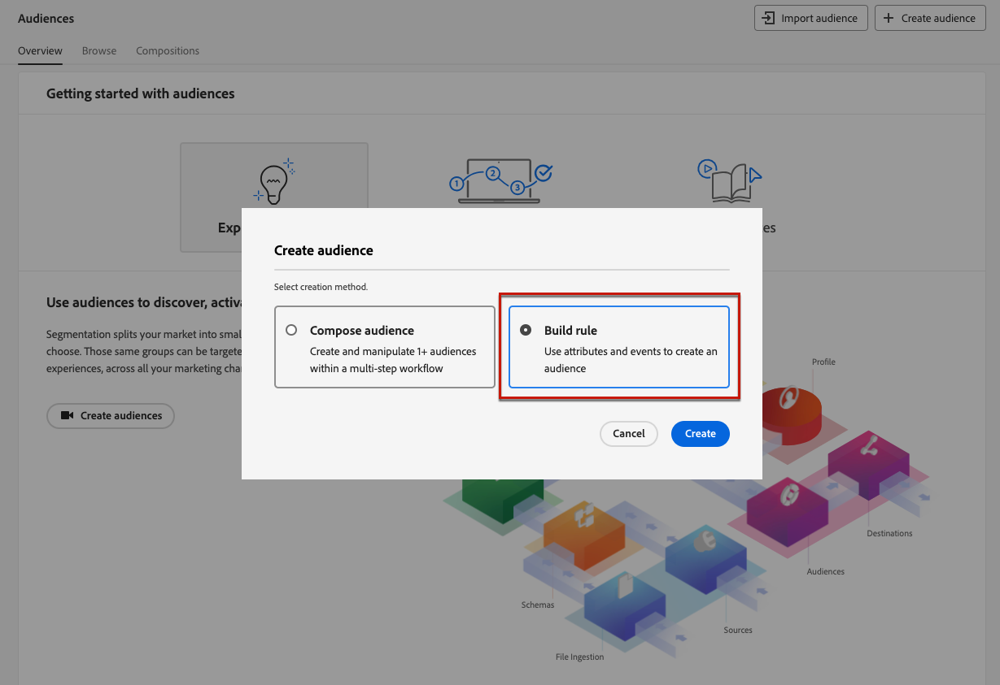

# Weigeren beheren {#consent}

Het is een wettelijke vereiste om ontvangers de mogelijkheid te bieden zich niet langer te abonneren op het ontvangen van communicatie van een merk, en om ervoor te zorgen dat deze keuze wordt nagekomen. Meer informatie over de toepasselijke wetgeving vindt u in het [Documentatie Experience Platform](https://experienceleague.adobe.com/docs/experience-platform/privacy/regulations/overview.html#regulations){target="_blank"}.

**Waarom is het belangrijk?**

* Als u deze voorschriften niet naleeft, brengt u juridische risico&#39;s met zich mee voor uw merk.
* Het helpt u vermijden verzendend ongevraagde mededelingen naar uw ontvangers, die hen zouden kunnen maken uw berichten als spam merken en uw reputatie schaden.

## Abonnementen beheren tijdens reizen en campagnes {#opt-out-ajo}

Wanneer het verzenden van berichten van reizen of campagnes, moet u altijd ervoor zorgen dat de klanten van toekomstige mededelingen kunnen opzeggen. Als u het abonnement opzegt, worden de profielen automatisch verwijderd uit het publiek van toekomstige marketingberichten.

while **[!DNL Journey Optimizer]** biedt manieren om de optie om te weigeren in e-mails en SMS-berichten te beheren. Voor pushberichten is geen actie aan uw kant vereist, omdat ontvangers hun abonnement zelf kunnen opzeggen via hun apparaten. Ze kunnen er bijvoorbeeld voor kiezen om meldingen te stoppen wanneer ze worden gedownload of wanneer ze uw app gebruiken. Op dezelfde manier kunnen ze de meldingsinstellingen wijzigen via het mobiele besturingssysteem.

>[!NOTE]
>
>Bovendien kun je Journey Optimizer gebruiken **REST-API onderdrukken** om uw uitgaande berichten te controleren gebruikend onderdrukking en lijsten van gewenste personen. [Leer hoe u met de REST API voor onderdrukking werkt](https://developer.adobe.com/journey-optimizer-apis/references/suppression/){target="_blank"}

In de volgende secties vindt u informatie over het beheren van opt-out in Journey Optimizer-berichten voor e-mail en SMS:

<table style="table-layout:fixed"><tr style="border: 0;">
<td>

<a href="../email/email-opt-out.md"><strong>E-mailuitschakelbeheer</strong>

</td>
<td>

<a href="../sms/sms-opt-out.md"><strong>SMS-opt-out-beheer</strong></a>

</td>
</tr></table>

>[!NOTE]
>
>In [!DNL Journey Optimizer], wordt de toestemming door het Experience Platform afgehandeld [Goedkeuringsschema](https://experienceleague.adobe.com/docs/experience-platform/xdm/field-groups/profile/consents.html){target="_blank"}. Standaard is de waarde voor het veld voor toestemming leeg en wordt deze behandeld als toestemming voor het ontvangen van uw communicatie. U kunt deze standaardwaarde wijzigen terwijl u aan boord gaat tot een van de mogelijke vermelde waarden [hier](https://experienceleague.adobe.com/docs/experience-platform/xdm/data-types/consents.html#choice-values){target="_blank"}.

## Persoonlijkheidsgoedkeuring implementeren {#opt-out-personalization}

Uw klanten kunnen er ook voor kiezen om geen persoonlijke inhoud te presenteren. Zodra een profiel uit verpersoonlijking heeft gekozen, moet u ervoor zorgen dat hun gegevens niet voor verpersoonlijking worden gebruikt en u moet om het even welke gepersonaliseerde inhoud met een fallback variant vervangen.

### In beslissingsbeheer {#opt-out-decision-management}

Als u aanbiedingen gebruikt, worden de voorkeuren voor personalisatie niet automatisch geïmplementeerd in [beslissingsbereik](../offers/offer-activities/create-offer-activities.md#add-decision-scopes) gebruikt uit een [beslissing](../offers/api-reference/offer-delivery-api/decisioning-api.md) API-verzoek of [randdefinitie](../offers/api-reference/offer-delivery-api/edge-decisioning-api.md) API-verzoek. In dit geval moet u handmatig toestemming voor personalisatie afdwingen. Volg de onderstaande stappen om dit te doen.

>[!NOTE]
>
>Beslissingsbereik gebruikt in [!DNL Journey Optimizer] authored kanalen voldoen aan deze eis van de reis of de campagne waartoe zij behoren.

1. Een [Adobe Experience Platform-publiek](../audience/access-audiences.md) met de [Segmenteringsservice](https://experienceleague.adobe.com/docs/experience-platform/segmentation/ui/overview.html){target="_blank"} en gebruik een profielkenmerk, zoals **[!UICONTROL Personalize Content = Yes (opt-in)]** om gebruikers aan te wijzen die met personalisatie hebben ingestemd.

   

1. Wanneer u een [beslissing](../offers/offer-activities/create-offer-activities.md), voegt u een beslissingsbereik toe en definieert u een subsidiabiliteitsbeperking op basis van dit publiek voor elke verzameling evaluatiecriteria die gepersonaliseerde aanbiedingen bevat.

   

1. Een [fallback-aanbieding](../offers/offer-library/creating-fallback-offers.md) dat geen gepersonaliseerde inhoud omvat.

1. [Toewijzen](../offers/offer-activities/create-offer-activities.md#add-fallback) het niet-persoonlijke fallback-aanbod aan het besluit.

   

1. [Controleren en opslaan](../offers/offer-activities/create-offer-activities.md#review) de beschikking.

Als een gebruiker:

* met toestemming voor personalisatie zal het beslissingsbereik het beste aanbod voor dat profiel bepalen .

* zonder toestemming voor personalisatie, komt het desbetreffende profiel niet in aanmerking voor een van de aanbiedingen die in de evaluatiecriteria zijn opgenomen en zal daarom het niet-persoonlijke fallback-aanbod ontvangen.

>[!NOTE]
>
>Toestemming voor het gebruik van profielgegevens in [gegevensmodellering](../offers/ranking/ai-models.md) wordt nog niet ondersteund in [!DNL Journey Optimizer].

### In de verpersoonlijkingsredacteur {#opt-out-expression-editor}

De [personalisatie-editor](../personalization/personalization-build-expressions.md) zelf voert geen toestemmingscontroles of handhaving uit, aangezien het niet betrokken is bij de levering van berichten.

Nochtans, staat het gebruik van op recht-gebaseerde etiketten van de toegangscontrole toe om te beperken welke gebieden voor verpersoonlijking kunnen worden gebruikt. De [berichtvoorbeeld](../content-management/preview.md) en [e-mailrenderservice](../content-management/rendering.md) de velden die met gevoelige informatie zijn aangeduid, maskeren.

>[!NOTE]
>
>Leer meer op het niveau van Objecten toegangsbeheer (OLAC) binnen [deze sectie](../administration/object-based-access.md).

In [!DNL Journey Optimizer] het toestemmingsbeleid wordt als volgt gehandhaafd :

* U kunt toestemmingsbeleidsdefinities als deel van de publieksverwezenlijking omvatten om ervoor te zorgen dat het publiek dat voor de campagne wordt geselecteerd reeds heeft **uitgefilterde profielen die niet voldoen aan de toestemmingscriteria**.

* [!DNL Journey Optimizer] voert een algemene controle uit op het kanaalniveau om **ervoor zorgen dat profielen hebben gekozen** het ontvangen van marketingberichten op het desbetreffende kanaal.

  >[!NOTE]
  >
  >De [!DNL Journey Optimizer] campagneobject zelf voert momenteel geen aanvullende controles uit op de handhaving van het toestemmingsbeleid.

Volg een van de onderstaande opties om de toestemming voor personalisatie handmatig af te dwingen in campagnes.

### Het gebruiken van de bouwer van de segmentregel

U kunt de bouwer van de segmentregel gebruiken om een publiek tot stand te brengen dat opt-outprofielen bevat.

1. Een [Adobe Experience Platform-publiek](../audience/access-audiences.md) met de [Segmenteringsservice](https://experienceleague.adobe.com/docs/experience-platform/segmentation/ui/overview.html){target="_blank"}.

   

1. Selecteer een profielkenmerk, zoals **[!UICONTROL Personalize Content = No (opt-out)]** om gebruikers uit te sluiten die niet hebben ingestemd met personalisatie.

   

1. Klikken **[!UICONTROL Save]**.

U kunt dit publiek nu gebruiken om profielen die geen toestemming voor personalisatie hebben gegeven, uit uw campagnes te filteren.

### Een gesplitste activiteit gebruiken in een compositiewerkstroom

U kunt een controle van de verpersoonlijkingstoestemming aan een publiek ook toevoegen door een gespleten activiteit aan een samenstellingswerkschema toe te voegen.

1. Een publiek maken met de opdracht **[!UICONTROL Compose Audience]** -optie. [Meer informatie over het maken van een compositieworkflow](../audience/create-compositions.md)

   

1. Voeg uw beginnende publiek toe gebruikend de specifieke knoop op het recht.

1. Klik op de knop **+** en selecteert u een **[!UICONTROL Split]** activiteit om een gespleten publiek tot stand te brengen. [Meer informatie over de splitsingsactiviteit](../audience/composition-canvas.md#split)

   

1. Selecteer in het rechterdeelvenster de optie **[!UICONTROL Attribute split]** als het gesplitste type.

   

1. Klik op het potloodpictogram naast het pictogram **[!UICONTROL Attribute]** veld om de **[!UICONTROL Select a profile attribute]** venster.

1. Zoeken naar het kenmerk voor verpersoonlijkingstoestemming (`profile.consents.personalize.content.val`) en selecteert u deze.

   

1. **[!UICONTROL Path 1]** zal het niet-gepersonaliseerde publiek zijn. Kies een relevant label.

1. Kies de gewenste waarde in deze [list](https://experienceleague.adobe.com/docs/experience-platform/xdm/data-types/consents.html#choice-values){target="_blank"}.

   In dit geval gebruiken we `n` om aan te geven dat gebruikers niet instemmen met het gebruik van hun gegevens voor personalisatie.

   

1. U kunt een afzonderlijk pad maken voor andere keuzevelden. U kunt ook de resterende paden verwijderen en inschakelen **[!UICONTROL Other profiles]** om alle andere profielen op te nemen waarvoor geen keuzevrijheid van `n`.

1. Klik op **[!UICONTROL Save Audience]** voor elk pad om het resultaat van uw workflow op te slaan in een nieuw publiek. Voor elk pad wordt één publiek opgeslagen in Adobe Experience Platform.

1. Publiceer de compositieworkflow als u klaar bent.

U kunt dit publiek nu gebruiken om profielen die geen toestemming voor personalisatie hebben gegeven, uit uw campagnes te filteren.

>[!NOTE]
>
>Als u een publiek creeert dat geen toestemming voor verpersoonlijking heeft gegeven en u dan dit publiek in een campagne selecteert, zullen de verpersoonlijkingshulpmiddelen beschikbaar blijven. Het is aan uw marketing gebruikers om te begrijpen dat als zij met een publiek werken dat geen verpersoonlijking zou moeten ontvangen, zij geen verpersoonlijkingshulpmiddelen zouden moeten gebruiken.
