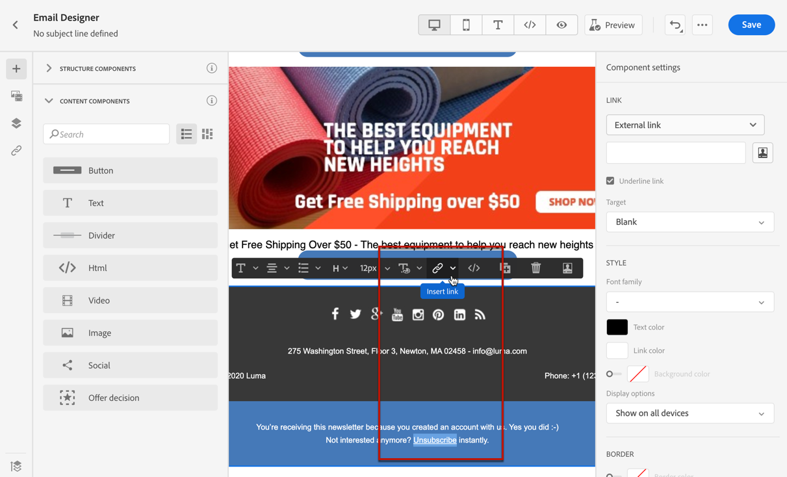

# Weigeren beheren {#consent}

Gebruiken [!DNL Journey Optimizer] om de toestemming van uw ontvangers voor communicatie te volgen en te begrijpen hoe zij met uw merk willen werken door hun voorkeuren en abonnementen te beheren.

Regels zoals de GDPR bepalen dat u aan specifieke vereisten moet voldoen voordat u informatie van de Onderwerpen van Gegevens kunt gebruiken. Bovendien moeten betrokkenen hun toestemming te allen tijde kunnen wijzigen.

**Waarom is het belangrijk?**

* Als u deze voorschriften niet naleeft, brengt u juridische risico&#39;s met zich mee voor uw merk.
* Het helpt u vermijden verzendend ongevraagde mededelingen naar uw ontvangers, die hen zouden kunnen maken uw berichten als spam merken en uw reputatie schaden.

Meer informatie over het beheren van privacy en de toepasselijke regels in het dialoogvenster [Documentatie Experience Platform](https://experienceleague.adobe.com/docs/experience-platform/privacy/home.html){target=&quot;_blank&quot;}.

>[!NOTE]
>
>In [!DNL Journey Optimizer], wordt de toestemming door het Experience Platform afgehandeld [Goedkeuringsschema](https://experienceleague.adobe.com/docs/experience-platform/xdm/field-groups/profile/consents.html){target=&quot;_blank&quot;}. Standaard is de waarde voor het veld voor toestemming leeg en wordt deze behandeld als toestemming voor het ontvangen van uw communicatie. U kunt deze standaardwaarde wijzigen terwijl u aan boord gaat tot een van de mogelijke vermelde waarden [hier](https://experienceleague.adobe.com/docs/experience-platform/xdm/data-types/consents.html#choice-values){target=&quot;_blank&quot;}.

## E-mailuitschakelbeheer {#opt-out-management}

Het is een wettelijke vereiste dat ontvangers de mogelijkheid krijgen om zich af te melden voor het ontvangen van communicatie van een merk. Meer informatie over de toepasselijke wetgeving vindt u in het [Documentatie Experience Platform](https://experienceleague.adobe.com/docs/experience-platform/privacy/regulations/overview.html#regulations){target=&quot;_blank&quot;}.

Daarom moet u altijd een **afmelden, koppeling** in elke e-mail die naar ontvangers wordt verzonden:

* Nadat u op deze koppeling hebt geklikt, worden de ontvangers naar een bestemmingspagina gestuurd om te bevestigen dat ze het programma willen afsluiten.
* Na bevestiging van hun keuze worden de gegevens van de profielen bijgewerkt met deze informatie.

>[!NOTE]
>
>E-mailberichten van het type Marketing moeten een opt-out-koppeling bevatten, die niet vereist is voor transactiemeldingen. De berichtcategorie (**[!UICONTROL Marketing]** of **[!UICONTROL Transactional]**) wordt gedefinieerd op de [kanaaloppervlak](../configuration/channel-surfaces.md#email-type) (d.w.z. vooraf ingestelde berichten) en wanneer [het bericht maken](../messages/get-started-content.md#create-new-message).

### Externe opt-out {#opt-out-external-lp}

Hiervoor kunt u een koppeling naar een externe bestemmingspagina invoegen in een e-mail, zodat gebruikers zich niet meer kunnen abonneren op het ontvangen van communicatie van uw merk.

#### Koppeling voor annuleren toevoegen {#add-unsubscribe-link}

Eerst moet u een afmeldingskoppeling toevoegen aan een bericht. Volg de onderstaande stappen om dit te doen:

1. Bouw uw eigen bestemmingspagina zonder abonnement.

1. De gastheer het op het derdesysteem van uw keus.

1. [Een bericht maken](../messages/get-started-content.md) tijdens een reis.

1. Selecteer tekst in uw inhoud en [een koppeling invoegen](../design/message-tracking.md#insert-links) gebruiken van de contextafhankelijke werkbalk.

   

1. Selecteren **[!UICONTROL External Opt-out/Unsubscription]** van de **[!UICONTROL Link type]** vervolgkeuzelijst.

   

1. In de **[!UICONTROL Link]** , plakt u de koppeling naar de bestemmingspagina van derden.

   

1. Klik op **[!UICONTROL Save]**.

#### Een API-aanroep voor opt-out implementeren {#opt-out-api}

Als u wilt dat de ontvangers de optie Weigeren kiezen wanneer ze hun keuze op de bestemmingspagina indienen, moet u een **API-oproep voor abonnement** doorheen [Adobe Developer](https://developer.adobe.com){target=&quot;_blank&quot;} om de voorkeuren van de corresponderende profielen bij te werken.

Deze vraag van de POST is als volgt:

Eindpunt: platform.adobe.io/journey/imp/consent/preferences

Parameters query:

* **param**: bevat de gecodeerde lading
* **sig**: handtekening
* **pid**: gecodeerde profiel-id

Deze drie parameters worden opgenomen in de URL van de bestemmingspagina van derden die naar de ontvanger wordt verzonden:


Eisen voor koptekst:

* x-api-key
* x-gw-ims-org-id
* x-sandbox-name
* autorisatie (gebruikerstoken van uw technische account)

Instantie van aanvraag:

```
{
   "marketing": [
       {
            "type": "email",           
            "choice": "no",          
            "scope": "channel"       
        }
    ],
 
}
```

[!DNL Journey Optimizer] gebruikt u deze parameters om de keuze van het corresponderende profiel bij te werken via de [Adobe Developer](https://developer.adobe.com){target=&quot;_blank&quot;} API-aanroep.

#### Bericht verzenden met afmeldingskoppeling {#send-message-unsubscribe-link}

Zodra u de unsubscribe verbinding aan uw landende pagina vormde en de API vraag uitvoerde, is uw bericht klaar om te worden verzonden.

1. Verzend het bericht inclusief de koppeling via een [reis](../building-journeys/journey.md).

1. Zodra het bericht wordt ontvangen, als de ontvanger de unsubscribe verbinding klikt, wordt uw landende pagina getoond.

   

1. Indien de ontvanger het formulier indient (hier door op de **Abonnement opzeggen** (in uw bestemmingspagina), worden de profielgegevens bijgewerkt via [API-aanroep](#opt-out-api).

1. De ontvanger van de optie-uit wordt dan opnieuw gericht aan een bevestigingsberichtscherm erop wijzend dat het kiezen uit succesvol was.

   

   Dit heeft tot gevolg dat deze gebruiker geen communicatie van uw merk ontvangt, tenzij hij opnieuw een abonnement neemt.

1. Als u wilt controleren of de keuze van het corresponderende profiel is bijgewerkt, gaat u naar het Experience Platform en opent u het profiel door een naamruimte voor identiteiten en een bijbehorende identiteitswaarde te selecteren. Meer informatie in het dialoogvenster [Documentatie Experience Platform](https://experienceleague.adobe.com/docs/experience-platform/profile/ui/user-guide.html#getting-started){target=&quot;_blank&quot;}.

   

   In de **[!UICONTROL Attributes]** tab, kunt u de waarde zien voor **[!UICONTROL choice]** is gewijzigd in **[!UICONTROL no]**.

### Eén klik op Weigeren {#one-click-opt-out}

Omdat veel klanten op zoek zijn naar een eenvoudiger proces om hun abonnement op te zeggen, kunt u ook een link met één muisklik toevoegen aan uw e-mailinhoud. Deze verbinding zal uw ontvangers toestaan om van uw mededelingen snel af te zien, zonder aan een landende pagina worden opnieuw gericht waar zij hun keus moeten bevestigen, die het afmeldingsproces versnellen.

Volg onderstaande stappen om een koppeling om te weigeren toe te voegen in uw e-mail.

1. [Een koppeling invoegen](../design/message-tracking.md#insert-links) en selecteert u **[!UICONTROL One click Opt-out]** als het type koppeling.

   

1. Selecteer hoe u de optie Weigeren wilt toepassen: op het kanaal, de identiteit, of abonnementsniveau.

   

   * **[!UICONTROL Channel]**: De opt-out is van toepassing op toekomstige berichten die naar het doel van het profiel (d.w.z. e-mailadres) voor het huidige kanaal worden verzonden. Als er meerdere doelen aan een profiel zijn gekoppeld, geldt de opt-out voor alle doelen (e-mailadressen) in het profiel voor dat kanaal.
   * **[!UICONTROL Identity]**: De opt-out is van toepassing op toekomstige berichten die worden verzonden naar het specifieke doel (d.w.z. e-mailadres) dat voor het huidige bericht wordt gebruikt.
   * **[!UICONTROL Subscription]**: De opt-out is van toepassing op toekomstige berichten verbonden aan een specifieke abonnementenlijst. Deze optie kan alleen worden geselecteerd als het huidige bericht is gekoppeld aan een abonnementenlijst.

1. Voer de URL in van de bestemmingspagina waarop de gebruiker wordt omgeleid wanneer het abonnement wordt opgezegd. Deze pagina is alleen hier om te bevestigen dat de optie Weigeren is gelukt.

   >[!NOTE]
   >
   >Als u de optie **List-Unsubscribe** Deze URL wordt ook gebruikt wanneer gebruikers op de koppeling Abonneren in de e-mailheader klikken. [Meer informatie](#unsubscribe-header)

   

   U kunt uw koppelingen aanpassen. Meer informatie over gepersonaliseerde URL&#39;s vindt u in [deze sectie](../personalization/personalization-syntax.md).

1. Sla uw wijzigingen op.

Zodra uw bericht door [reis](../building-journeys/journey.md)Als een ontvanger op de koppeling om te weigeren klikt, wordt zijn profiel onmiddellijk uitgeschakeld.

### Koppeling in e-mailkoptekst opzeggen {#unsubscribe-header}

>[!CONTEXTUALHELP]
>id="ajo_admin_preset_unsubscribe"
>title="Koppeling voor abonnement toevoegen aan e-mailkoptekst"
>abstract="Schakel List-Unsubscribe in om een koppeling voor afmelden aan de e-mailkoptekst toe te voegen. Als u een URL voor afmelden wilt instellen, voegt u een koppeling om te weigeren in de e-mailinhoud in."
>additional-url="https://experienceleague.corp.adobe.com/docs/journey-optimizer/using/privacy/consent/opt-out.html#one-click-opt-out" text="Eén klik op Weigeren"

Als de [List-Unsubscribe, optie](../configuration/channel-surfaces.md#list-unsubscribe) is ingeschakeld op het niveau van het kanaaloppervlak, de bijbehorende e-mails die worden verzonden met [!DNL Journey Optimizer] zal een unsubscribe verbinding in de e-mailkopbal omvatten.

De koppeling voor afmelden wordt bijvoorbeeld als volgt weergegeven in Gmail:


>[!NOTE]
>
>Als u de koppeling voor afmelden in de e-mailheader wilt weergeven, moet de e-mailclient van de ontvangers deze functie ondersteunen.

Het afmeldingsadres is het standaardadres **[!UICONTROL Mailto (unsubscribe)]** adres dat in de overeenkomstige kanaaloppervlakte wordt getoond. [Meer informatie](../configuration/channel-surfaces.md#list-unsubscribe).

Als u een gepersonaliseerde URL voor afmelden wilt instellen, voegt u een koppeling voor een eenmalige aanmelding in de inhoud van het e-mailbericht in en voert u de gewenste URL in. [Meer informatie](#one-click-opt-out)

Afhankelijk van de e-mailclient kan het klikken op de koppeling voor het opzeggen van abonnementen in de koptekst de volgende effecten hebben:

* Het afmeldingsverzoek wordt verzonden naar het standaardadres voor afmelden.

* De ontvanger wordt verwezen naar de bestemmingspagina URL die u toen het toevoegen van de opt-out verbinding aan uw bericht specificeerde.

   >[!NOTE]
   >
   >Als u geen koppeling voor het uitschakelen van een muisklik toevoegt aan uw berichtinhoud, wordt er geen bestemmingspagina weergegeven.

* Het corresponderende profiel wordt direct uitgeschakeld en deze keuze wordt in het Experience Platform bijgewerkt. Meer informatie in het dialoogvenster [Documentatie Experience Platform](https://experienceleague.adobe.com/docs/experience-platform/profile/ui/user-guide.html#getting-started){target=&quot;_blank&quot;}.

## Push opt-out-beheer {#push-opt-out-management}

Push-ontvangers kunnen hun abonnement opzeggen via hun apparaten zelf.

Ze kunnen er bijvoorbeeld voor kiezen om meldingen te stoppen wanneer ze worden gedownload of wanneer ze uw app gebruiken. Op dezelfde manier kunnen ze de meldingsinstellingen wijzigen via het mobiele besturingssysteem.

## SMS-opt-out-beheer {#sms-opt-out-management}

In overeenstemming met de industriestandaarden en -voorschriften moeten alle SMS-marketingberichten een manier bevatten waarop de ontvangers hun abonnement gemakkelijk kunnen opzeggen. Als u het abonnement opzegt, worden de profielen automatisch verwijderd uit het publiek van toekomstige marketingberichten.

>[!NOTE]
>
>Het toevoegen van een koppeling voor het opzeggen van abonnementen is niet verplicht voor transactiemeldingen.

Adobe Journey Optimizer verwerkt automatisch de volgende trefwoorden in binnenkomende berichten: **STARTEN**, **STOPPEN**, en **VERWIJDEREN**. Deze trefwoorden activeren automatische standaardantwoorden van de SMS-provider.

Raadpleeg de volgende video voor meer informatie over de manier waarop native ondersteuning voor binnenkomende trefwoorden (start, stop en unstop) werkt voor SMS:

>[!VIDEO](https://video.tv.adobe.com/v/344026?quality=12)
