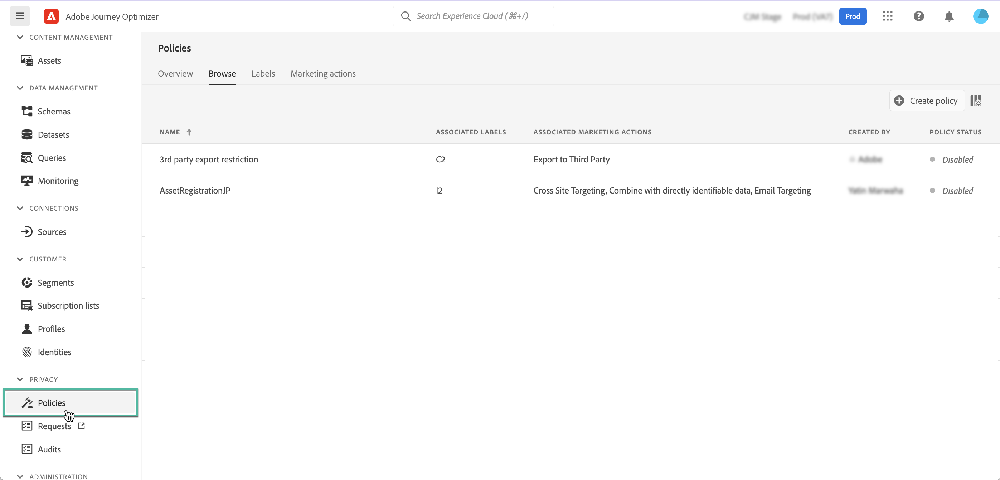

# Beleid voor gegevensgebruik {#Policies}

>[!CONTEXTUALHELP]
>id="ajo_olac_manage_access"
>title="Olac Manage Access"
>abstract="TBC"

Met Adobe Experience Platform **Data Governance Service** kunt u beperkingen op het gegevensgebruik afdwingen door labels, marketingacties en beleidsregels te gebruiken.

Om dit te doen, staat de dienst van de Governance van Gegevens u toe om de etiketten van het gegevensgebruik op datasets en gebieden toe te passen, die elk volgens het verwante beleid van het gegevensgebruik categoriseren.

Beleid voor gegevensgebruik is regels die het soort marketingacties beschrijven dat u mag uitvoeren op gegevens binnen het Experience Platform, of dat u er een beperking voor hebt. Ze zijn toegankelijk vanuit de **[!UICONTROL Policies]** -menu.

Raadpleeg de documentatie van Adobe Experience Platform voor meer informatie over het gegevensbeheerkader en over het werken met labels en beleid:

* [Overzicht van Data Governance Service](https://experienceleague.adobe.com/docs/experience-platform/data-governance/home.html)
* [Overzicht van labels voor gegevensgebruik](https://experienceleague.adobe.com/docs/experience-platform/data-governance/labels/overview.html?lang=en)
* [Beleid voor gegevensgebruik](https://experienceleague.adobe.com/docs/experience-platform/data-governance/policies/overview.html)
