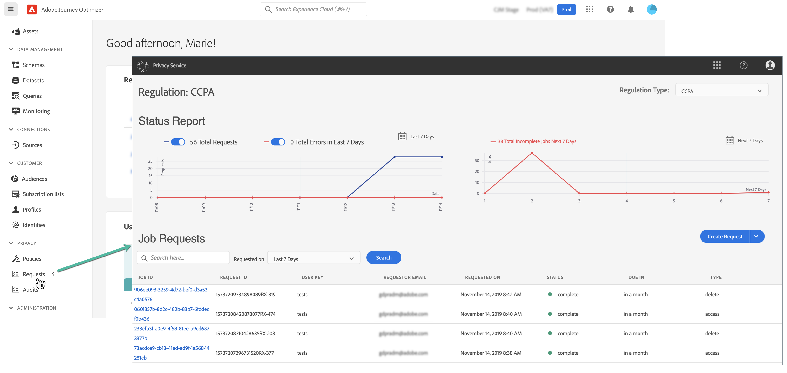

# Privacyverzoeken {#track-changes}

Adobe Experience Platform **Privacy Service** biedt een RESTful-API en -gebruikersinterface waarmee u verzoeken om klantgegevens kunt beheren. Met Privacy Service kunt u verzoeken om toegang tot en verwijdering van persoonsgegevens van klanten uit Adobe Experience Cloud-toepassingen indienen, waardoor u gemakkelijker kunt voldoen aan wettelijke en organisatorische privacyregels.

De verzoeken van de privacy kunnen van worden gecreeerd en worden beheerd **[!UICONTROL Requests]** -menu.

Raadpleeg de documentatie bij Adobe Experience Platform voor meer informatie over de Privacy Service en het maken en beheren van privacyverzoeken:

* [Overzicht van Privacy Service](https://experienceleague.adobe.com/docs/experience-platform/privacy/home.html)
* [Privacy-taken beheren in de gebruikersinterface van de Privacy Service](https://experienceleague.adobe.com/docs/experience-platform/privacy/ui/user-guide.html)
