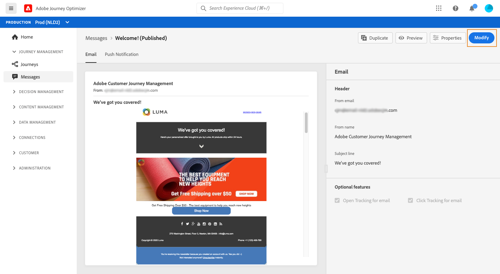

# Uw berichten publiceren {#publish-manage-messages}

## Een bericht publiceren {#publish-message}

Zodra uw bericht is gecreeerd, kunt u het publiceren om het voor uitvoering ter beschikking te stellen.

>[!CAUTION]
>
>Controleer en los waarschuwingen op voordat u ze publiceert. [Meer informatie](alerts.md)

Zodra uw bericht wordt gepubliceerd, wordt het toegevoegd aan de berichtlijst met **[!UICONTROL Published]** status.

Het is nu gereed om te worden geactiveerd door een of meer [reizen](building-journeys/journey.md).

>[!NOTE]
>
>Wanneer u een aanbod, een fallback-aanbieding, een verzameling van aanbiedingen of een besluit van een aanbieding bijwerkt waarnaar direct of indirect wordt verwezen in een gepubliceerd bericht, worden de updates nu automatisch weerspiegeld in het bijbehorende bericht, zonder dat u het bericht opnieuw hoeft te publiceren. [Meer weten over aanbiedingen](offers/get-started/starting-offer-decisioning.md)

## Een alleen-lezen bericht bijwerken {#modify-message}

Na publicatie wordt een bericht alleen-lezen weergegeven. U kunt het nog steeds bijwerken door een nieuw concept van dat bericht te maken.

Op deze manier kunt u bijvoorbeeld inhoud bijwerken of een probleem verhelpen zonder de hele reis waar uw bericht wordt gebruikt opnieuw te publiceren.

>[!NOTE]
>
>De conceptversie kan worden bewerkt terwijl de gepubliceerde versie nog wordt gepubliceerd en actief is.

Een gepubliceerd bericht bijwerken:

1. Selecteer in de berichtenlijst het bericht dat u wilt openen.

1. Klik op **[!UICONTROL Modify]**.

   

1. Bevestig uw keuze. Er wordt een conceptversie van het bericht gemaakt.

   

1. Bewerk de inhoud of wijzig de instellingen naar wens.
1. Klik op **[!UICONTROL Publish]**. Deze actie zal de nieuwe versie van het bericht publiceren dat voor de volgende uitvoeringen zal worden gebruikt.

Zodra de nieuwe versie wordt gepubliceerd, op de volgende API vraag, zal een nieuwe berichtuitvoering worden geproduceerd. Het volgende binnenkomende profiel zal de nieuwe versie ontvangen.

<!--For batch messages, the audience/segment being processed in the previous execution will not be affected by the new version. Only the next incoming API call with an audience/segment will generate a new message execution with the new version. -->
