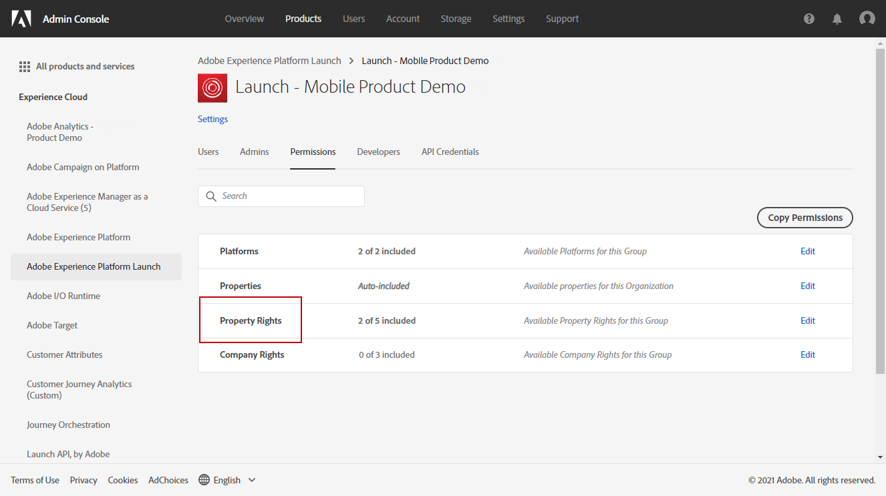
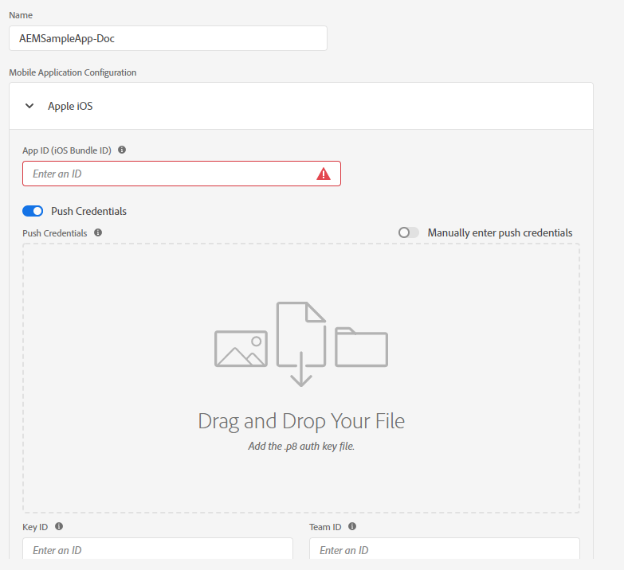
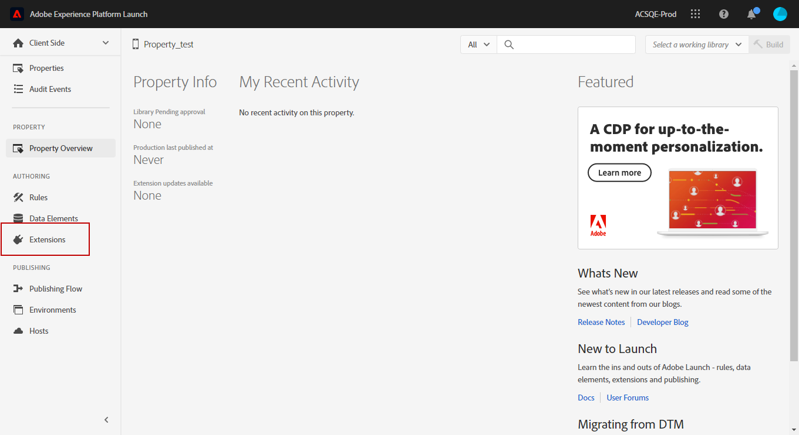
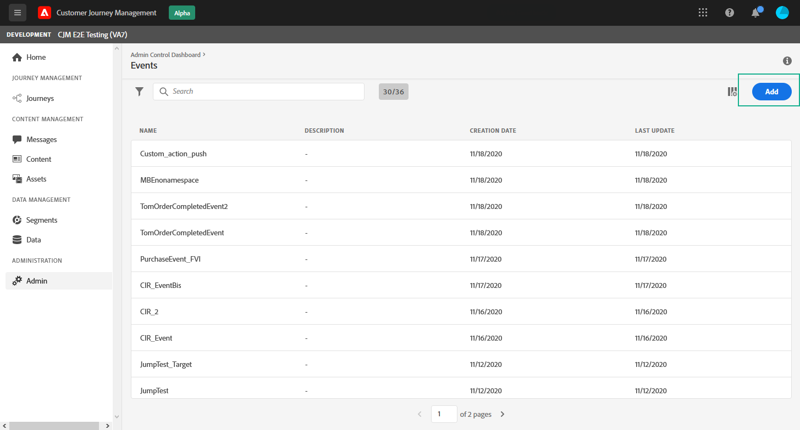
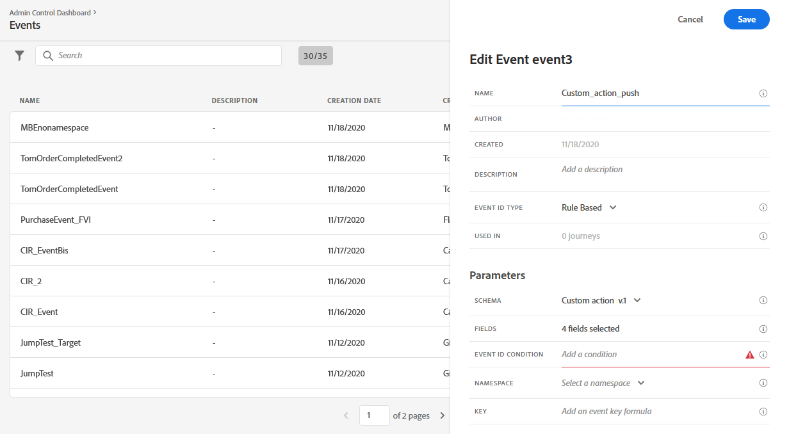

# Pushmeldingskanaal {#push-notification-configuration} configureren

[!DNL Journey Optimizer] kunt u uw reizen maken en berichten naar het beoogde publiek sturen. Voordat u met [!DNL Journey Optimizer] pushmeldingen gaat verzenden, moet u ervoor zorgen dat er configuraties en integratie zijn in de mobiele app en in [!DNL Adobe Experience Platform] en [!DNL Adobe Experience Platform Launch]. Voor meer informatie over de gegevensstroom van pushberichten in Adobe Reis optimizer raadpleegt u [deze pagina](push-gs.md).

## Voordat u begint

<!--
### Check provisioning

Your Adobe Experience Platform account must be provisioned to contain following schemas and datasets for push notification data flow to function correctly:

| Schema <br>Dataset                                                                       | Group of fields                                                                                                                                                                         | Operation                                                |
| -------------------------------------------------------------------------------------- | --------------------------------------------------------------------------------------------------------------------------------------------------------------------------------------- | -------------------------------------------------------- |
| CJM Push Profile Schema <br>CJM Push Profile Dataset                                     | Push Notification Details<br>Adobe CJM ExperienceEvent - Message Profile Details<br>Adobe CJM ExperienceEvent - Message Execution Details<br>Application Details<br>Environment Details | Register Push Token                                      |
| CJM Push Tracking Experience Event Schema<br>CJM Push Tracking Experience Event Dataset | Push Notification Tracking                                                                                                                                                              | Track interactions and provide data for the reporting UI |
-->

### Machtigingen instellen

Voordat u een mobiele toepassing maakt, moet u ervoor zorgen dat u de juiste gebruikersmachtigingen hebt of toewijst in **Adobe Experience Platform Launch**. Meer informatie vindt u in [Adobe Experience Platform Launch-documentatie](https://experienceleague.adobe.com/docs/launch/using/admin/user-permissions.html).

>[!CAUTION]
>
>De duimconfiguratie moet door een deskundige gebruiker worden uitgevoerd. Afhankelijk van uw implementatiemodel en de personen die bij deze implementatie zijn betrokken, moet u mogelijk de volledige set machtigingen toewijzen aan één productprofiel of machtigingen delen tussen de ontwikkelaar van de app en de beheerder **Adobe Journey Optimizer**. Meer informatie over **Adobe Experience Platform Launch**-machtigingen in [deze documentatie](https://experienceleague.adobe.com/docs/launch/using/admin/user-permissions.html?lang=en#platform-launch-permissions)

<!--ou need to your have access to perform following roles :

* Manage Datastreams
* Manage Client-side Properties
* Manage App Configurations
-->

Volg onderstaande stappen om **Eigenschap** en **Bedrijf** rechten toe te wijzen:

1. Open **[!DNL Admin Console]**.

1. Selecteer op het tabblad **[!UICONTROL Products]** de **[!UICONTROL Adobe Experience Platform Launch]**-kaart.

   

1. Selecteer een bestaande **[!UICONTROL Product Profile]** of maak een nieuwe met de **[!UICONTROL New profile]** knoop. Leer hoe u een nieuwe **[!UICONTROL New profile]** maakt in de [Admin-consoledocumentatie](https://experienceleague.adobe.com/docs/experience-platform/access-control/ui/create-profile.html#ui).

1. Selecteer **[!UICONTROL Property rights]** op het tabblad **[!UICONTROL Permissions]**.

   

1. Klik op **[!UICONTROL Add all]**. Hiermee voegt u het volgende recht toe aan uw productprofiel:
   * **[!UICONTROL Approve]**
   * **[!UICONTROL Develop]**
   * **[!UICONTROL Manage Environments]**
   * **[!UICONTROL Manage Extensions]**
   * **[!UICONTROL Publish]**

   Deze machtigingen zijn vereist voor het installeren en publiceren van de Adobe Journey Optimizer-extensie en het publiceren van de app-eigenschap in Adobe Experience Platform Mobile SDK.

1. Selecteer vervolgens **[!UICONTROL Company rights]** in het linkermenu.

   

1. Voeg de volgende rechten toe:

   * **[!UICONTROL Manage App Configurations]**
   * **[!UICONTROL Manage Properties]**

   Deze machtigingen zijn vereist voor de ontwikkelaar van de mobiele app voor het instellen van pushreferenties in **Adobe Experience Launch** en het definiëren van voorinstellingen voor pushmeldingen in **Adobe Journey Optimizer**.

   

1. Klik op **[!UICONTROL Save]**.

Volg onderstaande stappen om deze **[!UICONTROL Product profile]** aan gebruikers toe te wijzen:

1. Open **[!DNL Admin Console]**.

1. Selecteer op het tabblad **[!UICONTROL Products]** de **[!UICONTROL Adobe Experience Platform Launch]**-kaart.

1. Selecteer de eerder geconfigureerde **[!UICONTROL Product profile]**.

1. Klik op het tabblad **[!UICONTROL Users]** op **[!UICONTROL Add user]**.

   

1. Typ de naam of het e-mailadres van uw gebruiker en selecteer de gebruiker. Klik vervolgens op **[!UICONTROL Save]**.

   >[!NOTE]
   >
   >Als de gebruiker niet eerder in de Admin console werd gecreeerd, verwijs naar [gebruikersdocumentatie toevoegen](https://helpx.adobe.com/enterprise/admin-guide.html/enterprise/using/manage-users-individually.ug.html#add-users).

   

### Uw app configureren

De technische opstelling impliceert nauwe samenwerking tussen de toepassingsontwikkelaar en bedrijfsbeheerder. Voordat u met het verzenden van pushberichten begint met [!DNL Journey Optimizer], moet u instellingen definiëren in Adobe Experience Platform Launch en uw mobiele app integreren met Adobe Experience Platform Mobile SDK&#39;s.

Voer de implementatiestappen uit die in de onderstaande koppelingen worden beschreven:

* Voor **Apple iOS**: Meer informatie over het registreren van uw app bij APN&#39;s vindt u in [Apple-documentatie](https://developer.apple.com/documentation/usernotifications/registering_your_app_with_apns)
* Voor **Google Android**: Meer informatie over het instellen van een Firebase Cloud Messaging-clienttoepassing op Android vindt u in [Google-documentatie](https://firebase.google.com/docs/cloud-messaging/android/client)

### Uw mobiele app integreren met de SDK van Adobe Experience Platform

Adobe Experience Platform Mobile SDK biedt client-side integratie-API&#39;s voor uw mobiele apparaten via met Android en iOS compatibele SDK&#39;s. Volg [Adobe Experience Platform Mobile SDK-documentatie](https://aep-sdks.gitbook.io/docs/getting-started/overview) voor installatie met Adobe Experience Platform Mobile SDK&#39;s in uw app.

Tegen het einde van deze update had u ook een mobiele eigenschap in Adobe Experience Platform Launch moeten maken en configureren. Normaal gesproken maakt u een eigenschap mobile voor elke mobiele toepassing die u wilt beheren. Leer hoe u een mobiele eigenschap maakt en configureert in [Adobe Experience Platform Launch-documentatie](https://aep-sdks.gitbook.io/docs/getting-started/create-a-mobile-property).


## Stap 1: Uw pushgegevens voor de app toevoegen in Adobe Experience Platform Launch {#push-credentials-launch}

Nadat u de juiste gebruikersmachtigingen hebt verleend, moet u nu uw pushgegevens voor mobiele toepassingen toevoegen in [!DNL Adobe Experience Platform Launch].

De registratie van de pushreferenties voor de mobiele app is vereist om Adobe te machtigen pushberichten namens u te verzenden. Raadpleeg de onderstaande stappen:

1. Zorg er in [!DNL Adobe Experience Platform Launch] voor dat **[!UICONTROL Client Side]** is geselecteerd in de vervolgkeuzelijst.

1. Selecteer het tabblad **[!UICONTROL App Configurations]** in het linkerdeelvenster en klik op **[!UICONTROL App Configuration]** om een nieuwe configuratie te maken.

1. Voer een **[!UICONTROL Name]** voor de configuratie in.

1. Selecteer in het vervolgkeuzemenu **[!UICONTROL Messaging Service Type]** de **[!UICONTROL Messaging service type]** die u voor deze referenties wilt gebruiken.

   * **Voor Android**

      

      1. Geef de **[!UICONTROL App ID (Android package name)]** op: doorgaans is de pakketnaam de toepassings-id in het `build.gradle`-bestand.

      1. Sleep de FCM-pushgegevens en zet deze neer. Raadpleeg [Google Documentation](https://firebase.google.com/docs/admin/setup#initialize-sdk) voor meer informatie over hoe u de pushreferenties kunt ophalen.
   * **Voor iOS**

      

      1. Voer de mobiele app **Bundel-id** in het veld **[!UICONTROL App ID (iOS Bundle ID)]** in. De toepassingenbundel-id vindt u op het tabblad **Algemeen** van het primaire doel in **XCode**.

      1. Sleep **Apple Push Notification Authentication Key** voor uw Apple Developer-account. Deze sleutel kan van **Certificates**, **Identifiers** en **Profiles** pagina worden verkregen.

      1. Geef de **Sleutel-id** op. Dit is een tekenreeks van 10 tekens die wordt toegewezen tijdens het maken van de p8-auttoets. U vindt deze onder **Toetsen** tabblad op de pagina **Certificates**, **Identifiers** en **Profiles**.

      1. Geef de **Team-id** op. Dit is een tekenreekswaarde die u vindt op het tabblad Lidmaatschap.


1. Klik **[!UICONTROL Save]** om uw toepassingsconfiguratie tot stand te brengen.

<!--
## Step 2: Set up a mobile property in Adobe Experience Platform Launch {#launch-property}

Setting up a mobile property allows the mobile app developer or marketer to configure the mobile SDKs attributes such as Session Timeouts, the [!DNL Adobe Experience Platform] sandbox to be targeted and the **[!UICONTROL Adobe Experience Platform Datasets]** to be used for mobile SDK to send data to.

For further details and procedures on how to set up a **[!UICONTROL Platform Launch property]**, refer to the steps detailed in [Adobe Experience Platform Mobile SDK documentation](https://aep-sdks.gitbook.io/docs/getting-started/create-a-mobile-property#create-a-mobile-property).


To get the SDKs needed for push notification to work you will need the following SDK extensions, for both Android and iOS:

* **[!UICONTROL Mobile Core]** (installed automatically)
* **[!UICONTROL Profile]** (installed automatically)
* **[!UICONTROL Adobe Experience Platform Edge]**
* **[!UICONTROL Adobe Experience Platform Assurance]**, optional but recommended to debug the mobile implementation.

Learn more about [!DNL Adobe Experience Platform Launch] extensions in [Adobe Experience Platform Launch documentation](https://experienceleague.adobe.com/docs/launch-learn/implementing-in-mobile-android-apps-with-launch/configure-launch/launch-add-extensions.html).
-->

## Stap 2: Adobe Journey Optimizer-extensie configureren in uw mobiele eigenschap

Met de **Adobe Journey Optimizer-extensie** voor Adobe Experience Platform Mobile SDK&#39;s kunt u pushmeldingen voor uw mobiele apps maken en kunt u de penningen van gebruikers verzamelen en interactiemetingen beheren met Adobe Experience Platform-services.

Leer hoe u Journey Optimizer-extensie instelt in [Adobe Experience Platform Mobile SDK-documentatie](https://aep-sdks.gitbook.io/docs/using-mobile-extensions/adobe-journey-optimizer).


<!-- 
**[!UICONTROL Edge configuration]** is used by **[!UICONTROL Edge]** extension to send custom data from mobile device to [!DNL Adobe Experience Platform]. 
To configure [!DNL Adobe Experience Platform], you must provide the **[!UICONTROL Sandbox]** name and **[!UICONTROL Event Dataset]**.

For further details and procedures on how to create **[!UICONTROL Edge configuration]**, refer to the steps detailed in [Adobe Experience Platform Mobile SDK documentation](https://aep-sdks.gitbook.io/docs/getting-started/configure-datastreams).

1. From [!DNL Adobe Experience Platform Launch], select the **[!UICONTROL Edge Configurations]** tab and click **[!UICONTROL Edge Configurations]**.
    
1. Select **[!UICONTROL New Edge Configuration]** to add a new **[!UICONTROL Edge Configuration]**.
1. Enter a **[!UICONTROL Name]** and click **[!UICONTROL Save]**

1. Click the **[!UICONTROL Adobe Experience Platform]** toggle to enable it.

1. Fill in the **[!UICONTROL Sandbox]**, **[!UICONTROL Event dataset]** and **[!UICONTROL Profile Dataset]** fields. Then, click **[!UICONTROL Save]**.
    
    


1. From [!DNL Adobe Experience Platform Launch], ensure that **[!UICONTROL Client Side]** is selected in the drop-down menu.

1. select the **[!UICONTROL Properties]** tab and click **[!UICONTROL New Property]**.

    

1. Enter a **[!UICONTROL Name]** for your new property.

1. Select **[!UICONTROL Mobile]** as **[!UICONTROL Platform]**.

    

1. Click **[!UICONTROL Save]** to create your new property.

To configure **[!UICONTROL Adobe Experience Platform Edge Extension]** to send custom data from mobile devices to [!DNL Adobe Experience Platform].

1. Select your previously created property and select the **[!UICONTROL Extensions]** tab to view the extensions for this property.

    

1. Click **[!UICONTROL Configure]** under the **[!UICONTROL Adobe Experience Platform Edge]** Network' extension.

1. From the **[!UICONTROL Edge Configuration]** drop-down list, select the **[!UICONTROL Edge Configuration]** created in the previous steps. For more information on **[!UICONTROL Edge Configuration]**, refer to this [section](#edge-configuration).

1. Click **[!UICONTROL Save]**.

To configure **[!UICONTROL Adobe Experience Platform Messaging]** extension to send push profile and push interactions to the correct datasets, follow the same steps as above. Use **[!UICONTROL Sandbox]**, **[!UICONTROL Event dataset]** and **[!UICONTROL Profile Dataset]** created in the [Adobe Experience Platform setup](#edge-configuration).
-->

<!--
## Step 4: Publish the Property {#publish-property}

You now need to publish the property to integrate your configuration and to use it in the mobile app. 

To publish your property, refer to the steps detailed in [Adobe Experience Platform Mobile SDK documentation](https://aep-sdks.gitbook.io/docs/getting-started/create-a-mobile-property#publish-the-configuration)

## Step 5: Configure the ProfileDataSource {#configure-profiledatasource}

To configure the `ProfileDataSource`, use the `ProfileDCInletURL` from [!DNL Adobe Experience Platform] setup and add the following in the mobile app:

```
    MobileCore.updateConfiguration(
    mutableMapOf("messaging.dccs" to <ProfileDCSInletURL>)
```

-->

## Stap 3: Uw mobiele app testen met een gebeurtenis {#mobile-app-test}

Nadat u de mobiele app hebt geconfigureerd in zowel Adobe Experience Platform als Adobe Launch, kunt u deze nu testen voordat u pushberichten naar uw profielen verzendt. In dit geval maken we een reis naar onze mobiele app en stellen we een gebeurtenis in die de pushmelding activeert.

<!--
You can use a test mobile app for this use case. For more on this, refer to this [page](https://wiki.corp.adobe.com/pages/viewpage.action?spaceKey=CJM&title=Details+of+setting+the+mobile+test+app) (internal use only).
-->

Voor deze reis aan het werk, moet u een schema tot stand brengen XDM. Raadpleeg [XDM-documentatie](https://experienceleague.adobe.com/docs/experience-platform/xdm/schema/composition.html?lang=en#schemas-and-data-ingestion) voor meer informatie.

1. Blader in het linkermenu naar **[!UICONTROL Schemas]**.

1. Klik **[!UICONTROL Create schema]** dan selecteren **[!UICONTROL XDM ExperienceEvent]**.

   

1. Selecteer **[!UICONTROL Create a new field group]**.

1. Voer een **[!UICONTROL Display Name]** en een **[!UICONTROL Description]** in. Klik **[!UICONTROL Add field groups]** wanneer gereed. Raadpleeg [XDM System documentation](https://experienceleague.adobe.com/docs/experience-platform/xdm/tutorials/create-schema-ui.html) voor meer informatie over het maken van veldgroepen.


   

1. Selecteer het schema aan de linkerkant. Voer in het rechterdeelvenster de naam van het schema en de beschrijving in. Schakel dit schema in voor **[!UICONTROL Profile]**.

   


1. Selecteer links in het venster de veldgroep en klik op het pictogram + om een nieuw veld te maken. Typ in **[!UICONTROL Field groups properties]** aan de rechterkant een **[!UICONTROL Field name]**, **[!UICONTROL Display name]** en selecteer **[!UICONTROL String]** als **[!UICONTROL Type]**.

   

1. Controleer **[!UICONTROL Required]** en klik **[!UICONTROL Apply]**.

1. Klik op **[!UICONTROL Save]**. Uw schema is nu gemaakt en kan in een gebeurtenis worden gebruikt.

Vervolgens moet u een gebeurtenis instellen.

1. Selecteer **[!UICONTROL Configurations]** in het linkermenu van de startpagina onder BEHEER. Klik **[!UICONTROL Manage]** in **[!UICONTROL Events]** sectie om uw nieuwe gebeurtenis tot stand te brengen.

1. Klik **[!UICONTROL Create Event]**, opent de ruit van de gebeurtenisconfiguratie op de rechterkant van het scherm.

   

1. Voer de naam van de gebeurtenis in. U kunt ook een beschrijving toevoegen.

1. Selecteer in het veld **[!UICONTROL Event ID type]** de optie **[!UICONTROL Rule Based]**.

1. Selecteer in **[!UICONTROL Parameters]** het eerder gemaakte schema.

   

1. Controleer in de lijst met velden of het veld dat in de schemaveldgroep is gemaakt, is geselecteerd.

   

1. Klik **[!UICONTROL Edit]** op **[!UICONTROL Event ID condition]** gebied. Sleep het veld dat u eerder hebt toegevoegd om de voorwaarde te definiëren die door het systeem wordt gebruikt om de gebeurtenissen te identificeren die de reis activeren.

   

1. Typ de syntaxis die u moet gebruiken om uw pushmelding in uw testapp te activeren, in dit voorbeeld **orderbevestiging**.

   

1. Selecteer **[!UICONTROL ECID]** als uw **[!UICONTROL Namespace]**.

1. Klik op **[!UICONTROL Ok]** en vervolgens op **[!UICONTROL Save]**.

Uw gebeurtenis wordt nu gemaakt en kan nu op een reis worden gebruikt.

1. Klik in het linkermenu op **[!UICONTROL Journeys]**.

1. Klik **[!UICONTROL Create Journey]** om een nieuwe reis tot stand te brengen.

1. Bewerk de eigenschappen van de journey in het configuratievenster dat aan de rechterkant wordt weergegeven. Meer informatie vindt u in deze [sectie](building-journeys/journey-gs.md#change-properties).

1. Begin door de gebeurtenis te slepen die in de vorige stappen van **[!UICONTROL Events]** drop-down werd gecreeerd.

   

1. Van **[!UICONTROL Actions]** drop-down, belemmering en laat vallen een **[!UICONTROL Message]** activiteit aan uw reis.

1. Selecteer een eerder gemaakt bericht. Raadpleeg deze [pagina](create-message.md) voor meer informatie over het maken van pushberichten.

1. Sleep een **[!UICONTROL End]** activiteit aan uw reis.

1. Klik op de schakeloptie **[!UICONTROL Test]** om uw pushberichten te testen en klik op **[!UICONTROL Trigger an event]**.

   

1. Typ uw ECID in het veld **[!UICONTROL Key]** en typ vervolgens **orderbevestiging** in het tweede veld.

   

1. Klik op **[!UICONTROL Send]**.

Uw gebeurtenis wordt geactiveerd en u ontvangt uw pushmelding voor uw mobiele app.

## Stap 4: Een berichtvoorinstelling maken voor push{#message-preset}

Als uw mobiele app is ingesteld in [!DNL Adobe Experience Platform Launch], moet u een berichtvoorinstelling maken om pushberichten te kunnen verzenden vanuit **[!DNL Journey Optimizer]**.

Leer hoe u een berichtvoorinstelling maakt en configureert in [deze sectie](configuration/message-presets.md).

U bent nu klaar om pushmeldingen te verzenden met Journey Optimizer.

* Leer hoe u een pushbericht maakt op [deze pagina](create-push.md).
* Leer hoe te om een bericht in een reis toe te voegen in [deze sectie](building-journeys/journeys-message.md).
