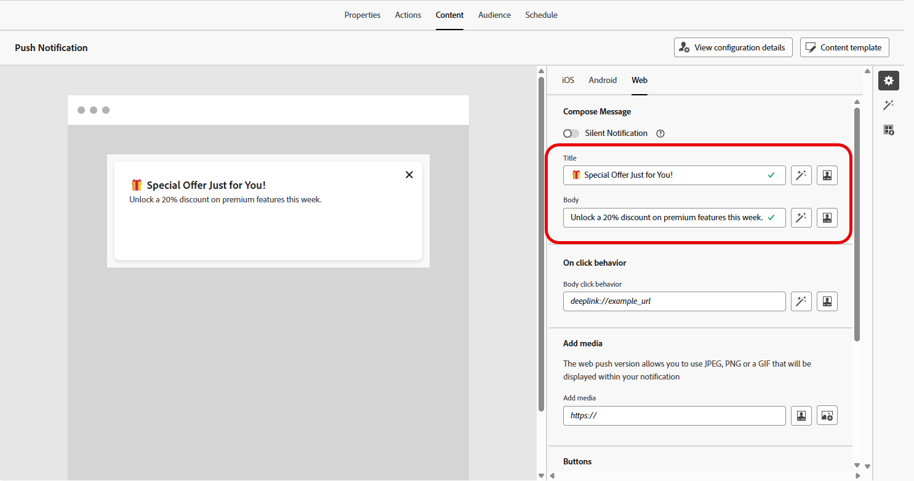

# Een pushmelding voor het web ontwerpen {#design-push-notification}

>[!AVAILABILITY]
>
>Momenteel, steunen de duw van het Web berichten in Journey Optimizer niet de **Zilzame eigenschap van het Bericht**, maar zullen in een recentere tijd beschikbaar zijn.

Nadat u uw webpushmeldingscampagne of -reis hebt gemaakt, kunt u doorgaan met het ontwerpen van de inhoud en structuur van de campagne en de site. Merk op dat alvorens om het even welk pushbericht van het Web te verzenden, het noodzakelijk is om dit kanaal binnen uw [&#x200B; configuratie van het Kanaal &#x200B;](push-configuration-web.md) eerst te vormen.

<!--
## Send a silent notification {#silent-notification}

A silent push notification (also called a background notification) is a hidden message sent to your web application without alerting the user.

To enable a silent notification, enable the **[!UICONTROL Silent Notification]** option. When this option is used, the notification is delivered directly to the application, and no alert, banner, or sound is shown to the user.

Use the **Custom Data** section to include additional information in the form of key-value pairs. 

-->

## Titel en body {#push-title-body}

Klik op de velden **[!UICONTROL Title]** en **[!UICONTROL Body]** om uw bericht samen te stellen. Gebruik de verpersoonlijkingsredacteur om inhoud te bepalen, [&#x200B; verpersoonlijken gegevens &#x200B;](../personalization/personalize.md) en [&#x200B; dynamische inhoud &#x200B;](../personalization/get-started-dynamic-content.md) toevoegen.

Klik op **[!UICONTROL Edit text with the AI assistant]** om uw inhoud eenvoudig te genereren met de Journey Optimizer AI-assistent.

## Bij klikken, gedrag {#on-click-behavior}

Gebruik het veld **[!UICONTROL Body click behavior]** om een diepe koppeling te definiëren die bepaalt wat er gebeurt wanneer een gebruiker op de berichttekst klikt. Op deze manier kunt u gebruikers rechtstreeks naar een specifieke pagina of sectie van uw webtoepassing sturen.

## Media toevoegen {#add-media-push}

Voer de media-URL in het veld **[!UICONTROL Add media]** in. U kunt ook personalisatietokens opnemen in de URL om de inhoud voor elke gebruiker aan te passen.

Klik  om media snel te produceren gebruikend de Medewerker van Journey Optimizer AI.

## Knoppen toevoegen {#add-buttons-push}

Maak uw webpushmeldingen interactief door knoppen toe te voegen aan uw inhoud.

De knoppen zijn alleen zichtbaar wanneer het apparaat is ontgrendeld. Als het scherm vergrendeld is, worden alleen de **[!UICONTROL Title]** en **[!UICONTROL Message]** weergegeven.

Gebruik de optie **[!UICONTROL Add Button]** om het label en de bijbehorende actie van elke knop te definiëren, zoals hieronder wordt beschreven:

* **[!UICONTROL Deeplink]**: Leid gebruikers om naar een specifieke weergave, sectie of tab in uw app. Voer in het bijbehorende veld de koppeling-URL in.

* **[!UICONTROL Web URL]**: Leid gebruikers om naar een externe webpagina. Voer de URL in het bijbehorende veld in.

## Aangepaste gegevens {#custom-data}

In de sectie **[!UICONTROL Custom Data]** kunt u aangepaste sleutel-waardeparen toevoegen aan de berichtlading. Deze waarden kunnen door uw webtoepassing worden gebruikt om specifieke handelingen te activeren of de gebruikerservaring aan te passen. Voor meer op hoe te opstelling duwen berichten in Adobe Experience Platform, verwijs naar [&#x200B; deze sectie &#x200B;](push-gs.md)

