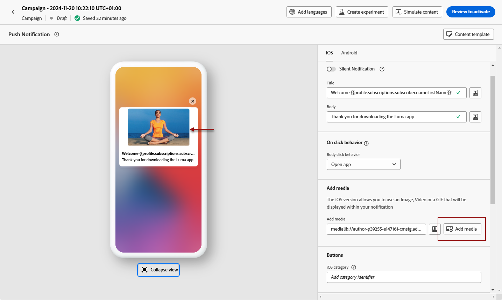

# Een pushmelding ontwerpen {#design-push-notification}

## Titel en body {#push-title-body}

>[!CONTEXTUALHELP]
>id="ajo-message-push-compose"
>title="Pas uw pushmelding aan."
>abstract="Om uw bericht samen te stellen, ga de inhoud in de **Titel** en **3} gebieden van het Lichaam in.** Als u personalisatietokens wilt opnemen, opent u het dialoogvenster voor personalisatie."

Klik op de velden **[!UICONTROL Title]** en **[!UICONTROL Body]** om uw bericht samen te stellen. Gebruik de verpersoonlijkingsredacteur om inhoud te bepalen, gegevens te personaliseren en dynamische inhoud toe te voegen. Leer meer over [ verpersoonlijking ](../personalization/personalize.md) en [ dynamische inhoud ](../personalization/get-started-dynamic-content.md) in de verpersoonlijkingsredacteur.

In de sectie met voorvertoningen van apparaten kunt u visualiseren hoe de pushmelding wordt weergegeven op iOS- en Android-apparaten.

Versnel uw inhoudsverwezenlijking met AI Medewerker en produceer dwingende tekst van het pushbericht met [ AI Medewerker voor tekstgeneratie ](../content-management/generative-text.md) of creeer volledige duw berichten met [ Medewerker AI voor volledige inhoudsgeneratie ](../content-management/generative-full-content.md).

## Bij klikken, gedrag {#on-click-behavior}

>[!CONTEXTUALHELP]
>id="ajo-message-push-onclick"
>title="Informatie over klikgedrag"
>abstract="Selecteer het gedrag wanneer een ontvanger op de hoofdtekst van het pushbericht klikt."

U kunt het gedrag selecteren wanneer een gebruiker op de hoofdtekst van het pushbericht klikt.

* Selecteer de optie **[!UICONTROL Open app]** om de app te openen. App verbonden aan het bericht wordt bepaald in de [ kanaalconfiguratie ](../configuration/channel-surfaces.md) (d.w.z. vooraf ingesteld bericht).
* Selecteer de optie **[!UICONTROL Deeplink]** als u de gebruiker wilt omleiden naar specifieke inhoud in een app.  De specifieke inhoud kan een specifieke weergave, een bepaalde sectie van een pagina of een bepaald tabblad zijn. Als de optie is geselecteerd, voert u de koppeling in het bijbehorende veld in.
* Als u de gebruiker wilt omleiden naar een externe URL, gebruikt u de optie **[!UICONTROL Web URL]** . Wanneer de optie is geselecteerd, voert u de URL in het bijbehorende veld in.

## Media toevoegen {#add-media-push}

>[!CONTEXTUALHELP]
>id="ajo-message-push-media"
>title="Media toevoegen aan uw pushmelding"
>abstract="U kunt een afbeelding, video of GIF toevoegen die in uw melding worden weergegeven."

In de iOS-versie van uw pushmelding kunt u een afbeelding, video of GIF toevoegen die in uw melding worden weergegeven.

In de Android-versie kunt u alleen een afbeeldingspictogram en een afbeelding voor uitgebreide berichten toevoegen.

Er zijn twee opties beschikbaar. U kunt:

* Selecteer een element in **[!UICONTROL Add media]** met de knop **[!DNL Adobe Experience Manager Assets]** .

  Leer hoe te om **[!DNL Adobe Experience Manager Assets]** op [ te gebruiken deze pagina ](../integrations/assets.md).

* U kunt ook de URL van het medium invoeren in het veld **[!UICONTROL Add media]** . In dat geval kunt u personalisatie toevoegen aan de URL.

Nadat de media zijn toegevoegd, worden deze rechts van de meldingsinstantie weergegeven.

## Knoppen toevoegen {#add-buttons-push}

>[!CONTEXTUALHELP]
>id="ajo-message-push-buttons"
>title="Voeg knoppen toe waarmee gebruikers kunnen communiceren met uw pushmelding."
>abstract="Voeg vanuit deze sectie call-to-action-knoppen toe aan uw bericht. Geef voor Apple iOS een identificatiecode voor de berichtencategorie op. Voor Google Android kunt u aangepaste tekst en doelen voor elke knop opnemen."

Maak een actionable melding door knoppen toe te voegen aan uw pushinhoud.

Als het apparatenscherm wordt gesloten, worden deze knopen niet getoond: slechts dan is de **Titel** en het **Bericht** van het bericht zichtbaar. Als het apparaat ontgrendeld is, zien de ontvangers de knoppen.

In de Android-versie kunt u maximaal drie knoppen toevoegen.

In de iOS-versie wordt een id voor een berichtencategorie opgegeven. Meldingscategorieën moeten vooraf worden geconfigureerd in de iOS-app, waarin de knoppen worden gedefinieerd die moeten worden weergegeven en de acties die moeten worden ondernomen. Zie de [ documentatie van Apple ](https://developer.apple.com/documentation/usernotifications/declaring_your_actionable_notification_types) voor meer details.

1. Gebruik **[!UICONTROL Add button]** om instellingen te definiëren: het label en de bijbehorende actie. De mogelijke acties zijn het zelfde als voor [ on-click gedrag ](#on-click-behavior).

1. Gebruik het pictogram **[!UICONTROL Expand view]** onder de centrale voorvertoning om een voorvertoning van uw persoonlijke knoppen weer te geven.

   

## Een stille melding verzenden {#silent-notification}

>[!CONTEXTUALHELP]
>id="ajo_message_push_silent_notification"
>title="Informatie over stille meldingen"
>abstract="Verzend berichten zonder de gebruiker te storen, worden de berichten niet getoond in het berichtcentrum of de berichtbar."

Een stille pushmelding (of een achtergrondmelding) is een verborgen instructie die aan de toepassing wordt geleverd. Deze wordt bijvoorbeeld gebruikt om uw toepassing op de hoogte te stellen van de beschikbaarheid van nieuwe inhoud of om op de achtergrond een download te starten.

Selecteer de optie **[!UICONTROL Silent Notification]** om de toepassing stil te melden: in dit geval wordt het bericht rechtstreeks naar de toepassing overgebracht. Er wordt geen waarschuwing weergegeven op het scherm van het apparaat.

Gebruik de sectie **[!UICONTROL Custom data]** om sleutelwaardeparen toe te voegen.

## Aangepaste gegevens {#custom-data}

>[!CONTEXTUALHELP]
>id="ajo-message-push-custom"
>title="Configureer aangepaste gegevens voor uw pushmelding."
>abstract="Voeg aangepaste variabelen toe aan de payload, afhankelijk van de configuratie van uw mobiele toepassing."

In de sectie **[!UICONTROL Custom data]** kunt u aangepaste variabelen toevoegen aan de payload, afhankelijk van de configuratie van uw mobiele toepassing. Voor meer op hoe te opstelling duwen berichten in Adobe Experience Platform, verwijs naar [ deze sectie ](push-gs.md)

## Geavanceerde opties {#advanced-options-push}

>[!CONTEXTUALHELP]
>id="ajo-message-push-advanced"
>title="Configureer geavanceerde opties voor uw pushmelding."
>abstract="In deze sectie kunt u de personalisatie van uw pushmelding verbeteren."

U kunt **[!UICONTROL Advanced options]** voor uw pushmelding configureren. De beschikbare parameters worden hieronder weergegeven:

| Parameter | Beschrijving |
|---------|---------|
| **[!UICONTROL Collapsible]** (iOS / Android) | Een inklapbaar bericht is een bericht dat door een nieuw bericht kan worden vervangen als het verouderd is geworden. Een veelvoorkomend gebruik van samenvouwbare berichten is berichten die worden gebruikt om een mobiele toepassing te vertellen gegevens van de server te synchroniseren. Een voorbeeld hiervan is een sport-app waarmee gebruikers de laatste score krijgen. Alleen het meest recente bericht is relevant. Aan de andere kant is elk bericht met een niet-inklapbaar bericht belangrijk voor de client-app en moet het worden bezorgd. |
| **[!UICONTROL Custom sound]** (iOS / Android) | Het geluid dat door de mobiele terminal moet worden afgespeeld wanneer het bericht wordt ontvangen. Het geluid moet in de app worden gebundeld. |
| **[!UICONTROL Badges]** (iOS / Android) | Een badge wordt gebruikt om het aantal nieuwe ongelezen meldingen direct op het applicatiepictogram te tonen.   de merkwaarde zal verdwijnen zodra de gebruiker opent of de nieuwe inhoud van de toepassing leest. Wanneer een melding op een apparaat wordt ontvangen, kan het een merkwaarde voor de verwante app vernieuwen of toevoegen.  Bijvoorbeeld, als u het aantal ongelezen artikelen van uw klanten opslaat, kunt u hefboomwerking verpersoonlijking om de unieke ongelezen waarde van de artikelbadge voor elke klant te verzenden. Voor meer verpersoonlijking, verwijs naar [ deze sectie ](../personalization/personalize.md). |
| **[!UICONTROL Notification group]** (alleen iOS) | Koppel een berichtgroep aan de pushmelding.  Beginnend met iOS 12, staan de berichtgroepen u toe om berichtdraden en berichtonderwerpen in draad IDs te consolideren. Een merk kan bijvoorbeeld marketingmeldingen verzenden onder één groep-id, terwijl meer meldingen over operationele typen onder een of meer verschillende id&#39;s worden bewaard.  om dit te illustreren, kunt u groupID hebben: 123 &quot;controleer de nieuwe lenteinzameling van sweaters&quot;en groupID: 456 &quot;uw pakket werd geleverd&quot;berichtgroepen. In dit voorbeeld worden alle leveringsmeldingen gebundeld onder groep ID: 456. |
| **[!UICONTROL Notification channel]** (alleen Android) | Koppel een berichtkanaal aan de pushmelding.  Beginnend in Android 8.0 (API niveau 26), moeten alle berichten aan een kanaal worden toegewezen om te tonen. Voor meer op dit, verwijs naar de [ de ontwikkelaarsdocumentatie van Android ](https://developer.android.com/guide/topics/ui/notifiers/notifications#ManageChannels). |
| **[!UICONTROL Add content-availability flag]** (alleen iOS) | Verstuurt de markering voor de beschikbare inhoud in de pushlading om ervoor te zorgen dat de app wordt geactiveerd zodra deze de pushmelding ontvangt. Dit betekent dat de app toegang kan krijgen tot de payload-gegevens.  Dit werkt zelfs als de app op de achtergrond wordt uitgevoerd en zonder tussenkomst van de gebruiker (bijvoorbeeld tikken op pushmelding). Dit is echter niet van toepassing als de app niet wordt uitgevoerd. Zie de [Apple Developer documentatie](https://developer.apple.com/library/content/documentation/NetworkingInternet/Conceptual/RemoteNotificationsPG/CreatingtheNotificationPayload.html) voor meer informatie hierover. |
| **[!UICONTROL Add mutable-content flag]** (alleen iOS) | Verzendt de markering voor meerbare inhoud in de pushlading en zorgt ervoor dat de inhoud van het pushbericht kan worden gewijzigd door een uitbreiding van de berichtservice die in iOS SDK is opgegeven. Zie [Apple Developer documentatie](https://developer.apple.com/library/content/documentation/NetworkingInternet/Conceptual/RemoteNotificationsPG/ModifyingNotifications.html) voor meer informatie hierover.  U kunt dan uw mobiele app-extensies gebruiken om de inhoud of presentatie van aankomende pushmeldingen die zijn verzonden vanuit [!DNL Journey Optimizer] , verder te wijzigen. Gebruikers kunnen deze optie bijvoorbeeld gebruiken om gegevens te decoderen, de tekst van de hoofdtekst of titel van een melding te wijzigen, een thread-id aan een melding toe te voegen, enzovoort. |
| **[!UICONTROL Add Push expiration]** (alleen iOS) | Kies de **Datum en de Tijd** van uw Duw vervaldatum. Op iOS wordt de vervaldatum van een melding afgedwongen als een harde stop. Dit betekent dat elk bericht dat de Apple Push Notification Service (APNS) bereikt nadat de vervaldatum is verstreken, niet wordt afgeleverd, zodat klanten nooit verouderde of irrelevante berichten ontvangen. Zie de [Apple Developer documentatie](https://developer.apple.com/documentation/usernotifications/sending-notification-requests-to-apns) voor meer informatie hierover. |
| **[!UICONTROL Notification visibility]** (alleen Android) | Hiermee definieert u de zichtbaarheid van het pushbericht.  <b> Privé </b> zal het bericht op alle lockscreens tonen, maar verborgen gevoelige of privé informatie over veilige lockscreens.  <b> Openbaar </b> zal het bericht in zijn geheel op alle lockscreens tonen.  <b> Geheim </b> zal om het even welk deel van het bericht op veilig lockscreen niet openbaren.   voor meer op dit, verwijs de [ documentatie van de ontwikkelaar van Android ](https://developer.android.com/reference/android/app/Notification). |
| **[!UICONTROL Notification priority]** (alleen Android) | Hiermee definieert u het belang van de pushmelding van Laag tot Max. Dit bepaalt hoe &quot;indringend&quot;de dupmelding zal zijn wanneer het wordt geleverd. Voor meer op dit, verwijs naar de [ de ontwikkelaarsdocumentatie van Android ](https://developer.android.com/guide/topics/ui/notifiers/notifications#importance) |
| **[!UICONTROL Delivery priority]** (alleen Android) | Hiermee stelt u een hoge of normale prioriteit in voor uw pushberichten. Zie de [Google Developer-documentatie](https://firebase.google.com/docs/cloud-messaging/concept-options#setting-the-priority-of-a-message) voor meer informatie over de prioriteit van berichten. |
| **[!UICONTROL Time to live]** (alleen Android) | Plaats het aantal seconden waarna uw bericht zal verlopen. In Android wordt verlopen beschouwd als een leveringsvenster: in Firebase Cloud Messaging (FCM) wordt de vervaltijd omgezet in een tijd-naar-live (TTL)-waarde die begint wanneer het bericht wordt ontvangen. Dit betekent dat niet-geleverde campagnes later kunnen worden verzonden dan verwacht of zelfs buiten het gewenste tijdsbestek. Voor meer op dit, verwijs de [ de ontwikkelaarsdocumentatie van Android ](https://firebase.google.com/docs/cloud-messaging/concept-options#ttl). |
