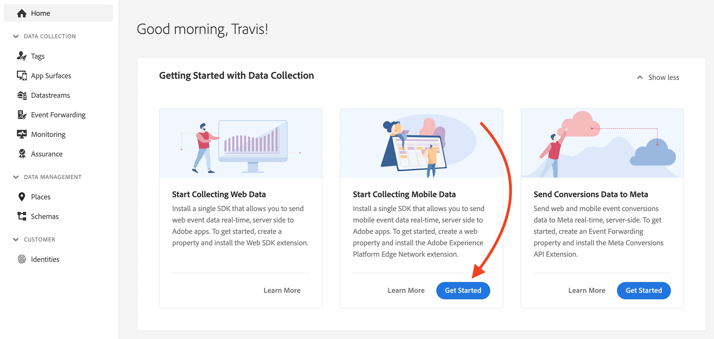

# Snelstartworkflow voor mobiele instaptoegang {#mobile-wf}

De nieuwe **Snelle start-workflow voor mobiel instapsysteem** is een nieuwe productfunctie voor het snel configureren van de Adobe Experience Platform Mobile SDK, het verzamelen en valideren van mobiele gebeurtenisgegevens en het verzenden van pushberichten met [!DNL Journey Optimizer].

Deze mogelijkheid is toegankelijk via de **[!DNL Adobe Experience Platform Data Collection]** homepage naar alle klanten als openbare bètaversie.

## Aan de slag{#gs-mobile-wf}

Deze nieuwe werkstroom automatiseert de opstelling van de Inzameling van Gegevens door het totale aantal kliks te verminderen en de mobiele configuratie voor Journey Optimizer te versnellen. Deze snelstartworkflow begeleidt u door vier eenvoudige stappen [instellen](##setup-mobile-wf), [uitvoeren](#implement-mobile-wf), [validate](#valid-mobile-wf), en [revisie](#review-mobile-wf) uw mobiele configuratie.

Als u toegang wilt tot de nieuwe workflow voor snel aan boord gaan van mobiele apparaten, bladert u naar **[!DNL Data Collection]** van de oplossingsschakelaar. Selecteer vervolgens de **[!DNL Start Collecting Mobile Data]** op de homepage.

Hieronder vindt u een aantal aanvullende kenmerken:

* Eenvoudige workflow in vier stappen en gebruikersinterface.
* Biedt een basisconfiguratie voor het verzamelen van mobiele gebeurtenisgegevens via de [Adobe Experience Platform Mobile SDK](https://developer.adobe.com/client-sdks/documentation/){target="_blank"} in minuten.
* Mogelijkheid om een eenvoudige mobiele pushgebeurtenis te testen en te valideren met behulp van [Adobe Experience Platform Assurance](https://experienceleague.adobe.com/docs/experience-platform/assurance/home.html){target="_blank"}.
* Auto leidt tot en vormt alle noodzakelijke Inzameling van Gegevens, en de activa van Journey Optimizer.
* In productbegeleiding en tooltips.
* Verstrekt een natuurlijke overgang voor geavanceerdere implementatie indien nodig.

## Instellen {#setup-mobile-wf}

In de eerste stap van deze workflow worden automatisch alle benodigde gegevensverzamelingen en Journey Optimizer-elementen gemaakt en geconfigureerd, zoals Mobile Properties, Mobile Extensions, Journey Optimizer Extension, Rules, Data Elements, enzovoort.

Nadat u de voorwaarden en bepalingen voor bèta hebt geaccepteerd, voert u de naam van uw mobiele app in en klikt u op **[!DNL Next]**.

Geef informatie op voor iOS- en Android-platforms, zoals de toepassings-id en verificatietoetsen of het sleutelbestand.

## Implementeren{#implement-mobile-wf}

De volgende stap bevat stapsgewijze instructies voor het installeren van de code op uw mobiele app.

## Valideren{#valid-mobile-wf}

De implementatie controleren en controleren om deze te valideren. U kunt een testpushmelding verzenden.

## Controleren {#review-mobile-wf}

De automatische opstelling wordt gedaan. U kunt nu naar de eigenschap mobile van uw tag gaan, uw regels of gegevenselement configureren en pushmeldingen verzenden met Adobe Journey Optimizer.

**Verwante onderwerpen**

* [Aan de slag met pushmeldingen](get-started-push.md)
* [Gegevensstroom van pushmeldingen en componenten](push-gs.md)
* [Het pushkanaal configureren](push-configuration.md)
* [Pushmeldingenrapport](../reports/journey-global-report.md#push-global)
* [Een pushmelding maken](create-push.md)
