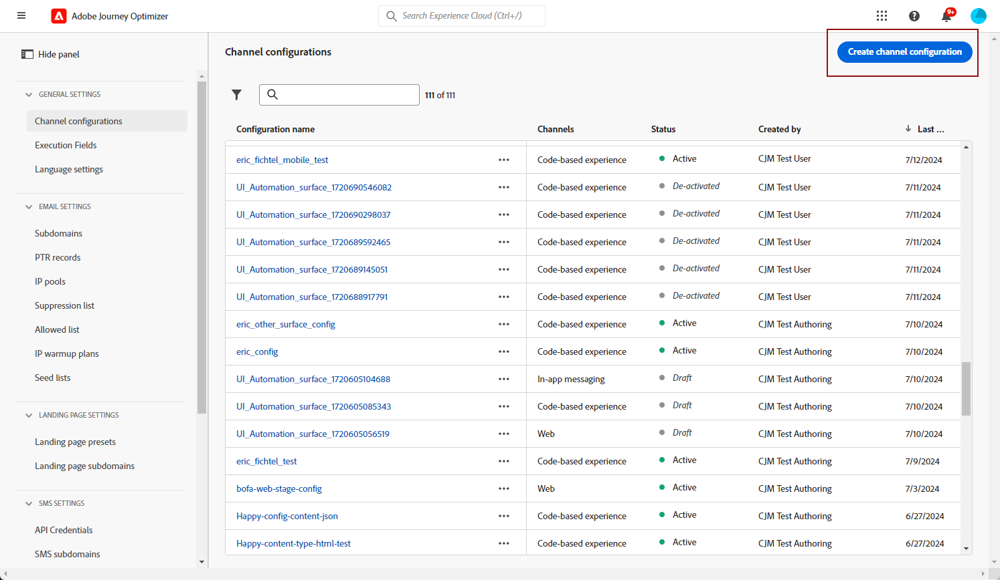

# Pushmeldingskanaal voor mobiele apps configureren {#push-notification-configuration}

Met [!DNL Journey Optimizer] kunt u uw reizen maken en berichten verzenden naar een doelgroep. Voordat u pushmeldingen met [!DNL Journey Optimizer] gaat verzenden, moet u ervoor zorgen dat er configuraties en integratie zijn in de mobiele app en voor tags in Adobe Experience Platform. Om de de gegevensstroom van de Berichten van de Duw in [!DNL Adobe Journey Optimizer] te begrijpen gelieve te verwijzen naar [ deze pagina ](push-gs.md).

>[!AVAILABILITY]
>
>Het nieuwe **Mobiele onboarding snelle beginwerkschema** is nu beschikbaar. Met deze nieuwe productfunctie kunt u de Mobile SDK snel configureren om gegevens van mobiele gebeurtenissen te verzamelen en te valideren en om mobiele pushberichten te verzenden. Dit vermogen is toegankelijk via de homepage van de Inzameling van Gegevens als openbare bèta. [Meer informatie](mobile-onboarding-wf.md)
>

## Voordat u begint {#start-push}

### Machtigingen instellen {#setup-permissions}

Voordat u een mobiele toepassing maakt, moet u er eerst voor zorgen dat u over de juiste gebruikersmachtigingen voor tags in Adobe Experience Platform beschikt of deze toewijst. Leer meer in [ documentatie van Markeringen ](https://experienceleague.adobe.com/docs/experience-platform/tags/admin/user-permissions.html){target="_blank"}.

>[!CAUTION]
>
>De duimconfiguratie moet door een deskundige gebruiker worden uitgevoerd. Afhankelijk van uw implementatiemodel en persona&#39;s betrokken bij deze implementatie, zou u de volledige reeks toestemmingen aan één enkel productprofiel kunnen moeten toewijzen of toestemmingen tussen de app ontwikkelaar en **Adobe Journey Optimizer** beheerder delen. Leer meer over **toestemmingen van Markeringen** in [ deze documentatie ](https://experienceleague.adobe.com/docs/experience-platform/tags/admin/user-permissions.html){target="_blank"}.

<!--ou need to your have access to perform following roles :

* Manage Datastreams
* Manage Client-side Properties
* Manage App Configurations
-->

Om **Bezit** en **bedrijf** rechten toe te wijzen, volg hieronder de stappen:

1. Open de lus **[!DNL Admin Console]** .

1. Selecteer op het tabblad **[!UICONTROL Products]** de **[!UICONTROL Adobe Experience Platform Data Collection]** -kaart.

   

1. Selecteer een bestaande **[!UICONTROL Product Profile]** of maak een nieuwe **[!UICONTROL New profile]** met de knop. Leer hoe te om een nieuw **[!UICONTROL New profile]** in de [ Admin consoledocumentatie ](https://experienceleague.adobe.com/docs/experience-platform/access-control/ui/create-profile.html#ui){target="_blank"} tot stand te brengen.

1. Selecteer op het tabblad **[!UICONTROL Permissions]** de optie **[!UICONTROL Property rights]**.

   

1. Klik op **[!UICONTROL Add all]**. Hiermee voegt u het volgende recht toe aan uw productprofiel:
   * **[!UICONTROL Approve]**
   * **[!UICONTROL Develop]**
   * **[!UICONTROL Manage Environments]**
   * **[!UICONTROL Manage Extensions]**
   * **[!UICONTROL Publish]**

   Deze machtigingen zijn vereist voor het installeren en publiceren van de Adobe Journey Optimizer-extensie en het publiceren van de app-eigenschap in Adobe Experience Platform Mobile SDK.

1. Selecteer vervolgens **[!UICONTROL Company rights]** in het linkermenu.

   

1. Voeg de volgende rechten toe:

   * **[!UICONTROL Manage App Configurations]**
   * **[!UICONTROL Manage Properties]**

   Deze toestemmingen worden vereist voor de mobiele toepassingsontwikkelaar aan opstellings dupgeloofsbrieven in **de Inzameling van Gegevens van Adobe Experience Platform** en bepalen de het kanaalconfiguraties van het Duwbericht (d.w.z. berichtvoorinstellingen) in **Adobe Journey Optimizer**.

   

1. Klik op **[!UICONTROL Save]**.

Volg onderstaande stappen om deze **[!UICONTROL Product profile]** aan gebruikers toe te wijzen:

1. Open de lus **[!DNL Admin Console]** .

1. Selecteer op het tabblad **[!UICONTROL Products]** de **[!UICONTROL Adobe Experience Platform Data Collection]** -kaart.

1. Selecteer de eerder geconfigureerde **[!UICONTROL Product profile]**.

1. Klik op het tabblad **[!UICONTROL Users]** op **[!UICONTROL Add user]**.

   

1. Typ de naam of het e-mailadres van uw gebruiker en selecteer de gebruiker. Klik vervolgens op **[!UICONTROL Save]** .

   >[!NOTE]
   >
   >Als de gebruiker niet eerder in de console Admin werd gecreeerd, verwijs naar [ gebruikersdocumentatie ](https://helpx.adobe.com/enterprise/admin-guide.html/enterprise/using/manage-users-individually.ug.html#add-users) toevoegen.

   


### Controleer uw gegevenssets {#push-datasets}

De volgende schema&#39;s en datasets zijn beschikbaar met het kanaal van de dupmelding:

| Schema <br> Dataset | Groep velden | Bewerking |
| -------------------------------------------------------------------------------------- | --------------------------------------------------------------------------------------------------------------------------------------------------------------------------------------- | -------------------------------------------------------- |
| CJM het Schema van het Profiel van de Duw <br> Dataset van het Profiel van CJM | De Details van het Push- Bericht <br> Adobe CJM ExperienceEvent - de Details van het Profiel van het Bericht <br> Adobe CJM ExperienceEvent - de Details van de Uitvoering van het Bericht <br> de Details van de Toepassing <br> Milieu Details | Push Token registreren |
| CJM het Schema van de Gebeurtenis van de Ervaring van het Push Volgen CJM <br> CJM de Dataset van de Gebeurtenis van de Draagervaring | Push Notification Tracking | Interacties bijhouden en gegevens verstrekken voor de rapportageinterface |


>[!NOTE]
>
>Wanneer gebeurtenissen voor het bijhouden van push-gegevens worden opgenomen in de CJM-gegevensset voor het bijhouden van push-ervaringen, kunnen er fouten optreden, ook al worden gegevens gedeeltelijk met succes opgenomen. Dit kan voorkomen als sommige gebieden in uw afbeelding niet in inkomende gebeurtenissen bestaan: het systeem registreert waarschuwingen maar verhindert niet inname van geldige gedeelten van de gegevens. Deze waarschuwingen worden in batch-status weergegeven als &#39;mislukt&#39;, maar geven gedeeltelijk succes bij inname aan.
>
>Om de volledige lijst van gebieden en attributen voor elk schema te bekijken, raadpleeg het [ het schemawoordenboek van Journey Optimizer ](https://experienceleague.adobe.com/tools/ajo-schemas/schema-dictionary.html){target="_blank"}.


### Uw app configureren {#configure-app}

De technische opstelling impliceert nauwe samenwerking tussen de toepassingsontwikkelaar en bedrijfsbeheerder. Voordat u begint met het verzenden van pushberichten met [!DNL Journey Optimizer] , moet u pushreferenties maken, een Push channel-configuratie in Adobe Journey Optimizer maken en uw mobiele app integreren met Adobe Experience Platform Mobile SDK&#39;s.

Voer de implementatiestappen uit die in de onderstaande koppelingen worden beschreven:

* Voor **Apple iOS**: Leer hoe te om uw app met APNs in [ Documentatie van Apple ](https://developer.apple.com/documentation/usernotifications/registering_your_app_with_apns){target="_blank"} te registreren
* Voor **Google Android**: Leer hoe te opstelling een de cliëntapp van het Overseinen van de Wolk van de Wolk van de Vuurbasis op Android in [ Documentatie van Google ](https://firebase.google.com/docs/cloud-messaging/android/client){target="_blank"}

### Uw mobiele app integreren met Adobe Experience Platform SDK {#integrate-mobile-app}

Adobe Experience Platform Mobile SDK biedt client-side integratie-API&#39;s voor uw mobiele apparaten via met Android en iOS compatibele SDK&#39;s. Volg [ de Mobiele documentatie van SDK van Adobe Experience Platform Mobile ](https://developer.adobe.com/client-sdks/documentation/getting-started/){target="_blank"} om opstelling met Adobe Experience Platform Mobile SDKs in uw app te krijgen.

Tegen het einde van deze procedure moet u ook een eigenschap mobile in [!DNL Adobe Experience Platform Data Collection] hebben gemaakt en geconfigureerd. Doorgaans maakt u een eigenschap voor mobiele apparaten voor elke mobiele toepassing die u wilt beheren. Leer hoe te om een mobiel bezit in [ Adobe Experience Platform Mobiele documentatie van SDK ](https://developer.adobe.com/client-sdks/documentation/getting-started/create-a-mobile-property/){target="_blank"} tot stand te brengen en te vormen.

<!--To enable **Web push notifications**, ensure that the [pushNotifications property](https://experienceleague.adobe.com/en/docs/experience-platform/web-sdk/commands/configure/pushnotifications) is properly configured within the Web SDK. Then, use [the sendPushSubscription command](https://experienceleague.adobe.com/en/docs/experience-platform/web-sdk/commands/sendpushsubscription) to register push subscriptions with Adobe Experience Platform.
-->

## Stap 1: Voeg uw pushreferenties voor de app toe in Journey Optimizer {#push-credentials-launch}

Nadat u de juiste gebruikersmachtigingen hebt verleend, moet u nu uw pushgegevens voor mobiele toepassingen toevoegen in Journey Optimizer.

De registratie van de pushreferenties voor de mobiele app is vereist om Adobe te machtigen pushberichten namens u te verzenden. Raadpleeg de onderstaande stappen:

1. Open het menu **[!UICONTROL Channels]** > **[!UICONTROL Push settings]** > **[!UICONTROL Push credentials]**.

1. Klik op **[!UICONTROL Create push credential]**.

1. Selecteer in de vervolgkeuzelijst **[!UICONTROL Platform]** het besturingssysteem:

   * **voor iOS**

     

      1. Voer de mobiele app **[!UICONTROL App ID]** in.

      1. Schakel de optie **[!UICONTROL Apply to all sandboxes]** in om deze pushgegevens beschikbaar te maken voor alle sandboxen. Als een specifieke zandbak zijn eigen geloofsbrieven voor het zelfde Platform en toepassings identiteitskaart paar heeft, zullen die zandbakspecifieke geloofsbrieven belangrijkheid nemen.

      1. Schakel de knop **[!UICONTROL Manually enter push Credentials]** in om uw referenties toe te voegen.

      1. Sleep het .p8 Apple Push Notification Authentication Key-bestand naar het bestand. Deze sleutel kan van de **Certificaten** worden verkregen, **herkenningstekens** en **Profielen** pagina.

         >[!NOTE]
         >
         > Alleen .p8 Apple Push Notification-toetsen worden ondersteund. Gebruik een ander Apple Developer-account als u de .p8-sleutellimiet hebt bereikt.
         >Voor meer informatie over de belangrijkste grenzen van Apple, verwijs naar [ Documentatie van de Ontwikkelaar van Apple ](https://developer.apple.com/documentation/usernotifications/registering_your_app_with_apns).


      1. Verstrek **Zeer belangrijke identiteitskaart**. Dit is een tekenreeks van 10 tekens die wordt toegewezen tijdens het maken van de p8-auttoets. Het kan onder **Sleutels** lusje in **Certificaten**, **Herkenningstekens** en **pagina van Profielen** worden gevonden.

      1. Verstrek **identiteitskaart van het Team**. Dit is een tekenreekswaarde die u vindt op het tabblad Lidmaatschap.

   * **voor Android**

     

      1. Geef de **[!UICONTROL App ID]** op. De pakketnaam is doorgaans de toepassings-id in het `build.gradle` -bestand.

      1. Schakel de optie **[!UICONTROL Apply to all sandboxes]** in om deze pushgegevens beschikbaar te maken voor alle sandboxen. Als een specifieke zandbak zijn eigen geloofsbrieven voor het zelfde Platform en toepassings identiteitskaart paar heeft, zullen die zandbakspecifieke geloofsbrieven belangrijkheid nemen.

      1. Schakel de knop **[!UICONTROL Manually enter push credentials]** in om uw referenties toe te voegen.

      1. Sleep de FCM-pushgegevens en zet deze neer. Voor meer details op hoe te om de dupgeloofsbrieven te krijgen verwijs naar [ Documentatie van Google ](https://firebase.google.com/docs/admin/setup#initialize-sdk){target="_blank"}.

<!--
    * **For Web**

        

        1. Provide the **[!UICONTROL App ID]**.

        1. Enter your **[!UICONTROL VAPID public key]** and **[!UICONTROL private key]**.
-->

1. Klik op **[!UICONTROL Submit]** om uw toepassingsconfiguratie te maken.

<!--
## Step 2: Set up a mobile property in Adobe Experience Platform Launch {#launch-property}

Setting up a mobile property allows the mobile app developer or marketer to configure the mobile SDKs attributes such as Session Timeouts, the [!DNL Adobe Experience Platform] sandbox to be targeted and the **[!UICONTROL Adobe Experience Platform Datasets]** to be used for mobile SDK to send data to.

For further details and procedures on how to set up a **[!UICONTROL Platform Launch property]**, refer to the steps detailed in [Adobe Experience Platform Mobile SDK documentation](https://aep-sdks.gitbook.io/docs/getting-started/create-a-mobile-property#create-a-mobile-property).


To get the SDKs needed for push notification to work you will need the following SDK extensions, for both Android and iOS:

* **[!UICONTROL Mobile Core]** (installed automatically)
* **[!UICONTROL Profile]** (installed automatically)
* **[!UICONTROL Adobe Experience Platform Edge]**
* **[!UICONTROL Adobe Experience Platform Assurance]**, optional but recommended to debug the mobile implementation.

Learn more about [!DNL Adobe Experience Platform Launch] extensions in [Adobe Experience Platform Launch documentation](https://experienceleague.adobe.com/docs/launch-learn/implementing-in-mobile-android-apps-with-launch/configure-launch/launch-add-extensions.html).
-->

## Stap 2: Creeer een kanaalconfiguratie voor duw{#message-preset}

Wanneer u uw pushreferenties hebt gemaakt, moet u een configuratie maken om pushmeldingen te kunnen verzenden vanuit **[!DNL Journey Optimizer]** .

1. Open het menu **[!UICONTROL Channels]** > **[!UICONTROL General settings]** > **[!UICONTROL Channel configurations]** en klik op **[!UICONTROL Create channel configuration]** .

   

1. Voer een naam en beschrijving (optioneel) voor de configuratie in.

   >[!NOTE]
   >
   > Namen moeten beginnen met een letter (A-Z). Het mag alleen alfanumerieke tekens bevatten. U kunt ook onderstrepingsteken `_` -, punt `.` - en afbreekstreepjes `-` gebruiken.


1. Als u aangepaste of basislabels voor gegevensgebruik aan de configuratie wilt toewijzen, kunt u **[!UICONTROL Manage access]** selecteren. [ leer meer over de Controle van de Toegang van het Niveau van Objecten (OLAC) ](../administration/object-based-access.md).

1. Selecteer **kanaal van de Duw**.

   

1. Selecteer **[!UICONTROL Marketing action]**(s) om het toestemmingsbeleid aan de berichten te associëren gebruikend deze configuratie. Alle toestemmingsbeleid verbonden aan de marketing actie wordt gebruikt om de voorkeur van uw klanten te respecteren. [Meer informatie](../action/consent.md#surface-marketing-actions)

1. Kies uw **[!UICONTROL Platform]**: Android en/of iOS <!--and/or Web--> .

1. Selecteer het zelfde **[!UICONTROL App id]** zoals voor uw [ hierboven gevormde dupreferentie ](#push-credentials-launch).

1. Sla uw wijzigingen op.

U kunt nu uw configuratie selecteren wanneer u pushmeldingen maakt.

## Stap 3: Adobe Journey Optimizer-extensie configureren in uw mobiele eigenschap {#configure-journey-optimizer-extension}

De **uitbreiding van Adobe Journey Optimizer** voor de bevoegdheden van Adobe Experience Platform Mobile SDKs duwt berichten voor uw mobiele apps en helpt u gebruikersdrukknoppennen verzamelen en interactiemeting met de diensten van Adobe Experience Platform beheert.

Leer hoe te opstellingsJourney Optimizer uitbreiding in [ de Mobiele documentatie van SDK van Adobe Experience Platform ](https://developer.adobe.com/client-sdks/documentation/adobe-journey-optimizer/){target="_blank"}.


<!-- 
**[!UICONTROL Edge configuration]** is used by **[!UICONTROL Edge]** extension to send custom data from mobile device to [!DNL Adobe Experience Platform]. 
To configure [!DNL Adobe Experience Platform], you must provide the **[!UICONTROL Sandbox]** name and **[!UICONTROL Event Dataset]**.

1. From [!DNL Adobe Experience Platform Launch], select the **[!UICONTROL Edge Configurations]** tab and click **[!UICONTROL Edge Configurations]**.
    
1. Select **[!UICONTROL New Edge Configuration]** to add a new **[!UICONTROL Edge Configuration]**.
1. Enter a **[!UICONTROL Name]** and click **[!UICONTROL Save]**

1. Click the **[!UICONTROL Adobe Experience Platform]** toggle to enable it.

1. Fill in the **[!UICONTROL Sandbox]**, **[!UICONTROL Event dataset]** and **[!UICONTROL Profile Dataset]** fields. Then, click **[!UICONTROL Save]**.
    
    


1. From [!DNL Adobe Experience Platform Launch], ensure that **[!UICONTROL Client Side]** is selected in the drop-down menu.

1. select the **[!UICONTROL Properties]** tab and click **[!UICONTROL New Property]**.

    

1. Enter a **[!UICONTROL Name]** for your new property.

1. Select **[!UICONTROL Mobile]** as **[!UICONTROL Platform]**.

    

1. Click **[!UICONTROL Save]** to create your new property.

To configure **[!UICONTROL Adobe Experience Platform Edge Extension]** to send custom data from mobile devices to [!DNL Adobe Experience Platform].

1. Select your previously created property and select the **[!UICONTROL Extensions]** tab to view the extensions for this property.

    

1. Click **[!UICONTROL Configure]** under the **[!UICONTROL Adobe Experience Platform Edge]** Network' extension.

1. From the **[!UICONTROL Edge Configuration]** drop-down list, select the **[!UICONTROL Edge Configuration]** created in the previous steps. For more information on **[!UICONTROL Edge Configuration]**, refer to this [section](#edge-configuration).

1. Click **[!UICONTROL Save]**.

To configure **[!UICONTROL Adobe Experience Platform Messaging]** extension to send push profile and push interactions to the correct datasets, follow the same steps as above. Use **[!UICONTROL Sandbox]**, **[!UICONTROL Event dataset]** and **[!UICONTROL Profile Dataset]** created in the [Adobe Experience Platform setup](#edge-configuration).
-->

<!--
## Step 4: Publish the Property {#publish-property}

You now need to publish the property to integrate your configuration and to use it in the mobile app. 

To publish your property, refer to the steps detailed in [Adobe Experience Platform Mobile SDK documentation](https://aep-sdks.gitbook.io/docs/getting-started/create-a-mobile-property#publish-the-configuration)

## Step 5: Configure the ProfileDataSource {#configure-profiledatasource}

To configure the `ProfileDataSource`, use the `ProfileDCInletURL` from [!DNL Adobe Experience Platform] setup and add the following in the mobile app:

```
    MobileCore.updateConfiguration(
    mutableMapOf("messaging.dccs" to <ProfileDCSInletURL>)
```

-->

## Stap 4: Test uw mobiele app met een gebeurtenis {#mobile-app-test}

Nadat u de mobiele app hebt geconfigureerd in zowel Adobe Experience Platform als [!DNL Adobe Experience Platform Data Collection] , kunt u deze nu testen voordat u pushberichten naar uw profielen verzendt. In dit geval maken we een reis om onze mobiele app als doel in te stellen en een gebeurtenis in te stellen die de pushmelding activeert.

<!--
You can use a test mobile app for this use case. For more on this, refer to this [page](https://wiki.corp.adobe.com/pages/viewpage.action?spaceKey=CJM&title=Details+of+setting+the+mobile+test+app) (internal use only).
-->

Voor deze reis aan het werk, moet u een schema tot stand brengen XDM. Voor meer informatie, verwijs naar [ XDM documentatie ](https://experienceleague.adobe.com/docs/experience-platform/xdm/schema/composition.html#schemas-and-data-ingestion){target="_blank"}.

1. Klik in de menusectie GEGEVENSBEHEER op **[!UICONTROL Schemas]** .
   
1. Klik **[!UICONTROL Create schema]**, in het hoogste recht, selecteer **[!UICONTROL Experience Event]** en klik **daarna**.
   
1. Ga een naam en een beschrijving voor uw schema in en klik **Afwerking**.
   
1. In de **sectie van de Groepen van het Gebied**, op de linkerzijde, voegt de klik **** toe en selecteert **[!UICONTROL Create a new field group]**.

1. Voer een **[!UICONTROL Display Name]** en een **[!UICONTROL Description]** in. Klik op **[!UICONTROL Add field groups]** wanneer u gereed bent. Voor meer informatie over hoe te om gebiedsgroepen tot stand te brengen, verwijs naar [ documentatie van het Systeem XDM ](https://experienceleague.adobe.com/docs/experience-platform/xdm/tutorials/create-schema-ui.html){target="_blank"}.


   

1. Selecteer het schema aan de linkerkant. Schakel dit schema voor **[!UICONTROL Profile]** in het rechterdeelvenster in.

   


1. Selecteer links in het venster de veldgroep en klik op het pictogram + om een nieuw veld te maken. Typ in **[!UICONTROL Field groups properties]** aan de rechterkant een **[!UICONTROL Field name]** , **[!UICONTROL Display name]** en selecteer **[!UICONTROL String]** as **[!UICONTROL Type]** .

   

1. Controleer **[!UICONTROL Required]** en klik op **[!UICONTROL Apply]** .

1. Klik op **[!UICONTROL Save]**. Uw schema is nu gemaakt en kan in een gebeurtenis worden gebruikt.

Vervolgens moet u een gebeurtenis instellen.

1. Selecteer **[!UICONTROL Configurations]** in het linkermenu van de startpagina onder BEHEER. Klik op **[!UICONTROL Manage]** in de sectie **[!UICONTROL Events]** om een nieuwe gebeurtenis te maken.

1. Klik op **[!UICONTROL Create Event]** en het deelvenster voor gebeurtenisconfiguratie wordt aan de rechterkant van het scherm geopend.

   

1. Voer de naam van de gebeurtenis in. U kunt ook een beschrijving toevoegen.

1. Selecteer in het veld **[!UICONTROL Event ID type]** de optie **[!UICONTROL Rule Based]**.

1. Selecteer in **[!UICONTROL Parameters]** het eerder gemaakte schema.

   

1. Controleer in de lijst met velden of het veld dat in de schemaveldgroep is gemaakt, is geselecteerd.

   

1. Klik op **[!UICONTROL Edit]** in het veld **[!UICONTROL Event ID condition]** . Sleep het veld dat u eerder hebt toegevoegd om de voorwaarde te definiëren die door het systeem wordt gebruikt om de gebeurtenissen te identificeren die de reis activeren.

   

1. Type in de syntaxis die u zult moeten gebruiken om uw dupbericht in uw test te teweegbrengen app, in dit voorbeeld **ordesbevestiging**.

   

1. Selecteer **[!UICONTROL ECID]** als uw **[!UICONTROL Namespace]** .

1. Klik op **[!UICONTROL Ok]** en vervolgens op **[!UICONTROL Save]**.

Uw gebeurtenis wordt nu gemaakt en kan nu op een reis worden gebruikt.

1. Klik in het linkermenu op **[!UICONTROL Journeys]** .

1. Klik op **[!UICONTROL Create Journey]** om een nieuwe rit te maken.

1. Bewerk de eigenschappen van de journey in het configuratievenster dat aan de rechterkant wordt weergegeven. Leer meer in deze [ sectie ](../building-journeys/journey-properties.md).

1. Begin door de gebeurtenis te slepen die in de vorige stappen van de vervolgkeuzelijst **[!UICONTROL Events]** is gemaakt.

   

1. Sleep vanuit de vervolgkeuzelijst **[!UICONTROL Actions]** een **[!UICONTROL Push]** -activiteit naar de gewenste locatie.

1. Configureer de pushmelding. Voor meer informatie over hoe te om dupberichten tot stand te brengen, verwijs naar deze [ pagina ](create-push.md).

1. Klik op de schakeloptie **[!UICONTROL Test]** om uw pushberichten te testen en klik op **[!UICONTROL Trigger an event]** .

   

1. Ga uw ECID op het **[!UICONTROL Key]** gebied in dan type in **orde bevestiging** op het tweede gebied.

   

1. Klik op **[!UICONTROL Send]**.

Uw gebeurtenis wordt geactiveerd en u ontvangt uw pushmelding voor uw mobiele app.

