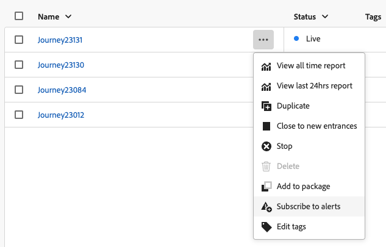

# Toegang tot en abonnement op systeemwaarschuwingen {#alerts}

Wanneer het bouwen van uw reizen en campagnes, gebruik de **Alarm** knoop om fouten te controleren en op te lossen alvorens hen uit te voeren of te publiceren.

* Leer hoe te om uw reizen op [ problemen op te lossen deze pagina ](../building-journeys/troubleshooting.md)

* Leer om uw campagnes te herzien en te activeren: [ campagnes van de Actie ](../campaigns/review-activate-campaign.md) | [ API-teweeggebrachte campagnes ](../campaigns/review-activate-api-triggered-campaign.md) | [ Geordende campagnes ](../orchestrated/start-monitor-campaigns.md)

Wanneer een bepaalde set voorwaarden is bereikt, kunnen bovendien waarschuwingsberichten worden verzonden naar alle gebruikers in uw organisatie die zich op hen hebben geabonneerd. Deze waarschuwingen zijn beschikbaar via het toegewezen **[!UICONTROL Alerts]** -menu. Adobe Experience Platform biedt verschillende vooraf gedefinieerde waarschuwingsregels die u voor uw organisatie kunt inschakelen. Bovendien kunt u zich abonneren op [!DNL Adobe Journey Optimizer] specifieke systeemwaarschuwingen zoals deze op deze pagina worden beschreven.

>[!NOTE]
>
>Leer meer over alarm in Adobe Experience Platform in [ documentatie van Adobe Experience Platform ](https://experienceleague.adobe.com/docs/experience-platform/observability/alerts/overview.html){target="_blank"}.

Klik in het linkermenu onder **[!UICONTROL Administration]** op **[!UICONTROL Alerts]** . Verscheidene pre-gevormde alarm voor Journey Optimizer zijn beschikbaar in **doorbladert** tabel.

{width=50%}

* Signaleringen die specifiek zijn voor reizen:

   * [ Gelezen de Trekker van de Publiek Onsuccesvol ](#alert-read-audiences) alarm
   * het [ Vertrokken Tarief van de Fout van de Actie van de Douane van de Douane van de Douane (vervangt het vorige Fout van de Actie van de Reis)](#alert-custom-action-error-rate)
   * Het [ Profiel verwerpt Tarief overschreden ](#alert-discard-rate) alarm
   * het [ Tarief van de Fout van het Profiel overtroffen ](#alert-profile-error-rate) alarm
   * het [ Gepubliceerde Dagboek ](#alert-journey-published) alarm
   * het [ Reis voltooide ](#alert-journey-finished) alarm
   * het [ Gegraveerde 1} alarm van de Actie van de Douane Beheerd van de Actie](#alert-custom-action-capping)

* Waarschuwingen specifiek voor kanaalconfiguratie:

   * het [ DNS van het Domein van AJO- verslag missen ](#alert-dns-record-missing) alarm
   * de [ mislukking van de het kanaalconfiguratie van AJO ](#alert-channel-config-failure) alarm
     <!--* the [AJO domain certificates renewal unsuccessful](#alert-certificates-renewal) alert-->

## Abonneren op waarschuwingen {#subscribe-alerts}

Als een onverwacht gedrag optreedt en/of een bepaalde set voorwaarden in uw bewerkingen is bereikt (zoals een mogelijk probleem wanneer het systeem een drempelwaarde overschrijdt), worden waarschuwingsmeldingen verzonden naar gebruikers in uw organisatie die zich op deze gebruikers hebben geabonneerd.

U kunt aan elk alarm individueel van het gebruikersinterface intekenen, of globaal van het **[!UICONTROL Alerts]** menu (zie [ Globale abonnement ](#global-subscription)), of eenheidsabonnement voor een specifieke reis (zie [ Eenheids abonnement ](#unitary-subscription)).

Op basis van de voorkeuren van de abonnee worden waarschuwingen verzonden via e-mail en/of rechtstreeks in het Journey Optimizer-meldingscentrum in de rechterbovenhoek van de gebruikersinterface (in-app-meldingen). Selecteer in de sectie [!DNL Adobe Experience Cloud] **[!UICONTROL Preferences]** hoe u deze waarschuwingen wilt ontvangen. [Meer informatie](../start/user-interface.md#in-product-alerts)

Wanneer een alarm wordt opgelost, ontvangen de abonnees een &quot;Opgelost&quot;bericht. Waarschuwingen worden na 1 uur opgelost om te beschermen tegen het in- en uitschakelen van waarden.

### Globaal abonnement {#global-subscription}

Voer de volgende stappen uit als u zich wilt abonneren op een waarschuwing voor alle reizen en campagnes:

1. Blader in het linkermenu naar het dashboard van **[!UICONTROL Alerts]** en selecteer de optie **[!UICONTROL Subscribe]** voor de waarschuwing waarop u zich wilt abonneren.

   {width=80%}

   >[!NOTE]
   >
   >Abonnement is alleen van toepassing op een specifieke sandbox. U moet zich voor elke sandbox afzonderlijk abonneren op waarschuwingen.

1. Gebruik dezelfde methode voor **[!UICONTROL Unsubscribe]** .

U kunt ook via [ I/O de berichten van de Gebeurtenis ](https://experienceleague.adobe.com/docs/experience-platform/observability/alerts/subscribe.html){target="_blank"} intekenen. Waarschuwingsregels zijn ingedeeld in verschillende abonnementspakketten. De abonnementen van de gebeurtenis die aan het specifieke alarm van Journey Optimizer beantwoorden zijn gedetailleerd [ hieronder ](#journey-alerts).

### Unitair abonnement {#unitary-subscription}

Voer de volgende stappen uit als u zich wilt abonneren op een waarschuwing voor een specifieke reis of een abonnement wilt opzeggen:

1. Blader naar de reisinventaris en selecteer de optie **[!UICONTROL Subscribe to alerts]** voor een specifieke reis.

   {width=75%}

1. Kies de waarschuwing(en). Het volgende alarm is beschikbaar: [ het Tarief van de Weigering van het Profiel dat ](#alert-discard-rate) wordt overschreden, [ het Tarief van de Fout van de Actie van de Douane overschreden ](#alert-custom-action-error-rate), [ het Tarief van de Fout van het Profiel dat ](#alert-profile-error-rate), [ Gepubliceerde Weg ](#alert-journey-published), [ Afgewerkte Weg ](#alert-journey-finished), en [ Gecteerde die} Actie van de Actie van de Afbeelding in werking van de Aangepast.](#alert-custom-action-capping)

1. Als u het abonnement op een waarschuwing wilt opzeggen, heft u de selectie van de waarschuwing op in hetzelfde scherm.

1. Klik op **[!UICONTROL Save]** om te bevestigen.

<!--To enable email alerting, refer to [Adobe Experience Platform documentation](https://experienceleague.adobe.com/docs/experience-platform/observability/alerts/ui.html#enable-email-alerts){target="_blank"}.-->

## Reiswaarschuwingen {#journey-alerts}

Alle reisberichten die beschikbaar zijn in de gebruikersinterface worden hieronder vermeld.

>[!CAUTION]
>
>Het specifieke alarm van Adobe Journey Optimizer is slechts op **levende** reizen van toepassing. Er worden geen waarschuwingen gegeven voor reizen in testmodus.

### Trigger voor publiek lezen is mislukt {#alert-read-audiences}

Dit alarm waarschuwt u als de a **Gelezen activiteit van het publiek** geen profiel 10 min na geplande tijd van uitvoering heeft verwerkt. Deze fout kan worden veroorzaakt door technische problemen, of omdat het publiek leeg is. Als deze fout door technische problemen wordt veroorzaakt, moet u er rekening mee houden dat er nog steeds pogingen kunnen worden gedaan, afhankelijk van het type probleem (bijvoorbeeld: als het aanmaken van exportarbeidsplaatsen is mislukt, proberen we elke 10 miljoen opnieuw gedurende maximaal 1 uur).

Het alarm op **Gelezen de activiteiten van het publiek** zijn slechts op terugkomende reizen van toepassing. **las de activiteiten van het publiek** in levende reizen die een programma hebben om **in werking te stellen** of **zodra mogelijk** wordt genegeerd.

Het alarm op **Gelezen Publiek** wordt opgelost wanneer een profiel de **Gelezen knoop van het Publiek**, of na 1 uur ingaat.

De I/O naam van het gebeurtenisabonnement die aan **beantwoordt las de Trekker van het Publiek Onsuccesvol** alarm is **Reis leest publieksvertragingen, Mislukkingen en Fouten**.

Om **te problemen op te lossen leest het 1} alarm van het publiek {, controleer uw publiekstelling in de interface van Experience Platform.**

### Profielverwijderingsfrequentie overschreden {#alert-discard-rate}

In deze waarschuwing wordt u gewaarschuwd als de verhouding tussen het profiel en de ingevoerde profielen in de afgelopen 5 minuten de drempel overschrijdt. De standaarddrempel wordt geplaatst aan 20% maar u kunt [ een douanedrempel ](#custom-threshold) bepalen.

Klik de naam van het alarm om de waakzame details en configuratie te controleren.

Er zijn verscheidene redenen een profiel kon worden verworpen, dat de methode van het oplossen van problemen zal informeren. Hieronder volgen enkele algemene redenen:

* Profiel dat bij binnenkomst is weggegooid omdat het al in die eenheidsreis woont. Om dit op te lossen, zorg ervoor dat het profiel genoeg tijd heeft om de reis weg te gaan alvorens de volgende gebeurtenis voor dat profiel aankomt.
* Identiteit is niet ingesteld voor het profiel of de naamruimte die wordt gebruikt door de reis van het leespubliek wordt niet gebruikt in dat profiel. Om dit op te lossen, zorg ervoor dat namespace in de reis de identiteitsnamespace aanpast die door de profielen wordt gebruikt.
* Doorvoersnelheid van gebeurtenis wordt overschreden. Om dit op te lossen, moet ervoor worden gezorgd dat gebeurtenissen die in het systeem komen deze grenzen niet overschrijden.

### Foutsnelheid aangepaste handeling overschreden {#alert-custom-action-error-rate}

Deze waarschuwing waarschuwt u als de verhouding van de fouten van de douaneactie aan succesvolle vraag van HTTP de laatste 5 minuten overschrijdt drempel. De standaarddrempel wordt geplaatst aan 20% maar u kunt [ een douanedrempel ](#custom-threshold) bepalen.

>[!NOTE]
>
>Dit alarm vervangt het vorige **alarm van de Actie van de Douane van de 1} Reis.**

Klik de naam van het alarm om de waakzame details en configuratie te controleren.

Fouten in aangepaste handelingen kunnen om verschillende redenen optreden. Als u deze fouten wilt oplossen, kunt u:

* Controleer uw douaneactie gebruikend [ testwijze ](../building-journeys/testing-the-journey.md) op een andere reis.
* Controleer uw [ reisrapport ](../reports/journey-live-report.md) om foutenredenen op actie te zien.
* Controleer uw reis stepEvents om naar meer informatie rond &quot;failureReason&quot; te zoeken.
* Controleer of de aangepaste handeling correct is geconfigureerd en bevestig dat de verificatie nog steeds geldig is. Voer bijvoorbeeld een handmatige controle uit met Postman.
* Controleer dat het eindpunt bereikbaar is en de douaneactie het via de controle van de douaneactieconnectiviteit kan bereiken.
* Verifieer de verificatiereferenties, controleer de internetverbinding, enz.

### Foutsnelheid profiel overschreden {#alert-profile-error-rate}

In deze waarschuwing wordt u gewaarschuwd als de verhouding tussen profielen in fout en ingevoerde profielen in de afgelopen 5 minuten de drempel overschrijdt. De standaarddrempel wordt geplaatst aan 20% maar u kunt [ een douanedrempel ](#custom-threshold) bepalen.

Klik de naam van het alarm om de waakzame details en configuratie te controleren.

Om profielfout problemen op te lossen, kunt u de gegevens in stapgebeurtenissen vragen om te begrijpen waar en waarom het profiel in de reis ontbrak.

### Reis gepubliceerd {#alert-journey-published}

Deze waarschuwing brengt u op de hoogte wanneer een reis door een arts op het reiscanvas is gepubliceerd.

Dit is een informatieve waarschuwing die u helpt de gebeurtenissen van de reis levenscyclus in uw organisatie te volgen. Er zijn geen resolutiecriteria, aangezien dit een eenmalige kennisgeving is.

### Reis voltooid {#alert-journey-finished}

Deze waarschuwing brengt u op de hoogte wanneer een reis is gebeëindigd. De definitie van &quot;voltooid&quot; varieert afhankelijk van het type transport:

| Soort reis | Terugkeren? | Heeft einddatum? | Definitie van &quot;voltooid&quot; |
|--------------|------------|---------------|--------------------------|
| Doelgroep lezen | Nee | nvt | 91 dagen na begin van uitvoering |
| Doelgroep lezen | Ja | Nee | 91 dagen na begin van uitvoering |
| Doelgroep lezen | Ja | Ja | Wanneer einddatum is bereikt |
| Door gebeurtenissen geïnitieerde reis | nvt | Ja | Wanneer einddatum is bereikt |
| Door gebeurtenissen geïnitieerde reis | nvt | Nee | Indien gesloten in UI of via API |

Dit is een informatieve waarschuwing die u helpt bij het volgen van de voltooiing van de reis. Er zijn geen resolutiecriteria, aangezien dit een eenmalige kennisgeving is.

### Aangepaste actiekoppeling geactiveerd {#alert-custom-action-capping}

Deze waarschuwing geeft een waarschuwing wanneer een aangepaste handeling tot het vastzetten van de afbeelding heeft geleid. Het in kaart brengen wordt gebruikt om het aantal vraag te beperken die naar een extern eindpunt wordt verzonden om overweldigend het eindpunt te verhinderen.

Klik de naam van het alarm om de waakzame details en configuratie te controleren.

Wanneer het begrenzen wordt teweeggebracht, betekent het dat het maximumaantal API vraag binnen de bepaalde tijdspanne is bereikt, en verdere vraag wordt vertraagd of een rij gevormd. Leer meer over het aftappen op douaneacties op [ deze pagina ](../action/about-custom-action-configuration.md#custom-action-enhancements-best-practices).

Deze waarschuwing wordt opgelost wanneer het maximum niet meer actief is, of wanneer geen profielen de douaneactie tijdens de evaluatieperiode bereiken.

U kunt als volgt problemen met de begrenzing oplossen:

* Controleer de configuratie van het maximum op uw douaneactie om de grenzen voor uw gebruiksgeval te verzekeren.
* Controleer of het volume van API-aanroepen hoger is dan verwacht en denk na of u het reisontwerp of de instellingen voor aftopping wilt aanpassen.
* Controleer het externe eindpunt om ervoor te zorgen het de verwachte lading kan behandelen.

## Configuratiewaarschuwingen {#configuration-alerts}

De waarschuwingen voor de bewaking van kanaalconfiguraties die beschikbaar zijn in de gebruikersinterface worden hieronder weergegeven.

### AJO Domain DNS-record ontbreekt {#alert-dns-record-missing}

Dit alarm brengt u op de hoogte wanneer de kritieke DNS verslagen (NS of CNAME) die voor juiste leveringsconfiguratie worden vereist ontbreken of misconfigured zijn. Zonder deze records kan de e-mailleverbaarheid in het gedrang komen.

>[!NOTE]
>
>* NS-records zijn essentieel voor volledige subdomeindelegatie naar Adobe. [Meer informatie](../configuration/about-subdomain-delegation.md#full-subdomain-delegation)
>
>* CNAME-records ondersteunen CNAME-subdomeininstelling. [Meer informatie](../configuration/about-subdomain-delegation.md#cname-subdomain-setup)

Het **DNS van het Domein van AJO DNS verslag missen** alarm wordt teweeggebracht wanneer het systeem ontdekt dat de vereiste NS of CNAME verslagen afwezig zijn of niet de configuratienormen aanpassen.

1. Klik het alarm dat aan beïnvloede [ subdomain ](../configuration/delegate-subdomain.md) in de [!DNL Journey Optimizer] interface moet worden geleid.

   <!--For guidance on editing delegated subdomains, see [this section](../configuration/delegate-subdomain.md).-->

1. Verbeter de DNS configuratie door de verslagen correct te plaatsen en [ voorlegt opnieuw subdomain ](../configuration/delegate-subdomain.md#submit-subdomain) delegatie.

   >[!NOTE]
   >
   >Zorg ervoor dat alle verslagen behoorlijk op uw domein het ontvangen oplossing alvorens te werk te gaan worden gecreeerd.

1. Als u niet zeker bent van de juiste waarden, kunt u een nieuw subdomein maken in [!DNL Journey Optimizer] met dezelfde naam als het subdomein waarop het effect is toegepast. [ leer hoe te opstelling een nieuw subdomain ](../configuration/delegate-subdomain.md#set-up-subdomain)

Als de wijzigingen het probleem niet verhelpen, wordt dezelfde waarschuwing de volgende dag opnieuw geactiveerd.

<!--The I/O event subscription name corresponding to this alert is xx. > Do we need to mention this?-->

### AJO-kanaalconfiguratiefout {#alert-channel-config-failure}

>[!IMPORTANT]
>
>Dit alarm is slechts op **e-mail** kanaalconfiguraties van toepassing gebruikend het [ type van de douanesubdomain ](../configuration/delegate-custom-subdomain.md) delegatie. <!--Other channel types (such as SMS, push, or in-app) are not covered by this alert.-->

Deze waarschuwing wordt geactiveerd als de systeemcontrole problemen met de configuratie van het e-mailkanaal detecteert. Deze kwesties kunnen misconfigured kanaalmontages, ongeldige DNS configuratie, de kwestie van de suppressielijst, IP inconsistentie, of een andere fouten omvatten die e-maillevering kunnen beïnvloeden.

Als u een dergelijke waarschuwing ontvangt, worden de resolutiestappen hieronder weergegeven:

1. Klik het alarm dat aan de beïnvloede [ configuratie van het e-mailkanaal ](../email/get-started-email-config.md) in de [!DNL Journey Optimizer] interface moet worden geleid.

   Voor begeleiding bij het uitgeven van kanaalconfiguraties, zie [ deze sectie ](../configuration/channel-surfaces.md#edit-channel-surface).

1. Bekijk de configuratiegegevens en de foutberichten die u hebt ontvangen. Vaak voorkomende oorzaken van falen zijn:

   * Validatie van SPF is mislukt
   * Validatie van DKIM is mislukt
   * Validatie van MX-record mislukt
   * Ongeldige DNS-records

   >[!NOTE]
   >
   >De mogelijke redenen van de configuratiefout zijn vermeld in [ deze sectie ](../configuration/channel-surfaces.md).

1. Los het probleem op:

   * Werk indien nodig de kanaalconfiguratie bij.
   * Mogelijk moet u specifieke DNS-problemen oplossen die in de waarschuwing worden vermeld.

   >[!NOTE]
   >
   >Aangezien één enkel domein met veelvoudige kanaalconfiguraties kan worden geassocieerd, kan het oplossen van DNS kwesties voor één kanaalconfiguratie verwante kwesties over verscheidene configuraties automatisch bevestigen.

Als de wijziging het probleem niet verhelpt, wordt dezelfde waarschuwing de volgende dag opnieuw geactiveerd.

Houd bij het oplossen van problemen met de e-mailconfiguratie rekening met de onderstaande aanbevolen procedures:

* Reageer onmiddellijk - De configuratiefouten van de Adres zodra zij worden ontdekt om verstoringen in e-maillevering te vermijden.
* Controleer alle configuraties - Als in de waarschuwing meerdere van invloed zijnde e-mailconfiguraties worden aangegeven, controleert en corrigeert u deze.

<!--### AJO domain certificates renewal unsuccessful {#alert-certificates-renewal}

This alert warns you if a domain certificate (CDN, tracking URL) renewal failed for a specific Journey Optimizer subdomain.-->

## Waarschuwingen beheren {#manage-alerts}

### Een waarschuwing bewerken

U kunt de details van een alarm controleren door op zijn lijn te klikken. De naam, status en meldingskanalen worden weergegeven in het linkerdeelvenster.
Voor Reis-waarschuwingen gebruikt u de knop **[!UICONTROL More actions]** om deze te bewerken. U kunt a [ douanedrempel ](#custom-threshold) voor deze alarm dan bepalen.

{width=60%}

### Een aangepaste drempel definiëren {#custom-threshold}

U kunt drempels voor het [ alarm van de Reis ](#journey-alerts) plaatsen. De drempelwaarschuwingen boven de standaardwaarde is 20%.

De drempel wijzigen:

1. Doorblader aan het **Alarm** scherm
1. Klik op de knop **[!UICONTROL More actions]** van de waarschuwing die u wilt bijwerken
1. Voer de nieuwe drempelwaarde in en bevestig deze. De nieuwe drempel is op **van toepassing alle** reizen

{width=60%}

>[!CAUTION]
>
>De drempelwaarden zijn voor alle reizen wereldwijd en kunnen per reis niet afzonderlijk worden gewijzigd.

### Een waarschuwing uitschakelen

Standaard zijn alle waarschuwingen ingeschakeld. Als u een waarschuwing wilt uitschakelen, selecteert u de optie **[!UICONTROL Disable alert]** : alle abonnees van deze waarschuwing ontvangen de gerelateerde meldingen niet meer.

### Waarschuwingsstatussen

De mogelijke statussen voor waarschuwingen worden hieronder weergegeven:

* **[!UICONTROL Enabled]** - De waarschuwing is ingeschakeld en controleert momenteel de triggervoorwaarde.
* **[!UICONTROL Disabled]** - De waarschuwing is uitgeschakeld en controleert momenteel niet de triggervoorwaarde. U ontvangt geen meldingen voor deze waarschuwing.
* **[!UICONTROL Triggered]** - Er wordt momenteel voldaan aan de triggervoorwaarde van de waarschuwing.

### Abonnees weergeven en bijwerken {#manage-subscribers}

Selecteer **[!UICONTROL Manage alert subscribers]** om de lijst weer te geven met gebruikers die zich op de waarschuwing hebben geabonneerd.

{width=80%}

Als u meer abonnees wilt toevoegen, voert u hun e-mail gescheiden door een komma in en selecteert u **[!UICONTROL Update]** .

Als u abonnees wilt verwijderen, verwijdert u hun e-mailadres uit de huidige abonnees en selecteert u **[!UICONTROL Update]** .

## Aanvullende bronnen {#additional-resources-alerts}

* Leer hoe te om uw reizen op [ problemen op te lossen deze pagina ](../building-journeys/troubleshooting.md).
* Leer hoe te om uw campagnes op [ te herzien deze pagina ](../campaigns/review-activate-campaign.md).
