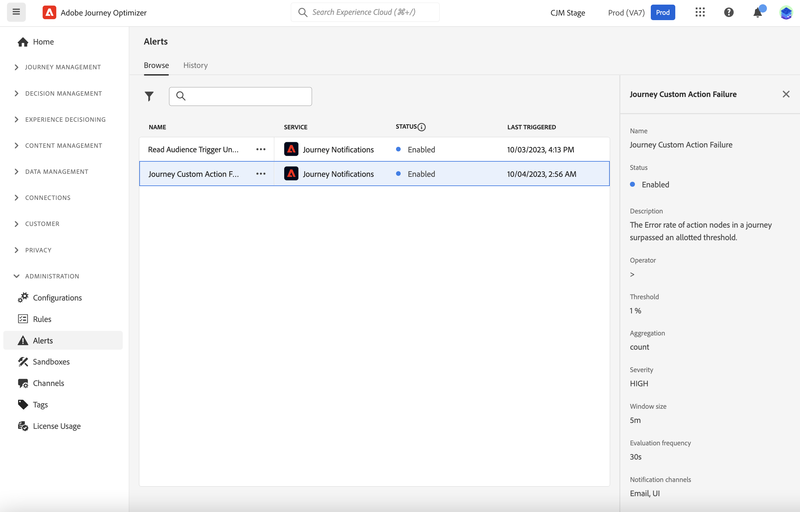

# Aan de slag met waarschuwingen {#alerts}

Wanneer het bouwen van uw reizen en campagnes, gebruik de **Alarm** knoop om fouten te controleren en op te lossen alvorens hen uit te voeren of te publiceren. Leer hoe te om uw reizen in [ problemen op te lossen deze pagina ](../building-journeys/troubleshooting.md). Leer hoe te om uw campagnes in [ te herzien deze pagina ](../campaigns/review-activate-campaign.md).

Je kunt je ook abonneren op Adobe Journey Optimizer-systeemwaarschuwingen, zoals op deze pagina wordt beschreven.

## Toegang tot en abonnement nemen op waarschuwingen {#alerting-capabilities}

Wanneer een fout optreedt, kunt u systeemwaarschuwingen ontvangen in het Journey Optimizer-meldingscentrum (waarschuwingen in de app) en/of een e-mail ontvangen.

Van het **menu van Alarm**, kunt u het beschikbare alarm bekijken, en aan hen intekenen. Wanneer een bepaalde reeks voorwaarden in uw verrichtingen (zoals een potentieel probleem wanneer het systeem een drempel) overschrijdt wordt bereikt, worden de waakzame berichten geleverd aan om het even welke gebruikers in uw organisatie die aan hen hebben geabonneerd.

<!--These messages can repeat over a pre-defined time interval until the alert has been resolved.-->

Leer meer over alarm in Adobe Experience Platform in [ documentatie van Adobe Experience Platform ](https://experienceleague.adobe.com/docs/experience-platform/observability/alerts/overview.html) {target="_blank"}.

In het linkermenu, onder **Beleid**, klik **Alarm**. Twee pre-gevormde alarm voor Journey Optimizer zijn beschikbaar: het ](#alert-custom-actions) alarm van de Actie van de Douane van de 0} Reis {en het [ Gelezen Onsuccesvolle ](#alert-read-audiences) alarm van de Trekker van de Auditie. [ Deze waarschuwingen worden hieronder beschreven.

U kunt aan elk alarm individueel van het gebruikersinterface intekenen, door **te selecteren onderteken** optie van het **Alarm** dashboard. Gebruik dezelfde methode om uw abonnement op te zeggen.

U kunt aan alarm door [ I/O de berichten van de Gebeurtenis ](https://experienceleague.adobe.com/docs/experience-platform/observability/alerts/subscribe.html) ook intekenen {target="_blank"}. Waarschuwingsregels zijn ingedeeld in verschillende abonnementspakketten. Abonnementen voor gebeurtenissen die overeenkomen met de specifieke Journey Optimizer-waarschuwingen worden hieronder beschreven.

Als een onverwacht gedrag optreedt, wordt een waarschuwingsbericht verzonden naar de abonnees. Op basis van de gebruikersvoorkeuren worden waarschuwingen verzonden via e-mail en/of rechtstreeks in het Journey Optimizer-meldingscentrum, in de rechterbovenhoek van de gebruikersinterface. Standaard is alleen waarschuwingen in de app ingeschakeld. Om e-mailalarm toe te laten, verwijs naar [ documentatie van Adobe Experience Platform ](https://experienceleague.adobe.com/docs/experience-platform/observability/alerts/ui.html#enable-email-alerts) {target="_blank"}.

Wanneer een alarm wordt opgelost, ontvangen de abonnees een &quot;Opgelost&quot;bericht.

>[!CAUTION]
>
>Het specifieke alarm van Adobe Journey Optimizer is slechts op **levende** reizen van toepassing. Er worden geen waarschuwingen gegeven voor reizen in testmodus.

## Aangepaste actie voor reis mislukt {#alert-custom-actions}

Deze waarschuwing geeft een waarschuwing als een aangepaste handeling mislukt. Wij zijn van mening dat er sprake is van een mislukking waarbij de afgelopen vijf minuten meer dan 1 procent van de fouten is gemaakt bij een specifieke aangepaste actie. Dit wordt elke 30 seconden geëvalueerd.

Waarschuwingen over aangepaste handelingen worden opgelost wanneer, gedurende de laatste 5 minuten:

* er is geen fout opgetreden bij die aangepaste handeling (of bij fouten onder de drempel van 1%);

* of, er is geen profiel dat aangepaste handeling heeft bereikt.

De naam van het I/O gebeurtenisabonnement die aan het alarm van de douaneactie beantwoordt is **de Mislukking van de Actie van de Douane van de Reis**.

## Trigger voor publiek lezen is mislukt {#alert-read-audiences}

Dit alarm waarschuwt u als de a **Gelezen activiteit van het publiek** geen profiel 10 min na geplande tijd van uitvoering heeft verwerkt. Deze fout kan worden veroorzaakt door technische problemen, of omdat het publiek leeg is.

Het alarm op **Gelezen de activiteiten van het publiek** zijn slechts op terugkomende reizen van toepassing. **las de activiteiten van het publiek** in levende reizen die een programma hebben om **in werking te stellen** of **zodra mogelijk** wordt genegeerd.

Het alarm op **Gelezen Publiek** wordt opgelost wanneer een profiel de **Gelezen knoop van het Publiek** ingaat.

De I/O naam van het gebeurtenisabonnement die aan **beantwoordt las de Trekker van het Publiek Onsuccesvol** alarm is **Reis leest publieksvertragingen, Mislukkingen en Fouten**.

## Problemen oplossen {#alert-troubleshooting}

Om **te problemen op te lossen las het 1} alarm van het publiek {, controleer uw publiekstelling in de interface van het Experience Platform.**

Om **het alarm van de Actie van de Douane problemen op te lossen**:

* Controleer uw aangepaste actie in de testmodus op een andere reis:

  

* Controleer uw reisrapport om foutredenen voor actie te zien.

  

* Controleer uw reis stepEvents om naar meer informatie rond &quot;failureReason&quot; te zoeken.

* Controleer uw configuratie van de douaneactie en bevestig dat de authentificatie nog OK is. Voer bijvoorbeeld een handmatige controle uit met Postman.
