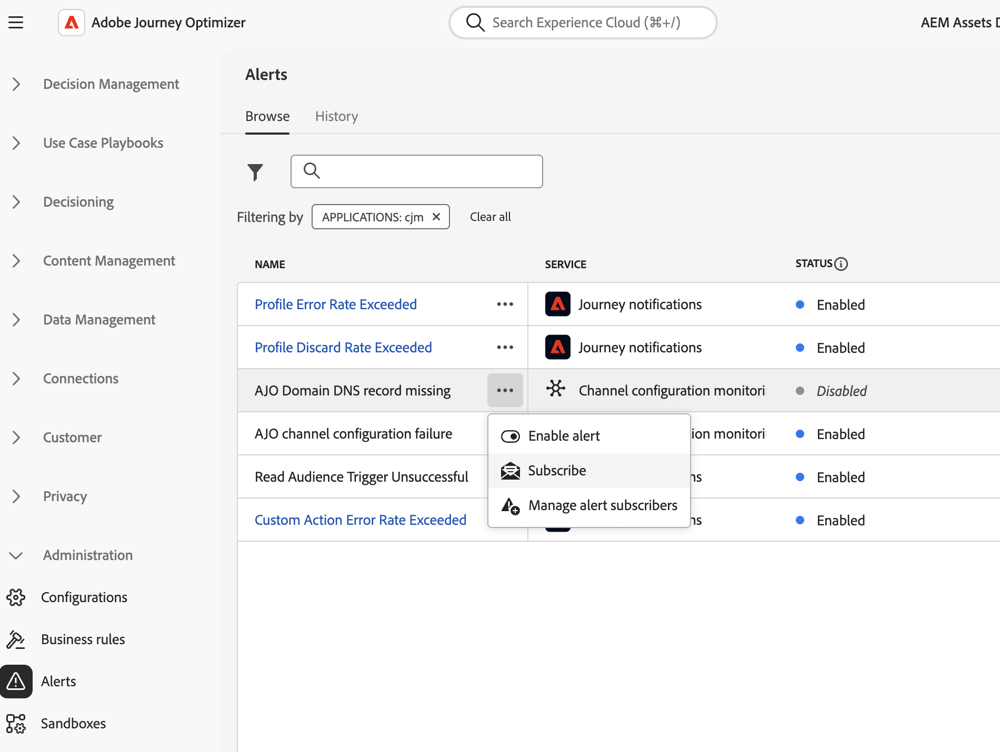

# Aan de slag met waarschuwingen {#alerts}

## Toegang tot en abonnement nemen op waarschuwingen {#alerting-capabilities}

Wanneer er een fout optreedt, kunt u systeemwaarschuwingen ontvangen in het Journey Optimizer-meldingscentrum en een e-mail ontvangen. Van de **Waarschuwingen** kunt u de beschikbare waarschuwingen weergeven en hierop een abonnement nemen. Wanneer een bepaalde reeks voorwaarden in uw verrichtingen (zoals een potentieel probleem wanneer het systeem een drempel) overschrijdt wordt bereikt, worden de waakzame berichten geleverd aan om het even welke gebruikers in uw organisatie die aan hen hebben geabonneerd.

<!--These messages can repeat over a pre-defined time interval until the alert has been resolved.-->

Meer informatie over berichten in Adobe Experience Platform in [Adobe Experience Platform-documentatie](https://experienceleague.adobe.com/docs/experience-platform/observability/alerts/overview.html){target="_blank"}.

In het linkermenu, onder **Administratie**, klikt u op **Waarschuwingen**. Er zijn twee vooraf geconfigureerde waarschuwingen voor Journey Optimizer beschikbaar: de [Aangepaste actie voor reis mislukt](#alert-custom-actions) en de [Trigger voor leessegment is mislukt](#alert-read-audiences) waarschuwing. Deze waarschuwingen worden hieronder beschreven.

U kunt zich op elke waarschuwing afzonderlijk abonneren vanuit de gebruikersinterface door de optie **Abonneren** van de **Waarschuwingen** dashboard. Gebruik dezelfde methode om uw abonnement op te zeggen.

U kunt zich ook abonneren op waarschuwingen via [I/O-gebeurtenismeldingen](https://experienceleague.adobe.com/docs/experience-platform/observability/alerts/subscribe.html){target="_blank"}. Waarschuwingsregels zijn ingedeeld in verschillende abonnementspakketten. Abonnementen voor gebeurtenissen die overeenkomen met de specifieke Journey Optimizer-waarschuwingen worden hieronder beschreven.

Als een onverwacht gedrag optreedt, wordt een waarschuwingsbericht verzonden naar de abonnees. Op basis van de gebruikersvoorkeuren worden waarschuwingen verzonden via e-mail, of rechtstreeks in het Journey Optimizer-meldingscentrum, in de rechterbovenhoek van de gebruikersinterface.

Wanneer een alarm wordt opgelost, ontvangen de abonnees een &quot;Opgelost&quot;bericht.

>[!CAUTION]
>
>Specifieke Adobe Journey Optimizer-waarschuwingen gelden alleen voor **leven** ritten. Er worden geen waarschuwingen gegeven voor reizen in testmodus.

## Aangepaste actie voor reis mislukt {#alert-custom-actions}

Deze waarschuwing geeft een waarschuwing als een aangepaste handeling mislukt. Wij zijn van mening dat er sprake is van een mislukking waarbij de afgelopen vijf minuten meer dan 1 procent van de fouten is gemaakt bij een specifieke aangepaste actie. Dit wordt elke 30 seconden geëvalueerd.

Waarschuwingen over aangepaste handelingen worden opgelost wanneer, gedurende de laatste 5 minuten:

* er is geen fout opgetreden bij die aangepaste handeling (of bij fouten onder de drempel van 1%);

* of, er is geen profiel dat aangepaste handeling heeft bereikt.

De naam van het abonnement voor de I/O-gebeurtenis die overeenkomt met de aangepaste waarschuwing voor een handeling is **Aangepaste actie voor reis mislukt**.

## Trigger voor leessegment is mislukt {#alert-read-audiences}

Deze waarschuwing geeft een waarschuwing als een **Publiek lezen** geen profiel 10 minuten na de geplande uitvoeringstijd heeft verwerkt. Deze fout kan worden veroorzaakt door technische problemen, of omdat het publiek leeg is.

Waarschuwingen ingeschakeld **Publiek lezen** de activiteiten zijn alleen van toepassing op terugkerende reizen . **Publiek lezen** activiteiten in het kader van rechtstreekse reizen die volgens een tijdschema moeten worden uitgevoerd **Eenmaal** of **Zo snel mogelijk** worden genegeerd.

Waarschuwingen ingeschakeld **Publiek lezen** worden opgelost wanneer een profiel wordt ingevoerd **Publiek lezen** knooppunt.

De naam van het I/O-gebeurtenisabonnement die overeenkomt met de **Trigger voor leessegment is mislukt** waarschuwing is **Vertragingen, fouten en fouten met betrekking tot het lezen van segmenten voor reizen**.
