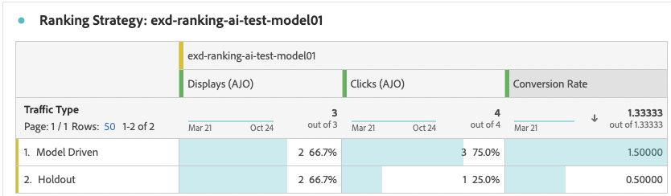

# Op code gebaseerd campagnerapport {#campaign-global-report-cja-code}

>[!BEGINSHADEBOX]

U kunt het campagnerapport op basis van code openen door in uw campagne op de knop **[!UICONTROL Reports]** te klikken en vervolgens **[!UICONTROL View all time report]** te selecteren. [Meer informatie](report-gs-cja.md)

>[!ENDSHADEBOX]

>[!NOTE]
>
>Code-gebaseerde ervaringen functioneren als binnenkomende interacties waarin gebruikers zich aanmelden door toegang te krijgen tot uw site of app. Derhalve **gerichte** of **3} metriek van het publiek {, die profielen volgen voor uitgaande berichtlevering worden gekozen, niet voor code-gebaseerde campagnes verhoogd.**

## Weergeven en klikken {#impressions-code}

In de **[!UICONTROL Display & Click]** -grafieken wordt een gedetailleerde analyse gegeven van de betrokkenheid van uw profielen bij uw op code gebaseerde ervaringen. Deze grafieken bieden waardevolle inzichten in de interactie tussen profielen en uw inhoud.

+++ Meer informatie over afmetingen voor indrukken en klikken

* **[!UICONTROL Unique Clicks]**: Aantal profielen dat op een inhoud in uw ervaringen heeft geklikt.

* **[!UICONTROL Clicks]**: Het aantal keren dat er op de inhoud is geklikt in uw ervaringen.

* **[!UICONTROL Displays]**: Het aantal keren dat de ervaring is geopend.

* **[!UICONTROL Unique displays]**: Het aantal keren dat de ervaring is geopend, wordt geen rekening gehouden met meerdere interacties van één profiel.

+++

## Gegevens bijhouden {#track-data-code}

De tabel **[!UICONTROL Tracking data]** biedt een gedetailleerde momentopname van profielactiviteiten die zijn gekoppeld aan uw ervaringen op basis van code en biedt essentiële inzichten in de effectiviteit van betrokkenheid en ervaringen.

+++ Meer informatie over het bijhouden van gegevensmetriek

* **[!UICONTROL People]**: Aantal gebruikersprofielen dat voor uw ervaringen in aanmerking komt als doelprofielen.

* **[!UICONTROL Click through rate (CTR)]**: percentage gebruikers dat interactie heeft gehad met uw ervaringen.

* **[!UICONTROL Clicks]**: Het aantal keren dat er op de inhoud is geklikt in uw ervaringen.

* **[!UICONTROL Unique Clicks]**: Aantal profielen dat op een inhoud in uw ervaringen heeft geklikt.

* **[!UICONTROL Displays]**: Het aantal keren dat uw ervaring is geopend.

* **[!UICONTROL Unique displays]**: Het aantal keren dat uw ervaring is geopend, wordt er geen rekening gehouden met meerdere interacties van één profiel.

+++

## Labels voor bijgehouden koppelingen {#track-link-code}

De tabel **[!UICONTROL Tracked link labels]** bevat een uitgebreid overzicht van de koppelingslabels in uw op code gebaseerde ervaringen, waarbij de labels worden gemarkeerd die het hoogste bezoekersverkeer genereren. Met deze functie kunt u de populairste koppelingen identificeren en er prioriteiten aan stellen.

+++ Meer informatie over metriek van tracklabels

* **[!UICONTROL Unique Clicks]**: Aantal profielen dat op een inhoud in uw op code gebaseerde ervaringen klikte.

* **[!UICONTROL Clicks]**: Het aantal keren dat er op een inhoud is geklikt in een op code gebaseerde ervaring.

* **[!UICONTROL Displays]**: Het aantal keren dat de ervaring is geopend.

* **[!UICONTROL Unique displays]**: Het aantal keren dat de ervaring is geopend, wordt geen rekening gehouden met meerdere interacties van één profiel.

+++

## Beslissingsrapportage {#decisioning-reporting}

### KPI&#39;s voor besluitvorming {#decisioning-kpis}

**Beslissende KPIs** verstrekt zeer belangrijke inzichten in de betrokkenheid van uw bezoekers met uw ervaringen, met inbegrip van metriek zoals:

* **[!UICONTROL Total items]**: het totale aantal afzonderlijke items dat deel uitmaakte van een gepersonaliseerd ervaring- of beslissingsproces binnen een opgegeven periode.

* **[!UICONTROL Total displays]**:

* **[!UICONTROL Total clicks]**: het totale aantal keren dat gebruikers gedurende een bepaalde periode op items, koppelingen, producten of andere interactieve elementen hebben geklikt.

* **[!UICONTROL Fallback rate]**: percentage van de gevallen waarin geen selectiestrategieën zijn gekwalificeerd, wat resulteert in de weergave van een algemene of minder specifieke optie.

### Betrokkenheid funnel {#engagement-funnel}

In de tabel **[!UICONTROL Engagement Funnel]** worden de prestaties van persoonlijke ervaringen gecontroleerd door te beoordelen hoe effectief elke fase van de funnel gebruikersinteractie aanstuurt.

* **[!UICONTROL Displays]**: het totale aantal keren dat persoonlijke ervaringen zijn weergegeven of weergegeven voor verschillende aanraakpunten.

* **[!UICONTROL Clicks]**: het totale aantal keren dat gebruikers op persoonlijke ervaringen hebben geklikt die aan hen werden weergegeven.

### Meest gebruikte objecten op doorklikpercentage {#top-decision}

In de tabel **[!UICONTROL Top decision items by CTR]** worden de prestaties van afzonderlijke items gemarkeerd op basis van hun doorklikfrequentie. Met deze maatstaf kunt u bepalen welke items het meest effectief zijn bij het activeren van gebruikers en het besturen van interacties.

* **[!UICONTROL Click-through Rate (CTR)]**: percentage gebruikers dat op een koppeling, advertentie of aanbeveling klikt in vergelijking met het aantal keer dat deze werd weergegeven.

### Betrokkenheid funnel via selectiestrategie {#engagement-funnel-selection}

Met de tabel **[!UICONTROL Engagement Funnel by Selection Strategy]** kunt u controleren en analyseren hoe effectief verschillende selectiestrategieën gebruikers met een persoonlijke ervaring engageren.

* **[!UICONTROL Displays]**: het totale aantal keren dat persoonlijke ervaringen zijn weergegeven of weergegeven voor verschillende aanraakpunten.

* **[!UICONTROL Clicks]**: het totale aantal keren dat gebruikers op persoonlijke ervaringen hebben geklikt die aan hen werden weergegeven.

### Prestaties van beslissingsitems {#decision-items-performance}

De tabel **[!UICONTROL Decision Items Performance]** evalueert hoe goed elk item presteert in het activeren van gebruikers en het aansturen van gewenste acties, zoals aankopen, klikken of andere reacties.

* **[!UICONTROL Displays]**: het totale aantal keren dat persoonlijke ervaringen zijn weergegeven of weergegeven voor verschillende aanraakpunten.

* **[!UICONTROL Clicks]**: het totale aantal keren dat gebruikers op persoonlijke ervaringen hebben geklikt die aan hen werden weergegeven.

### Beoordelingsstrategie {#ranking-strategy}

>[!NOTE]
>
>De **[!UICONTROL Ranking Strategy]** lijst wordt beschikbaar slechts wanneer een [ AI model ](../experience-decisioning/ranking/ai-models.md) in de campagne wordt opgenomen. <!--[Learn more](../experience-decisioning/ranking/ranking-formulas.md)-->

De tabel **[!UICONTROL Ranking Strategy]** biedt inzicht in de prestaties van door AI gestuurde rangschikkingsmodellen in persoonlijke ervaringen waarbij twee typen verkeer worden vergeleken:

* **Gedreven Model**: de gebruikers ontvangen inhoud die door het model van AI wordt gerangschikt, voor relevantie en overeenkomst wordt geoptimaliseerd.

* **Holdout**: de gebruikers ontvangen inhoud willekeurig tijdens de exploratiefase van het model wordt gediend die.

De belangrijkste getoonde metriek omvatten:

* **[!UICONTROL Displays]**: het totale aantal keren dat persoonlijke ervaringen zijn weergegeven of weergegeven voor verschillende aanraakpunten.

* **[!UICONTROL Clicks]**: het totale aantal keren dat gebruikers op persoonlijke ervaringen hebben geklikt die aan hen werden weergegeven.

* **[!UICONTROL Conversion rate]**: percentage weergaven dat tot gebruikersacties heeft geleid (klik bijvoorbeeld) om aan te geven dat het model erin geslaagd is gebruikers aan te trekken.

>[!NOTE]
>
>Momenteel is het [ rapport van de Meting van het 0} optillen slechts beschikbaar voor het ](../experience-decisioning/ranking/auto-optimization-model.md#lift) Gepersonaliseerde model van optimalisering [ AI. ](../experience-decisioning/ranking/personalized-optimization-model.md) Als u rapporten over liftmetingen nodig hebt, gebruikt u in plaats daarvan het gepersonaliseerde optimalisatiemodel.

### Omrekeningskoers voor Holdout- en Model-georiënteerd verkeer {#conversion-rate}

>[!NOTE]
>
>De **[!UICONTROL Conversion rate for Holdout and Model Driven traffic]** grafiek wordt beschikbaar slechts wanneer een [ AI model ](../experience-decisioning/ranking/ai-models.md) in de campagne wordt opgenomen. <!--[Learn more](../experience-decisioning/ranking/ranking-formulas.md)-->

In de grafiek **[!UICONTROL Conversion rate for Holdout and Model Driven traffic]** wordt de conversiesnelheid in de loop der tijd weergegeven voor twee typen verkeer:

* **Gedreven Model**: de gebruikers ontvangen inhoud die door het model van AI wordt gerangschikt, voor relevantie en overeenkomst wordt geoptimaliseerd.

* **Holdout**: de gebruikers ontvangen inhoud willekeurig tijdens de exploratiefase van het model wordt gediend die.

>[!CAUTION]
>
>Wanneer het gebruiken van een AI model dat in a [ wordt opgenomen rangschikt formule ](../experience-decisioning/ranking/ranking-formulas.md), worden de gegevens niet weerspiegeld in het rapport van het tarief van de Omzetting.
