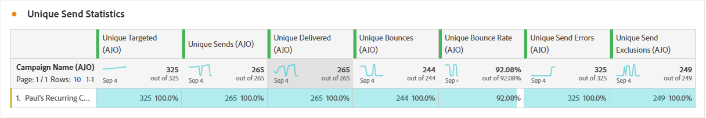

# E-mailcampagnerapport {#campaign-global-report-cja-email}

>[!INFO]
>
>Aangezien Apple nieuwe privacybeschermingsfuncties heeft geïntroduceerd voor de native e-mailtoepassing, waaronder Mail Privacy Protection, kunnen afzenders geen pixels voor het bijhouden van gegevens meer gebruiken om gegevens te verzamelen over profielen die de bescherming van de privacy van Apple-mail hebben ingeschakeld. Het is dan ook mogelijk dat de mogelijkheid van Adobe Journey Optimizer om e-mailberichten te volgen met behulp van trackingpixels wordt beïnvloed.
> [Meer informatie &#x200B;](https://experienceleaguecommunities.adobe.com/t5/adobe-campaign-classic-blogs/the-impact-of-apple-ios-privacy-changes-on-email-marketing-and/ba-p/699780?profile.language=nl) over de invloed van privacywijzigingen in Apple iOS op e-mailmarketing.
> 
> We raden u aan de focus op kliks en conversiemetriek te richten in plaats van op open koersen voor nauwkeurigere inzichten.

>[!BEGINSHADEBOX]

U kunt uw campagnerapport voor e-mail openen door in uw campagne op de knop **[!UICONTROL Reports]** te klikken en vervolgens **[!UICONTROL View all time report]** te selecteren. [Meer informatie](report-gs-cja.md)

>[!ENDSHADEBOX]

## KPI&#39;s per e-mail

De KPI&#39;s (Key Performance Indicators) van **[!UICONTROL Email]** bieden een gericht dashboard met unieke en geaggregeerde metriek dat de prestaties en de betrokkenheidsniveaus van uw e-mailcampagnes weerspiegelt.

+++ Meer informatie over de maatstaven van KPI&#39;s voor e-mail

* **[!UICONTROL Unique Click-through rate]**: percentage unieke profielen dat op minstens één koppeling in de e-mail heeft geklikt, in verhouding tot het aantal unieke geleverde e-mails.

* **[!UICONTROL Click through open rate (CTOR)]**: percentage profielen dat met het bericht interactie heeft gehad.

* **[!UICONTROL Unique Open rate]**: percentage unieke profielen dat de e-mail ten minste één keer heeft geopend, in verhouding tot het aantal unieke geleverde e-mails.

* **[!UICONTROL Unique Bounce rate]**: percentage unieke profielen waarvan de e-mail minstens één keer is verzonden, op basis van het totale aantal unieke verzendingen.

* **[!UICONTROL Delivered]**: Aantal verzonden e-mailberichten in verhouding tot het totale aantal verzonden berichten.

* **[!UICONTROL Unique delivered]**: aantal unieke profielen waarvoor ten minste één bericht is ontvangen.

* **[!UICONTROL Estimated Opens]**: Schatting van het totaal aantal e-mailberichten wordt geopend waarin zowel direct wordt geopend door profielen als automatisch wordt geopend door e-mailservers. Deze metrische aanpassing voor opent teweeggebracht door postservers voor privacy of veiligheidsaftasten door een open tarief toe te passen dat van ontvangers wordt berekend die manueel e-mail opende aan die waarvan e-mails slechts door postservers werden geopend.

* **[!UICONTROL Unique Estimated Opens]**: schatting van het aantal unieke e-mailontvangers dat het e-mailbericht waarschijnlijk heeft geopend. Deze maatstaf is bedoeld om een nauwkeuriger aantal individuele betrokkenheid te leveren die door mailservers wordt geactiveerd voor privacy- of beveiligingsscanning door een unieke open snelheid toe te passen die wordt berekend aan de hand van unieke profielen die de e-mail handmatig hebben geopend voor gebruikers wiens e-mailberichten alleen werden geopend door e-mailservers.

* **[!UICONTROL Clicks]**: Het totale aantal keren dat op een koppeling in het bericht is geklikt, inclusief het aantal keer dat op een koppeling met hetzelfde profiel wordt geklikt.

* **[!UICONTROL Unique clicks]**: Aantal unieke profielen dat op een inhoud in uw bericht heeft geklikt.

+++

## Unieke klik op funnel

In de grafiek van **[!UICONTROL Click funnel]** wordt een gedetailleerde analyse gegeven van de manier waarop profielen worden gebruikt voor uw e-mailinhoud. Deze grafiek biedt waardevolle inzichten in elke fase van interactie, van levering tot klik, zodat u precies kunt zien hoe effectief uw berichten de betrokkenheid van gebruikers beïnvloeden.

+++ Meer informatie over maatgegevens van funnel klikken

* **[!UICONTROL Unique Targeted]**: aantal unieke profielen dat tijdens het verzendproces als doel is ingesteld.

* **[!UICONTROL Unique Sends]**: aantal unieke profielen waarvoor is geprobeerd ten minste één e-mail te verzenden.

* **[!UICONTROL Unique delivered]**: aantal unieke profielen waarvoor ten minste één bericht is ontvangen.

* **[!UICONTROL Unique estimated opens]**: schatting van het aantal unieke e-mailontvangers dat het e-mailbericht waarschijnlijk heeft geopend. Deze maatstaf is bedoeld om een nauwkeuriger aantal individuele betrokkenheid te leveren die door mailservers wordt geactiveerd voor privacy- of beveiligingsscanning door een unieke open snelheid toe te passen die wordt berekend aan de hand van unieke profielen die de e-mail handmatig hebben geopend voor gebruikers wiens e-mailberichten alleen werden geopend door e-mailservers.

* **[!UICONTROL Unique clicks]**: Aantal unieke profielen dat op een inhoud in uw bericht heeft geklikt.

+++

## Unieke leveringsstatus

De grafiek van **[!UICONTROL Delivery status]** biedt een uitgebreide weergave van gegevens met betrekking tot verzonden e-mailberichten in uw campagne en biedt inzicht in belangrijke metriek zoals geleverde gegevens en stuitingen. Dit maakt een gedetailleerde analyse van het verzendingsproces van e-mail mogelijk en biedt waardevolle informatie over de efficiëntie en prestaties van uw campagnes.

+++ Meer informatie over de metriek van de leveringsstatus

* **[!UICONTROL Unique send errors]**: Aantal unieke profielen waarvoor tijdens het uitgaande proces ten minste één verzendfout is opgetreden.

* **[!UICONTROL Unique delivered]**: aantal unieke profielen waarvoor ten minste één bericht is ontvangen.

* **[!UICONTROL Unique send exclusions]**: aantal unieke profielen dat is uitgesloten van het ontvangen van berichten vanwege vooraf gedefinieerde regels of publiekscriteria.

* **[!UICONTROL Unique bounces]**: aantal unieke profielen waarvoor ten minste één bericht is teruggestuurd tijdens het verzendproces.

+++

## Geleverde versus klik trend {#delivered-click}

In de grafiek van **[!UICONTROL Delivered vs Click trend]** wordt een gedetailleerde analyse gegeven van de betrokkenheid van uw profielen bij uw e-mails. Deze grafiek biedt waardevolle inzichten in de interactie tussen profielen en uw inhoud. In de grafiek worden twee assen gebruikt om geleverde e-mails weer te geven en naast elkaar te klikken. Hierdoor is het eenvoudiger om ongebruikelijke patronen of wijzigingen in de betrokkenheid te zien in vergelijking met het aantal e-mails dat is verzonden.

+++ Meer informatie over cijfers voor trends in geleverd en klik op trend

* **[!UICONTROL Delivered]**: Aantal verzonden e-mailberichten in verhouding tot het totale aantal verzonden e-mails.

* **[!UICONTROL Clicks]**: Het aantal keer dat er op de inhoud in uw e-mails is geklikt.

+++

## Unieke verzendende statistieken {#unique-sending-statistics-email}

De tabel van **[!UICONTROL Unique Sending Statistics]** bevat een gedetailleerd overzicht van unieke e-mailprestatiegegevens in uw campagnes. Het richt zich op individuele profielen, zoals die uniek gericht, geleverd aan, geprononceerd, of uitgesloten-verstrekt diepgaande inzichten in hoe uw e-mails uw publiek bereiken en betreden.

+++ Meer informatie over de statistische gegevens voor Unieke verzendstatistieken

* **[!UICONTROL Unique Targeted]**: aantal unieke profielen dat tijdens het verzendproces als doel is ingesteld.

* **[!UICONTROL Unique Sends]**: aantal unieke profielen waarvoor is geprobeerd ten minste één e-mail te verzenden.

* **[!UICONTROL Unique Delivered]**: Aantal unieke profielen dat ten minste één e-mail heeft ontvangen.

* **[!UICONTROL Unique Bounces]**: aantal unieke profielen waarvoor ten minste één e-mail heeft geleid tot een stuit.

* **[!UICONTROL Unique Bounce Rate]**: percentage unieke profielen waarvan de e-mail minstens één keer is verzonden, op basis van het totale aantal unieke verzendingen.

* **[!UICONTROL Unique Send Errors]**: aantal unieke profielen dat tijdens het uitgaande proces ten minste één verzendfout heeft aangetroffen.

* **[!UICONTROL Unique Send Exclusions]**: aantal unieke profielen dat is uitgesloten van het ontvangen van berichten vanwege geschiktheidsregels, publiekssegmentatie of profielstatus.

+++

## Unieke volgstatistieken {#unique-tracking-statistics-email}

De tabel **[!UICONTROL Unique Tracking statistics]** biedt een gerichte weergave van de betrokkenheid op profielniveau met de e-mails in uw campagne. Het benadrukt unieke metriek die waardevolle inzichten in hoe individuele profielen met uw e-mailinhoud over zeer belangrijke stadia van betrokkenheid interactie aanbieden.

+++ Meer informatie over statistieken bijhouden

* **[!UICONTROL Unique Click through rate (CTR)]**: percentage unieke profielen dat op minstens één koppeling in de e-mail heeft geklikt, in verhouding tot het aantal unieke geleverde e-mails.

* **[!UICONTROL Unique Click through open rate (CTOR)]**: percentage unieke profielen dat na het openen van het e-mailbericht op een koppeling heeft geklikt op basis van unieke openen.

* **[!UICONTROL Unique Open Rate]**: percentage unieke profielen dat de e-mail ten minste één keer heeft geopend, in verhouding tot het aantal unieke geleverde e-mails.

* **[!UICONTROL Unique Clicks]**: aantal unieke profielen dat op ten minste één stuk inhoud in de e-mail heeft geklikt.

* **[!UICONTROL Unique Estimated Email Opens]**: schatting van het aantal unieke e-mailontvangers dat het e-mailbericht waarschijnlijk heeft geopend. Deze maatstaf is bedoeld om een nauwkeuriger aantal individuele betrokkenheid te leveren die door mailservers wordt geactiveerd voor privacy- of beveiligingsscanning door een unieke open snelheid toe te passen die wordt berekend aan de hand van unieke profielen die de e-mail handmatig hebben geopend voor gebruikers wiens e-mailberichten alleen werden geopend door e-mailservers.

* **[!UICONTROL Unique Email Unsubscribes]**: Aantal unieke profielen dat op de koppeling Abonnement opzeggen in uw e-mails of op de bijbehorende bestemmingspagina heeft geklikt.

+++

## Verzendstatistieken {#sending-statistics-email}

De tabel **[!UICONTROL Sending Statistics]** bevat een uitgebreid overzicht van essentiële gegevens over e-mails in uw campagnes. Het bevat belangrijke metriek, zoals de interactie met uw e-mails en het aantal e-mails dat met succes is bezorgd. Het biedt waardevolle inzichten in de effectiviteit en het bereik van uw e-mails en campagnes.

+++ Meer informatie over het verzenden van statistieken

* **[!UICONTROL Targeted]**: Het totale aantal e-mailberichten dat tijdens het verzendproces is verwerkt.

* **[!UICONTROL Sends]**: Het totale aantal verzendingen voor uw e-mail.

* **[!UICONTROL Delivered]**: Het totale aantal e-mails dat is verzonden in verhouding tot het totale aantal verzonden berichten.

* **[!UICONTROL Bounces]**: het totaal aan fouten dat tijdens het verzendproces is gecumuleerd en de automatische retourverwerking in verhouding tot het totale aantal verzonden berichten.

* **[!UICONTROL Bounce rate]**: percentage e-mailberichten dat tot een stuiting heeft geleid, in verhouding tot het totale aantal verzonden e-mails.

* **[!UICONTROL Send Errors]**: het totale aantal fouten dat is opgetreden tijdens het verzendproces waardoor het niet naar profielen kan worden verzonden.

* **[!UICONTROL Send Exclusions]**: het totale aantal profielen dat door Adobe Journey Optimizer is uitgesloten.

+++

## Trackingstatistieken {#tracking-statistics-email}

De tabel **[!UICONTROL Email - Tracking statistics]** bevat een gedetailleerd overzicht van de profielactiviteiten met betrekking tot e-mails die in uw campagne zijn opgenomen. Dit omvat cijfers over het openen, klikken en andere relevante betrokkenheidsindicatoren, die een uitgebreid overzicht bieden van hoe profielen met uw e-mailinhoud communiceren.

+++ Meer informatie over statistieken bijhouden

* **[!UICONTROL Click through rate (CTR)]**: percentage gebruikers dat interactie heeft gehad met het e-mailbericht.

* **[!UICONTROL Click through open rate (CTOR)]**: Het aantal keren dat de e-mail is geopend.

* **[!UICONTROL Estimated Email Opens]**: Schatting van het totaal aantal e-mailberichten wordt geopend waarin zowel direct wordt geopend door profielen als automatisch wordt geopend door e-mailservers. Deze metrische aanpassing voor opent teweeggebracht door postservers voor privacy of veiligheidsaftasten door een open tarief toe te passen dat van ontvangers wordt berekend die manueel e-mail opende aan die waarvan e-mails slechts door postservers werden geopend.

* **[!UICONTROL Clicks]**: Het aantal keer dat er op de inhoud in uw e-mails is geklikt.

* **[!UICONTROL Spam complaints]**: Het aantal keren dat een bericht is gedeclareerd als spam of junk.

* **[!UICONTROL Unsubscribes]**: Het aantal klikken op de koppeling om het abonnement op te zeggen of op de bijbehorende bestemmingspagina.

+++

## E-maildomeinen {#email-domains}

De tabel van **[!UICONTROL Email Domains]** bevat een diepgaande uitsplitsing van e-mailberichten die zijn gecategoriseerd op domein. Hiermee krijgt u uitgebreide inzicht in de prestatiemetriek van uw e-mailcampagnes. Met deze uitgebreide analyse kunt u het gedrag van verschillende domeinen begrijpen als reactie op uw e-mailinhoud.

+++ Meer informatie over metrische gegevens van e-maildomeinen

* **[!UICONTROL Unique Delivered]**: Aantal unieke profielen dat ten minste één e-mail heeft ontvangen.

* **[!UICONTROL Estimated Email Opens]**: Schatting van het totaal aantal e-mailberichten wordt geopend waarin zowel direct wordt geopend door profielen als automatisch wordt geopend door e-mailservers. Deze metrische aanpassing voor opent teweeggebracht door postservers voor privacy of veiligheidsaftasten door een open tarief toe te passen dat van ontvangers wordt berekend die manueel e-mail opende aan die waarvan e-mails slechts door postservers werden geopend.

* **[!UICONTROL Unique Clicks]**: aantal unieke profielen dat op ten minste één stuk inhoud in de e-mail heeft geklikt.

* **[!UICONTROL Unique Bounces]**: aantal unieke profielen waarvoor ten minste één e-mail heeft geleid tot een stuit.

* **[!UICONTROL Unique Send Errors]**: aantal unieke profielen dat tijdens het uitgaande proces ten minste één verzendfout heeft aangetroffen.

* **[!UICONTROL Unique Send Exclusions]**: aantal unieke profielen dat is uitgesloten van het ontvangen van berichten vanwege geschiktheidsregels, publiekssegmentatie of profielstatus.

+++

## Labels voor bijgehouden koppelingen {#track-link-label}

De tabel **[!UICONTROL Tracked link labels]** bevat een uitgebreid overzicht van de koppelingslabels in uw e-mails, waarin de labels worden gemarkeerd die het hoogste bezoekersverkeer genereren. Met deze functie kunt u de populairste koppelingen identificeren en er prioriteiten aan stellen.

+++ Meer informatie over metriek van tracklabels

* **[!UICONTROL Unique Clicks]**: Aantal profielen dat op de inhoud van een e-mail heeft geklikt.

* **[!UICONTROL Clicks]**: Het aantal keer dat er op de inhoud in uw e-mails is geklikt.

+++

## URL&#39;s van bijgehouden koppeling {#track-link-url}

De tabel **[!UICONTROL Tracked link URLs]** bevat een uitgebreid overzicht van de URL&#39;s in uw e-mail die het hoogste bezoekersverkeer aantrekken. Hierdoor kunt u de populairste koppelingen identificeren en er prioriteiten aan stellen, zodat u meer inzicht krijgt in de betrokkenheid bij profielen met specifieke inhoud in uw e-mails.

+++ Meer informatie over URL&#39;s met gekoppelde koppelingen

* **[!UICONTROL Unique Clicks]**: Aantal profielen dat op de inhoud van een e-mail heeft geklikt.

* **[!UICONTROL Clicks]**: Het aantal keer dat er op de inhoud in uw e-mails is geklikt.

+++

## E-mailonderwerpen {#email-subjects}

De tabel **[!UICONTROL Email subjects]** bevat een uitgebreid overzicht van e-mailonderwerpen die het hoogste bezoekersverkeer hebben aangetrokken. Deze bron biedt waardevolle inzichten in de dynamiek van de betrokkenheid van het publiek.

+++ Meer informatie over metrische gegevens over e-mailonderwerpen

* **[!UICONTROL Unique Open Rate]**: percentage unieke profielen dat de e-mail ten minste één keer heeft geopend, in verhouding tot het aantal unieke geleverde e-mails.

* **[!UICONTROL Unique Estimated Email Opens]**: schatting van het aantal unieke e-mailontvangers dat het e-mailbericht waarschijnlijk heeft geopend. Deze maatstaf is bedoeld om een nauwkeuriger aantal individuele betrokkenheid te leveren die door mailservers wordt geactiveerd voor privacy- of beveiligingsscanning door een unieke open snelheid toe te passen die wordt berekend aan de hand van unieke profielen die de e-mail handmatig hebben geopend voor gebruikers wiens e-mailberichten alleen werden geopend door e-mailservers.

* **[!UICONTROL Open Rate]**: Het percentage e-mailberichten dat wordt geopend in verhouding tot het totale aantal geleverde e-mails, waarbij meerdere wordt geopend door hetzelfde profiel.

* **[!UICONTROL Estimated Email Opens]**: Schatting van het totaal aantal e-mailberichten wordt geopend waarin zowel direct wordt geopend door profielen als automatisch wordt geopend door e-mailservers. Deze metrische aanpassing voor opent teweeggebracht door postservers voor privacy of veiligheidsaftasten door een open tarief toe te passen dat van ontvangers wordt berekend die manueel e-mail opende aan die waarvan e-mails slechts door postservers werden geopend.

+++

## Uitgesloten redenen {#excluded-reasons}

De tabel **[!UICONTROL Excluded reasons]** bevat een uitgebreide weergave van de verschillende factoren die ertoe hebben geleid dat gebruikersprofielen zijn uitgesloten van het doelpubliek, waardoor het bericht niet is ontvangen.

Verwijs naar [&#x200B; deze pagina &#x200B;](exclusion-list.md) voor de uitvoerige lijst van uitsluitingsredenen.

## Stuitingsredenen {#bounce-reasons-email}

In de tabel **[!UICONTROL Bounce Reasons]** worden de beschikbare gegevens met betrekking tot teruggestuurde berichten gecompileerd, zodat u gedetailleerde informatie krijgt over de specifieke redenen voor e-mailblokkeringen.

Voor meer informatie over grenzen, verwijs naar de [&#x200B; lijst van de Onderdrukking &#x200B;](../reports/suppression-list.md) pagina.

## Foutredenen {#error-reasons-email}

De tabel **[!UICONTROL Error Reasons]** biedt zichtbaarheid in de specifieke fouten die tijdens het verzendproces zijn opgetreden en biedt waardevolle informatie over de aard en het optreden van fouten.
