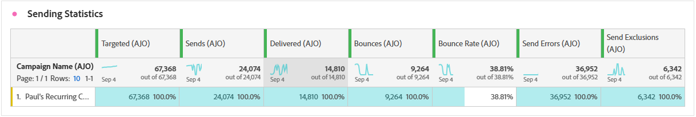

# E-mailcampagnerapport {#campaign-global-report-cja-email}

>[!BEGINSHADEBOX]

Aangezien Apple nieuwe privacybeschermingsfuncties heeft geïntroduceerd voor de native e-mailtoepassing, waaronder Mail Privacy Protection, kunnen afzenders geen pixels voor het bijhouden van gegevens meer gebruiken om gegevens te verzamelen over profielen die de bescherming van de privacy van Apple-mail hebben ingeschakeld. Het is dan ook mogelijk dat de mogelijkheid van Adobe Journey Optimizer om e-mailberichten te volgen met behulp van trackingpixels wordt beïnvloed. [ Leer meer ](https://experienceleaguecommunities.adobe.com/t5/adobe-campaign-classic-blogs/the-impact-of-apple-ios-privacy-changes-on-email-marketing-and/ba-p/699780) op het effect van de privacyveranderingen van Apple iOS op E-mailmarketing.

We raden u aan de focus op kliks en conversiemetriek te richten in plaats van op open koersen voor nauwkeurigere inzichten.

>[!ENDSHADEBOX]

## Geleverde versus klik trend {#delivered-click}

In de grafiek van **[!UICONTROL Delivered vs Click trend]** wordt een gedetailleerde analyse gegeven van de betrokkenheid van uw profielen bij uw e-mails. Deze grafiek biedt waardevolle inzichten in de interactie tussen profielen en uw inhoud.

+++ Meer informatie over cijfers over trends bij levering en klik op trends

* **[!UICONTROL Delivered]**: Aantal verzonden e-mailberichten in verhouding tot het totale aantal verzonden e-mails.

* **[!UICONTROL Clicks]**: Het aantal keer dat er op de inhoud in uw e-mails is geklikt.

+++

## Leveringsstatus {#delivery-status}

De grafiek van **[!UICONTROL Delivery status]** biedt een uitgebreide weergave van gegevens met betrekking tot verzonden e-mailberichten in uw campagne en biedt inzicht in belangrijke metriek zoals geleverde gegevens en stuitingen. Dit maakt een gedetailleerde analyse van het verzendingsproces van e-mail mogelijk en biedt waardevolle informatie over de efficiëntie en prestaties van uw campagnes.

+++ Meer informatie over de afleveringsstatus

* **[!UICONTROL Delivered]**: Aantal verzonden e-mailberichten in verhouding tot het totale aantal verzonden e-mails.

* **[!UICONTROL Bounces for outbound channels]**:Totaal aantal fouten gecumuleerd tijdens het verzendproces en automatische retourverwerking in verhouding tot het totale aantal verzonden berichten.

* **[!UICONTROL Outbound errors]**: het totale aantal fouten dat is opgetreden tijdens het verzendingsproces waardoor het niet naar profielen kan worden verzonden.

* **[!UICONTROL Outbound exclusions]**: aantal profielen dat door Adobe Journey Optimizer is uitgesloten.

+++

## Verzendstatistieken {#sending-statistics-email}

De tabel **[!UICONTROL Sending Statistics]** bevat een uitgebreid overzicht van essentiële gegevens over e-mails in uw campagnes. Het bevat belangrijke metriek, zoals de interactie met uw e-mails en het aantal e-mails dat met succes is bezorgd. Het biedt waardevolle inzichten in de effectiviteit en het bereik van uw e-mails en campagnes.

+++ Meer informatie over het verzenden van statistieken

* **[!UICONTROL People]**: Aantal gebruikersprofielen dat als doelprofielen voor uw berichten in aanmerking komt.

* **[!UICONTROL Targeted]**: Het totale aantal e-mailberichten dat tijdens het verzendproces is verwerkt.

* **[!UICONTROL Sends]**: Het totale aantal verzendingen voor uw e-mail.

* **[!UICONTROL Delivered]**: Aantal verzonden e-mailberichten in verhouding tot het totale aantal verzonden berichten.

* **[!UICONTROL Bounces for outbound channels]**: het totaal aan fouten dat tijdens het verzendproces is gecumuleerd en de automatische retourverwerking in verhouding tot het totale aantal verzonden berichten.

* **[!UICONTROL Outbound Errors]**: het totale aantal fouten dat is opgetreden tijdens het verzendproces waardoor het niet naar profielen kan worden verzonden.

* **[!UICONTROL Outbound Exclusions]**: aantal profielen dat door Adobe Journey Optimizer is uitgesloten.

+++

## Trackingstatistieken {#tracking-statistics-email}

De tabel **[!UICONTROL Email - Tracking statistics]** bevat een gedetailleerd overzicht van de profielactiviteiten met betrekking tot e-mails die in uw campagne zijn opgenomen. Dit omvat cijfers over het openen, klikken en andere relevante betrokkenheidsindicatoren, die een uitgebreid overzicht bieden van hoe profielen met uw e-mailinhoud communiceren.

+++ Meer informatie over statistieken bijhouden

* **[!UICONTROL Click through rate (CTR)]**: percentage gebruikers dat interactie heeft gehad met het e-mailbericht.

* **[!UICONTROL Click through open rate (CTOR)]**: Het aantal keren dat de e-mail is geopend.

* **[!UICONTROL Clicks]**: Het aantal keer dat er op de inhoud in uw e-mails is geklikt.

* **[!UICONTROL Unique Clicks]**: Aantal profielen dat op de inhoud van een e-mail heeft geklikt.

* **[!UICONTROL Email Opens]**: Het aantal keren dat uw e-mails zijn geopend in een campagne.

* **[!UICONTROL Unique Email Opens]**: percentage geopende e-mailberichten.

* **[!UICONTROL Spam complaints]**: Het aantal keren dat een bericht is gedeclareerd als spam of junk.

* **[!UICONTROL Unsubscribes]**: Het aantal klikken op de koppeling voor het opzeggen van abonnementen.

+++

## E-maildomeinen {#email-domains}

De tabel van **[!UICONTROL Email Domains]** bevat een diepgaande uitsplitsing van e-mailberichten die zijn gecategoriseerd op domein. Hiermee krijgt u uitgebreide inzicht in de prestatiemetriek van uw e-mailcampagnes. Met deze uitgebreide analyse kunt u het gedrag van verschillende domeinen begrijpen als reactie op uw e-mailinhoud.

+++ Meer informatie over metriek van e-maildomeinen

* **[!UICONTROL Sends]**: Het totale aantal verzendingen voor uw e-mail.

* **[!UICONTROL Delivered]**: Aantal verzonden e-mailberichten in verhouding tot het totale aantal verzonden e-mails.

* **[!UICONTROL Email Opens]**: Het aantal keren dat uw e-mails zijn geopend in een campagne.

* **[!UICONTROL Clicks]**: Het aantal keer dat er op de inhoud in uw e-mails is geklikt.

* **[!UICONTROL Bounces for outbound channels]**: Het totale aantal fouten dat tijdens het verzendproces is gecumuleerd en de automatische retourverwerking in verhouding tot het totale aantal verzonden e-mails.

* **[!UICONTROL Outbound Errors]**: het totale aantal fouten dat is opgetreden tijdens het verzendproces waardoor het niet naar profielen kan worden verzonden.
+++

## Labels voor bijgehouden koppelingen {#track-link-label}

De tabel **[!UICONTROL Tracked link labels]** bevat een uitgebreid overzicht van de koppelingslabels in uw e-mails, waarin de labels worden gemarkeerd die het hoogste bezoekersverkeer genereren. Met deze functie kunt u de populairste koppelingen identificeren en er prioriteiten aan stellen.

+++ Meer informatie over metriek van tracklabels

* **[!UICONTROL Unique Clicks]**: Aantal profielen dat op de inhoud van een e-mail heeft geklikt.

* **[!UICONTROL Clicks]**: Het aantal keer dat er op de inhoud in uw e-mails is geklikt.

+++

## URL&#39;s van bijgehouden koppeling {#track-link-url}

De tabel **[!UICONTROL Tracked link URLs]** bevat een uitgebreid overzicht van de URL&#39;s in uw e-mail die het hoogste bezoekersverkeer aantrekken. Hierdoor kunt u de populairste koppelingen identificeren en er prioriteiten aan stellen, zodat u meer inzicht krijgt in de betrokkenheid bij profielen met specifieke inhoud in uw e-mails.

+++ Meer informatie over URL&#39;s met gekoppelde koppelingen

* **[!UICONTROL Unique Clicks]**: Aantal profielen dat op de inhoud van een e-mail heeft geklikt.

* **[!UICONTROL Clicks]**: Het aantal keer dat er op de inhoud in uw e-mails is geklikt.

* **[!UICONTROL Displays]**: Het aantal keren dat de e-mail is geopend.

* **[!UICONTROL Unique displays]**: Het aantal keren dat de e-mail is geopend, wordt geen rekening gehouden met meerdere interacties van één profiel.

+++

## E-mailonderwerpen {#email-subjects}

De tabel **[!UICONTROL Email subjects]** bevat een uitgebreid overzicht van e-mailonderwerpen die het hoogste bezoekersverkeer hebben aangetrokken. Deze bron biedt waardevolle inzichten in de dynamiek van de betrokkenheid van het publiek.

+++ Meer informatie over metrische gegevens over e-mailonderwerpen

* **[!UICONTROL People]**: Aantal gebruikersprofielen dat in aanmerking komt als doelprofielen voor uw e-mails.

+++

## Uitgesloten redenen {#excluded-reasons}

De tabel **[!UICONTROL Excluded reasons]** bevat een uitgebreide weergave van de verschillende factoren die ertoe hebben geleid dat gebruikersprofielen zijn uitgesloten van het doelpubliek, waardoor het bericht niet is ontvangen.

Verwijs naar [ deze pagina ](exclusion-list.md) voor de uitvoerige lijst van uitsluitingsredenen.

## Stuitingsredenen {#bounce-reasons-email}

In de tabel **[!UICONTROL Bounce Reasons]** worden de beschikbare gegevens met betrekking tot teruggestuurde berichten gecompileerd, zodat u gedetailleerde informatie krijgt over de specifieke redenen voor e-mailblokkeringen.

Voor meer informatie over grenzen, verwijs naar de [ lijst van de Onderdrukking ](../reports/suppression-list.md) pagina.

## Foutredenen {#error-reasons-email}

De tabel **[!UICONTROL Error Reasons]** biedt zichtbaarheid in de specifieke fouten die tijdens het verzendproces zijn opgetreden en biedt waardevolle informatie over de aard en het optreden van fouten.
