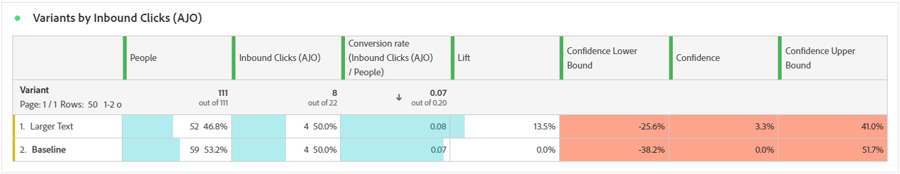

# campagnerapport voor experimenten {#campaign-global-report-cja-experimentation}

>[!CONTEXTUALHELP]
>id="ajo_campaigns_content_experiment_click"
>title="Metrisch met succes"
>abstract="De totale waarde van de metrische waarde van het Succes, eerder geselecteerd toen het creëren van uw Experimenten, gedeeld door het aantal profielen."

## Experimentatie {#experimentation}

Het tabblad **[!UICONTROL Experimentation]** biedt belangrijke inzichten in de prestaties van elke variant en identificeert de meest succesvolle variant.

Het kan enige tijd duren om de beste uitvoerder te definiëren. Als uw experiment niet succesvol is, zal het aan **Onovertuigend** worden geplaatst.

### ExperimentatiekPI&#39;s {#experimentation-kpis}

De KPI&#39;s (Key Performance Indicators) van **[!UICONTROL Experimentation]** functioneren als een allesomvattend dashboard, dat een analyse levert van essentiële metriek die aan uw experimentatie is gekoppeld.

+++ Meer informatie over KPI&#39;s-meetgegevens voor experimenten

* **[!UICONTROL Lift]**: maat voor de procentuele verbetering van de conversiesnelheid van een bepaalde behandeling ten opzichte van de basislijn.

* **[!UICONTROL Confidence]**: Bewijs dat een bepaalde behandeling gelijk is aan de basisbehandeling. [Meer informatie](../content-management/experiment-calculations.md#understand-confidence)

+++

### Variant op metrische waarde met succes {#variant-inbound}

De **Variant door succesmetriek** lijst toont hoe elke variant gebaseerd op succes metrisch wanneer vestiging het experiment uitvoert.
Voor diepte-duik in deze resultaten en hoe te om hen te interpreteren, verwijs naar [&#x200B; deze pagina &#x200B;](../content-management/get-started-experiment.md#interpret-results).

+++ Meer informatie over Variant op metrische waarde

* **[!UICONTROL People]**: Aantal gebruikersprofielen dat als doelprofielen voor uw berichten in aanmerking komt.

* **[!UICONTROL Inbound Clicks]**: de totale waarde van de metrische waarde voor succes die eerder is geselecteerd bij het maken van uw experimenten.

* **[!UICONTROL Conversion rate]**: de totale waarde van de metrische waarde voor succes die eerder is geselecteerd bij het maken van uw experimenten, gedeeld door het aantal profielen.

* **[!UICONTROL Lift]**: maat voor de procentuele verbetering van de conversiesnelheid van een bepaalde behandeling ten opzichte van de basislijn.

* **[!UICONTROL Confidence Lower bound]**: laagste geschatte waarde van het verschil in conversiesnelheid tussen de behandeling en de basislijn, binnen het gekozen betrouwbaarheidsinterval.

* **[!UICONTROL Confidence]**: Bewijs dat een bepaalde behandeling gelijk is aan de basisbehandeling. [Meer informatie](../content-management/experiment-calculations.md#understand-confidence)

* **[!UICONTROL Confidence Upper bound]**: Hoogste geschatte waarde van het verschil in conversiesnelheid tussen de behandeling en de basislijn, binnen het gekozen betrouwbaarheidsinterval.

+++

### Conversiesnelheid voor metrisch resultaat {#conversion-rate}

De grafiek van **[!UICONTROL Confidence interval]** toont de waaier van mogelijke verbetering, die de basislijn met de best-presterende behandeling voor gekozen succesmetrisch vergelijkt. [Meer informatie](../content-management/experiment-calculations.md#confidence-intervals).