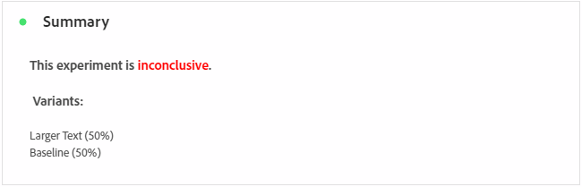

# campagnerapport voor experimenten {#campaign-global-report-cja-experimentation}

>[!CONTEXTUALHELP]
>id="ajo_campaigns_content_experiment_click"
>title="Metrisch met succes"
>abstract="De totale waarde van de metrische waarde van het Succes, eerder geselecteerd toen het creëren van uw Experimenten, gedeeld door het aantal profielen."

## Experimentatie {#experimentation}

Het tabblad **[!UICONTROL Experimentation]** biedt belangrijke inzichten in de prestaties van elke variant en identificeert de meest succesvolle variant.

Het kan enige tijd duren om de beste uitvoerder te definiëren. Als uw experiment niet succesvol is, zal het aan **Onovertuigend** worden geplaatst.

### ExperimentatiekPI&#39;s {#experimentation-kpis}

De KPI&#39;s (Key Performance Indicators) van **[!UICONTROL Experimentation]** functioneren als een allesomvattend dashboard, dat een analyse levert van essentiële metriek die aan uw experimentatie is gekoppeld.

+++ Meer informatie over KPI&#39;s-meetgegevens voor experimenten

* **[!UICONTROL Lift]**: maat voor de procentuele verbetering van de conversiesnelheid van een bepaalde behandeling ten opzichte van de basislijn.

* **[!UICONTROL Confidence]**: Bewijs dat een bepaalde behandeling gelijk is aan de basisbehandeling. [Meer informatie](../content-management/experiment-calculations.md#understand-confidence)

+++

### Variant volgens binnenkomende klikken {#variant-inbound}

De **[!UICONTROL Variant by Inbound clicks]** -widget geeft de prestaties van elke variant weer.
Voor diepte-duik in deze resultaten en hoe te om hen te interpreteren, verwijs naar [ deze pagina ](../content-management/get-started-experiment.md#interpret-results).

+++ Leer meer op Variant door Binnenkomende klikmetriek

* **[!UICONTROL People]**: Aantal gebruikersprofielen dat als doelprofielen voor uw berichten in aanmerking komt.

* **[!UICONTROL Inbound Clicks]**: Het totale aantal klikken over uitgaande kanalen.

* **[!UICONTROL Conversion rate]**: de totale waarde van de metrische waarde voor succes die eerder is geselecteerd bij het maken van uw experimenten, gedeeld door het aantal profielen.

* **[!UICONTROL Lift]**: maat voor de procentuele verbetering van de conversiesnelheid van een bepaalde behandeling ten opzichte van de basislijn.

* **[!UICONTROL Confidence]**: Bewijs dat een bepaalde behandeling gelijk is aan de basisbehandeling. [Meer informatie](../content-management/experiment-calculations.md#understand-confidence)

<!--
* **[!UICONTROL Confidence Upper bound]**:

* **[!UICONTROL Confidence Lower bound]**:
-->
+++

### Conversiesnelheid voor binnenkomende klikken {#conversion-rate}

De grafiek van **[!UICONTROL Confidence interval]** meet onzekerheid rond verbetering. Het geeft het procentuele verschil in prestaties weer tussen de basislijn en de best presterende behandeling. [Meer informatie](../content-management/experiment-calculations.md#confidence-intervals).
