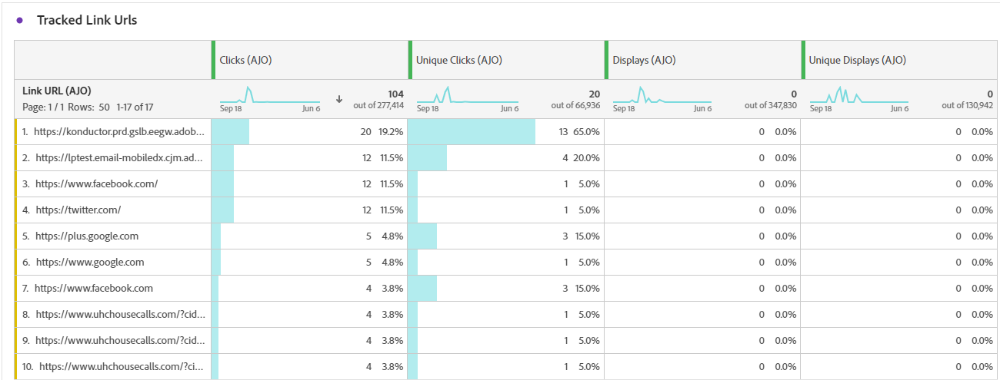

# Campagnerapport in app {#campaign-global-report-cja-inapp}

>[!IMPORTANT]
>
>Alvorens u op uw campagnes en reizen kunt melden In-App, zorg ervoor om de rapporteringseerste vereisten te volgen die op [ worden verstrekt deze pagina ](../in-app/inapp-configuration.md#experiment-prerequisites).

>[!BEGINSHADEBOX]

U hebt toegang tot uw campagnerapport in de app door in uw campagne op de knop **[!UICONTROL Reports]** te klikken en vervolgens **[!UICONTROL View all time report]** te selecteren. [Meer informatie](report-gs-cja.md)

>[!ENDSHADEBOX]

## Tendens weergeven en klikken {#impression-click-trend}

De grafiek van **[!UICONTROL Impression & Click trend]** bevat een gedetailleerde analyse van de betrokkenheid van uw profielen bij uw In-app-berichten. Deze grafiek biedt waardevolle inzichten in de interactie tussen profielen en uw inhoud.

+++ Meer informatie over cijfers voor indrukken en klikken op trends

* **[!UICONTROL Clicks]**: Het aantal keren dat de gebruiker interactie had met de berichten in de app.

* **[!UICONTROL Displays]**: Het aantal keren dat het bericht in de app aan de gebruiker is getoond.

+++

## Klikken {#clicks-inapp}

In de grafiek van **[!UICONTROL Clicks]** worden in-app klikgegevens weergegeven, die zowel het totale aantal klikken op inhoud als het aantal unieke profielen weergeven die op de inhoud hebben geklikt.

+++ Meer informatie over maatstaven klikken

* **[!UICONTROL Unique Clicks]**: Aantal profielen dat op een inhoud in uw In-app-berichten heeft geklikt

* **[!UICONTROL Clicks]**: Het aantal keren dat de gebruiker interactie had met de berichten in de app.

+++

## Weergave {#display-inapp}

De grafiek van **[!UICONTROL Displays]** helpt u zowel het algemene bereik van het bericht als het aantal unieke profielen begrijpen die met het verbinden.

+++ Meer informatie over weergavemetriek

* **[!UICONTROL Displays]**: Het aantal keren dat het bericht in de app aan de gebruiker is getoond.

* **[!UICONTROL Unique displays]**: Het aantal keren dat het bericht is geopend, wordt er geen rekening gehouden met meerdere interacties van één profiel.

+++

## Gegevens bijhouden {#tracking-data-inapp}

De tabel **[!UICONTROL Tracking data]** bevat een gedetailleerde momentopname van profielactiviteiten die aan uw In-app-berichten zijn gekoppeld. Deze tabel biedt essentiële inzichten in de betrokkenheid en de doeltreffendheid van in-app-berichten.

+++ Meer informatie over het bijhouden van gegevensmetriek

* **[!UICONTROL People]**: Aantal gebruikersprofielen dat in aanmerking komt als doelprofielen voor uw berichten in de app.

* **[!UICONTROL Click through rate (CTR)]**: percentage gebruikers dat interactie had met de berichten in de app.

* **[!UICONTROL Click through open rate (CTOR)]**: Het aantal keren dat de berichten in de app zijn geopend.

* **[!UICONTROL Clicks]**: Het aantal keren dat de gebruiker interactie had met de berichten in de app.

* **[!UICONTROL Unique Clicks]**: Aantal profielen dat op een inhoud in uw In-app berichten klikte.

* **[!UICONTROL Displays]**: Het aantal keren dat het bericht in de app aan de gebruiker is getoond.

* **[!UICONTROL Unique displays]**: Het aantal keren dat het bericht is geopend, wordt er geen rekening gehouden met meerdere interacties van één profiel.

* **[!UICONTROL Sends]**: Het aantal keren dat de app de In-app-campagne heeft aangevraagd. Meerdere aanvragen per gebruikerssessie (bijvoorbeeld bij het starten of opnieuw laden) kunnen ertoe leiden dat deze waarde het aantal unieke gebruikers overschrijdt als de campagnegegevens niet in de cache zijn opgeslagen.

* **[!UICONTROL Inbound triggered]**: Het aantal keren dat de app het bericht in de app weergeeft. Dit getal kan lager zijn dan het totaal dat wordt verzonden als de regels aan de app het bericht niet weergeven.

* **[!UICONTROL Inbound dismisses]**: Het aantal keren dat gebruikers het bericht in de app hebben verwijderd zonder ermee te werken.

+++

## Labels voor bijgehouden koppelingen {#track-link-label-inapp}

De tabel **[!UICONTROL Tracked link labels]** bevat een uitgebreid overzicht van de koppelingslabels in uw In-app-berichten, waarin de labels worden gemarkeerd die het hoogste bezoekersverkeer genereren. Met deze functie kunt u de populairste koppelingen identificeren en er prioriteiten aan stellen.

+++ Meer informatie over metriek van tracklabels

* **[!UICONTROL Unique Clicks]**: Aantal profielen dat op een inhoud in uw In-app berichten klikte.

* **[!UICONTROL Clicks]**: Het aantal keren dat de gebruiker interactie had met de berichten in de app.

* **[!UICONTROL Displays]**: Het aantal keren dat het bericht in de app aan de gebruiker is getoond.

* **[!UICONTROL Unique displays]**: Het aantal keren dat het bericht is geopend, wordt er geen rekening gehouden met meerdere interacties van één profiel.

+++

## URL&#39;s van bijgehouden koppeling {#track-link-url-inapp}

De tabel **[!UICONTROL Tracked link URLs]** bevat een uitgebreid overzicht van de URL&#39;s in uw In-app-berichten die het hoogste bezoekersverkeer aantrekken. Hierdoor kunt u de populairste koppelingen identificeren en er prioriteiten aan stellen, zodat u meer inzicht krijgt in de betrokkenheid bij profielen met specifieke inhoud in uw In-app-berichten.

+++ Meer informatie over URL&#39;s met gekoppelde koppelingen

* **[!UICONTROL Unique Clicks]**: Aantal profielen dat op een inhoud in uw In-app berichten klikte.

* **[!UICONTROL Clicks]**: Het aantal keren dat de gebruiker interactie had met de berichten in de app.

+++
